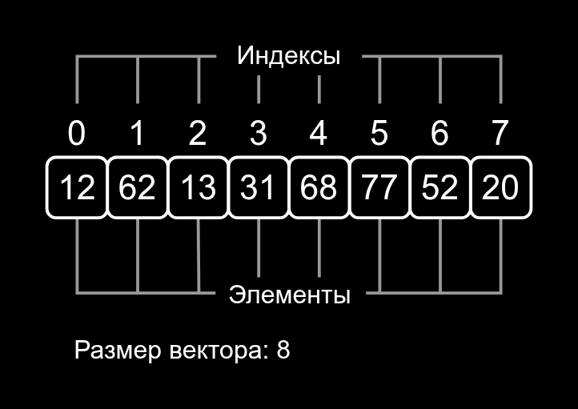

## Создание и применение вектора
Помимо простых значений, представляющих одно число, один символ, одну строку, в программировании применяют контейнеры — объекты, которые хранят целый набор, или как ещё говорят, массив значений.
Прежде, чем изучать сложные типы данных, вспомните простые: сопоставьте каждому значению его тип.
int
-10
-10

double
12.5
12.5

string
"42"s
"42"s

bool
true
true

char
'X'
'X'

Правильных ответов: 5, неправильных ответов: 0.
Как вам задача?


Вектор — один из стандартных контейнеров в C++. Каждый контейнер подходит для определённого круга задач. Задач, для которых подходит вектор, много, поэтому используется он очень часто. С него и начнём изучение контейнеров.

Чтобы работать с вектором, подключите библиотеку `<vector>`. При объявлении переменной в угловых скобках указывается тип элементов, которые будут содержаться в контейнере. Например, `vector<int>`, `vector<string>`, `vector<char>`. 

Представьте, что хотите сохранить в программе количество дней в каждом месяце года. Для этого будет удобен вектор. Количество дней — это число, то есть хранить в векторе будем значения типа `int`. Объявим переменную `month_lengths`. Её тип — `vector<int>`. Содержимое вектора пишется в фигурных скобках при инициализации:
```cpp
#include <vector>
using namespace std;

int main() {
    vector<int> month_lengths = {31, 28, 31, 30, 31, 30, 31, 31, 30, 31, 30, 31};
} 
```
Как видите, при объявлении вектора указывается и тип его элементов. Это одна из причин, почему программы на C++ обычно эффективнее, чем на Python. В C++ тип каждого значения, в том числе того, который хранится в векторе, известен заранее, до запуска программы. Благодаря этому компилятор может решить, как обрабатывать значения, и не тратить ресурсы во время работы приложения. Аналог вектора в языке Python — список. В одном списке могут содержаться объекты разных типов. Значит, прежде чем выполнить действие с элементом списка, Python должен определить его тип во время выполнения программы. Если сравнить типы данных с собаками разного размера и породы, то в С++ собаки рассажены по размеру и породе. А в Python все вольеры и животные вперемешку.

У любого вектора есть размер — количество значений в контейнере. Размер может быть равен как одному, так и десяти миллионам — C++ умеет эффективно работать даже с очень большими векторами. Допусти́м и вектор размера 0 — его называют пустым.

Чтобы выяснить размер вектора, используют его метод `size`, аналогичный методу `size` у строки:
```cpp
#include <iostream>
#include <vector>
using namespace std;

int main() {
    vector<int> month_lengths = {31, 28, 31, 30, 31, 30, 31, 31, 30, 31, 30, 31};
    cout << month_lengths.size() << endl;
} 
```
Программа выведет:
```
12
```
Каждый элемент вектора имеет индекс — порядковый номер от начала вектора. Причём элементы нумеруются с нуля: индекс первого элемента ноль, а индекс последнего на единицу меньше размера вектора.


<div class="caption">
Вектор {12, 62, 13, 31, 68, 77, 52, 20}
</div>


Чтобы обратиться к конкретному элементу вектора, нужно написать индекс в квадратных скобках. Индекс может быть числом, переменной или произвольным числовым выражением:
```cpp
int month_index;
cin >> month_index;

// Обращаемся к элементу вектора month_lengths с индексом month_index.
cout << "There are "s << month_lengths[month_index] << " days"s << endl;
```
Элементы вектора можно менять, присваивая им новые значения.

Январю соответствует индекс ноль, а февралю единица: применим это для корректной обработки високосного года.
```cpp
int year;
cin >> year;
vector<int> month_lengths = {31, 28, 31, 30, 31, 30, 31, 31, 30, 31, 30, 31};

// Определяем високосный год.
// Из годов, которые делятся на 4 без остатка,
// исключаем годы, делящиеся на 100,
// кроме тех, что делятся на 400.
bool year_is_leap = year % 4 == 0 && (year % 100 != 0 || year % 400 == 0);

// Для високосного года увеличиваем элемент вектора с индексом 1.
if (year_is_leap) {
    // Меняем элемент с индексом 1, присваивая ему новое значение.
    month_lengths[1] = month_lengths[1] + 1;
} 
```
Для элементов вектора доступны всё те же операции, что и для обычных переменных. Увеличение на единицу можно записать лаконичнее:
```cpp
// Для високосного года увеличиваем элемент вектора с индексом 1.
if (year_is_leap) {
        ++month_lengths[1];
}  
```
Индекс последнего элемента вычисляется как `month_lengths.size() - 1`. Довольно громоздкая конструкция. Чтобы вышло короче, можно использовать метод `back`:

```cpp
cout << month_lengths[month_lengths.size() - 1] << endl;  // Количество дней в декабре.
cout << month_lengths.back() << endl;                     // То же, но короче. 
```
Метод `size` вы без последствий вызовете для любого вектора, потому что размер — неотъемлемое свойство вектора. С `back` иначе. В пустом векторе нет последнего элемента. При вызове `back` для него программа поведёт себя непредсказуемо. Причём заранее С++ об ошибке не сообщит. Убедиться перед вызовом `back`, что вектор не пуст, — забота программиста.

Чтобы проверить вектор на пустоту, используйте метод `empty`. Например, у вас есть вектор, где хранятся клички потерянных животных. Вывести кличку последнего позволит `back`. Но сначала проверьте, не пуст ли вектор:

```cpp
vector<string> lost_pets = {"Oscar"s, "Pluto"s, "Tom"s};

if (lost_pets.empty()) {
    cout << "Wonderful! No pets are lost!"s << endl;
} else {
    cout << "Recent lost pet's name - "s << lost_pets.back() << endl;
}

// Программа выведет такой текст:
// Recent lost pet's name - Tom
```
Есть и другой способ проверить вектор на пустоту: вызвать `size` и сравнить результат с 0. Но использовать `empty` короче и выразительнее: сразу видно, что интересует именно пустота вектора.

Обращаться по индексу в векторе тоже нужно осторожно. Корректный индекс неотрицателен и строго меньше размера вектора. Если запро́сите элемент по некорректному индексу, программа обратится к чужой памяти, а после упадёт или продолжит работу, испортив содержимое другой переменной. Так что у программиста C++ много забот.

Вектор может содержать значения любых типов, в том числе другие векторы. Предположим, в приюте для животных есть график прогулок по дням недели, и мы хотим сохранить этот график. Подойдёт вектор векторов: 

```cpp
// В векторе векторов строк сохраним график
// прогулок по дням недели.
vector<vector<string>> walking_schedule = {
    {"Ludwig"s, "Karl"s, "Johann"s},
    {"Felix"s},
    {"Karl"s, "Gustav"s, "Richard"s, "Wolfgang"s, "Johann"s},
    {"Gustav"s, "Modest"s},
    {"Sebastian"s, "Wolfgang"s, "Modest"s},
    {"Rihard"s, "Sebastian"s, "Ludwig"s},
    {"Felix"s},
}; 
```
Нулевой элемент вектора соответствует понедельнику, первый — вторнику и так далее. Всего в векторе семь элементов — столько же, сколько дней в неделе. Самая массовая прогулка в среду — в этот день гуляют сразу пять постояльцев приюта. А вот Феликс — замкнутый пёс. Он любит гулять в одиночку, поэтому для него выделили два отдельных дня.

Какой тип имеет значение `walking_schedule[2]`?

> `vector<string>`

Вектор `walking_schedule` состоит из семи элементов, каждый из которых — вектор строк. Мы обратились ко второму элементу — вектору из пяти строк. Чтобы получить доступ к элементу внутреннего вектора, нужно написать `[]` ещё раз:
```cpp
// Выберем из вектора, соответствующего среде, элемент с индексом 1.
cout << "Вторым в среду гуляет "s << walking_schedule[2][1] << endl;

// Программа выведет:
// Вторым в среду гуляет Gustav.
```