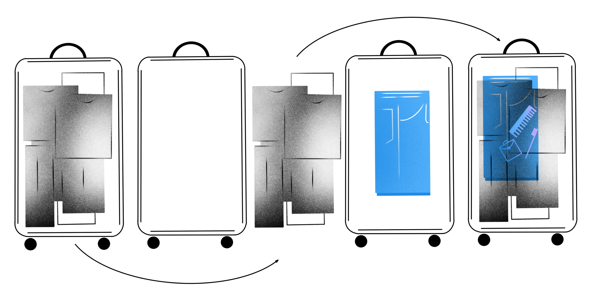

## Лаконичный for и добавление элементов в вектор

Вы познакомились с контейнером `vector`. Теперь пора узнать, как перебирать его элементы и автоматизировать работу с ним. Также мы рассмотрим добавление в вектор новых элементов.

### Галопом по вектору: новый for

Чтобы перебрать элементы вектора, используют цикл `for` и обращение по индексу. Так же, как со строками:
```cpp
for (int month_index = 0; month_index < month_lengths.size(); ++month_index) {
        cout << "There are "s << month_lengths[month_index] << " days "s
                 << " in month "s << (month_index + 1) << endl;
}
```
Вывод:
```
There 31 days in month 1
...
There 31 days in month 12 
```
Писать такой цикл сложно: только в заголовке нужно повторить название переменной-счётчика `month_index` трижды. А ещё надо помнить, что делает каждая из трёх секций внутри скобок. Огромный простор для ошибок. К счастью, у цикла `for` есть ещё один лик — лаконичный. В оригинале он называется range-based for. Это специальный цикл, который применяют, чтобы выполнить действия для каждого элемента контейнера.

В примере использован range-based for для прохода по вектору. Переменная `length` будет последовательно пробегать все его элементы:
```cpp
cout << "Month lengths are:"s;

// Значениями переменной length поочерёдно станут все элементы вектора month_length.
for (int length : month_lengths) {
        cout << " "s << length;
}
cout << endl; 
```
Вывод:
```
Month lengths are: 31 28 31 30 31 30 31 31 30 31 30 31
```
Поскольку строка — это тоже контейнер, содержащий символы, то и к ней примени́м range-based for:
```cpp
string str = "Tiger, tiger, burning bright, in the forests of the night"s;

// посчитаем количество пробелов в строке
int spaces = 0;
for (char c : str) {
    // если очередной символ - пробел, добавим единицу к переменной
    if (c == ' ') {
        spaces += 1;
    }
}

cout << "There are "s << spaces << " spaces"s << endl;
// вывод: There are 9 spaces 
```

### Добавим немножечко элементов

Вектор — не что-то монолитное, определяемое на этапе создания переменной. В любой момент в него можно вставить новый элемент. Это работает примерно как вставка символа в строку.

Новый элемент в конец вектора добавляют методом `push_back`. Например, так можно целиком прочитать содержимое вектора lost_pet_ages из потока ввода:
```cpp
// Читаем количество питомцев из cin.
int pet_count;
cin >> pet_count;

// Создаём пустой вектор.
vector<int> lost_pet_ages;

// Вектор ещё не сформирован. Используем обычный for, чтобы прочитать
// несколько чисел из cin и добавить их в вектор lost_pet_ages.
for (int i = 0; i < pet_count; ++i) {
        int age;
        cin >> age;
        lost_pet_ages.push_back(age);
}
```
Для добавления элемента в начало готового метода нет. Дело в том, что добавить элемент в конец строки и вектора — быстрая операция. А чтобы вставить что-нибудь в начало, нужно сдвинуть остальные элементы: нулевой — на первую позицию, первый — на вторую, второй — на третью.



<div class="caption">
Добавление элемента в начало вектора похоже на добавление вещи на дно уже собранного чемодана
</div>

Вставить в начало или другое место в середине вектора всё-таки можно. Для этого используют метод `insert`, в который передаётся позиция вставки. Для вставки в начало применим конструкцию `month_lengths.begin()`. Так мы получаем итератор, то есть объект, задающий позицию в контейнере. В данном случае — позицию первого элемента:
```cpp
vector<int> month_lengths = {31, 28, 31, 30, 31, 30, 31, 31, 30, 31, 30, 31};
// Применяем метод insert с указанием места вставки - начала вектора.
month_lengths.insert(month_lengths.begin(), 0);
cout << month_lengths[2] << endl;  // выведет 28 — количество дней в феврале
// Так удобно делать чтобы месяцы нумеровались в векторе с единицы. 
```
<div class="callout">
Итераторы — важные объекты в C++. Они вам встретятся ещё много раз. Подробнее рассмотрим итераторы в следующих уроках.
</div>

Метод `insert` применим и к строкам. Использовать его даже проще — можно указывать не итератор, а номер позиции, перед которой планируется вставка:
```cpp
string jack_sparrow = "Джек Воробей"s;
jack_sparrow.insert(0, "Капитан "s);  // вставляем в позицию 0, то есть в начало
cout << jack_sparrow << endl; 
// вывод: Капитан Джек Воробей

string search_query = "fluffy siamese cat"s;
search_query.insert(7, "-"s);  // вставляем перед 7-м символом - буквой s
cout << search_query << endl;
// вывод: fluffy -siamese cat 
```

Будем использовать слова с предшествующим минусом `-` в качестве минус-слов в поисковом сервере. Это понятие ещё пригодится.

<div class="callout">
В C++ символы, хранящиеся в переменной string, соответствуют байтам в двоичном представлении строки. Байты не идентичны печатным знакам — каждая русская буква может кодироваться двумя байтами. Точный способ кодирования зависит от операционной системы, настроек компилятора и кодировки исходного кода. В случае популярной кодировки UTF-8 строка Джек Воробей содержит 23 байта: 22 для кодирования 11 русских букв и один для пробела. Чтобы вставить текст в определённое место строки, нужно задавать позицию с учётом размера каждого символа.
</div>
