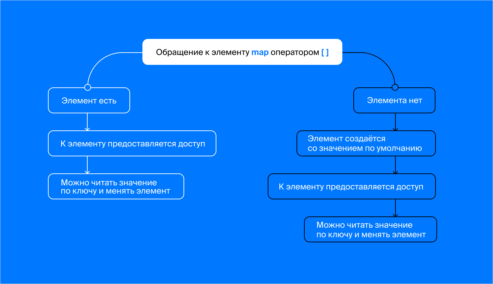

## Подводные камни map
Методы словаря похожи на методы множества. Так получилось не случайно: эти контейнеры имеют сходное внутреннее устройство. Изучим их подробнее.
Вспомните прошлый урок. Как правильно написать range-based for для контейнера map<string, int> my_dict?


Неправильный ответ
for(const int val : my_dict).

for(const auto& key, val : my_dict).

Тоже правильный ответ
for(const auto& [key, val] : my_dict).

for([key, val] : my_dict).
Как вам задача?


Скобки: квадратные и коварные
Проверить наличие ключа можно методом count. Как и в случае с set, для map есть только два возможных значения этого метода: 0 и 1.

if (legs_count.count(animal_name) == 1) {
    cout << "Yes, we know this animal!"s << endl;
} else {
    cout << "Sorry, no info about this species!"s << endl;
} 
В контейнерах, с которыми вы сталкивались до этого, можно было узнать количество элементов методом size и проверить на пустоту методом empty. Тут map не стал исключением.
Пока никаких подводных камней. Но они возникают при обращении к элементу словаря.
Для чтения и изменения значений мы использовали операцию []. Если обратиться к несуществующему элементу, он будет создан со значением по умолчанию. 
Рассмотрим такой пример:

#include <iostream>
#include <string>
#include <map>
#include <set>

using namespace std;

int main() {
    map<string, int> legs_count = {{"rabbit"s, 4}, {"dog"s, 4}, {"chicken"s, 2}};
    const set<string> names = {"dog"s, "cat"s, "elephant"s};
    for (const string& name : names) {
        cout << name << " - "s << legs_count[name] << endl;
    }
} 
Код выдаст неожиданный результат:
```cpp
cat - 0
dog - 4
elephant - 0 
```
Распечатаем теперь сам словарь:
```cpp
Size: 5
cat - 0
chicken - 2
dog - 4
elephant - 0
rabbit - 4 
```
Как можно заметить, в него добавились нули — значения по умолчанию для типа `int`, который используется в словаре.

Каждый раз, когда вы запрашиваете значение по несуществующему ключу, операция `[]` меняет словарь: добавляет ключ со стандартным значением.



Эта особенность бывает полезна. Представьте, что пересчитываете зверей в зоопарке. У вас есть их имена в виде вектора. Можно сначала проверить наличие имени-ключа в словаре и вручную добавить его первое появление:

```cpp
map<string, int> animals_count;
vector<string> names = {"elephant"s, "monkey"s, "elephant"s, "tiger"s};
for (const string& name : names) {
    if (animals_count.count(name) == 0) {
        animals_count[name] = 1;
    } else {
        ++animals_count[name];
    }
} 
```
Содержимое словаря станет таким:
```
Size: 3
elephant - 2
monkey - 1
tiger - 1 
```
Но теперь ясно, что все значения при первом обращении будут проинициализированы нулём. Поэтому код можно упростить:

```cpp
for (const string& name : names) {
    ++animals_count[name];
} 
```
Если нужного ключа нет, происходит следующее:
1. При выполнении animals_count[name] в словарь добавляется ключ name со значением по умолчанию 0.
2. animals_count[name] возвращает ссылку на добавленное значение.
3. Применяется операция ++, которая превращает 0 в 1.

То есть при отсутствии ключа инкремент его значения добавит в словарь единицу.

Неизменные ключи

Можно использовать цикл range-based for, чтобы менять словарь, по которому он проходит. Например, словарь days_here хранит количество дней, проведённых в приюте. Каждый день происходит увеличение всех значений на единицу:
```cpp
map<string, int> days_here = {
    {"Karl"s, 10}, {"Gustav"s, 3}, {"Richard"s, 42}, {"Wolfgang"s, 15} };

// если мы хотим поменять значение, то const писать не нужно
for (auto& [name, days] : days_here) {
    ++days;
}

cout << "Karl has been here for "s << days_here["Karl"s] << " days"s << endl; 
Программа выведет текст:
Karl has been here for 11 days 
```
А теперь представим, что нам надоела фамильярность, и мы решили добавить к каждому имени префикс `Mr.`. Попробуем сделать это, изменив ключи словаря:

```cpp
map<string, int> days_here = {
    {"Karl"s, 10}, {"Gustav"s, 3}, {"Richard"s, 42}, {"Wolfgang"s, 15} };

// если мы хотим поменять значение, то const писать не нужно
for (auto& [name, days] : days_here) {
    name = "Mr. "s + name;
}

cout << "Mr. Karl has been here for "s << days_here["Mr. Karl"s] << " days"s << endl; 
```

Идея хорошая, но скомпилировать этот код не удастся. Компилятор выдаст запутанную ошибку:

```cpp
main.cpp: In function 'int main()':
main.cpp:20:26: error: no match for 'operator=' (operand types are 'std::tuple_element<0, std::pair<const std::__cxx11::basic_string<char>, int> >::type' {aka 'const std::__cxx11::basic_string<char>'} and 'std::__cxx11::basic_string<char>')
   20 |         name = "Mr. "s + name; 
```

Конкретнее, он жалуется на отсутствие операции =. Тип `string` записан в тексте ошибки как `std::__cxx11::basic_string<char>`. Если учесть это, можно понять: проблема в том, что мы пытаемся вызвать операцию присваивания с типами `const string` и `string`. Это невозможно, потому что константную строку менять нельзя.

Увы, компилятор прав и наша задумка обречена на провал. Ключи словаря всегда константны. Их изменение влекло бы нарушение работы словаря — об этом вы узнаете далее.

Как можно обойти ограничение и добавить ко всем обитателям префикс Mr.?

> Удалить элементы с ключами без Mr. и добавить новые с этим префиксом.


Нам поможет временный словарь:

```cpp
map<string, int> days_here = {
    {"Karl"s, 10}, {"Gustav"s, 3}, {"Richard"s, 42}, {"Wolfgang"s, 15} };

// Заключим объявление и использование переменной в фигурные скобки,
// чтобы показать, что она нужна лишь на несколько строк:
{
    map<string, int> days_here_new;

    // присваиваем уже в новый словарь
    for (const auto& [name, days] : days_here) {
        days_here_new["Mr. "s + name] = days;
    }

    days_here = days_here_new;
}

// Теперь ключи обрели префикс:
cout << "Mr. Karl has been here for "s << days_here["Mr. Karl"s] << " days"s << endl; 
```

### Вывод:

Mr. Karl has been here for 10 days 
Этот код можно сделать более эффективным, если заменить присваивание days_here = days_here_new на обмен:
```cpp
swap(days_here, days_here_new); 
```
Присваивание уничтожит содержимое `days_here`, а затем скопирует словарь. Для больших словарей обе эти операции ресурсозатратны. Функция `swap` меняет содержимое словарей местами.

Корректная реализация `swap(days_here, days_here_new)`:

```cpp
map<string, int> tmp = days_here;
days_here = days_here_new;
days_here_new = tmp; 
```

Однако, такая реализация содержит три копирования, а операция `swap` – ни одного. Это возможно благодаря оптимизации. Поэтому `swap` работает эффективнее, чем даже единственное присваивание. `swap(left_map, right_map)` можно использовать вместо выражения `left_map = right_map`, в том случае, когда значение `right_map` больше не требуется. Далее в курсе будет рассказано про операцию перемещения, которая является современным способом избегать копирований.