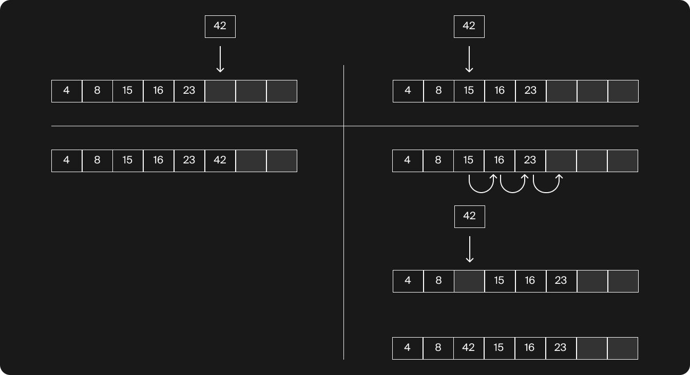
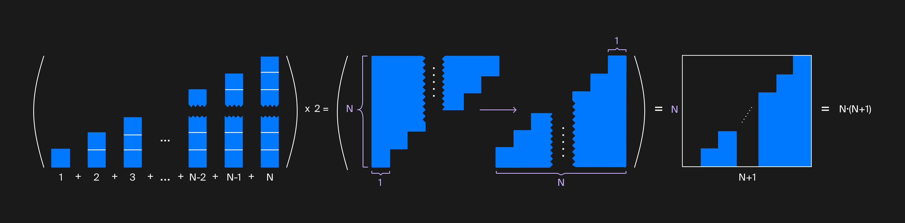
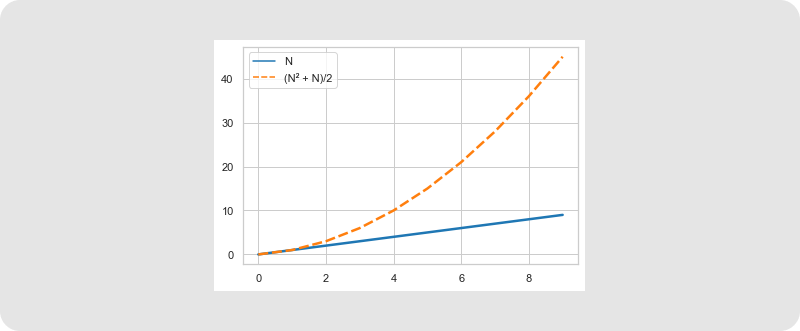
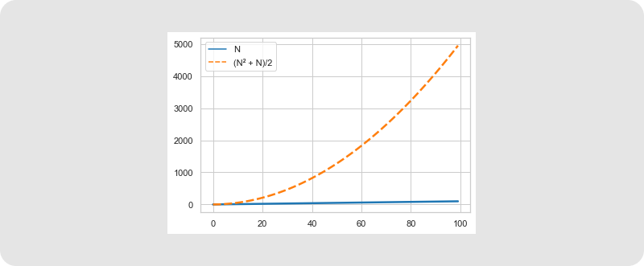

## Всегда ли нужно измерять
В теме «Профилируем и ускоряем» вы сделали невероятное: в тысячи раз ускорили операцию реверсирования вектора, просто изменив место вставки элементов. Для достижения конечного результата нет разницы, куда добавлять элемент: в начало или в конец, а с точки зрения влияния на производительность разница огромная. Но есть способ и без профилировщика понять, что вставлять нужно именно в конец. Тогда удастся сразу реализовать быстрый вариант.

Можно заранее оценить производительность алгоритма и не тратить время на заведомо неприемлемую по скорости реализацию. Для примера посчитаем количество элементарных операций для двух способов реверсирования вектора:

**Первый способ:** вставка элементов происходит в конец вектора.
**Второй способ:** вставка элементов происходит в начало вектора.

Будем считать только операции определённого вида — запись одного числа в память компьютера. Также будем считать, что мы заранее зарезервировали место в векторе методом `reserve`, так что вставки в конец требуют только одной операции.

Вектор хранит свои элементы непрерывным блоком. Чтобы вставить элемент в какую-либо позицию, нужно предварительно освободить для него ячейку. Для этого придётся передвинуть все последующие элементы вправо. Таким образом, вставка в начало вектора размера $K$ потребует $K+1$ операцию, так как нужно переместить $K$ существующих элементов вектора и записать ещё одно число. 

Вставка в конец и середину вектора. При вставке в середину пришлось переместить элементы 15, 16 и 23.

Мы посчитали одно перемещение за одну операцию, потому что переместить — это прочитать и записать в другое место, а чтения в данном примере не считаются. Вставка в конец требует только одну операцию записи.

Теперь представим, что вставляем не один раз, а много — обозначим это количество вставок через $N$.

Первый способ: делаем $N$ раз по одной операции. В сумме получим $N$.

Второй способ: в первый раз вектор пуст, будет одна операция записи. Во второй раз уже две операции, в третий — три. Просуммируем все количества операций для каждой из $N$ вставок и получим сложное выражение: $1+2+⋯+N$. Можно вычислить эту сумму по формуле суммы арифметической прогрессии. Ответом будет $\dfrac{N^2 - N}{2}$.

Если забыли формулу, просуммировать $1+2+3+⋯+(N−2)+(N−1)+N$ можно так:

Теперь предположим, что размер вектора 10 000 элементов. Вычислим общее количество операций.
Первый способ: 10 000 операций.
Второй способ: 50 005 000 операций.
Разница очевидна! Запуская программу, вы оценили это на себе, а вернее — на оборудовании своего компьютера. Причина такого серьёзного отличия в степени 2. Она есть в формуле второго способа, а в формуле первого её нет.
Наглядно покажет разницу $N$ и $\dfrac{N^2 - N}{2}$ такой график:

Сравнение величин при N до 10

Сравнение величин при N до 100

Алгоритм, в котором встречается $N^2$ , возникает и в обычных жизненных ситуациях. 

Найдём ответ в общем виде для офиса, где $N$ сотрудников. Каждый из N человек пожал руку остальным $N - 1$. Получилось $N⋅(N−1)$ рукопожатий. Но в рассуждении есть ошибка: жмут руку два человека, поэтому каждое рукопожатие посчитано два раза — в количестве рукопожатий первого и второго. Значит, результат нужно поделить на два. Получится ответ, похожий на то, что мы уже видели: $\dfrac{N^2 - N}{2}$.
Теперь посчитаем, сколько раз за весь день открывали и закрывали дверь, если каждый сотрудник делает это четыре раза: 
1. когда приходит на работу;
2. когда уходит;
3. когда идёт на обед;
4. когда возвращается с обеда;
   
А ещё в этот день один раз приходила уборщица и два раза курьер.

На этот раз подсчёт проще. Достаточно умножить количество сотрудников на количество открываний двери и прибавить остальных. Общая формула выглядит так: $4N+6$. Никакого квадрата тут нет, и количество получилось куда скромнее.