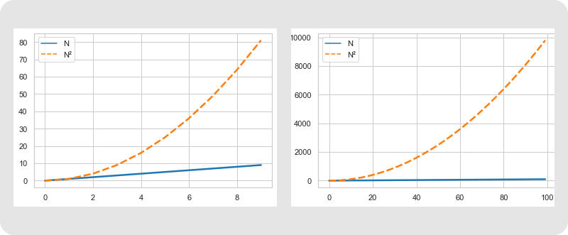

## От константы к квадрату
В прошлом уроке вы много считали. И считали не зря: вы увидели, что все полученные результаты разбились на два лагеря.

В первом лагере в ответе было $N$, но не было $N^2$, и числа получались не такими большими. Выражения, где есть $N$ в степени не выше единицы, называются линейными. Примеры линейных выражений: $N, 2N, 4N+6, 0.5N−100$. Для этих выражений есть специальное обозначение: $O(N)$ — произносится «о от эн».

Во втором лагере вы столкнулись с большими числами: 1225, 5050 и, наконец, 50 005 000. Всё потому, что в выражениях, из которых получились эти числа, фигурировал пресловутый $N^2$. Это квадратичная зависимость — есть N во второй степени, но нет $N$ в большей. Приведём примеры и тут: $\dfrac{N^2 - N}{2}$, $10N^2 +5N+1$, $\dfrac{N^2}{100} + 10$. Всё это можно обозначить символом $O(N^2)$ — произносится «о от эн квадрат».

Правило простое: из выражения убирают всё, кроме самого важного — в рассмотренных примерах это $N$ или $N^2$. Эти выражения покажут не сухой остаток точного количества операций, а то, что называется скоростью роста функции, или асимптотикой. Посмотрим, как это применить в программировании.

Первое правило асимптотики: убираем всё меньшее, оставляем главное.

Считать точное количество операций, которые выполнит программа, бывает непросто. А главное, это мало что даёт, ведь процессор выполняет больше операций, чем мы можем представить, глядя на код. Но это ещё полбеды. Разные операции имеют разную продолжительность. Бывает, что одна и та же операция иногда выполняется быстро, а иногда медленно. Всё это говорит о том, что абстрактное понятие «количество операций» или «количество сложений», «количество сравнений» не имеет большого смысла.

Как видите, при большом $N$ важен не коэффициент 1000 и длительность одной операции, а именно асимптотика. Если количество операций в A было $O(N^2)$, то у B это $O(N)$, благодаря чему при большом N программа B оказалась быстрее. Важно, что при увеличении N разница будет существенно расти: например, при $N=10 000 000$ она составит уже примерно 50 раз!

Эти графики показывают: при увеличении $N$ разница между $N$ и $N^2$ возрастает, а все коэффициенты, добавки и прочие постоянные факторы остаются неизменными.

В программировании важно, как программа поведёт себя при больших объёмах входных данных. Когда их мало, она и так, скорее всего, выполнится быстро. Поэтому главный вопрос — как будет расти количество операций программы, когда её параметры становятся большими. Чтобы ответить на этот вопрос, вводится понятие скорости роста количества операций — асимптотики. Оно обозначается буквой $O$. Асимптотика — это скорость роста. Количество, выражаемое формулой $O(N)$, может при некотором N быть даже больше, чем другое количество, выражаемое формулой $O(N^2)$. Но скорость роста у $O(N)$ меньше. Поэтому при увеличении N неизбежно настанет момент, когда $O(N^2)$ станет больше. На практике этот момент обычно настаёт быстро. А далее разница становится уже колоссальной, как на графике.

Самый простой, но важный пример асимптотики — константа. Она обозначается $O(1)$ и показывает, что оцениваемое количество известно заранее. Вернее, оно может варьироваться, но никогда не будет превышать заданное число, не зависящее ни от каких входных данных. Данных может быть очень и очень много, а оцениваемое количество всё равно останется в определённых пределах.

Например, Вася, приходя на работу, жмёт руку каждому из N коллег. Он делает $N−1$, то есть $O(N)$ рукопожатий. А его коллега Аркадий персонально здоровается только со своими друзьями: Андреем, Колей и Мишей. Количество его рукопожатий будет всего лишь $O(1)$.

Петя, наверное, самый дружелюбный человек на свете. Он здоровается со всеми, не только придя на работу, но и когда возвращается с обеда или просто отходит из офиса по своим делам. По правилам компании нельзя покидать офис более четырёх раз в день. 

Несмотря на дружелюбие, у Пети давний конфликт с Колей и Сашей, поэтому он никогда не здоровается с ними. Оцените количество рукопожатий, которые Петя совершает за день:

Неважно, сколько раз Петя выйдет из офиса и вернётся, осчастливив уставших коллег дружелюбным рукопожатием. Если это число ограничено чем-нибудь заранее известным, — в нашем случае 4 — количество рукопожатий всё равно вписывается в формулу $O(N)$: множитель и вычитаемое можно исключить по первому правилу асимптотики. Асимптотическая оценка возможна, даже когда данных для вычисления точного количества недостаточно.

Даже если в четверг половина офиса будет на конференции, на асимптотике это никак не отразится. Чтобы посчитать точное количество рукопожатий Пети, нужно будет узнать, кто из его коллег отправился на конференцию. Но на асимптотику это не влияет.

Вы изучили понятие скорости роста — асимптотика. Но пока не знаете, как этим пользоваться. В следующем уроке разберёмся, от чего зависит сложность программы и как эту сложность оценивать. После этого вы сможете самостоятельно оптимизировать программу.