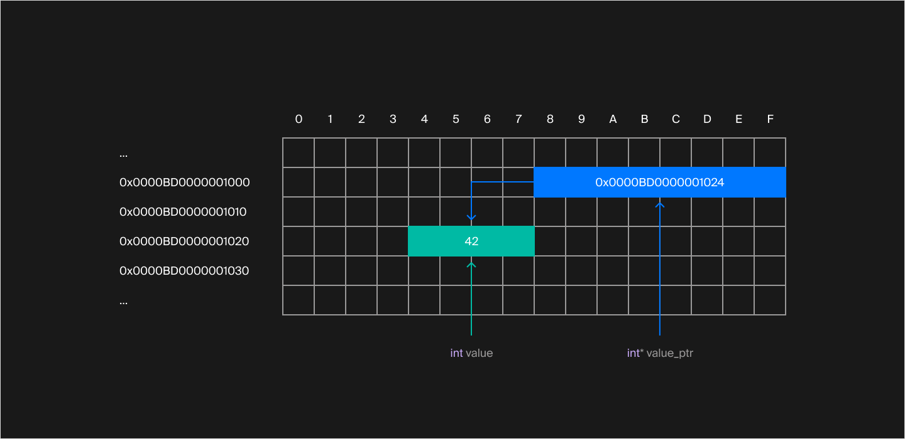
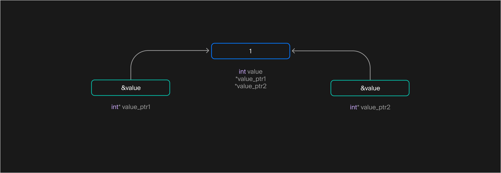

## Указатели. Открываем доступ к памяти
В прошлом уроке вы узнали об устройстве памяти компьютера и о том, как в ней представляются объекты, с которыми работает ваша программа. Сегодня познакомитесь с указателями — средством языка, открывающим доступ к памяти компьютера.

Указатель — переменная, которая хранит адрес объекта в памяти программы. Это как лист бумаги с адресом. Зная адрес своего друга, вы можете его навестить. Точно так же можно обратиться к объекту при наличии указателя на него.

Указатели объявляются подобно обычным переменным, только с использованием символа «звёздочка» `*` после типа. Например, так выглядит указатель, способный хранить адрес объекта типа `int`:

```cpp
int* p; 
```

Переменная `p` может хранить адрес целого числа. Так как переменная-указатель `p` не инициализирована, использовать её для доступа к объекту нельзя. Объявление указателя выделяет память для хранения адреса, но не инициализирует эту область памяти.

Размер указателей равен размеру адреса на конкретной платформе и не зависит от размера самих объектов. Рассмотрим пример:
```cpp
#include <iostream>
#include <map>
#include <string>

struct Vector3D {
    double x;
    double y;
    double z;
};

int main() {
    using namespace std;

    map<string, string>* string_to_string;

    cout << "char*: size:"s << sizeof(char*) << endl;
    cout << "int*: size:"s << sizeof(int*) << endl;
    cout << "double*: size:"s << sizeof(double*) << endl;
    cout << "Vector3D*: size:"s << sizeof(Vector3D*) << endl;
    cout << "map<string, string>*: size:"s << sizeof(string_to_string) << endl;
} 
```
Типичный размер и выравнивание указателя на 32-битной платформе равны четырём байтам, а на 64-разрядной — восьми. Вывод программы на 64-битной платформе:
```
char*: size:8
int*: size:8
double*: size:8
Vector3D*: size:8
map<string, string>*: size:8 
```
Вывод программы на 32-битной платформе:
```
char*: size:4
int*: size:4
double*: size:4
Vector3D*: size:4
map<string, string>*: size:4 
```
#### Инициализация указателя и получение адреса объекта

Чтобы использовать указатель, нужно присвоить ему адрес существующего объекта. Для получения адреса есть специальная унарная операция — `&`. Её называют операцией взятия адреса. Она применяется к объекту, адрес которого вы хотите получить, и возвращает адрес этого объекта:

```cpp
int value = 42;
// Указатель value_ptr ещё не инициализирован
int* value_ptr;

// Теперь в value_ptr хранится адрес переменной value
value_ptr = &value; 
```
Если присвоить указателю `value_ptr` результат выражения `&value`, указатель будет содержать адрес ячейки памяти, где располагается переменная `value`.



Так можно представить в памяти переменную `value` и указатель `value_ptr`. Адреса ячеек памяти приведены для примера.
Указателю можно присвоить только адрес объекта совместимого типа. Так, присвоить адрес переменной типа double указателю на тип `int` нельзя:

```cpp
int int_value = 42;
double double_value = 1.2345;

int* ptr;
// Следующая строка не скомпилируется,
// так как по адресу &double_value располагается объект типа double
ptr = &double_value; // error: cannot convert 'double*' to 'int*' in assignment 
```
Объявление указателя лучше объединить с его инициализацией — так запись короче, и неинициализированных указателей в программе не будет:

```cpp
int value = 42;
int* value_ptr = &value; 
```

Операцию взятия адреса можно применять не только к отдельным переменным, но и к полям структур и классов:

```cpp
#include <string>

using namespace std;

struct Point {
    double x;
    double y;
};

int main() {
    Point p;
    // y_ptr хранит адрес координаты Y точки p
    double* y_ptr = &p.y;
} 
```
Указатель `y_ptr` имеет тип `double*` и ссылается на поле y точки p:


В C++ ссылки — не объекты. Они вводят новое имя для доступа к уже существующему объекту. Поэтому оператор `&`, применённый к ссылке, возвращает не указатель на ссылку, а указатель на сам объект:
```cpp
int main() {
    int answer = 42;
    int& answer_ref = answer;

    // answer_ptr хранит адрес переменной answer
    int* answer_ptr = &answer_ref;
} 
```
И переменная `answer`, и ссылка `answer_ref` относятся к одному и тому же объекту. Поэтому взятие адреса ссылки равнозначно взятию адреса объекта:


Указатель `answer_ptr` хранит адрес переменной answer. На answer также ссылается ссылка `answer_ref`
#### Вывод указателя в поток

Операция `<<` может вывести в поток значение указателя.

```cpp
#include <iostream>
#include <string>

using namespace std;

int main() {
    int value = 42;
    int* value_ptr = &value;
    cout << "value_ptr: "s << value_ptr << endl;
}
```
Формат вывода адреса зависит от компилятора и платформы. Примеры:
- Linux для архитектуры x64, компилятор GCC:
```
value_ptr: 0x7ffd6596006c 
```
- Windows для архитектуры x86, компилятор Microsoft Visual C++ 2019:
```
value_ptr: 00EFF930 
```
#### Нулевой указатель

Неинициализированный указатель содержит неопределённое значение. Использовать такой указатель для доступа к объекту нельзя, поведение программы будет неопределённым, как и значение указателя. Также нет смысла сравнивать этот указатель с другими — в общем случае отличить значение неинициализированного указателя от инициализированного невозможно.

Инициализируйте указатель при его объявлении: присвойте ему адрес существующего объекта совместимого типа или специальное значение `nullptr` — нулевой указатель.

Нулевой указатель хранит значение `nullptr`. C++ гарантирует, что по адресу `nullptr` не будет размещаться ни один объект программы. Поэтому перед использованием указателя вы сможете определить, есть ли в нём адрес существующего объекта. Для этого сравните указатель со значением `nullptr`:
```cpp
#include <cassert>
#include <iostream>

int main() {
    using namespace std;

    int* p = nullptr;

    //------
    // Пример кода, который может записать в p адрес существующего объекта
    // или оставить указатель равным nullptr
    int value = 0;
    cin >> value;
    if (value >= 0) {
        p = &value;
    }
    //------

    cout << "p: "s << p << endl;

    if (p != nullptr) {
        assert(p == &value);
        cout << "p is not nullptr"s << endl;
        // Можно использовать указатель p для доступа к объекту
    }

    // Аналогично условию p != nullptr
    if (p) {
        assert(p != nullptr);

        // Можно использовать указатель p для доступа к объекту
    }

    if (!p) {
        assert(p == nullptr);
        cout << "p is nullptr"s << endl;
        // Указатель p равен nullptr. Использовать его для доступа к объекту нельзя
    }
} 
```
Как видно из примера, условие `p != nullptr` можно сократить до `p`, а `p == nullptr` — до `!p`. Так указатели конвертируются в `bool`.

Указатели разных типов нельзя сравнивать между собой. Исключение — указатель типа `void*`, который ничего не говорит о данных, расположенных по адресу, который он хранит. Также любой указатель можно сравнивать с `nullptr`. Это допустимо благодаря тому, что `nullptr` — не указатель, он имеет специальный тип — `nullptr_t`.

#### Разыменование указателя

Чтобы получить доступ к объекту в C++, используют унарную операцию разыменования указателя. Она обозначается символом *. Эта операция выполняет обратное действие. Если её применить к указателю, она вернёт ссылку на объект, адрес которого хранит указатель. Доступ к объекту посредством указателя ещё называют косвенным доступом. Рассмотрим, как указатели дают доступ к переменной:

```cpp
#include <cassert>

using namespace std;

int main() {
    int value = 1;

    // Указатель value_ptr1, ссылающийся на переменную value
    int* value_ptr1 = &value;
    // Указатель value_ptr2, копия указателя value_ptr1, также ссылается на переменную value
    int* value_ptr2 = value_ptr1;

    // Значения указателей на один и тот же объект будут равны
    assert(value_ptr1 == value_ptr2);

    // Значение объекта value, полученное напрямую и через указатель на него, будет одно и то же
    assert(*value_ptr1 == value && *value_ptr2 == value);

    // Изменение value видно через указатели на него
    value = 2;
    assert(*value_ptr1 == value && *value_ptr2 == value);

    // Изменяем значение value через указатель
    *value_ptr2 = 3;

    // Ожидаемо изменённое значение будет видно как при прямом доступе к объекту по его имени,
    // так и при косвенном обращении через указатель value_ptr1
    assert(*value_ptr1 == value && *value_ptr2 == value);
} 
```
В программе создаются переменная `value` и указатели `value_ptr1` и `value_ptr2`, ссылающиеся на неё. Доступ к значению `value` можно получить как напрямую по имени самой переменной, так и косвенно — разыменовать любой из указателей на неё.



Значение value можно получить, разыменовав любой из указателей `value_ptr1` и `value_ptr2`


Указатели `p1` и `p2` указывают на переменную `x`. К её значению можно обратиться, используя любой из этих указателей.

Если у вас есть указатель на объект класса или структуры, можно обратиться к его полям и методам через операцию `->`. Она автоматически разыменовывает указатель:

```cpp
#include <cassert>
#include <string>

int main() {
    using namespace std;

    string practicum = "Practicum"s;

    string* paracticum_ptr = &practicum;

    // Прежде чем обратиться к методу length, разыменуем указатель
    assert((*paracticum_ptr).length() == 9);

    // Также обращение к полям и методам структур и классов
    // доступно при помощи операции ->
    assert(paracticum_ptr->substr(2, 3) == "act"s);
} 
```
Операцию разыменования `*` и операцию доступа к полям и методам `->` можно применять только к указателям, которые хранят адрес существующего объекта в памяти. Использовать их с неинициализированным или нулевым указателем нельзя — это приведёт к неопределённому поведению. Прежде чем применять указатель, который может потенциально иметь нулевое значение, сделайте проверку на равенство `nullptr`:
```cpp
#include <cassert>
#include <iostream>

int main() {
    using namespace std;

    int* p = nullptr;

    //------
    int value = 0;
    cin >> value;
    if (value >= 0) {
        p = &value;
    }
    //------

    if (p != nullptr) {
        // Использовать p можно
        cout << *p << endl;
    }
} 
```
В этом уроке вы познакомились с указателями — объектами, способными хранить адреса других объектов. Избегайте неинициализированных указателей. Они — источник трудноуловимых ошибок.