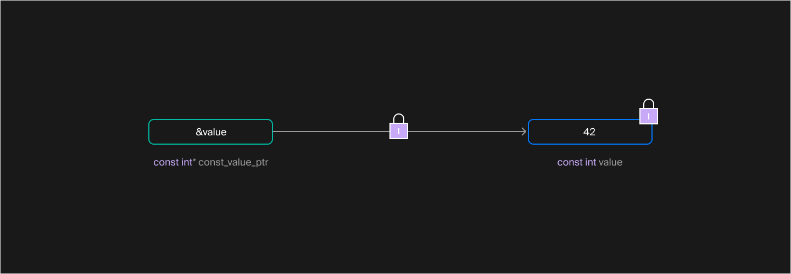
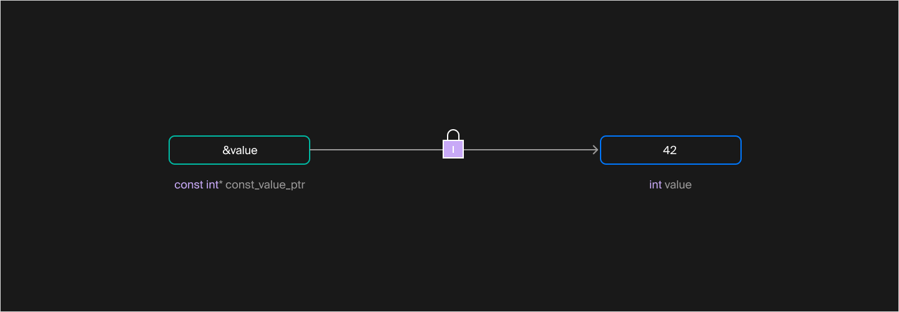
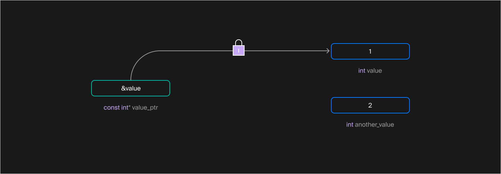
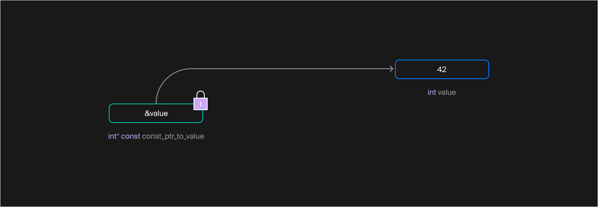
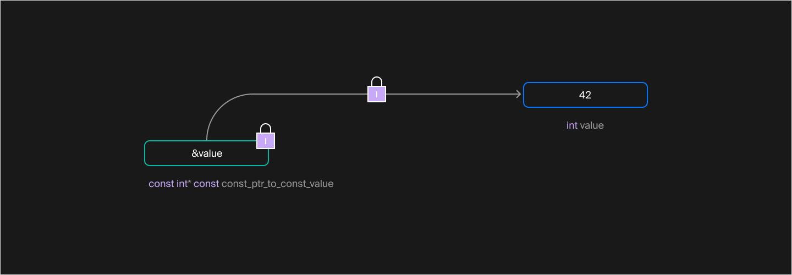

## Указатели и константность
В прошлом уроке вы познакомились с указателями — переменными, хранящими адреса объектов в памяти. Операция & позволяет взять адрес объекта и сохранить его в переменную-указатель. В нужный момент вы разыменовываете этот указатель операцией `*`, чтобы прочитать или изменить состояние объекта.

Переменные в C++ можно объявить константными, чтобы защитить их значения от непреднамеренной модификации. При попытке изменить константную переменную компилятор выдаст ошибку.

#### Указатель на константу

Свойство константности сохраняется и при взятии адреса объекта. Операция `&` возвращает указатель на константный объект — его ещё называют указателем на константу. Такой указатель разрешает читать значение объекта, но не модифицировать его:
```cpp
#include <cassert>

int main() {
    const int value = 42;

    // Ошибка: неконстантная ссылка не может ссылаться на константный объект
    // int& value_ref = value;

    // А вот так можно
    const int& const_value_ref = value;
    
    // Ошибка: указатель на неконстантное значение не может хранить адрес константного объекта
    // int* value_ptr = &value;

    // Указатель на константу типа int.
    const int* const_value_ptr = &value;
    // можно также объявить как int const* - это одно и то же

    // Указатель на константу можно использовать только для чтения значения объекта
    assert(*const_value_ptr == 42);
    // Выполнить модификацию объекта с его помощью нельзя.
    // Следующая строка не скомпилируется:
    // *const_value_ptr = 43;
} 
```

Здесь компилятор не разрешает задать указателю типа `int*` значение адреса константного объекта. Такой указатель позволил бы изменить состояние объекта. В этом плане указатели на константу похожи на константные ссылки.



Указатель на неизменяемое значение типа `const int`

Указатель на константу может хранить адрес неконстантного объекта и таким образом предоставить доступ к объекту только для чтения. В этом случае указатель на константу ведёт себя подобно константой ссылке. 

Константные ссылки и указатели на константу запрещают модифицировать объект, только если вы используете именно их. Изменять значение объекта иным способом можно.
```cpp
#include <cassert>

int main() {
    int value = 42;

    // Указатель на константу может хранить адрес неконстантного объекта
    const int* const_value_ptr = &value;

    // Константная ссылка может ссылаться на неконстантный объект
    const int& const_value_ref = value;

    value = 43;

    // Константные ссылки и указатели на константу означают, что
    // через них нельзя изменить значение объекта. Само значение 
    // может быть изменено иным способом.
    assert(const_value_ref == 43);
    assert(*const_value_ptr == 43);
}  
```
В этой программе доступ к переменной `value` через указатель `const_value_ptr` разрешается только для чтения. Саму переменную `value` можно изменять как обычно.



Указатель типа `const int *` указывает на изменяемое значение типа `int`. Изменение через указатель невозможно

#### Изменение значения указателя

В отличие от ссылок, указатели могут в процессе жизни менять своё значение, храня в разные моменты времени адреса разных объектов. Простейший способ изменить значение указателя — присвоить ему адрес другого объекта:
```cpp
#include <cassert>
#include <iostream>
#include <string>

using namespace std;

int main() {
    int value = 1;

    // Сначала value_ptr ссылается на value
    int* value_ptr = &value;

    cout << "&value: "s << &value << endl;
    cout << "value_ptr: "s << value_ptr << endl;
    assert(*value_ptr == 1);

    int another_value = 2;
    // Затем ссылается на another_value
    value_ptr = &another_value;

    cout << "&another_value: "s << &another_value << endl;
    cout << "value_ptr: "s << value_ptr << endl;
    assert(*value_ptr == 2);
} 
```
Возможный вывод этой программы:
```
&value: 00000031D55AFC20
value_ptr: 00000031D55AFC20
&another_value: 00000031D55AFC24
value_ptr: 00000031D55AFC24 
```
Указатель на константу сам константой не будет и может в любой момент начать ссылаться на другой объект:
```cpp
#include <cassert>
#include <iostream>
#include <string>

using namespace std;

int main() {
    int value = 1;

    // Указатель на константу. Само значение указателя константным не является.
    const int* value_ptr = &value;
    assert(*value_ptr == 1);

    int another_value = 2;

    // Можно присвоить указателю адрес другого объекта.
    value_ptr = &another_value;
    assert(*value_ptr == 2);
} 
```



Два значения типа `int` и указатель типа  `const int *`, указывающий на одно из них

#### Константные указатели

Константным может быть не только объект, на который ссылается указатель, но и сам указатель. Значение константного указателя нельзя изменить после инициализации. Чтобы объявить такой указатель, поставьте `const` справа от знака `*`. Как и обычная константа, константный указатель должен быть инициализирован при объявлении:
```cpp
int value = 42;
int* const const_ptr_to_value = &value;

int another_value = 5;
// Ошибка: нельзя изменить значение константного указателя
// const_ptr_to_value = &another_value; 
```



Неизменяемый указатель, указывающий на изменяемое значение

#### Константные указатели на константу

Как вы могли догадаться, константными могут быть как сам указатель, так и данные, на которые он ссылается. В этом случае разместите ключевое слово `const` с обеих сторон от символа `*`:
```cpp
int value = 42;
const int* const const_ptr_to_const_value = &value;

int another_value = 5;
// Ошибка: нельзя изменить значение константного указателя:
// const_ptr_to_const_value = &another_value;

// Ошибка: нельзя изменить значение данных через указатель:
// *const_ptr_to_const_value = 0; 
```



Неизменяемый указатель, указывающий на неизменяемое значение

В типе i`nt*` слово const можно написать не в двух, а в трёх местах: `const int*`,  `int* const `и `int const *`. Первый и последний вариант эквивалентны — это указатели на тип `const int`, который допустимо записывать как `int const`. Мы будем пользоваться только первым вариантом, но при чтении чужого кода может встретиться и второй.

#### Определение типа указателя

Есть простое мнемоническое правило, которое позволяет запомнить, к чему относится const в типе указателя. Для этого прочитайте объявление указателя справа налево, заменяя символ * на слово «указатель». Например:
```cpp
// p1 - это указатель на данные типа int
int* p1;

// p2 - это указатель на данные типа const int
const int* p2;

int data = 42;

// p3 - это константный указатель на данные типа int
int* const p3 = &data;

// p4 - это константный указатель на данные типа const int
const int* const p4 = &data; 
```

- `const string *` — изменяемый указатель на константный объект


- `vector<string> * const` — константный указатель на изменяемый объект


- `const vector<string*>` — не указатель


- `map<int, const string> * const` — константный указатель на изменяемый объект


- `string const *` — изменяемый указатель на константный объект


- `char const * const` — константный указатель на константный объект


#### Указатели и константность — итоги

Указатели на константу нужны, чтобы хранить адрес константного объекта и ограничивать доступ к неконстантным объектам. Сам указатель также может быть константным — в этом случае адрес, хранящийся в нём, нельзя менять после инициализации.