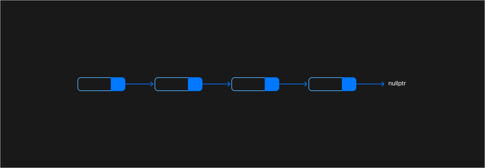
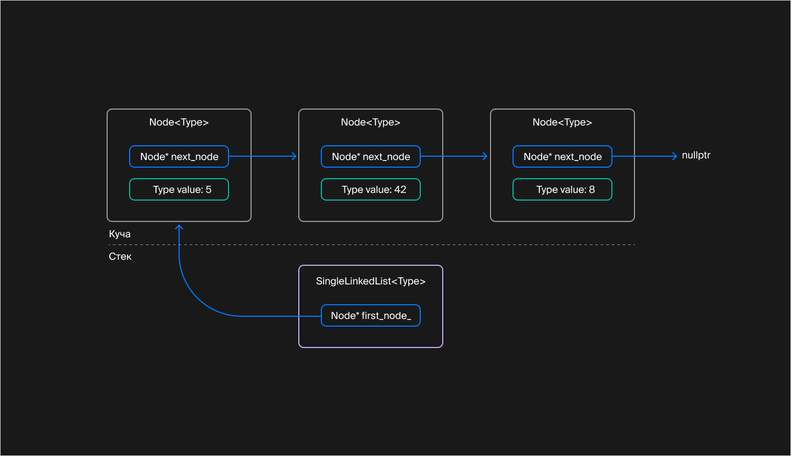
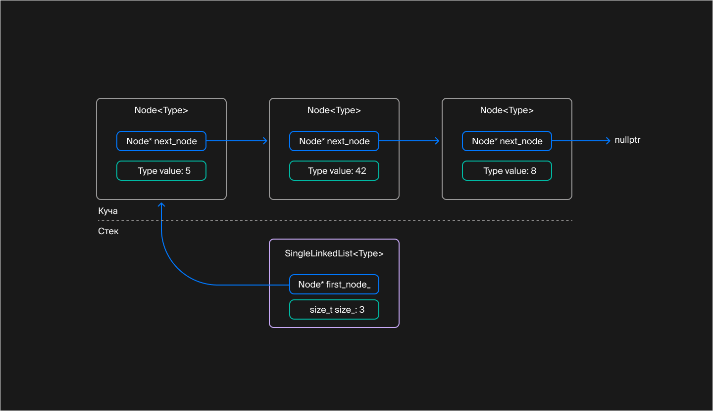
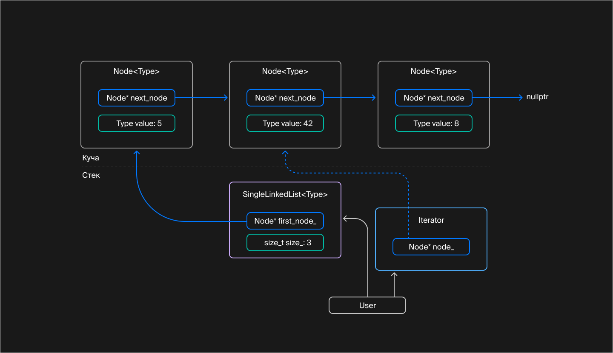
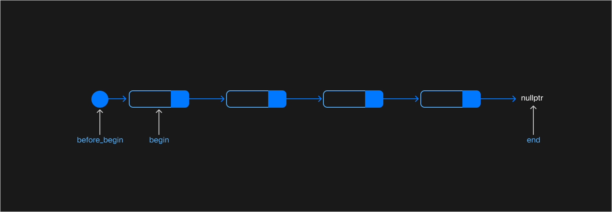
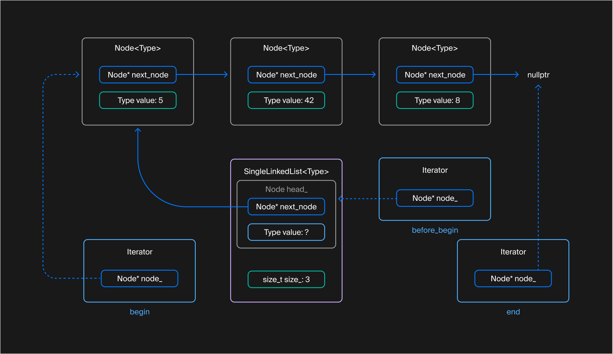

## Как устроен односвязный список

В предыдущих уроках вы использовали контейнеры стандартной библиотеки. Даже в основе вспомогательного класса `PtrVector` лежал контейнер `vector`. Теперь у вас достаточно знаний, чтобы с нуля создать первый собственный контейнер — односвязный список. Это позволит разобраться в том, как устроены связные структуры данных.

Односвязный список ещё называют линейным однонаправленным списком. Эта структура данных состоит из элементов одного типа. Их логически связывают между собой указатели. Каждый элемент списка указывает на следующий, а последний — на `nullptr`. Хранятся элементы списка, как правило, в динамической памяти.



Каждый элемент односвязного списка ссылается на следующий элемент

Структура односвязного списка такова, что передвигаться по его элементам можно только в прямом направлении. Узнать адрес предыдущего элемента, опираясь лишь на содержимое текущего элемента, невозможно.

Односвязный список допускает следующие операции:

- вставка элемента в начало или конец списка;
- вставка элемента после некоторого элемента списка;
- удаление элемента, следующего за данным элементом списка;
- проверка списка на пустоту;
- определение количества элементов в списке.

Достоинства односвязного списка:
- вставка и удаление элемента выполняются за константное время, то есть не зависят от количества элементов и позиции вставляемого или удаляемого элемента;
  
- размер списка ограничен лишь объёмом доступной памяти.

Недостатки односвязного списка следуют из особенностей его структуры:

- Узнать адрес элемента по его порядковому номеру — операция линейной сложности. Чтобы определить адрес $N$-го элемента списка, нужно последовательно перебрать все $N-1$ элементов, начиная с первого элемента.
  
- Неэффективное расходование памяти: помимо данных, каждый элемент списка хранит указатель на следующий элемент. Кроме того, при каждом создании объекта в динамической памяти пара десятков байт расходуется на поддержание структуры кучи.
  
- Не такая высокая эффективность вставки и удаления. Каждая вставка и каждое удаление обращаются к операциям работы с кучей: `new` или `delete`. Считается, что эти операции работают за константное время, однако константа может быть достаточно большой. При этом выполняется сложный код синхронизации между потоками, и могут быть задействованы низкоуровневые механизмы работы с памятью.
- Соседние элементы списка могут располагаться в памяти непоследовательно, что снижает эффективность работы кэш-памяти.

Тем не менее односвязный список — одна из базовых связанных структур данных. Понять, как он работает, — значит сделать первый шаг к разработке более сложных структур. В стандартной библиотеке односвязный список представлен шаблоном класса `forward_list`. Вам предстоит разработать его аналог — `SingleLinkedList`, то есть односвязный список.

Контейнер способен хранить данные произвольного типа, поэтому соответствующий класс следует объявить шаблонным:
```cpp
template <typename Type>
class SingleLinkedList {
    ...
}; 
```

Элемент списка называется «узел». Элемент списка можно представить в виде структуры `Node`, которая содержит значение элемента и указатель на следующий узел. Можно сделать структуру `Node` шаблонной, а можно просто поместить её внутрь шаблонного класса `SingleLinkedList`. В этом случае полное имя `SingleLinkedList<Type>::Node` будет содержать информацию о типе значения, которое хранится в узле:
```cpp
template <typename Type>
class SingleLinkedList {
    // Узел списка
    struct Node {
        Node() = default;
        Node(const Type& val, Node* next)
            : value(val)
            , next_node(next) {
        }
        Type value;
        Node* next_node = nullptr;
    };
    ...
}; 
```

Каждый узел списка знает, где находится следующий за ним элемент, а информацией о местоположении первого узла владеет сам класс списка. Так класс списка может управлять своим содержимым — достаточно знать адрес первого элемента, чтобы добраться до всех остальных.

В простейшем случае списку, чтобы управлять своими элементами, достаточно хранить указатель на первый элемент.



Список содержит указатель на первый элемент

Если представить список так, для его хранения потребуется минимум памяти в области стека — всего четыре или восемь байт в зависимости от размера указателя. Все остальные данные хранятся в области кучи. Но у такого способа есть недостаток — узнать количество элементов в списке можно, только пройдясь по всем его элементам.

Чтобы время вычисления длины списка не зависело от количества его элементов, можно пожертвовать четырьмя или восемью байтами и добавить в список дополнительное поле, которое хранило бы размер списка.



Чтобы не тратить время на подсчёт элементов списка, в него добавили поле `size_`

Пользовательский код не должен иметь возможности обратиться к узлам односвязного списка, так как:
- пользовательский код может случайно модифицировать структуру данных односвязного списка и нарушить её целостность. Это чревато сбоями в работе программы или утечками памяти;
  
- прямой доступ к элементам списка усложняет обход его элементов и вынуждает пользователей применять указатели.
Изменения в реализации списка или его узлов могут повлиять на работоспособность пользовательского кода.

Поэтому для доступа к элементам стандартных контейнеров применяют вспомогательные объекты — итераторы, которые:
- «знают» о внутреннем устройстве контейнера и умеют перемещаться с одного элемента на другой;

- скрывают служебные данные от пользовательского кода и предоставляют простой интерфейс. Используя его, можно обращаться к значениям элементов списка и к следующему элементу;
  
- играют роль указателей на элементы контейнера в операциях вставки и удаления элементов;

- служат посредниками между контейнерами и алгоритмами, благодаря чему один и тот же алгоритм можно использовать с разными контейнерами.

Итератор односвязного списка хранит указатель на текущий узел. Этих данных достаточно, чтобы иметь доступ к значению узла и перемещаться к следующему узлу.



Итератор хранит указатель на узел списка

Операции вставки и удаления элемента из односвязного списка требуют указателя на элемент, предшествующий позиции вставки/удаления. В этих операциях такой объект используется как опорный. Поэтому помимо знакомых вам итераторов `begin` и `end`, присущих другим контейнерам, односвязному списку нужен итератор `before_begin`. Данный итератор ссылается на позицию перед первым элементом:



Итераторы `before_begin`, `begin` и `end`

Итератор, хранящий позицию `before_begin`, обычно ссылается на фиктивный узел списка. Этот узел можно создать при инициализации списка и использовать лишь для хранения указателя на первый «настоящий» элемент и никогда — для хранения данных. Поэтому его можно хранить не только в куче, но и в самом списке, вместо указателя на первый элемент.



Узлы, на которые ссылаются итераторы `begin`, `before_begin` и `end`

```cpp
template <typename Type>
class SingleLinkedList {
    struct Node { ... };
private:
    Node head_;
    size_t size_;
}; 
```

Далее вы примените теорию на практике и шаг за шагом реализуете односвязный список. Начнём с пустого списка.

Эти две проблемы можно обойти, но код усложнится. Поэтому будем считать, что элемент `Type` легко создаётся конструктором без параметров и не занимает много места.