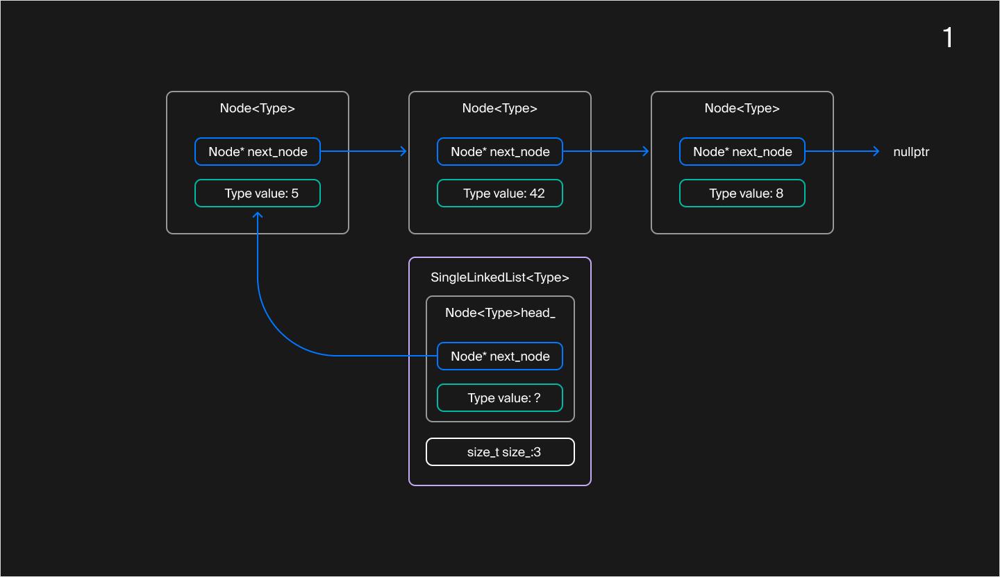
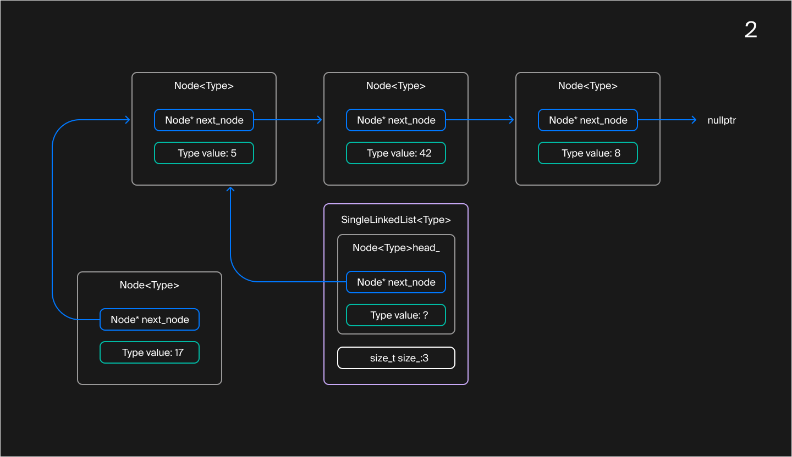
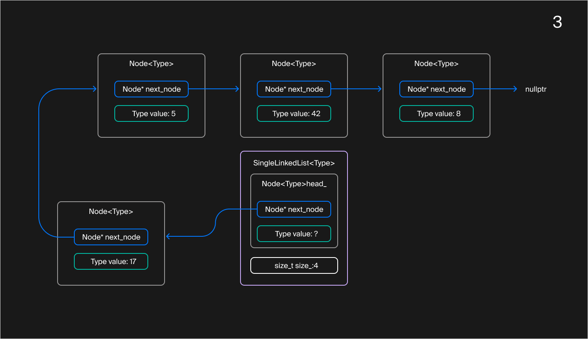
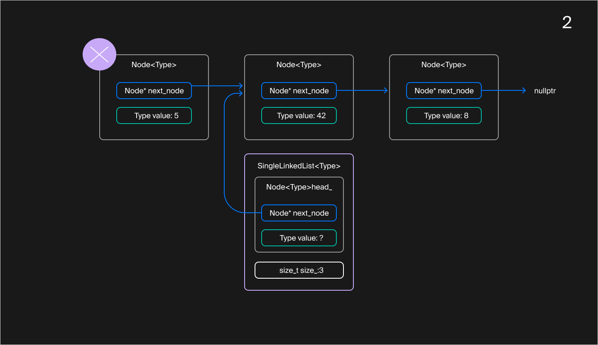
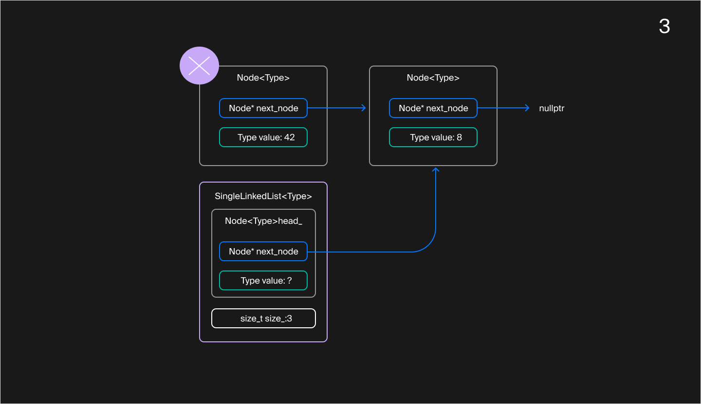
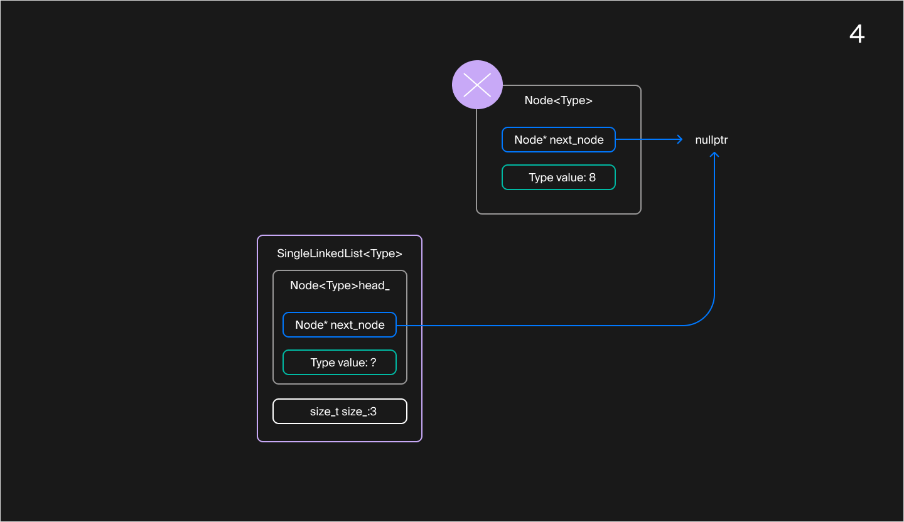

## Вставка элементов и очистка списка

В предыдущем уроке вы познакомились с новой структурой данных — односвязным списком и создали каркас шаблонного класса `SingleLinkedList`, который реализует функциональность пустого списка. В этом уроке вы научитесь динамически добавлять элементы в начало и очищать список.

#### Вставка элемента в начало списка

Пусть дан список, где уже есть несколько элементов `{5, 42, 8}`.

Односвязный список с элементами `{5, 42, 8}`

Поле `next_node` фиктивного узла `head_` хранит указатель на первый элемент списка. В случае пустого списка `head_.next_node` равен `nullptr`:

В пустом списке указатель `head_.next_node` равен `nullptr`
Чтобы вставить новый элемент в начало списка, нужно создать новый узел. Следующим элементом этого узла будет текущий первый элемент списка, то есть значение `head_.next_node`:

Чтобы вставить значение 17 в начало списка `{5, 42, 8}`, создадим новый узел, который ссылается на первый узел списка

Этот узел должен стать новым первым узлом списка. Обновим указатель `head_.next_node` и увеличим размер списка на единицу:

Вставленный узел становится первым узлом списка. Размер списка увеличивается

#### Очистка односвязного списка

Рассмотрим алгоритм очистки на примере односвязного списка `{5, 42, 8}`.

Односвязный список с элементами `{5, 42, 8}`

Процесс очистки продолжается, пока список непустой — то есть указатель `head_.next_node` на первый элемент списка ненулевой. После первой итерации `head_.next_node` будет ссылаться на второй элемент со значением 42 по адресу `head_.next_node->next_node`, а первый элемент со значением 5 удаляется:

Голова списка ссылается на его второй элемент, а первый элемент удаляется

На следующих итерациях происходит то же самое. Указатель `head_.next_node` смещается на второй элемент списка `{42, 8}`, а первый элемент удаляется:

Голова списка ссылается на значение 8, а значение 42 удаляется
Когда в списке останется один элемент, его удаление приведёт к тому, что `head_.next_node` будет ссылаться на `nullptr`:

Удаляется последний элемент списка. Голова указывает на значение `nullptr`
На этом процесс очистки списка заканчивается. Остаётся обнулить размер списка. Получится пустой список:

