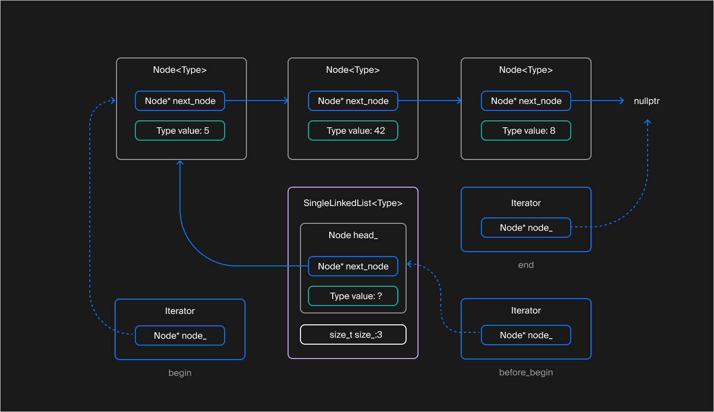

## Покоряем итераторы
Ваш односвязный список содержит методы `IsEmpty` и `GetSize`, которые позволяют узнать о наличии и количестве элементов, а также методы `PushFront` и `Clear` для вставки элемента и очистки списка. Но полноценная работа со списками предполагает не только возможность помещать внутрь него элементы, но и проходить по элементам списка.

Стандартные контейнеры вводят концепцию итератора — специального объекта, который играет роль указателя на элемент контейнера. Используем пару итераторов, чтобы задать подлежащий обходу диапазон `[начало, конец)` элементов контейнера.



Итераторы `begin`, `before_begin` и `end` и узлы, на которые они указывают

Итераторы и полуинтервалы — абстракции, которые прячут особенности внутреннего устройства конкретного контейнера за унифицированным интерфейсом. Итераторы разных контейнеров похожи: они предоставляют операции `*` и `->` для доступа к элементам, операции `++` и `--` для обхода элементов в прямом и обратном направлении. Благодаря этой унификации и шаблонам один алгоритм способен обрабатывать содержимое различных контейнеров. Создавать под каждый отдельную версию алгоритма не нужно.

В этом уроке вы реализуете поддержку обхода элементов для класса `SingleLinkedList`, совместимую со стандартной библиотекой и циклом range-based for.

#### Как устроен итератор односвязного списка

Чтобы класс или структура с точки зрения стандартных алгоритмов считались итератором, внутри должны быть объявлены вложенные типы:
- `iterator_category`. Задаёт категорию итератора. Категория итератора сообщает стандартной библиотеке о наборе операций, поддерживаемых итератором. Так как односвязный список поддерживает перебор элементов только в прямом направлении, его категория итератора должна быть равна `std::forward_iterator_tag`.
- `value_type`. Задаёт тип элементов, доступ к которым предоставляет итератор. В случае односвязного списка этот тип совпадает с параметром `Type` шаблона `SingleLinkedList`.
- `difference_type`. Задаёт тип для хранения смещения между двумя итераторами. Используется в таких функциях, как `std::advance` и `std::distance`. Для `SingleLinkedList` можно использовать тип `std::ptrdiff_t`. Это целое число со знаком, разрядность которого совпадает с разрядностью указателя на целевой платформе.

- `pointer`. Задаёт тип указателя, возвращаемого операцией `->`. Для неконстантного итератора `SingleLinkedList` это `Type*`, а для константного — `const Type*`.
- `reference`. Задаёт тип ссылки, которую возвращает операция разыменования `*`. В зависимости от константности итератора `SingleLinkedList` это либо `Type&`, либо `const Type&`.

```cpp
#include <cstddef>
#include <iterator> // Содержит объявления категорий итераторов

template <typename Type>
class SingleLinkedList {
    // Шаблон класса «Базовый Итератор»
    // определяет поведение итератора на элементы односвязного списка
    // ValueType — совпадает с Type (для Iterator) либо с const Type (для ConstIterator)
    template <typename ValueType>
    class BasicIterator {
    public:
        using iterator_category = std::forward_iterator_tag;
        using value_type = Type;
        using difference_type = std::ptrdiff_t;
        using pointer = ValueType*;
        using reference = ValueType&;
        ...
    };
    ...
}; 
```
Константный итератор подобен указателю на константу. Он предоставляет доступ к элементам контейнера только для чтения, при этом значение самого итератора можно менять. Стандартные контейнеры имеют константную и неконстантную версии методов `begin` и `end`, которые возвращают константный и неконстантный итераторы соответственно.

Итератор категории `std::forward_iterator_tag` соответствует категории однонаправленного итератора. В нём должны быть объявлены следующие операции:
- операции `==` и `!=`. Итераторы одного и того же списка равны, если указывают на одну и ту же позицию. Константные и неконстантные итераторы одного и того же списка можно сравнивать друг с другом;

- операция инкремента `++`. Перемещает итератор на следующую позицию в списке;

- операции `*` и `->` для доступа к элементу списка. Возвращают ссылку и указатель на значение, хранящееся в списке, а не на весь узел списка, задаваемый вложенной структурой `Node`. Помните, итераторы должны скрывать внутреннее устройство контейнера от внешнего мира.
  
```cpp
template <typename Type>
class SingleLinkedList {
    template <typename ValueType>
    class BasicIterator {
    public:
        ...
        [[nodiscard]] bool operator==(const BasicIterator<const Type>& rhs) const noexcept {...}
        [[nodiscard]] bool operator!=(const BasicIterator<const Type>& rhs) const noexcept {...}
        [[nodiscard]] bool operator==(const BasicIterator<Type>& rhs) const noexcept {...}
        [[nodiscard]] bool operator!=(const BasicIterator<Type>& rhs) const noexcept {...}

        BasicIterator& operator++() noexcept {...}
        BasicIterator operator++(int) noexcept {...}

        [[nodiscard]] reference operator*() const noexcept {...}
        [[nodiscard]] pointer operator->() const noexcept {...}
    ...
    };
    ...
}; 
```
Чтобы использовать `==` и `!=` для сравнения константных и неконстантных итераторов, нужно объявить две версии этих операций.

Обратите внимание на перегрузку операции инкремента. Вспомним, что в C++ есть префиксная и постфиксная формы операции инкремента и декремента. 

- префиксная версия модифицирует объект и возвращает ссылку на текущий экземпляр класса;

- постфиксная версия модифицирует объект и возвращает копию прежнего значения объекта.

Постфиксная форма операций инкремента и декремента принимает фиктивный параметр типа `int`, который не используется и только подсказывает компилятору, какая версия переопределена. Как правило, постфиксная форма основывается на функционале префиксной:

```cpp
class MyType {
public:
    // Перегрузка префиксной формы
    MyType& operator++() {
        /* изменяем текущий объект */
        return *this;
    }
    // Перегрузка постфиксной формы
    MyType operator++(int) {
        auto old_value(*this); // Сохраняем прежнее значение объекта для последующего возврата
        ++(*this); // используем логику префиксной формы инкремента
        return old_value;
    }
    ...
};
```
Во внутреннем представлении итератор односвязного списка хранит указатель на узел списка. В операциях `*` и `->` этот указатель разыменовывается, а после инкремента итератора ссылается на следующий узел списка.

Чтобы защитить внутреннюю структуру списка от доступа извне, создавать итератор, ссылающийся на позицию внутри списка, можно только внутри `SingleLinkedList`. Для этого в конструктор итератора передаётся указатель на приватную структуру `Node`.

Приватные члены класса доступны изнутри него. Так, например, `BasicIterator` находится внутри класса `SingleLinkedList`, поэтому итератору доступны все приватные члены `SingleLinkedList`, в том числе `Node`. Но наоборот это не работает: `SingleLinkedList` находится не внутри, а снаружи `BasicIterator`. Списку доступ к приватным членам итератора закрыт.

Но некоторым операциям списка может понадобиться доступ к указателю на узел внутри итератора. В C++ класс или структура могут объявить о своём безграничном доверии другому классу, структуре или функции, назвав их дружественными. Для этого применяют ключевое слово `friend`. Класс открывает друзьям доступ к своей приватной области.

Пользуйтесь этой возможностью осторожно: неаккуратная работа с приватными полями класса способна нарушить целостность состояния объекта. Например, после изменения приватной части класса программист может забыть внести нужные правки в логику работы его друзей. Вероятность этой ситуации повышается, если класс и его друзья находятся в разных файлах. В лучшем случае код не скомпилируется, а в худшем — скомпилируется, но ошибка долго останется незамеченной.

По умолчанию класс `SingleLinkedList` не имеет доступа к приватной области своего итератора. Объявив список своим другом, итератор разрешит ему, и только ему обращаться к своей внутренней части. В данном случае такое доверие обоснованно, так как и список, и итератор работают с одной и той же структурой данных, скрытой от внешнего мира:

```cpp
template <typename Type>
class SingleLinkedList {
    template <typename ValueType>
    class BasicIterator {
       ...
    private:
        // Разрешаем SingleLinkedList обращаться к приватной области
        friend class SingleLinkedList;
        explicit BasicIterator(Node* node) {...}
        Node* node_ = nullptr;
    };

public:
    using Iterator = BasicIterator<Type>;
    using ConstIterator = BasicIterator<const Type>;

    [[nodiscard]] Iterator begin() noexcept {
        // Благодаря дружбе SingleLinkedList имеет доступ к приватному конструктору своего итератора
        return Iterator{head_.next_node};
    }
    ...
};
```
Дружба — это чудо!＊
＊Отношение дружбы — самая сильная связь в C++. Гибкие и надёжные архитектуры строятся из компонентов, минимально осведомлённых об устройстве друг друга. Классу редко следует открывать внешнему коду доступ к своей приватной области. Контейнер и его итератор — один из случаев, когда это может быть оправдано.

Компилятор интерпретирует конструкцию `friend` во время настройки класса `SingleLinkedList` на конкретный тип. Имя `SingleLinkedList` в этот момент — сокращение для `SingleLinkedList<Type>`, и дружба будет применяться только к этой специализации. Если вы хотите подружить класс со всеми возможными специализациями шаблонного класса, то саму конструкцию `friend` можно сделать шаблонной:

```cpp
#include <utility>

class Alibaba;

// Разбойник — это объект шаблонного класса
// Разбойники разных специализаций имеют разные шаблонные параметры
template <typename LootType>
class Thief {
public:
    void GreetAlibaba(Alibaba& alibaba);

    LootType ConvertMoneyToLoot(int money);

private:
    LootType loot_;
};

class Alibaba {
    // Али-Баба дружит с разбойниками всех специализаций
    // Конструкцию friend делаем шаблонной
    template <typename T>
    friend class Thief;

private:
    int money_ = 100;
};

template <typename T>
void Thief<T>::GreetAlibaba(Alibaba& alibaba) {
    int stolen = 0;
    // Благодаря дружбе с Али-Бабой разбойник получил доступ к 
    // его приватному полю и обнулил это поле
    std::swap(stolen, alibaba.money_);
    loot_ += ConvertMoneyToLoot(stolen);
} 
```
#### Поддержка обхода элементов

Как и многое в C++, проход по элементам циклом range-based for — не привилегия, доступная лишь стандартным контейнерам. Поддержку этого цикла можно добавить любому классу, включив в него публичные методы `begin` и `end`. Они возвращают STL-совместимые итераторы, задающие диапазон элементов контейнера:

```cpp
template <typename Type>
class SingleLinkedList {
public:
    [[nodiscard]] Iterator begin() noexcept {...}
    [[nodiscard]] Iterator end() noexcept {...}
    // Константные версии begin/end для обхода списка без возможности модификации его элементов
    [[nodiscard]] ConstIterator begin() const noexcept {...}
    [[nodiscard]] ConstIterator end() const noexcept {...}
    // Методы для удобного получения константных итераторов у неконстантного контейнера
    [[nodiscard]] ConstIterator cbegin() const noexcept {...}
    [[nodiscard]] ConstIterator cend() const noexcept {...}
    ...
};

int main() {
    SingleLinkedList<int> list;
    ...
    // Благодаря методам begin и end SingleLinkedList поддерживает range-based for
    for (int& item : list) {
        *item *= 2;
    }
}
```