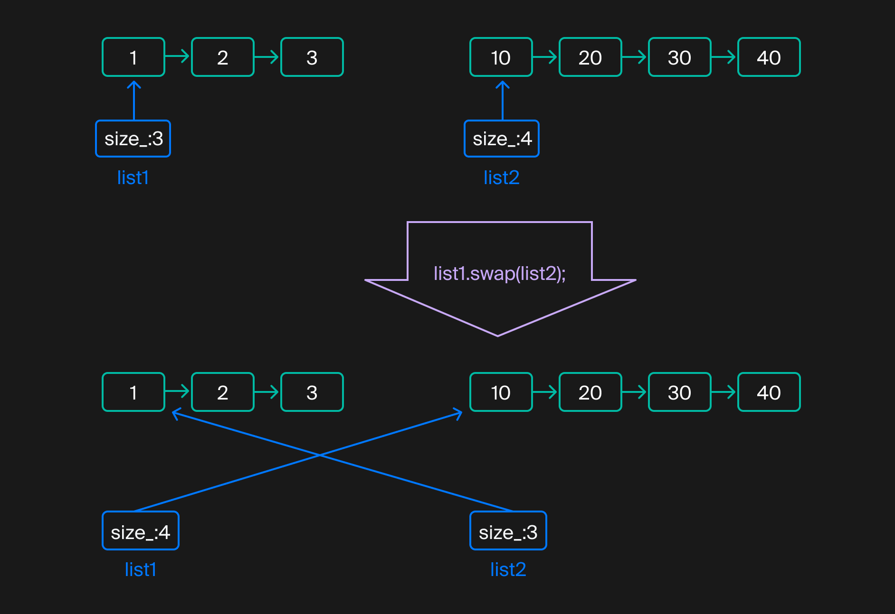
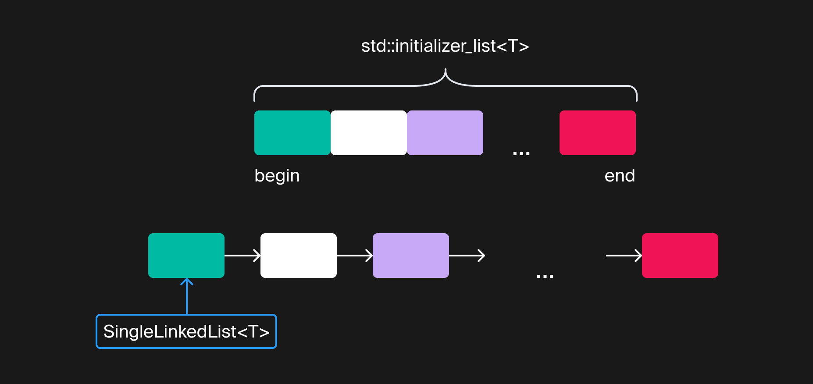

## Сравнение, копирование и присваивание
В прошлом уроке вы реализовали поддержку STL-совместимых итераторов. Теперь можно обходить элементы списка и проводить над ними различные манипуляции. В частности, вам стал доступен широкий спектр стандартных алгоритмов, принимающих прямые и входные итераторы. Например, `std::find:`
```cpp
int main() {
    using namespace std;
    SingleLinkedList<int> numbers;
    ...
    if (const auto it = std::find(numbers.cbegin(), numbers.cend(), 42); it != numbers.cend()) {
        cout << "The list contains 42"s << endl;
    } else {
        cout << "The list doesn't contain 42"s << endl;
    }
} 
```

В этом уроке сделаем использование списка более удобным. Вы реализуете:
- поддержку сравнения списков;
- конструирование списка с указанием содержимого;
- обмен содержимого списков;
- копирование и присваивание
- .
#### Сравнение списков

Содержимое стандартных контейнеров, таких как `vector`, можно сравнивать, используя операции `==`, `!=`, `>=`, `<=`, `>`, `<`, когда эти операции определены для их элементов.

Два контейнера одного типа считаются равными, когда их размеры равны и в них содержатся равные элементы. Теперь, когда список поддерживает итераторы, реализовать операцию `==` можно, применив алгоритм `std::equal`.

Операция `<` возвращает `true`, когда левый список лексикографически предшествует правому списку. Её можно реализовать, используя алгоритм `std::lexicographical_compare`. Например, список `{1, 2, 3}` лексикографически предшествует спискам `{1, 2, 4}`, `{1, 3}` и `{1, 2, 3, 1}`.

Остальные операции можем реализовать на основе `==` и `<`. Например, выражение `list1 > list2` эквивалентно `list2 < list1`, а `list1 <= list2` — противоположно `list2 < list1`. 

#### Обмен содержимого списков

У многих классов стандартной библиотеки есть метод swap, обменивающий состояние объекта с другим объектом того же типа без выбрасывания исключений. Функция swap лежит в основе идиомы copy-and-swap и помогает писать код, устойчивый к исключениям. Когда разработаете метод swap в классе `SingleLinkedList`, вам станет проще реализовать надёжное конструирование, копирование и присваивание односвязных списков.

Реализовать метод swap довольно просто. Элементы списка хранятся в динамической памяти, а сам список хранит лишь адрес своего первого элемента и размер. Чтобы обменять содержимое двух списков, надо обменять размеры списков и указатели на первые элементы.



Процесс обмена содержимого списков

Такой обмен не требует выделения динамической памяти и не выбрасывает исключений.

Для удобства реализуем шаблонную функцию swap, использующую метод swap. Она позволит без лишнего копирования и выбрасывания исключений обменивать содержимое двух списков, как это делает `std::swap`. Для каждого из стандартных контейнеров есть специализированная версия функции swap, основанная на вызове метода swap соответствующего контейнера:
```cpp
template <typename Type>
class SingleLinkedList {
public:
    
    void swap(SingleLinkedList& other) noexcept {...}
    ...
};

template <typename Type>
void swap(SingleLinkedList<Type>& lhs, SingleLinkedList<Type>& rhs) noexcept {
    lhs.swap(rhs);
}

int main() {
    SingleLinkedList<int> list_1;
    SingleLinkedList<int> list_2;
    ...
    swap(list_1, list_2);
} 
```

Декларация шаблонной функции должна быть доступна при её настройке, поэтому шаблонные функции нужно размещать в h-файле. Если вам заранее известен перечень всех возможных специализаций, тело функции можно разместить в cpp-файле, явно указывая, какие специализации потребуются.

#### Создание списка из std::initializer_list

Стандартные контейнеры поддерживают свою инициализацию путём передачи набора элементов напрямую в конструктор:

```cpp
#include <cassert>
#include <vector>

using namespace std;

int main() {
    vector<int> numbers{10, 20, 30, 40, 50};
    assert(numbers.size() == 5u);
    assert(numbers[2] == 30);
} 
Это не какая-нибудь магия, доступная только классам стандартной библиотеки. Компилятор, встречая список элементов внутри фигурных скобок, конструирует экземпляр класса std::initializer_list. Применив этот легковесный шаблонный класс, можно получить доступ к созданному списку элементов. Один из конструкторов класса vector принимает параметр типа initializer_list и конструирует вектор, содержащий копию элементов переданного списка. Подобный конструктор есть и у других классов стандартной библиотеки.
initializer_list имеет методы size, begin и end. Они позволяют узнать его размер и перебрать элементы списка инициализации:

#include <initializer_list>
#include <cassert>

int main() {
    std::initializer_list<int> items = {2, 3, 4};
    
    assert(items.size() == 3);
    
    int sum = 0;
    for (auto item : items) {
        sum += item;
    }
    assert(sum == 9);
    
    auto it = items.begin();
    int product = 1;
    while (it != items.end()) {
        product *= *it;
        ++it;
    }
    assert(product == 24);
} 
```

Добавим классу `SingleLinkedList` конструктор, принимающий `initializer_list`, и сможем совместить инициализацию списка с наполнением его элементами.



`initializer_list` и список, который из него сконструирован
```cpp
template <typename Type>
class SingleLinkedList {
public:
    SingleLinkedList(std::initializer_list<Type> values) {...}
    ...
};

int main() {
    SingleLinkedList<int> list{1, 2, 3, 4};
    assert(list.GetSize() == 4);
    assert(*list.begin() == 1);
} 
```
`initializer_list` принимают по значению, так как это легковесный объект. При его копировании не происходит глубокое копирование элементов.

#### Копирование списка

Как вы наверняка догадались, сгенерированный компилятором конструктор копирования для класса `SingleLinkedList` не подойдёт. Копия будет использовать те же узлы, что и оригинальный список, и при разрушении одного из списков указатель на первый узел второго списка станет невалидным, что приведёт к неопределённому поведению. Точь-в-точь как у осьминогов со сросшимися щупальцами. А это значит, что для односвязного списка нужен пользовательский конструктор копирования, который создаст копию элементов исходного списка.

Конструктор копирования важно сделать безопасным к возникновению исключений — их выбрасывание во время работы не должно приводить к утечкам памяти и неопределённому поведению. Ещё следует помнить, что при выбрасывании исключения во время конструирования объекта деструктор создаваемого объекта вызван не будет.

Один из самых простых способов сделать надёжный конструктор копирования — применить идиому copy-and-swap:

- создать внутри конструктора копирования временный односвязный список и последовательно скопировать внутрь него элементы исходного списка. Если на этом этапе будет выброшено исключение, деструктор временного списка освободит память от его элементов.

- когда временный список будет содержать копию исходного списка, останется использовать метод `swap` и обменять состояние текущего экземпляра класса и временного списка.
```cpp
template <typename Type>
class SingleLinkedList {
public:
    SingleLinkedList(const SingleLinkedList& other) {
        // Сначала надо удостовериться, что текущий список пуст
        assert(size_ == 0 && head_.next_node == nullptr);

        SingleLinkedList tmp;
        
        /* скопировать внутрь tmp элементы other */

        // После того как элементы скопированы, обмениваем данные текущего списка и tmp
        swap(tmp);
        // Теперь tmp пуст, а текущий список содержит копию элементов other
    }
    ...
}; 
```
Чтобы написать надёжный код на C++, используйте идиому RAII. С ней код будет ещё и более простым, так как своевременный вызов деструктора обеспечивается компилятором.

Вы встречались с этой идиомой ранее, когда писали профилировщик. Идиома RAII заключается в том, что время жизни ресурса неразрывно связывается со временем жизни объекта — в конструкторе происходит получение ресурса, а в деструкторе — освобождение.

Здесь владение элементами списка временно поручается локальной переменной `tmp`. Так копируемые элементы списка будут находиться под управлением этой переменной, пока не совершится операция обмена.

Вы ещё вернётесь к подробному изучению идиомы RAII в будущих спринтах, а пока можете ознакомиться с ней здесь: https://en.cppreference.com/w/cpp/language/raii

При конструировании односвязного списка на основе `initializer_list` также пригодится идиома copy-and-swap.

#### Присваивание списка

Операцию присваивания, последнюю из «Правила трёх», можно легко и надёжно реализовать, применив идиому copy-and-swap:
- проверьте, не выполняется ли присваивание списка самому себе, сравнив адреса левого и правого аргументов операции присваивания;

- сконструируйте временную копию правого аргумента. Выбрасывание исключения на этом этапе никак не повлияет на состояние текущего объекта (левый аргумент операции присваивания);

- используйте метод `swap`, чтобы обменять содержимое временной копии и текущего объекта. Операция `swap` исключений не выбрасывает и выполняется быстро. Временная копия будет содержать предыдущее значение левого аргумента, а текущий экземпляр — копию правого аргумента операции присваивания;

- при выходе из операции = временный объект будет разрушен, освободив память от предыдущего содержимого списка.