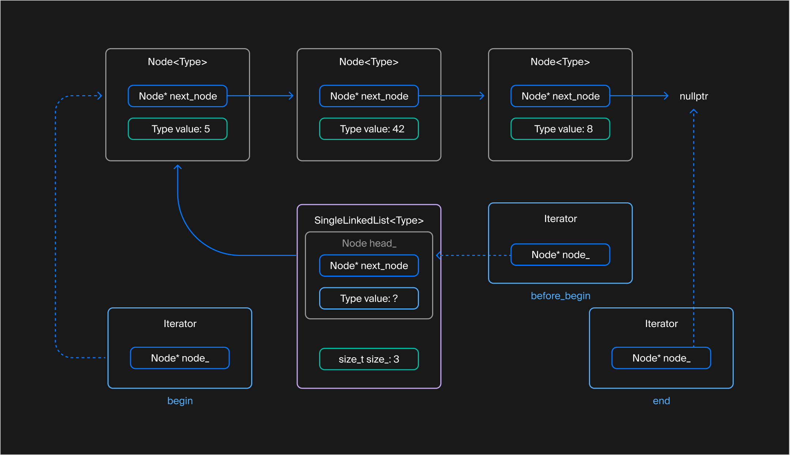
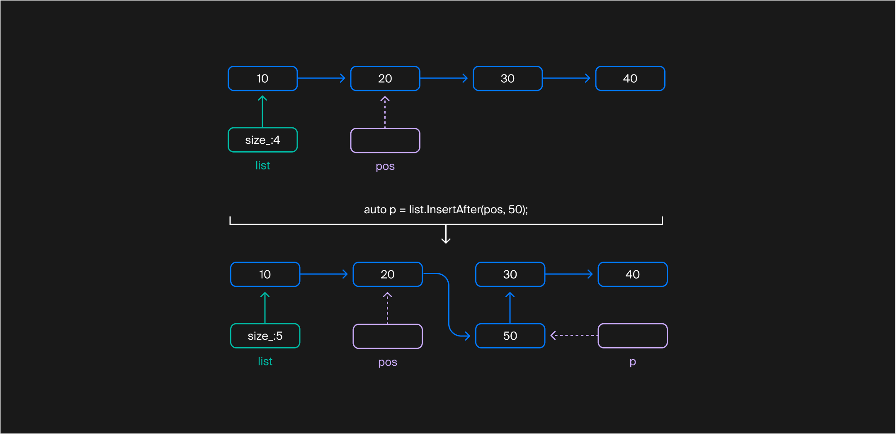
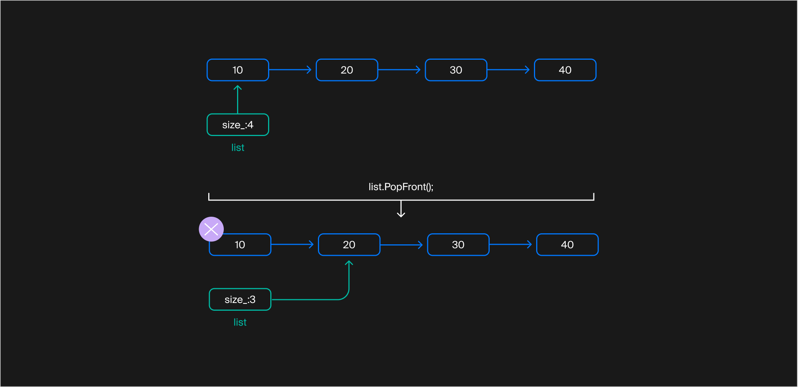
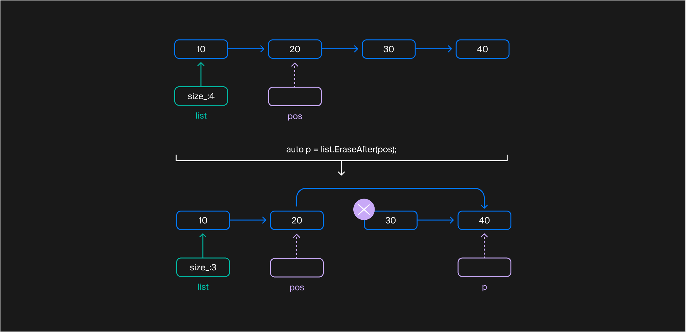

## Вставка и удаление в произвольной позиции
В прошлом уроке вы реализовали операции над списком в целом: сравнение, присваивание, обмен содержимым. На практике часто возникает потребность в точечной модификации списка: вставка и удаление элементов из произвольной позиции списка. В этом уроке вы разработаете эти операции.

#### Вставка элемента в произвольную позицию списка

Вспомним структуру односвязного списка. Его элементы хранятся в узлах, последовательно связанных друг с другом. Эти узлы представлены структурой `Node`, которая хранит значение элемента и указатель на следующий узел.
Адрес какого узла нужно знать, чтобы вставить новый элемент в произвольное место односвязного списка?

Итак, чтобы вставить новый узел, нужно иметь доступ к узлу, который предшествует позиции вставки. Проблема возникнет при вставке в начало: полноценного предшествующего узла в этом случае не будет. Тут пригодится фиктивный узел `head_`, который расположен «перед первым элементом». Чтобы получить итератор на него, используем методы `before_begin` и `cbefore_begin`:

```cpp
template <typename Type>
class SingleLinkedList {
public:
    [[nodiscard]] Iterator before_begin() noexcept;
    [[nodiscard]] ConstIterator cbefore_begin() const noexcept;
    [[nodiscard]] ConstIterator before_begin() const noexcept;
    ...
}; 
```



Список из трёх элементов и итераторы `begin`, `before_begin`, end
Вот алгоритм вставки значения `X` после узла `N`:
- создаём новый узел со значением `X`;
- с нового узла ссылаемся на `N.next_node`;
- с `N` ссылаемся на новый узел.
  


Вставка числа 50 после элемента 20 в список с элементами 10, 20, 30, 40. pos показывает позицию вставки, а  p — возвращаемый итератор

После вставки нужно увеличить размер списка и вернуть итератор, который ссылается на вновь созданный узел. Возвращённый итератор можем использовать, например, для вставки следующего элемента:

```cpp
int main() {
    SingleLinkedList<int> list;
    auto pos = list.InsertAfter(list.cbefore_begin(), 1);
    pos = list.InsertAfter(pos, 2);
    list.InsertAfter(pos, 3);
    // Список содержит {1, 2, 3}
} 
```

При вставке нужно выделить динамическую память и скопировать вставляемое значение. Это может привести к выбрасыванию исключения. Чтобы метод `InsertAfter` обеспечивал строгую гарантию безопасности исключений, примените подход, использованный в методе `PushFront`, — сначала создайте узел в динамической памяти, а потом обновите связи между узлами и размер списка.

#### Удаление элемента из начала списка

Обозначим первый узел как N и опишем процесс его удаления:
- указатель фиктивного элемента начинает указывать на N.next_node;
- узел N удаляется.

Эта операция выполняется за время `O(1)`. Она не требует динамического выделения памяти, поэтому не выбрасывает исключений. Если, конечно, их не выбрасывает деструктор типа `Type`.



Процесс удаления первого узла из списка с элементами 10, 20, 30, 40

К пустому списку операцию удаления первого элемента применить нельзя.

#### Удаление элемента в произвольной позиции

Чтобы удалить элемент в произвольной позиции односвязного списка, нужен доступ к узлу, который предшествует удаляемому элементу. После удаления указатель с предшествующего узла будет ссылаться на узел, следующий за удаляемым. Эта операция не требует доступа к другим узлам односвязного списка.

Такая операция не выбрасывает исключений, потому что не требует динамического выделения памяти. Операция `delete`, вызываемая, чтобы удалить узел списка, тоже не выбрасывает исключений. Исключения могут возникнуть, если их выбросит деструктор типа `Type`, но это нетипичная ситуация — лучше никогда не выбрасывать исключений в деструкторах.



Удаление элемента 30 из списка с элементами 10, 20, 30, 40. Итератор `pos` обозначает удаляемый узел, а `p` — узел, следующий за удалённым

Метод `EraseAfter` возвращает итератор, который ссылается на элемент, следующий за удалённым, либо на `end`, если произошло удаление последнего элемента списка. Возвращённый итератор можно использовать для обработки следующих элементов.