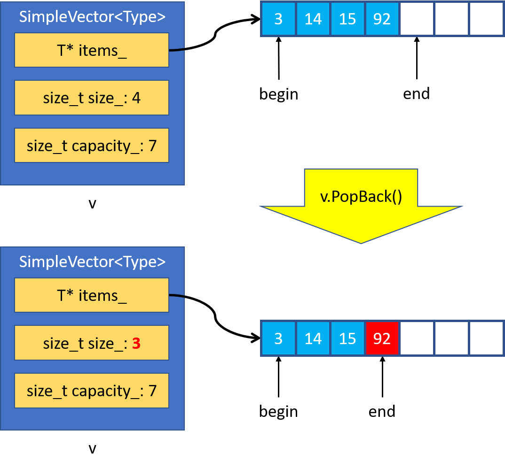
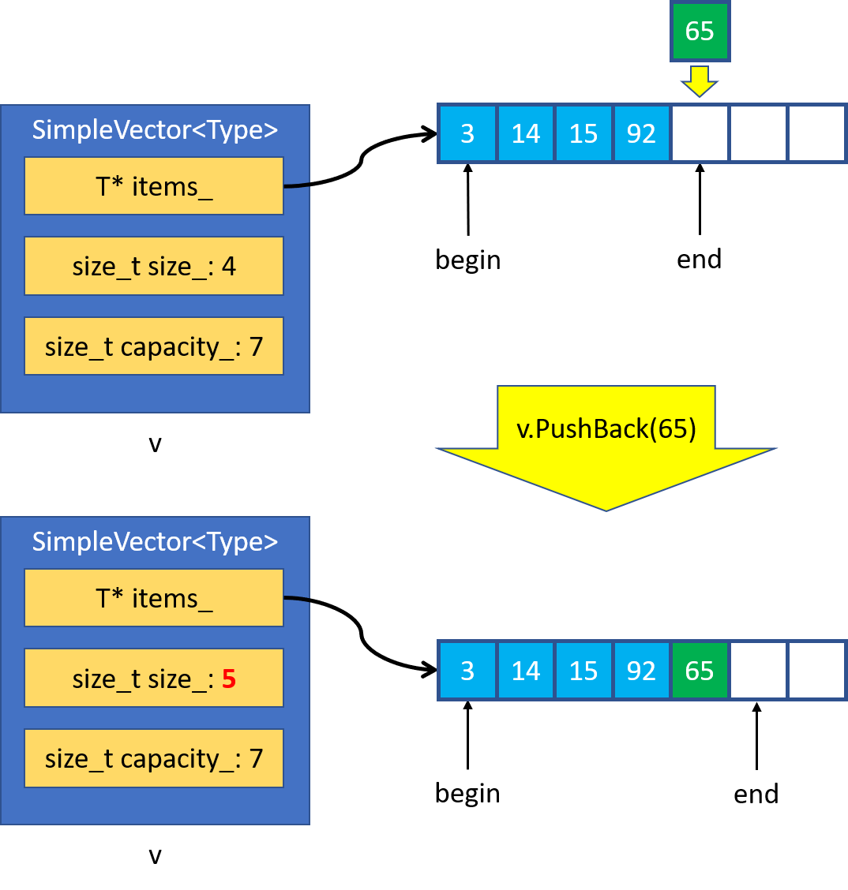
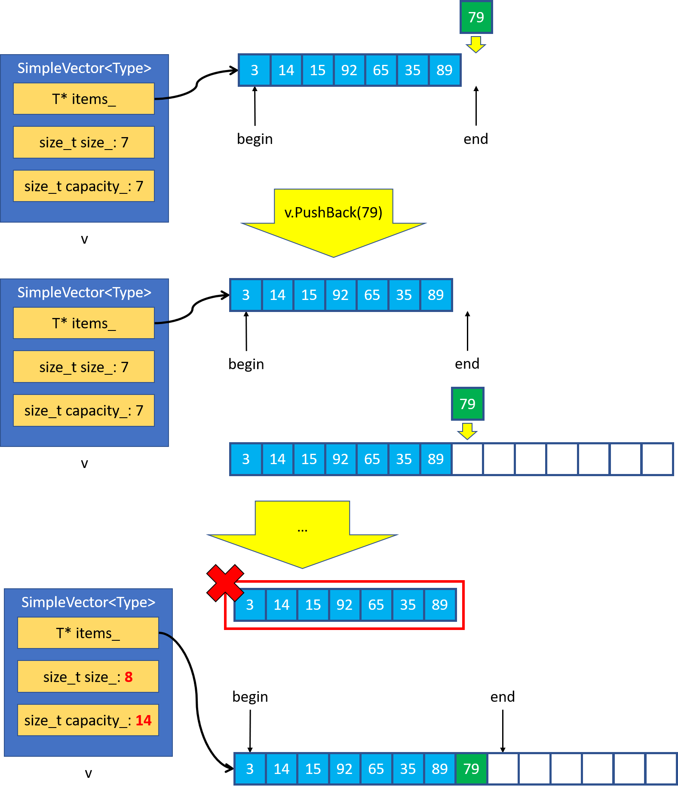
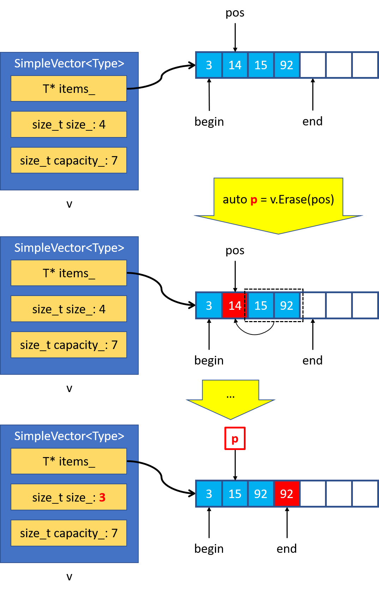
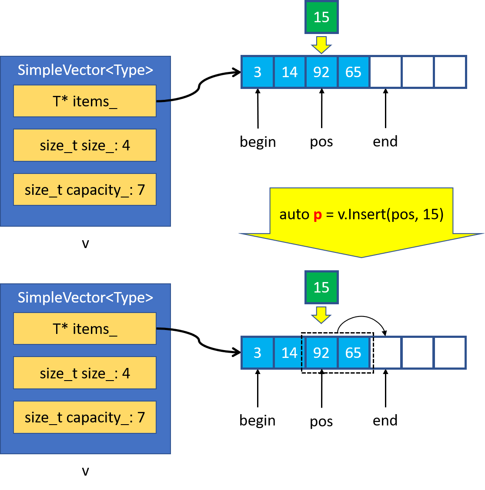
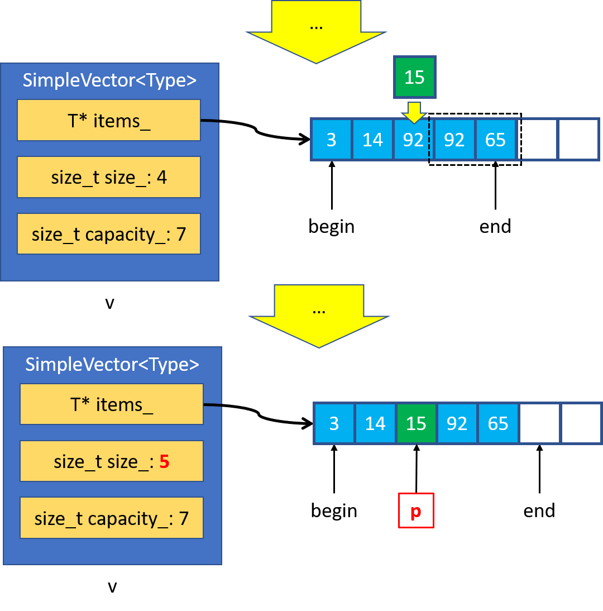
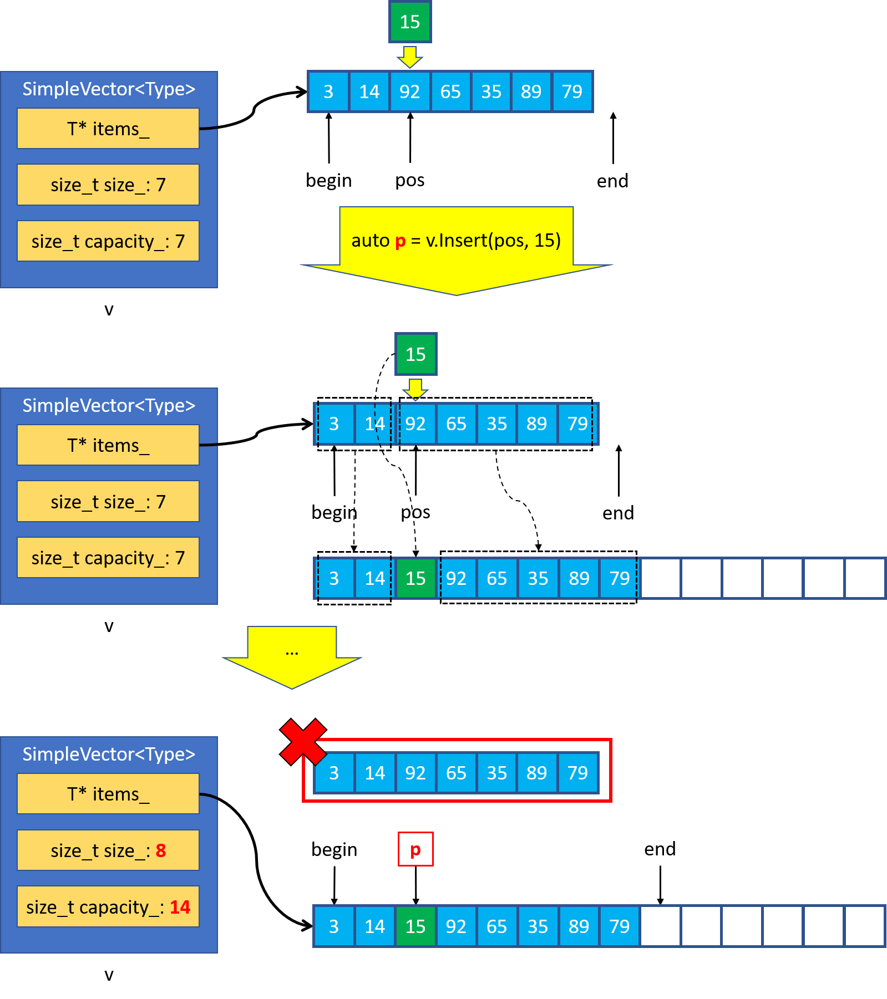

## Разработка контейнера SimpleVector. Часть вторая
В предыдущем уроке вы познакомились с устройством SimpleVector и создали в нём операции для управления размером контейнера и доступа к его элементам. В этом уроке вы реализуете:
- возможность сравнивать содержимое векторов, вставлять и удалять элементы;

- пользовательский конструктор копирования;

- пользовательский оператор присваивания.

#### Сравнение содержимого векторов

Вы уже реализовали операцию сравнения содержимого односвязных списков. Аналогично можно реализовать операции сравнения векторов, применив известные вам стандартные алгоритмы.

При сравнении векторов их вместимость нужно игнорировать. Например, два вектора одного размера, содержащие одни и те же элементы, равны, даже если имеют разную вместимость.

Какой стандартный алгоритм позволит реализовать операторы <, <=, >, >= в классе SimpleVector? — `std::lexicographical_compare`. Этот алгоритм выполняет лексикографическое сравнение элементов двух диапазонов. Он позволит реализовать оператор `<`, а остальные операции можно выразить на основе оператора `<`.

#### Удаление последнего элемента вектора
Для «удаления» последнего элемента служит метод `PopBack`:
```cpp
template <typename Type>
class SimpleVector {
public:
    void PopBack() noexcept { ... };
}; 
```

Чтобы удалить последний элемент непустого контейнера `SimpleVector` нужно уменьшить значение поля `size_`. Элемент продолжит находиться в векторе, но будет недоступен для использования.



Не допускается вызывать `PopBack`, когда вектор пуст. Такая же особенность есть и у метода `pop_back` стандартного вектора.

#### Добавление элемента в конец вектора

Для вставки элемента в конец вектора служит метод `PushBack`:

```cpp
template <typename Type>
class SimpleVector {
public:
    void PushBack(const Type& value) { ... };
}; 
```

При добавлении элемента в конец вектора возможны две ситуации, зависящие от того, заполнен вектор полностью или нет.

Когда вектор заполнен частично, запишем вставляемый элемент следом за последним элементом вектора и увеличим его размер.



Чуть сложнее обстоит ситуация, когда вектор заполнен полностью. В этом случае выделите новый массив с удвоенной вместимостью, скопируйте в него элементы исходного массива, а в конец поместите вставляемый элемент. После этого можно обновить размер и вместимость вектора, переключиться на новый массив, а старый массив — удалить.



При выполнении метода `PushBack` в куче выделяется память и вызывается оператор присваивания у элементов массива. Эти операции могут выбросить исключение. Чтобы сделать метод устойчивым к возникновению исключений, примените умный указатель `ArrayPtr`, а поля `size_` и `capacity_` измените после того, как скопируете элементы в новый массив.

Так как при вставке значения в конец заполненного вектора происходит пересоздание массива элементов, операция `PushBack` делает невалидными существующие ссылки и итераторы. То же самое происходит и в случае `std::vector`.

Какую асимптотическую сложность имеет операция `PushBack` в классе `SimpleVector`? Выберите один ответ. В вариантах ответа буквой N обозначается размер вектора. — $O(1)$. Операция вставки в конец `SimpleVector` имеет константную амортизированную сложность за счёт того, что при заполнении массива его вместимость увеличивается вдвое. Для $N$ вызовов `PushBack` суммарное количество операций над элементами массива будет зависеть от $N$ линейно.

#### Удаление элемента из произвольного места вектора

Для удаления произвольного элемента вектора служит метод `Erase`. Он принимает итератор, указывающий на удаляемый элемент вектора, и возвращает итератор, который ссылается на элемент, следующий за удалённым:
```cpp
template <typename Type>
class SimpleVector {
public:
    Iterator Erase(ConstIterator pos) { ... }
    ...
}; 
```
При работе этого метода элементы, следующие за удаляемым, должны быть скопированы на его место один за другим. После того, как все элементы будут скопированы, нужно уменьшить размер массива и вернуть указатель на элемент, следующий за удалённым.



При копировании элементов на место удалённого ранее хранившиеся в массиве значения перезаписываются. Если в середине такого процесса будет выброшено исключение, восстановить прежнее значение перезаписанных элементов массива будет невозможно. В этом случае вектор останется в согласованном, пусть и не первоначальном состоянии. В таком случае говорят, что метод предоставляет базовую гарантию безопасности исключений.

Обеспечить строгую гарантию безопасности исключений можно, создав новую копию массива в методе `Erase`, что негативно повлияло бы на производительность. По этой же причине метод `vector::erase` также даёт базовый уровень гарантий безопасности исключений.

#### Вставка элемента в произвольное место вектора

Для вставки элемента в произвольное место вектора служит метод `Insert`. Он принимает итератор, ссылающийся на место вставки, и само вставляемое значение. Метод возвращает итератор, который ссылается на вставленный элемент:

```cpp
template <typename Type>
class SimpleVector {
public:
    Iterator Insert(ConstIterator pos, const Type& value) { ... }
    ...
};
```

Как и в случае с `PushBack`, при вставке возможны две ситуации:
- вектор заполнен частично,
- вектор заполнен полностью.

При частичной заполненности вектора элементы, начиная с позиции вставки, сперва копируются на одну позицию «вправо».



После этого в освободившееся место записывается вставляемый элемент и увеличивается размер вектора.



Какой алгоритм подойдёт для копирования диапазона элементов массива «вправо» на одну позицию? — `std::copy_backward`. Этот алгоритм скопирует элементы диапазона, начиная с самого последнего. Такой порядок подходит для копирования элементов контейнера «вправо».

Когда элемент вставляется в заполненный вектор, в куче выделяется массив с удвоенной вместимостью. В этот массив копируются элементы, которые предшествуют вставляемому, сам вставляемый элемент и элементы, следующие за ним. В конце вектор обновляет свой размер и вместимость, начинает ссылаться на новый массив, а старый массив удаляет:



Как и в случае с `Erase`, базовая гарантия безопасности исключений естественна для метода `Insert`. Аналогичное решение принято и для метода `insert` класса `std::vector`.

Строгой гарантии безопасности исключений можно добиться так: сделать копию вектора, модифицировать её, а в конце обменять содержимое оригинала и копии.

#### Обмен содержимого векторов

Для обмена содержимого текущего вектора с другим предназначен метод `swap`:

```cpp
template <typename Type>
class SimpleVector {
public:
    void swap(SimpleVector& other) noexcept { ... }
}; 
```

Чтобы обменять содержимое векторов, достаточно обменять значения их полей. Эта операция выполняется за константное время, не требует выделения памяти и не бросает исключений.

