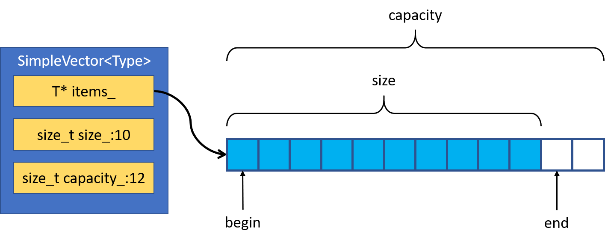
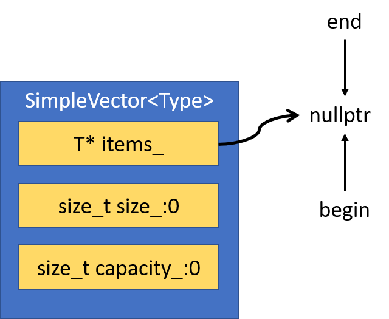
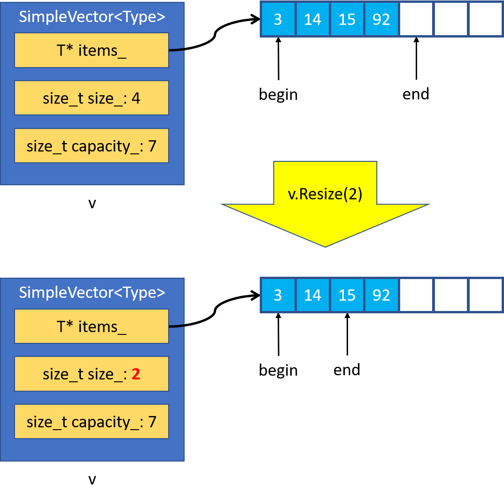
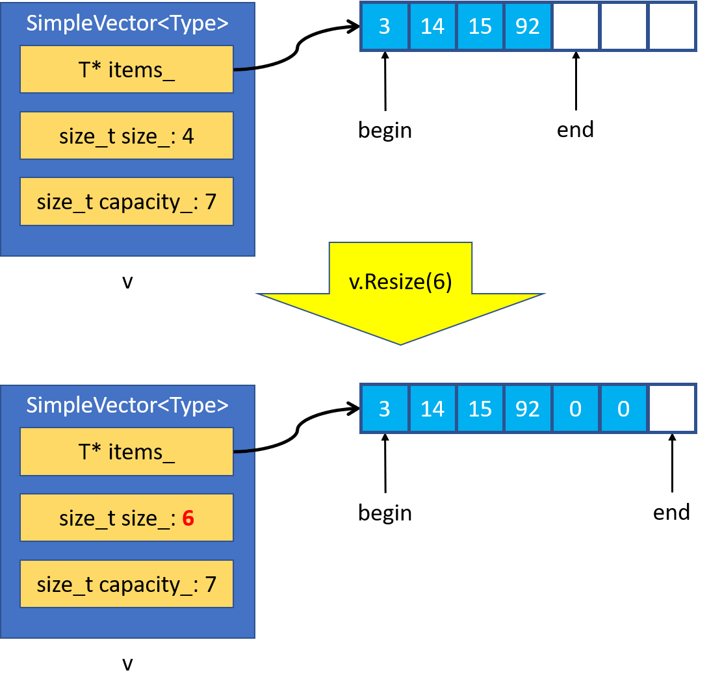
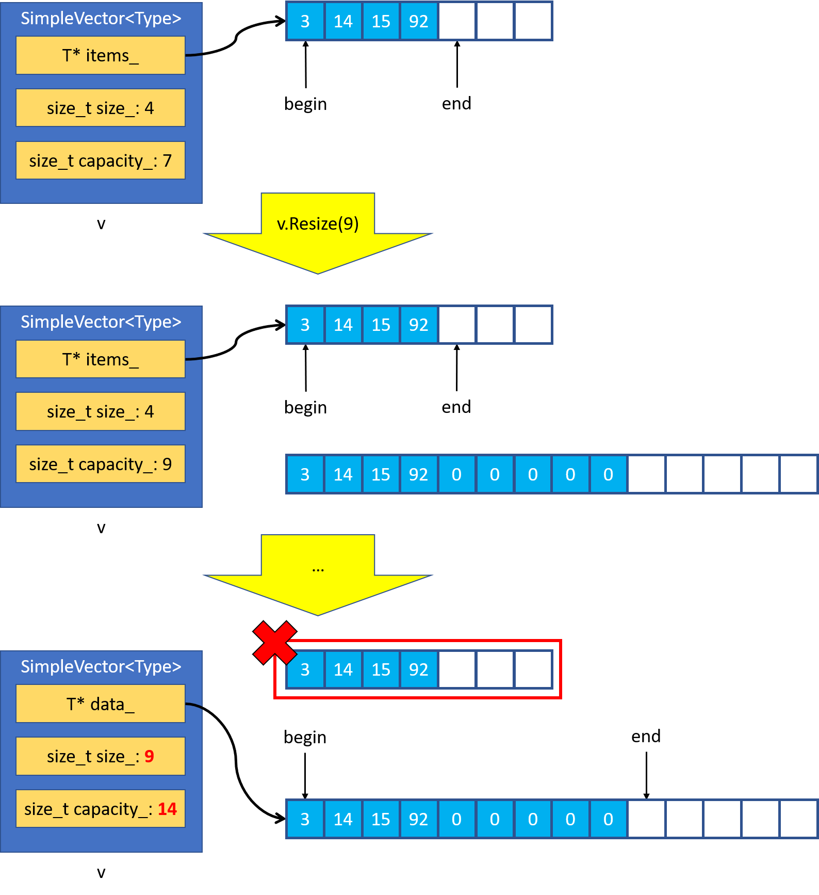
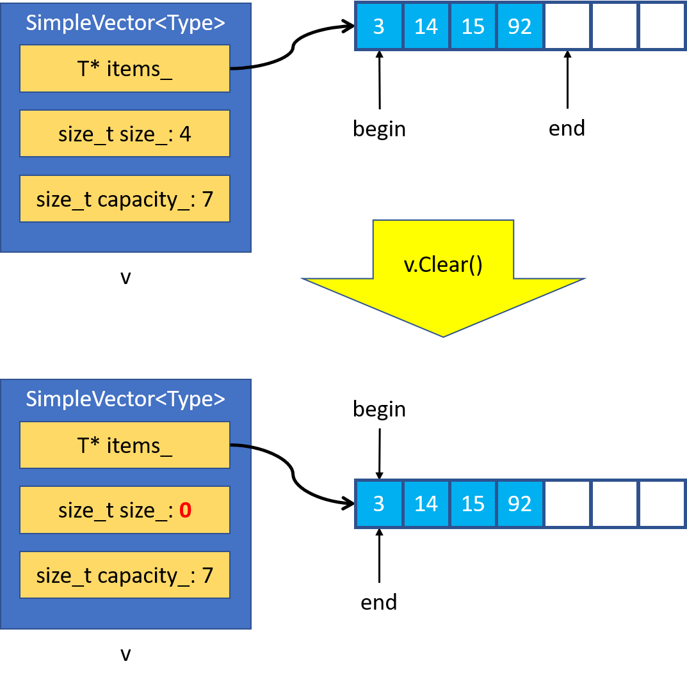

## Разработка контейнера SimpleVector. Часть первая

В этом и следующем уроках вы разработаете шаблонный класс SimpleVector. Это сильно упрощённый аналог стандартного контейнера vector, со сходной структурой и функционалом. Работа над SimpleVector поможет вам лучше понять устройство и особенности стандартного vector.

#### Устройство контейнера SimpleVector

В основе `SimpleVector` — массив в динамической памяти. Сам контейнер хранит лишь адрес начала массива, а также информацию о его текущем размере и вместимости:

- Размер — количество элементов, содержащееся в массиве;

- Вместимость — максимальное количество элементов, которые могут поместиться в массив.
```cpp
template <typename Type>
class SimpleVector {
public:
    ...
private:
    // Вместо сырого указателя лучше использовать умный указатель, такой как ArrayPtr
    Type* items_;

    size_t size_;
    size_t capacity_;
}; 
```
Можно провести аналогию с ведром воды — `capacity_` определяет максимальный объём воды, которая помещается в ведро, а `size_` — текущее количество воды в ведре.



Сконструированный по умолчанию вектор имеет нулевой размер и вместимость, а указатель на массив равен `nullptr`.



Размер контейнера `SimpleVector` равен 5, а его вместимость равна 8. На какой индекс элемента массива в динамической памяти ссылается итератор end? 
 - Итератор end ссылается на элемент, следующий за последним элементом контейнера. Последний элемент контейнера имеет индекс 4, следовательно, итератор end ссылается на элемент с индексом 5.

#### Изменение размера вектора
Как и `std::vector`, класс `SimpleVector` может изменять свой размер в сторону увеличения и уменьшения. Для этого служит метод `Resize`:
```cpp
template <typename T>
class SimpleVector {
public:
    void Resize(size_t new_size) { ... }
    ...
}; 
```

Самый простой случай — уменьшение размера массива. Для этого `SimpleVector` достаточно изменить значение поля `size_`.



Таким образом, `SimpleVector` при уменьшении своего размера не удаляет элементы из массива. «Лишние» элементы продолжают существовать вплоть до удаления массива по адресу `items_`. Например, до разрушения `SimpleVector`.

Чуть сложнее выглядит увеличение размера в пределах текущей вместимости контейнера. Помимо увеличения значения поля size_ происходит заполнение новых элементов значением по умолчанию для типа `Type`.



Чтобы заполнить элементы контейнера или массива одним и тем же значением, можно использовать алгоритм `std::fill`. Он присваивает элементам диапазона заданное значение.

Так как `SimpleVector` — шаблонный класс, операция присваивания для некоторых типов `Type` может выбрасывать исключения. Например, при нехватке памяти. Чтобы обеспечить строгую гарантию безопасности исключений, меняйте размер массива лишь после успешного заполнения новых элементов значением по умолчанию.

Самое интересное происходит, когда новый размер превышает текущую вместимость `SimpleVector`. В этом случае `SimpleVector` создаёт новый массив большего размера в динамической памяти, куда копирует элементы исходного массива и инициализирует остальные элементы значением по умолчанию. Для копирования элементов подходит алгоритм `std::copy`.



Подобно `std::vector` во многих реализациях стандартной библиотеки, новую вместимость `SimpleVector` можно выбрать как максимум из `new_capacity` и `capacity_ * 2`. Удваивание вместимости минимизирует частоту копирований элементов из одного массива в другой.

После копирования и заполнения элементов нулевым значением можно обновить `size_` и `capacity_`, а старый массив — удалить. Так вы обеспечите строгую гарантию безопасности исключений. Умный указатель `ArrayPtr` позволит сделать код не только надёжнее, но и проще.



Какую асимптотическую сложность имеет операция `Resize` в классе `SimpleVector`? Выберите один ответ.

$O(1)$

$O(Log(N))$

Правильный ответ
$O(N)$ — Худший случай работы метода `Resize(N)` происходит при увеличении размера с изменением вместимости контейнера. В этом случае надо скопировать в новый массив `k` существующих элементов и присвоить `N-k` элементам значение по умолчанию. Всего `k + (N-k) = N` операций.

$O(N*Log(N))$

$O(N^2)$
Как вам задача?


### Очистка контейнера SimpleVector

Очистку `SimpleVector` выполняет метод `Clear`. Он не изменяет его вместимость и семантически эквивалентен вызову Resize с аргументом, равным нулю. Метод `Clear` не выбрасывает исключений.

```cpp
template <typename T>
class SimpleVector {
public:
    void Clear(size_t new_size) noexcept { ... }
    ...
}; 
```

Какую асимптотическую сложность имеет операция `Clear` в классе `SimpleVector`? Выберите один ответ.


Правильный ответ:
$O(1)$ — Обнуление поля `size_` не зависит от количества элементов массива. Поэтому операция `Clear` выполняется за константное время.

$O(Log(N))$

$O(N)$

$O(N*Log(N))$

$O(N^2)$