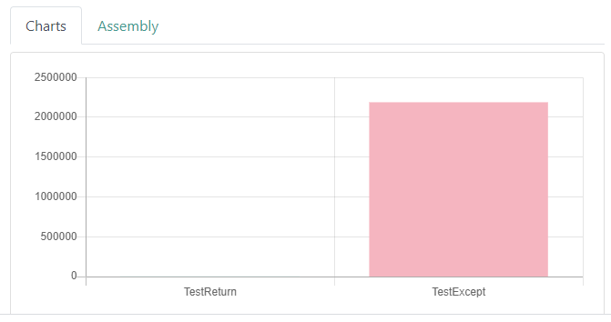

## Исключения как способ возврата
В первом уроке вы увидели, как `variant` помогает возвратить объект или ошибку:
```cpp
enum class GraduateFailReason {
    NOT_ALL_SPRINTS_PASSED,    // не все спринты пройдены
    FINAL_TASK_NOT_APPROVED,   // финальное задание не прошло ревью
    INCOMPLETE_FUNDING,        // неполная оплата
    DIPLOMA_ALREADY_RECEIVED   // диплом уже получен
};

std::variant<Diploma, GraduateFailReason> Graduate(int student_id); 
```
Вы могли подумать, что в таком случае можно использовать исключения для сообщения об ошибке.
Какая сигнатура функции более внятная? — В случае ошибки через возврат: `std::variant<Diploma, GraduateFailReason> Graduate(int student_id);`


Исключения дают некоторую гибкость при их обработке, но из сигнатуры не ясно, какие исключения выбрасывает метод. Без текстового описания узнать о выбрасываемых исключениях можно, только изучив код функции. Однако и этого недостаточно — исключения могут срабатывать в других вызываемых функциях.

Невнятность сигнатуры неприятна не только программисту, но и компилятору. Вы можете забыть обработать все исключения, а компилятор не напомнит вам это сделать. Такая ошибка типична.

В других языках, например в Java, в сигнатурах содержатся списки возможных исключений. В C++ комитету по стандартизации так и не удалось сделать это, и единственная стандартная спецификация исключений — `noexcept`.

Но сравним эти функции по производительности, ведь невнятность сигнатуры может в какой-то мере компенсироваться скоростью исполнения. Для простоты `Diploma` будет состоять из одного поля типа `int`:
```cpp
enum class GraduateFailReason {
    NOT_ALL_SPRINTS_PASSED   = 0, // не все спринты пройдены
    FINAL_TASK_NOT_APPROVED  = 1, // финальное задание не прошло ревью
    INCOMPLETE_FUNDING       = 2, // неполная оплата
    DIPLOMA_ALREADY_RECEIVED = 3  // диплом уже получен
};

struct Diploma {
    int x;
};

std::variant<Diploma, GraduateFailReason> GraduateReturn(int student_id) {
    if (student_id % 10 == 0) {
        return Diploma{student_id * 100};
    }

    // возьмём номер ошибки от 0 до 3
    int fail_reason_id = (student_id / 10) % 4;
    return static_cast<GraduateFailReason>(fail_reason_id);
}

Diploma GraduateExcept(int student_id) {
    if (student_id % 10 == 0) {
        return {student_id * 100};
    }

    // возьмём номер ошибки от 0 до 3
    int fail_reason_id = (student_id / 10) % 4;
    throw static_cast<GraduateFailReason>(fail_reason_id);
}
```
Создадим бенчмарк, который 1000 раз запустит эти функции и подведёт статистику (сколько раз встречалась каждая причина ошибки), а также посчитает сумму всех дипломов:
```cpp
static void TestReturn(benchmark::State& state) {
    for (auto _ : state) {
        array stat = {0, 0, 0, 0, 0};
        for (int i = 0; i < ITER_COUNT; ++i) {
            const auto result = GraduateReturn(++i);
            if (holds_alternative<Diploma>(result)) {
                const auto diploma = get<Diploma>(result);
                stat[4] += diploma.x;
            } else {
                const auto reason = get<GraduateFailReason>(result);
                ++stat[static_cast<int>(reason)];
            }
        }
        benchmark::DoNotOptimize(stat);
    }
}
BENCHMARK(TestReturn);

static void TestExcept(benchmark::State& state) {
    for (auto _ : state) {
        array stat = {0, 0, 0, 0, 0};
        for (int i = 0; i < ITER_COUNT; ++i) {
            try {
                Diploma ans = GraduateExcept(++i);
                stat[4] += ans.x;
            }
            catch (GraduateFailReason reason) {
                ++stat[static_cast<int>(reason)];
            }
        }
        benchmark::DoNotOptimize(stat);
    }
}
BENCHMARK(TestExcept);
```
Результаты бенчмарка говорят сами за себя — разница настолько большая, что столбик `TestReturn` даже не виден:


Добавление атрибута noinline не спасает ситуацию, хотя немного уравнивает результаты функций.

Выходит, исключения — это способ сделать медленную функцию с невнятной сигнатурой.

Значит ли этот бенчмарк, что исключениями никогда не нужно пользоваться? — Нет, в определённых ситуациях даже такое замедление может оказаться некритичным.


Большая разница объясняется тем, что вызываемая функция очень простая. По сравнению с её кодом, издержки на исключения занимают много времени. Если бы это была настоящая функция, формирующая PDF-документ диплома и обращающаяся к базам данных, замедления от исключений никто бы не заметил.

Код обработчика проще читать и писать в случае исключений. Это их преимущество. Можно сформулировать правило: исключение действительно должно быть неожиданной, исключительной ситуацией, которая может внезапно произойти и нарушить всю логику выполнения программы. Ожидаемая ошибка при работе одной определённой функции к исключительным ситуациям не относится, и лучше обрабатывать этот случай через распаковку или variant.