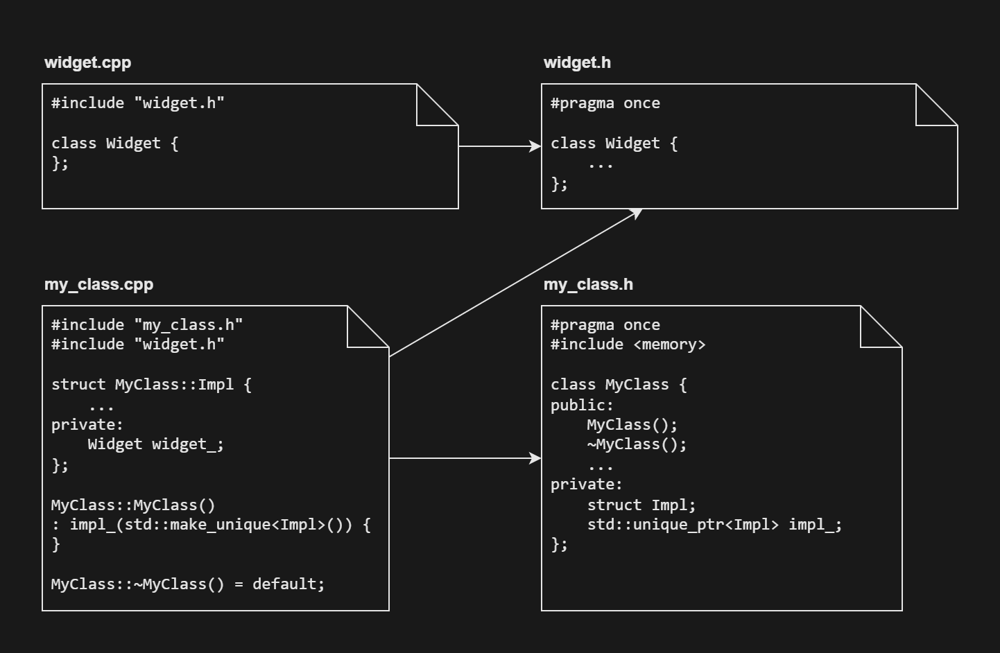
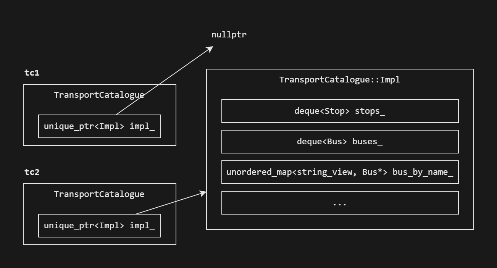
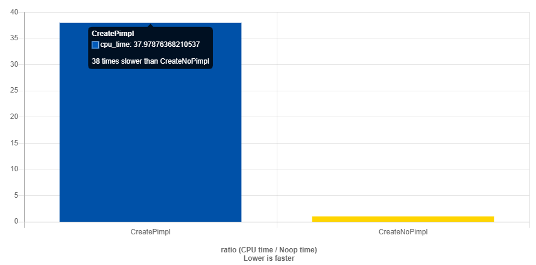

## Идиома Pimpl
Кроме управления временем жизни объектов указатель `unique_ptr` применяется в идиоме pImpl. Это приём программирования, который скрывает от пользователей класса детали его реализации.
Рассмотрим применение этой идиомы на примере класса Транспортный Справочник:
##### transport_catalogue.h:

```cpp
#pragma once
#include "geo.h"

struct Stop {
    ...
};

struct Bus {
    ...
};

class TransportCatalogue {
public:
    void AddStop(std::string name, geo::Coordinates pos);
    ...
private:
    std::deque<Bus> buses_;
    std::deque<Stop> stops_;
    ...
}; 
```
transport_catalogue.cpp:
```cpp
#include "transport_catalogue.h"

void TransportCatalogue::AddStop(std::string name, geo::Coordinates pos) {
    ...
}
... 

```

В этом классе есть публичные методы, доступные клиентам, а также приватные данные и методы, которые определяют детали реализации класса. Под клиентами класса подразумеваются части программы, которые этот класс используют.

Если отредактировать тело метода `AddStop`, система сборки вашей IDE увидит, что изменён лишь файл transport_catalogue.cpp, и перекомпилирует только его. Однако если вы решите добавить приватное поле или изменить сигнатуру приватного метода, для этого вам придётся отредактировать заголовочный файл transport_catalogue.h. Среда разработки перекомпилирует все .cpp файлы, которые прямо или косвенно подключают изменённый заголовочный файл. Если в вашей программе много мест, в которых подключается transport_catalogue.h, много времени будет тратиться на перекомпилирование при любом изменении этого заголовочного файла.

Проект состоит из следующих файлов:


Укажите, какие файлы с расширением .cpp потребуется перекомпилировать после внесения изменений в файл transport_catalogue.h? — transport_catalogue.cpp, map_renderer.cpp, application.cpp.

Идиома Pimpl позволяет перенести содержимое приватной части класса из заголовочного файла в .cpp-файл, тем самым спрятав приватную часть от клиентов вашего класса. Для этого нужно, чтобы в приватной части класса содержались не сами данные, а «непрозрачный» указатель на них:

##### transport_catalogue.h:
```cpp
class TransportCatalogue {
public:
    TransportCatalogue();
    ~TransportCatalogue(); // Деструктор здесь важен. Его тело будет в .cpp файле

    void AddStop(std::string name, geo::Coordinates pos);
    /* Прочие публичные методы */
private:
    // Объявляем вложенную структуру Impl, не раскрывая здесь её содержимое
    struct Impl;
    // unique_ptr автоматически удалит связанные с классом данные
    std::unique_ptr<Impl> impl_;
}; 
```
Теперь приватная часть класса содержит только указатель на структуру `Impl`. Чтобы объявить такой указатель, достаточно знать лишь что `Impl` — структура. Полностью эту структуру следует разместить в .cpp файле. Таким образом, детали реализации класса оказались скрыты.
В конструкторе класса нужно проинициализировать поле `impl_`.

##### transport_catalogue.cpp:

```cpp
#include "transport_catalogue.h"

// Структура TransportCatalogue::Impl содержит детали реализации класса TransportCatalogue
struct TransportCatalogue::Impl {
    void AddStop(std::string name, geo::Coordinates pos) {
        ...
    }

private:
    std::deque<Bus> buses_;
    std::deque<Stop> stops_;
    ...
};

TransportCatalogue::TransportCatalogue()
    : impl_(std::make_unique<Impl>()) {
}

// Деструктор следует разместить внутри .cpp-файла, где видно содержимое структуры Impl
// Так как нас устраивает деструктор, сгенерированный компилятором, вместо
// тела деструктора напишем = default.
TransportCatalogue::~TransportCatalogue() = default;

void TransportCatalogue::AddStop(std::string name, geo::Coordinates pos) {
    impl_->AddStop(std::move(name), pos);
} 
```
Рассмотрим ключевые шаги для реализации идиомы Pimpl:
- В приватной части класса объявляем структуру `Impl`, но не описываем её содержимое. Этого достаточно, чтобы внутри класса можно было использовать указатель на структуру.

- В приватной части класса размещаем `unique_ptr<Impl>`. Умный указатель сам позаботится о том, чтобы освободить память, которую занимает структура `Impl`.

- Вложенную структуру `Impl` объявляем в начале .cpp-файла. Важно указать полное имя структуры вместе с именем вашего класса. В нашем примере структура имеет имя `TransportCatalogue::Impl`.

- В конструкторе проинициализируем поле `impl_` функцией `make_unique`. Если у класса было несколько конструкторов, для каждого из них в структуре `Impl` может понадобиться создать конструктор с соответствующим набором параметров.

- Деструктор unique_ptr вызывает операцию delete для удаления объекта. Операция delete требует, чтобы тип удаляемого объекта был известен компилятору. Поэтому в классе TransportCatalogue нужно явным образом задать деструктор, а тело деструктора написать в .cpp-файле, ниже объявления структуры Impl.

- В публичных методах класса заменяем обращения к полям класса на обращения к полям и методам структуры Impl.
- Если в классе были приватные методы, их следует перенести внутрь структуры Impl.

Таким образом, объявление класса `TransportCatalogue` будет содержать только интерфейс (публичную часть) класса, а все детали реализации переедут в невидимую структуру `Impl` внутри .cpp-файла. Указатель на эту структуру будет единственным полем класса. Любые изменения в реализации класса не затронут заголовочный файл, а значит не потребуют перекомпилировать файлы программы, кроме изменившегося.

Кроме ускорения сборки идиома Pimpl помогает авторам библиотек сохранять совместимость ABI при выпуске новой версии библиотеки. Чтобы приложение использовало обновлённую библиотеку, не нужно пересобирать приложение. Достаточно установить в системе новую версию библиотеки.

Вместе с приватной областью класса идиома Pimpl прячет внутрь .cpp-файла ещё и директивы `#include`, подключающие сторонние библиотеки.


    От widget.h зависит только my_class.cpp, но не my_class.h

#### Перемещение объектов, использующих идиому Pimpl
Так как внутри класса, использующего идиому Pimpl, содержится `unique_ptr` на неполный тип, компилятор не сможет сгенерировать для него перемещающий конструктор и операцию присваивания — для этого в месте, где используются эти операции, компилятору должно быть видно содержимое структуры `Impl`. Поэтому вы можете столкнуться с ошибками компиляции в коде, подобном этому:
##### main.cpp:
```cpp
#include "transport_catalogue.h"

TransportCatalogue CreateTransportCatalogue() {
    TransportCatalogue tc;
    ...
    // Когда в функции возвращается один единственный объект,
    // компилятор избавится от вызова копирующего или перемещающего конструктора.
    // Эта оптимизация называется Guaranteed copy elision
    return tc;
}

TransportCatalogue CreateTransportCatalogueEx(bool param) {
    TransportCatalogue tc1;
    ...
    TransportCatalogue tc2;
    ...
    // Здесь компилятор не знает, какой из объектов вернёт функция,
    // и будет копировать или перемещать один из объектов tc1 и tc2.
    if (param) {
        return tc1;
    }
    return tc2;
} 
```
Компилятор выдаст ошибку:
```
main.cpp: In function 'TransportCatalogue CreateTransportCatalogueEx()':
main.cpp:8:16: error: use of deleted function 'TransportCatalogue::TransportCatalogue(const TransportCatalogue&)'
    8 |         return tc1;
      |                ^~~
In file included from main.cpp:1:
transport_catalogue.h:4:7: note: 'TransportCatalogue::TransportCatalogue(const TransportCatalogue&)' is implicitly deleted because the default definition would be ill-formed:
    4 | class TransportCatalogue {
      |       ^~~~~~~~~~~~~~~~~~
... 
```

Чтобы исправить проблему, нужно поступить с перемещающим конструктором и операцией присваивания так же, как с деструктором: явно объявить их в классе и реализовать внутри соответствующего .cpp файла, ниже объявления структуры `Impl`:

##### transport_catalogue.h:
```cpp
class TransportCatalogue {
public:
    ...
    // Перемещающий конструктор класса unique_ptr не бросает исключений,
    // поэтому мы можем гарантировать отсутствие исключений при перемещении 
    TransportCatalogue(TransportCatalogue&&) noexcept;
    TransportCatalogue& operator=(TransportCatalogue&&) noexcept;
}; 
```
##### transport_catalogue.cpp:

```cpp
struct TransportCatalogue::Impl {
    ...
};

// Явно объявляем перемещающий конструктор ниже объявления структуры Impl
TransportCatalogue::TransportCatalogue(TransportCatalogue&&) noexcept = default;

// Аналогично реализуем операцию перемещающего присваивания
TransportCatalogue& TransportCatalogue::operator=(TransportCatalogue&&) noexcept = default; 
```
Вот так, буквально в пару строк удалось решить проблему с перемещением объектов.

Важно помнить, что после перемещения прежним объектом `TransportCatalogue` пользоваться нельзя — его указатель `impl_` теперь обнулён.
```cpp
int main() {
    TransportCatalogue tc1;
    TransportCatalogue tc2{ std::move(tc1) };
    // Содержимое tc1 перемещено в tc2

    tc2.AddStop(...); // OK

    // Неопределённое поведение из-за разыменования нулевого указателя
    tc1.AddStop(...);
} 
```


После перемещения указатель impl_ у объекта tc1 равен nullptr

Обратите внимание, что если поля внутри `Impl` хранили ссылки или указатели друг на друга, то эти указатели и ссылки остаются валидными и после перемещения, так как мы просто перекидываем внешний указатель на внутреннюю структуру от одного транспортного справочника к другому. Поэтому внутри поля `bus_by_name_` ключи `string_view` и значения `Bus*` остаются валидными.

#### Копирование объектов, использующих идиому Pimpl

Обычно в объектах, использующих идиому Pimpl, реализуют деструктор и операции перемещения, так как они тривиальны. Конструктор копирования и операция копирующего присваивания по умолчанию у таких объектов удалены из-за поля типа unique_ptr. Часто достаточно одного лишь перемещения, но если копирование необходимо, его можно реализовать явно. Принцип тот же: явно объявляем копирующий конструктор и операцию присваивания в заголовочном файле, а определяем в .cpp-файле, ниже объявления стуктуры Impl.
##### transport_catalogue.h:
```cpp
class TransportCatalogue {
public:
    ...

    TransportCatalogue(const TransportCatalogue& other);
    TransportCatalogue& operator=(const TransportCatalogue& other);
private:
    struct Impl;
    std::unique_ptr<Impl> impl_;
}; 
```
##### transport_catalogue.cpp:
```cpp
struct TransportCatalogue::Impl {
    // Если копирование структуры Impl не сводится к простому копированию её полей,
    // то пишем пользовательский конструктор копирования
    Impl(const Impl& other) {
        /* Копируем содержимое other */
    }

    // Если присваивание Impl не сводится к простому присваиванию полей,
    // нужно реализовать должным образом операцию присваивания вручную
    Impl& operator=(const Impl& other) {
        /* Присваиваем содержимое other */
    }
};

TransportCatalogue::TransportCatalogue(const TransportCatalogue& other)
// Если other не пуст, копируем его поле impl_
: impl_(other.impl_ ? std::make_unique<Impl>(*other.impl_) : nullptr) {
}

TransportCatalogue& operator=(const TransportCatalogue& other) {
    if (this != std::addressof(other)) {
        if (!other.impl_) {     // Правый аргумент пуст?
            impl_.reset();
        } else if (impl_) {     // Левый и правый аргументы не пустые?
            assert(other.impl_);
            *impl_ = *other.impl_;
        } else {                // Левый аргумент пуст, а правый не пуст
            assert(!impl_ && other.impl_);
            impl_ = std::make_unique<Impl>(*other.impl_);
        }
    }
    return *this;
} 
```
Если присваивание `Impl` не даёт заметных преимуществ в скорости или памяти перед копированием, можно упростить операцию присваивания:
```cpp
TransportCatalogue& operator=(const TransportCatalogue& other) {
    if (this != std::addressof(other)) {
        impl_ = other.impl_ ? std::make_unique<Impl>(*other.impl_) : nullptr;
    }
    return *this;
} 
```
#### Накладные расходы

Идиома Pimpl усложняет код: вместо одного класса в программе теперь класс и структура. Каждый публичный метод класса либо вызывает метод структуры `Impl`, либо обращается к её полям напрямую. Для перемещения или копирования объектов приходится вручную писать соответствующие конструкторы и операции присваивания. Без Pimpl с этим часто справлялся компилятор.

Сказывается идиома Pimpl и на производительности: создание и удаление структуры `Impl` в динамической памяти имеет накладные расходы. Если изначальный объект был «легковесным», время конструирования `Impl` в куче может в несколько десятков раз превышать время конструирования объекта на стеке.


Синий прямоугольник время конструирования и разрушения легковесного объекта, использующего идиому Pimpl, жёлтый - время конструирования объекта без идиомы Pimpl

Ссылка на бенчмарк (https://quick-bench.com/q/vbUF9C6R48Fwn_sZ8RqroTV-pjw)

Pimpl добавляет накладные расходы и на вызов методов. Если раньше внутри метода можно было сразу обращаться к полям класса, то с Pimpl добавляется дополнительный уровень косвенности: перед доступом к данным нужно разыменовать указатель `impl_`. Из-за размещения структуры `Impl` отдельно от самого объекта, её данные могут оказаться не в кеше процессора, что также снижает производительность при вызове методов.

Существует подход под названием Fast Pimpl, который снижает затраты памяти и времени процессора при использовании идиомы Pimpl за счёт размещения данных не в куче, а на стеке. Однако этот подход заметно сложнее классического и не рассматривается в этом курсе. Вы можете самостоятельно ознакомиться с ним, например, в этом докладе.

#### Подводим итоги

- Идиома Pimpl сохраняет совместимость ABI, что может быть полезным для библиотек: их становится возможно обновлять без перекомпиляции клиентского кода. Умный указатель `unique_ptr` упрощает эту задачу за счёт автоматического управления временем жизни объектов, находящихся в куче.

- Идиома Pimpl обеспечивает лучшее сокрытие данных, так как полностью скрывает детали реализации из публично доступного интерфейса класса. Использование идиомы также может скрыть от клиента ряд зависимостей от внешних библиотек, что в некоторых случаях бывает полезно.

- Идиома Pimpl может сократить время компиляции, так как из заголовочного файла удаляются детали реализации и избыточные директивы `#include`. Спрятав от клиентов «тяжеловесные» внешние библиотеки, вы уменьшаете объём работы компилятора.

- Идиома Pimpl требует дополнительных усилий от программиста: нужно написать и отладить больше кода. Кроме того, приходится реализовывать операции копирования и перемещения, тогда как без использования идиомы их часто мог бы автоматически сгенерировать компилятор.
- Pimpl снижает производительность, так как добавляет дополнительный уровень косвенности при вызове методов и способствует менее эффективному размещению данных в кеше процессора.

В целом идиома Pimpl — это некоторый костыль, исправляющий недостатки языка C++, которые он унаследовал ради совместимости с языком C.
Самое важное применение этой идиомы — сохранить совместимость ABI и спрятать зависимости класса от клиентского кода.
Если в вашей программе достоинства от использования идиомы Pimpl перевешивают недостатки, смело применяйте эту идиому. В противном случае отдавайте предпочтение более простому коду.