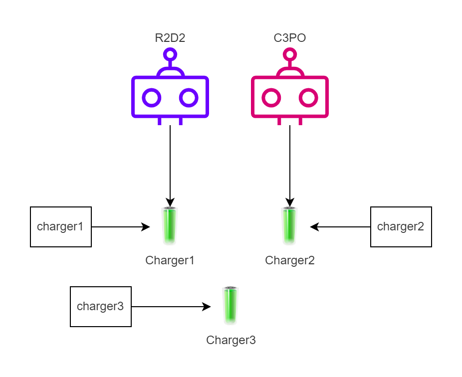
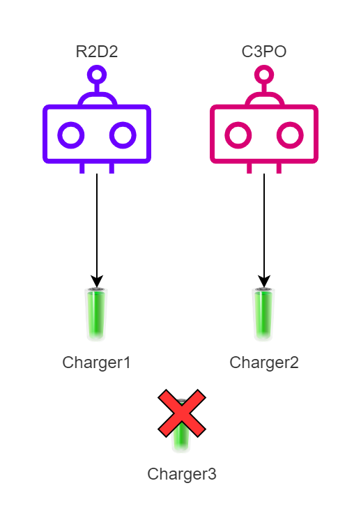
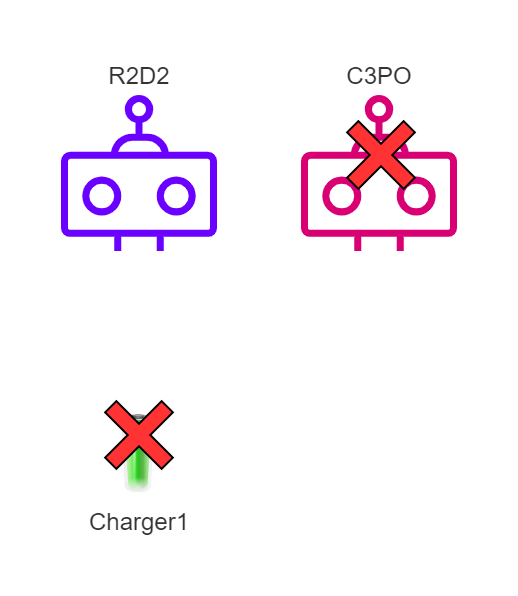
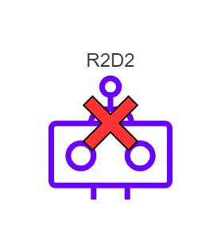
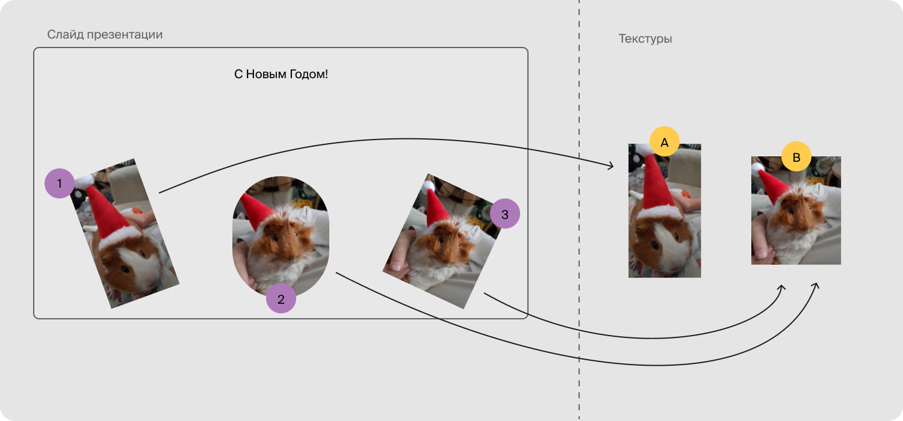

## Умный указатель shared_ptr

Вы познакомились с умным указателем unique_ptr, который единолично владеет объектом в динамической памяти. Им удобно пользоваться в случаях, когда время жизни одного объекта ограничено временем жизни другого объекта-владельца. Примеры:

- Время жизни дочерних узлов двоичного дерева ограничено временем жизни их родительского узла.

- Аккаунт в соцсети и контент. Пока существует аккаунт, существуют и посты, которые опубликованы через него.

Однако встречаются задачи, в которых конкретный объект должен жить, пока в программе есть хотя бы один объект-владелец, ссылающийся на него. Примеры:

- Несколько объектов на слайдах презентации могут использовать одно растровое изображение. Пока на слайдах есть хотя бы один такой объект, изображение удалять нельзя.

- Одно и то же соединение с базой данных может использоваться несколькими объектами. Закрывать это соединение можно только после разрушения всех объектов.

Тут указатель unique_ptr бессилен, ведь в программе может быть только один его экземпляр, ссылающийся на конкретный объект.

В таких ситуациях используют умный указатель std::shared_ptr.

### Указатель shared_ptr

`shared_ptr` — умный указатель, обеспечивающий совместное владение динамически выделенным ресурсом. Несколько экземпляров `shared_ptr` могут владеть одним и тем же объектом. Объект разрушается с помощью delete. Занимаемая им память освобождается, когда:

- вызывается деструктор последнего экземпляра `shared_ptr`, владевший этим объектом;

- последнему экземпляру `shared_ptr`, владевшему этим объектом, присваивается значение другого указателя (с помощью операции присваивания или вызова метода reset).

Можно создать `shared_ptr` на основе сырого указателя на объект в куче:
```cpp
shared_ptr<Object> obj_ptr{new Object()}; 
```
Либо сразу создать объект в куче и получить владеющий этим объектом `shared_ptr`, вызвав функцию `make_shared`:

auto obj_ptr = make_shared<Object>(); 

Продемонстрируем принципы работы `shared_ptr` на примере роботов, которые совместно владеют зарядными устройствами.
```cpp
// Зарядное устройство
class Charger {
public:
    explicit Charger(string name)
        : name_(move(name)) {
        cout << "Charger "sv << name_ << " has been created"sv << endl;
    }
    ~Charger() {
        cout << "Charger "sv << name_ << " has been destroyed"sv << endl;
    }
private:
    string name_;
}; 
```
Роботы могут использовать зарядные устройства, используя указатель `shared_ptr`. Для простоты будем считать, что каждый робот в один момент времени владеет только одним зарядным устройством. Несколько роботов могут использовать одно и то же зарядное устройство.
```cpp
class Robot {
public:
    explicit Robot(string name)
        : name_(move(name)) {
        cout << "Robot "sv << name_ << " has been created"sv << endl;
    }
    ~Robot() {
        cout << name_ << " has been destroyed"sv << endl;
    }

    // Начать использовать зарядное устройство.
    void UseCharger(shared_ptr<Charger> charger) {
        charger_ = move(charger);
    }
    // Перестать владеть зарядным устройством.
    void ReleaseCharger() {
        charger_.reset();
    }

    const shared_ptr<Charger>& GetCharger() const {
        return charger_;
    }
private:
    string name_;
    shared_ptr<Charger> charger_;
}; 
```

Сначала создаются роботы `r2d2` и `c3po`, затем во вложенном блоке добавляются умные указатели `charger1`, `charger2` и `charger3`, ссылающиеся на соответствующие зарядные устройства. Первые два зарядных устройства используются роботами, а третье — нет.

```cpp
int main() {
    Robot r2d2{"R2D2"s};
    Robot c3po{"C3PO"s};
    {
        auto charger1 = make_shared<Charger>("Charger1"s);
        auto charger2 = make_shared<Charger>("Charger2"s);
        auto charger3 = make_shared<Charger>("Charger3"s);

        r2d2.UseCharger(charger1);
        c3po.UseCharger(charger2);
        cout << "----"sv << endl;
    }
    cout << "----"sv << endl;
    ... 
```



При выходе из внутреннего блока разрушается charger3 — единственный указатель, ссылающийся на зарядное устройство №3. С ним перестаёт существовать и соответствующий объект. Также разрушаются указатели charger1 и charger2. Но зарядные устройства Charger1 и Charger2 не разрушаются, так как на них ссылаются указатели со стороны роботов:
```
Robot R2D2 has been created
Robot C3PO has been created
Charger Charger1 has been created
Charger Charger2 has been created
Charger Charger3 has been created
----
Charger Charger3 has been destroyed
---- 
```

Затем робот C3PO начинает использовать зарядное устройство робота R2D2.
```cpp
    cout << "C3PO uses R2D2's charger"sv << endl;
    c3po.UseCharger(r2d2.GetCharger()); 
```

Так как shared_ptr внутри C3PO перестаёт ссылаться на Charger2 происходит разрушение Charger2.
```
C3PO uses R2D2's charger
Charger Charger2 has been destroyed 
```
Затем R2D2 перестаёт ссылаться на своё зарядное устройство:
```cpp
    cout << "R2D2 releases its charger"sv << endl;
    r2d2.ReleaseCharger();
    cout << "----"sv << endl; 
```    
Так как на Charger2 всё ещё ссылается `shared_ptr` со стороны C3PO, с Charger2 ничего не происходит.
```
R2D2 releases its charger
---- 
```
В конце функции main из своей области видимости выходят локальные переменные r2d2 и c3po.

```cpp
    cout << "Robots end their lifetime"sv << endl;
    cout << "----"sv << endl;
} 
```
Сначала разрушается переменная `c3po`, а вместе с ней и последний указатель на Charger2.
```
Robots end their lifetime
----
C3PO has been destroyed
Charger Charger1 has been destroyed 
```

Затем разрушается переменная `r2d2`:
```
R2D2 has been destroyed 
```

Таким образом, `shared_ptr` позволяет динамически продлевать время жизни объекта в куче, пока у этого объекта есть хотя бы один владелец. Как только все владеющие объектом указатели разрушаются или перестают указывать на него, объект удаляется.

`shared_ptr` полезен, когда несколько объектов с разным временем жизни совместно используют некоторый ресурс. Этот ресурс нельзя удалять, пока он используется хотя бы одним объектом. Чтобы ресурс не занимал память впустую, его нужно удалить, когда в нём больше никто не нуждается. `shared_ptr` автоматизирует управление временем жизни такого ресурса.

Например, в программе для создания презентаций несколько фигур могут совместно использовать одну и ту же текстуру для рисования своей внутренней области.



На рисунке показан слайд презентации с тремя фигурами. Фигура №1 использует текстуру A, фигуры №2 и №3 — текстуру B. Время жизни фигур на слайде заранее не известно, так как пользователь может удалить в редакторе любую из них в произвольный момент. Нужно своевременно удалить из памяти текстуру, если не осталось фигур, которые её используют.

Текстуру A можно удалить из памяти программы сразу после удаления фигуры №1, а текстуру B — только после удаления фигур №2 и №3. Текстуры — ресурсы, совместно используемые фигурами. Управление этими ресурсами легко автоматизировать, если фигуры будут ссылаться на свои текстуры, используя `shared_ptr`. Дубликат фигуры будет использовать `shared_ptr`, ссылающийся на ту же текстуру, что и оригинальная фигура. Каждая текстура будет автоматически удалена, когда на слайде не останется ни одной использующей её фигуры.

#### Создание shared_ptr из unique_ptr

У `shared_ptr` есть специальный конструктор, принимающий `unique_ptr` по rvalue-ссылке. С его помощью можно переместить содержимое `unique_ptr` в `shared_ptr`, превратив единоличное владение объектом в совместное:
```cpp
auto u_ptr = std::make_unique<Dog>("Belka"s);
...
shared_ptr<Dog> s_ptr{std::move(u_ptr)};
// u_ptr пуст — право владения объектом передано указателю s_ptr.
assert(!u_ptr); 
```
Обратное преобразование из `shared_ptr` в `unique_ptr` невозможно: основная задача `shared_ptr` — совместное владение, а не уникальное. Если вам нужно написать функцию, которая будет создавать объект и возвращать умный указатель, возвращайте `unique_ptr`, а затем присваивайте его `shared_ptr`, когда требуется. Возвращать `shared_ptr` стоит, когда вы точно знаете, что возвращаемый объект предназначен лишь для совместного владения.