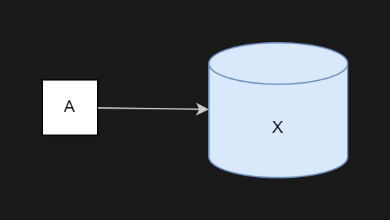
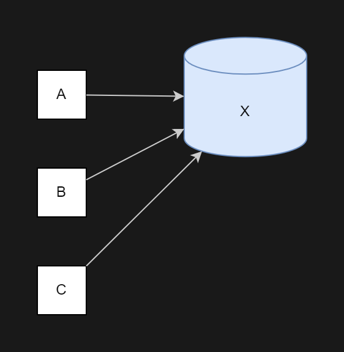
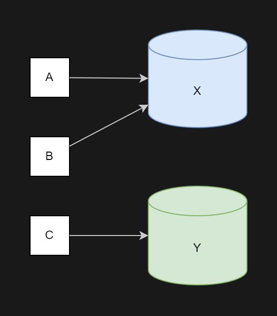
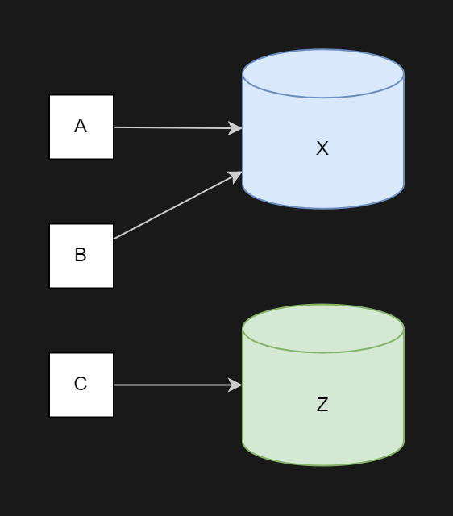
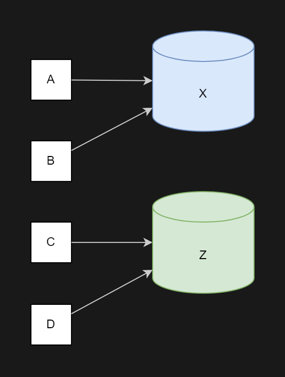
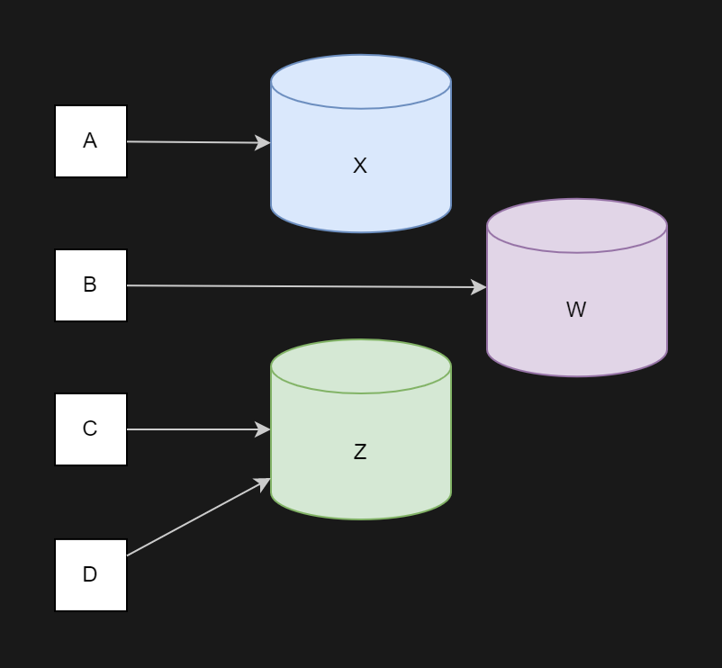
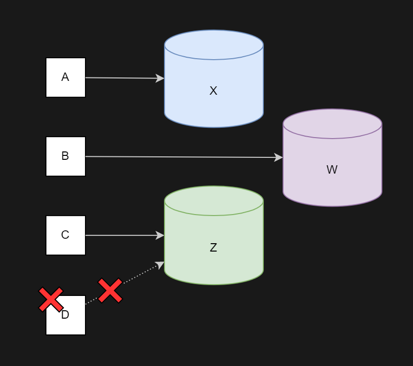
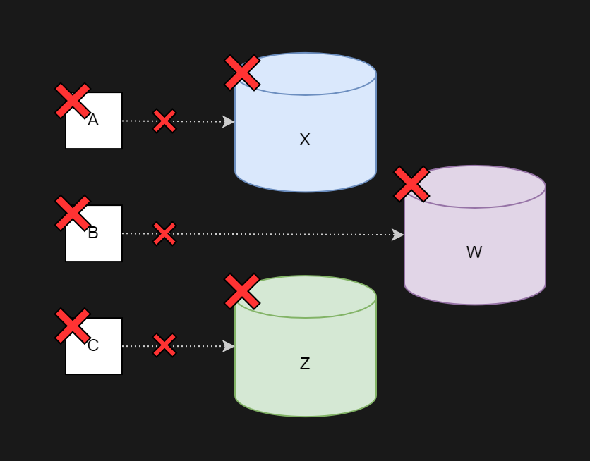
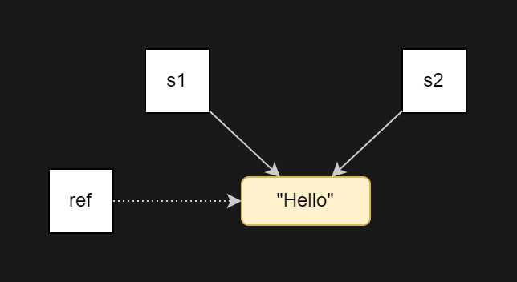

## Copy on write — теория

Умный указатель `shared_ptr` используется для совместного владения ресурсом. Ресурс живёт до тех пор, пока на него ссылается хотя бы один `shared_ptr`.

Однако владение ресурсом подразумевает не только управление его временем жизни, но и использование: доступ к данным и методам. В задаче про фигуры таким ресурсом был объект класса `Texture`. Несколько фигур могли использовать одну и ту же текстуру, что при больших размерах существенно экономило память.

Взгляните на методы класса `Texture`:
```cpp
class Texture {
public:
    Size GetSize() const;

    char GetPixelColor(Point p) const;
    ...
}; 
```
Все методы этого класса константные, поэтому с их помощью можно только считывать данные из текстуры, но нельзя изменять их. Совместное владение неизменяемым объектом — самый простой сценарий использования указателя `shared_ptr`. В реальных программах часто требуется изменять состояние объектов.

Представьте, что в классе `Texture` есть метод `SetPixelColor`, изменяющий цвет пикселя, а в классе `Shape` — метод `GetTexture`, возвращающий `shared_ptr<Texture>`:
```cpp
class Texture {
    ...
    void SetPixelColor(Point p, char color);
    ...
};

class Shape {
    ...
    std::shared_ptr<Texture> GetTexture() const;
    ...
}; 
```
Взгляните на этот фрагмент программы:
```cpp
int main() {
    auto tex = std::make_shared<Texture>(...);

    Shape rect1 {ShapeType::RECTANGLE};
    rect1.SetPosition({0, 0});
    rect1.SetSize({15, 10});
    rect1.SetTexture(tex);

    Shape rect2 = rect1;
    rect2.SetPosition({5, 5});
    rect2.GetTexture()->SetPixelColor({5, 3}, '+');

    rect1.Draw();
    rect2.Draw();
} 
```
Как в этой программе будут нарисованы прямоугольники rect1 и rect2? — Прямоугольники будут нарисованы с одной и той же текстурой `tex`.


Когда копируется фигура, то и оригинал, и копия будут ссылаться на одну и ту же текстуру. Поэтому изменение текстуры, полученной у одной фигуры, повлияет на внешний вид всех фигур с этой текстурой.

Предположим, что вас такое поведение не устраивает, и вы хотите, чтобы изменение текстуры одной фигуры не влияло на текстуру остальных фигур.

Самым простым решением этой проблемы было бы хранить внутри фигуры не указатель на текстуру, а саму текстуру.
Тогда при копировании фигуры будет копироваться и её текстура.
Но у этого подхода есть несколько серьёзных недостатков:

- Чрезмерное потребление памяти. Текстуры обычно имеют большой размер. Хранить в памяти множество одинаковых копий одной текстуры расточительно: каждая из них размером десятки или сотни килобайт.
- Снижение быстродействия из-за создания копии.
Исправить эти недостатки можно с помощью оптимизации Copy on write (копирование при записи). Смысл её в следующем:

- При копировании объекта копируются не сами данные, а только указатель на них. Это делает копирование объекта легковесной операцией.

- Пока над копиями объекта выполняются операции чтения, все копии используют одни и те же данные.

- При модификации объекта его данные копируются, если на них ссылается кто-то ещё. Объект начинает использовать модифицированную копию данных.

- Если объект единолично использует свои данные, то при его модификации данные не копируются.

Рассмотрим на примере.

Создадим объект $A$. Вместе с ним создаются данные $X$. Объект $A$ хранит указатель на объект $X$.



Объект A ссылается на данные X
Создадим две копии объекта $A$: объекты $B$ и $C$. Скопируются только указатели на данные. Сами данные не копируются.


Объекты A, B и C используют одни и те же данные X

Выполним модификацию объекта $C$. Перед модификацией данных они будут скопированы и $C$ будет использовать изменённую копию.


Теперь объект C использует отдельную копию данных Y

Ещё раз изменим объект $C$. Так как он единолично владеет данными, они копироваться не будут.


Данные объекта C изменились с Y на Z

Создадим $D$, копию объекта $C$. И оригинал, и копия будут использовать одни и те же данные.


С и D используют одни и те же данные Z

Что произойдёт, если теперь над объектом $B$ выполнить операцию записи? — Будет создана копия данных $X$, $B$ будет ссылаться на изменённую копию.

Так как $B$ владеет данными совместно с объектом $A$, будут скопированы данные, $B$ будет ссылаться на модифицированную копию $W$.



Объект B ссылается на новую копию W

Рассмотрим, что происходит при разрушении объектов.

Объект $D$ разрушается. Так как на данные $Z$ ссылался и объект $C$, данные не удаляются.


Объект C удерживает данные Z от удаления

Объекты $A$, $B$ и $C$ удаляются. Вместе с ними удаляются и данные $X$, $W$, $Z$, которыми они владели единолично.


И никого не стало...

Этот алгоритм может показаться несколько сложным, однако возможностей `shared_ptr` достаточно, чтобы создать простой объект, реализующий эту оптимизацию.

- Объект должен ссылаться на данные с помощью `shared_ptr`. Тогда копии объекта будут использовать одни и те же данные, а копирование объекта будет сводиться к копированию указателя `shared_ptr`.

- Чтобы изменить состояние объекта, нужно убедиться, что он единственный владелец данных. Для этого воспользуемся методом `shared_ptr::use_count`. Он возвращает количество `shared_ptr`, владеющих объектом. Если вернулось число больше единицы, значит, на эти данные ссылается кто-то кроме текущего объекта. В этот момент нужно скопировать данные и модифицировать копию.

Чтобы оптимизацию Copy on Write было просто применять, создадим умный указатель `CoW` (Copy on Write). Внутри он будет хранить `shared_ptr`. За счёт этого все копии `CoW` будут использовать один и тот же экземпляр данных.
```cpp
template <typename Value>
class CoW {
public:
    // Конструируем значение по умолчанию.
    CoW()
        : value_(std::make_shared<Value>()) {
    }

    // Создаём значение за счёт перемещения его из value.
    CoW(Value&& value)
        : value_(std::make_shared<Value>(std::move(value))) {
    }

    // Создаём значение из value.
    CoW(const Value& value)
        : value_(std::make_shared<Value>(value)) {
    }

private:
    std::shared_ptr<Value> value_;
}; 
```
В этом классе 3 конструктора:

- конструктор по умолчанию;

- конструктор, создающий СoW-объект путём копирования переданного значения;

- конструктор, создающий CoW-объект путём перемещения переданного значения.

Конструктор копирования и операцию присваивания писать не нужно, так как с их генерированием справится компилятор.

Следующим шагом добавим в `CoW` операции `*` и `->`. Они предоставят доступ к данным в режиме чтения:

```cpp
template <typename Value>
class CoW {
public:
    ...

    // Оператор разыменования служит для чтения значения.
    const Value& operator*() const noexcept {
        assert(value_);
        return *value_;
    }

    // Оператор -> служит для чтения полей и вызова константных методов.
    const Value* operator->() const noexcept {
        assert(value_);
        return value_.get();
    }

    ...
};
```

Проверим `CoW` в действии. Положим внутрь строку и убедимся, что обе CoW-копии используют одну и ту же строку:
```cpp
int main() {
    using namespace std::literals;

    CoW<std::string> s1("Hello");
    CoW<std::string> s2{s1};

    // Для доступа к значению используем операцию разыменования.
    std::cout << *s1 << ", "sv << *s2 << std::endl;

    // Для вызова константных методов служит стрелочка.
    std::cout << s1->size() << std::endl;

    // Оба указателя ссылаются на одну и ту же строку в памяти.
    assert(&*s1 == &*s2);
    std::cout << &*s1 << ", "sv << &*s2 << std::endl;
}
```
Запустим программу. На вашем компьютере адреса в третьей строке будут другими, но обязательно одинаковыми:
```
Hello, Hello
5
000001B0C3ED5A30, 000001B0C3ED5A30 
```
Доступ на запись устроен хитрее. Добавим метод `Write`. В нём удостоверимся, что текущий указатель — единственный владелец данных. Для этого воспользуемся методом `shared_ptr::use_count`.

Если кроме текущего указателя на данные ссылается кто-то ещё, создадим копию и будем использовать её. В самом конце вызовем переданную нам функцию и передадим туда неконстантную ссылку на текущую копию объекта:
```cpp
template <typename Value>
class CoW {
public:
    ...

    // Write принимает функцию, в которую CoW передаст неконстантную ссылку на хранящееся значение.
    template <typename ModifierFn>
    void Write(ModifierFn&& modify) {
        EnsureUnique();
        // Теперь value_ — единственный владелец данных.

        std::forward<ModifierFn>(modify)(*value_);
    }

private:
    // Удостоверяемся, что текущий объект единолично владеет данными.
    // Если это не так, создаём копию и будем ссылаться на неё.
    void EnsureUnique() {
        assert(value_);

        if (value_.use_count() > 1) {
            // Кроме нас на value_ ссылается кто-то ещё, копируем содержимое value_.
            value_ = std::make_shared<Value>(*value_);
        }
    }

    ...
}; 
```

Чтобы изменить CoW-объект, вызовем метод `Write`. В него передадим лямбда-функцию и внутри неё изменим значение объекта.
```cpp
int main() {
    using namespace std::literals;

    CoW<std::string> s1("Hello"s);
    CoW<std::string> s2{s1};

    std::cout << *s1 << " "sv << *s2 << std::endl;

    s2.Write([](auto& value) {
        // Внутри этой функции можно изменить значение, содержащееся в s2.
        value = "World"s;
        value += '!';
    });

    // Теперь s2 содержит строку "World!".
    std::cout << *s1 << " "sv << *s2 << std::endl;
}
```
Этот способ удобен, когда над объектом нужно проделать несколько модифицирующих операций. Но чаще всего требуется вызвать лишь один неконстантный метод класса или изменить одно из полей. В этом случае эта конструкция будет громоздкой:
```cpp
s2.Write([](auto& value) {
    value.clear();
}); 
```
Подумаем, как сделать это более лаконично.
Можно было бы добавить в CoW метод Write без параметров, который бы вернул ссылку на объект:
```cpp
template <typename Value>
class CoW {
public:
    ...
    Value& Write() {
        EnsureUnique();

        return *value_;
    }
    ...
};
```
Тогда изменение объекта сократилось бы до одной строки:
```cpp
s1.Write().clear(); 
```
Однако за этой простотой кроется опасность. Пользователь класса может сохранить ссылку, возвращённую методом Write. Затем использует эту ссылку для модификации данных, когда объект уже не будет единоличным владельцем.

Что выведет эта программа?
```
CoW<std::string> s1("Hello"s);

auto& data = s1.Write();
CoW<std::string> s2(s1); 

data = "Hi"s;
std::cout << *s1 << " "sv << *s2; 
```

Правильный ответ — `Hi Hi`.

Изменение данных объекта, полученных у `s1`, привело к изменению данных объекта `s2`. Отданная наружу ссылка позволила изменить данные в обход механизмов логики Copy on write.


Ссылка ref позволяет модифицировать строку в обход s1 и s2

Чтобы защититься от этого, нужно возвращать пользователю не ссылку, а специальный прокси-объект с операциями `*` и `->`.

```cpp
template <typename Value>
class CoW {
    // Прокси-объект объявлен в приватной области. Поэтому его нельзя создать снаружи класса.
    struct WriteProxy {
        explicit WriteProxy(Value* value) noexcept
            : value_ptr_{value} {
        }

        // Прокси-объект нельзя копировать и присваивать.
        WriteProxy(const WriteProxy&) = delete;
        WriteProxy& operator=(const WriteProxy&) = delete;

        // У lvalue-ссылок операции разыменования нет.
        Value& operator*() const& = delete;
        // А у rvalue-ссылок разыменование есть.
        [[nodiscard]] Value& operator*() const&& noexcept {
            return *value_ptr_;
        }

        // Операции -> у lvalue-ссылок нет.
        Value* operator->() const& = delete;
        // У rvalue-ссылок операция -> есть.
        Value* operator->() const&& noexcept {
            return value_ptr_;
        }

    private:
        Value* value_ptr_;
    };

public:

    [[nodiscard]] WriteProxy Write() {
        EnsureUnique();

        // Возвращаем прокси-объект для модификации данных.
        return WriteProxy(value_.get());
    }
    ...
}; 
```
Чтобы защититься от многократного использования `WriteProxy`, здесь используется перегрузка операций `*` и `->` для rvalue- и lvalue-ссылок. У rvalue-ссылок на `WriteProxy` эти операции есть, а у lvalue-ссылок они удалены. Поэтому такой код компилироваться не будет:
```cpp
    CoW<std::string> s1("Hello");
    auto writer = s1.Write();
    CoW<std::string> s2;

    writer->append("!!!"); // Ошибка компиляции. 
```
Теперь одиночные модификации объекта можно выполнить без использования лямбда-функций:

```cpp
CoW<std::string> s1("Hello");
CoW<std::string> s2{s1};
// Чтобы изменить значение, нужно разыменовать результат вызова Write().
*s2.Write() = "Wor";
*s2.Write() += "ld";
// Можно вызывать неконстантные методы, используя ->.
s2.Write()->append("!"); 
```
Подведём итоги. Оптимизация Copy on write экономит память, которую занимают копии объекта. Копирование откладывается до момента, когда в этом будет реальная необходимость.
Закрепим эту оптимизацию на практике.