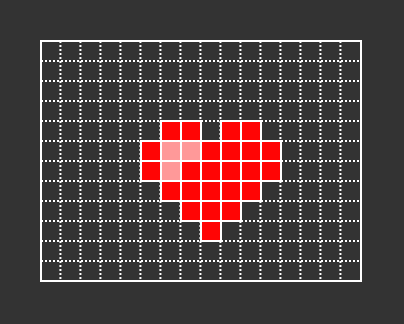
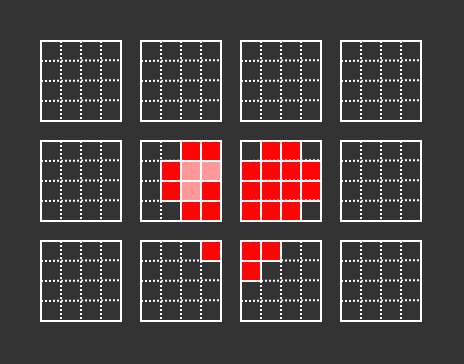
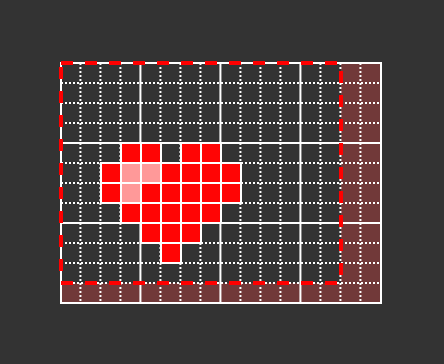
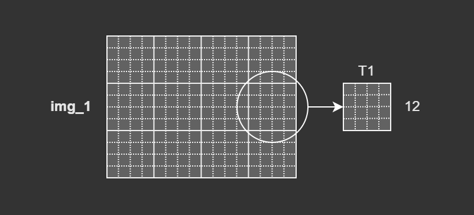
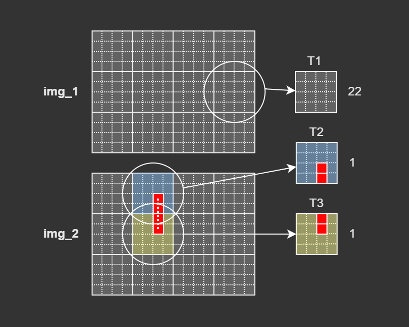
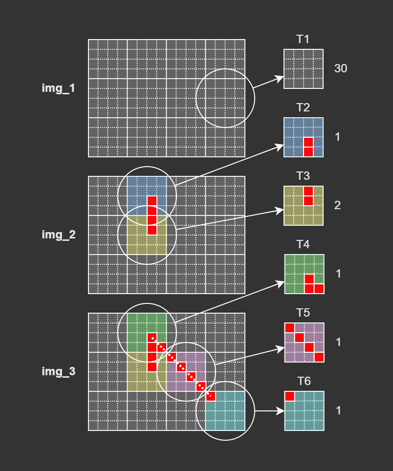
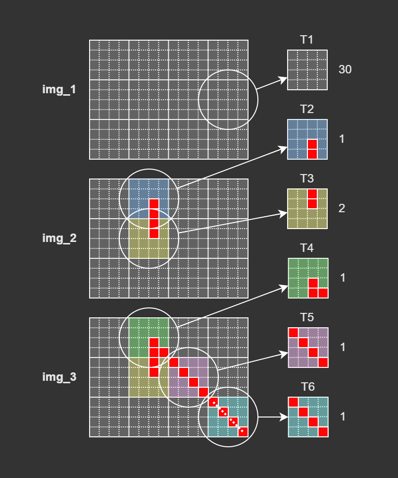

## Copy on write — практика

Рассмотрим оптимизацию Copy on write для компактного хранения изображений в графическом редакторе.

Представьте, что вы разрабатываете графический редактор наподобие Paint. В этой программе пользователь может рисовать на растре различные графические примитивы: линии, окружности, прямоугольники, изменять цвета отдельных пикселей.

Растровое изображение — двумерный массив пикселей размером MxN.

Пример растрового изображения

Одна из обязательных функций любого графического редактора — возможность отмены изменений. Для этого редактор должен сохранять предыдущие версии изображения, чтобы в любой момент можно было переключиться на одну из них. И здесь начинаются сложности.

Чем больше размеры картинки, тем больше памяти она занимает. Например, иконка 32x32 пикселя с глубиной цвета в 32 бита будет занимать $32 * 32 * (32/8)=4096$ байт, или 4 килобайта. А фотография размером 4000x3000 пикселей и глубиной цвета 32 бита — уже 48 мегабайт. Если после каждой правки сохранять копию изображения целиком, никакой памяти не хватит!

В этом случае поможет Copy on write. Воспользуемся тем, что в подобных редакторах большинство действий пользователя изменяют лишь небольшую часть изображения. Например, рисование карандашом или кистью изменяет всего лишь сотни или даже десятки пикселей.

Разобьём всё изображение на тайлы, прямоугольные кусочки (а чаще, квадратные) фиксированного размера. Каждый тайл будет хранить небольшую часть целого изображения.

Растровое изображение, разбитое на тайлы размером 4x4

Размеры тайла не должны быть слишком маленькими, чтобы накладные расходы, связанные с ним, были незначительными по сравнению с размерами самого тайла. Большое изображение, составленное из слишком маленьких тайлов, будет использовать много памяти для хранения служебной информации.
Слишком большим тайл тоже не должен быть, так как память выделяется целыми тайлами, что может быть расточительно.

Типичный размер тайла — от 8x8 до 64x64 пикселей. При глубине цвета в 32 бита тайл будет занимать от 0.25 до 16 килобайт, а служебные данные — несколько десятков байт.

Если размеры изображения не кратны размерам тайла, количество тайлов по горизонтали и вертикали округляют вверх и часть области граничных тайлов не используют. Например, если используются тайлы 4x4, изображение размером 14x11 пикселей потребует 4x3=12 тайлов. Похожим образом поступают с кафельной плиткой: размеры стены округляют вверх до целого числа плиток, а потом лишние части плитки отрезают.

Части тайлов, выходящие за границы изображения, не используются

Изображение должно хранить каждый тайл с оптимизацией Copy on write. Тогда копия изображения будет использовать те же тайлы, что и оригинал. И только при изменении пикселей изображения будут создаваться модифицированные копии затронутых тайлов.

Copy on write будет экономить память даже при хранении единственного изображения, если все его пиксели одного цвета. В этом случае всю поверхность изображения можно замостить копией одного тайла.

Вся поверхность картинки img_1 вымощена 12-ю копиями тайла T1

Рассмотрим работу с тайловым изображением.

Создадим `img_2`, копию картинки `img_1`, и нарисуем внутри `img_2` вертикальный отрезок. На основе тайла `T1` будут созданы тайлы `T2` и `T3`. Остальные тайлы в изображении `img_2` будут использовать тайл `T1`.

В тайлах T2 и T3 нарисован вертикальный отрезок

Скопируем img_2 в img_3, где нарисуем диагональный отрезок. Будут созданы тайлы:

- `T4` на основе тайла `T2`;
- `T5` на основе тайла `T1`;
- `T6` на основе тайла `T1`.

В тайлах T4, T5 и T6 нарисован диагональный отрезок

Нарисуем в `img_3` ещё один диагональный отрезок. Тайл `T6` будет модифицирован без создания его копии, так как он используется в единственном экземпляре:

В тайле T6 нарисован диагональный отрезок

В результате в программе получилось 3 изображения размером 16x12 пикселей, использующие всего 6 тайлов 4x4. Даже на таком простом примере можно видеть, как мы сэкономили память в 6 раз. При большем количестве похожих копий можно достичь экономии в десятки и даже сотни раз!