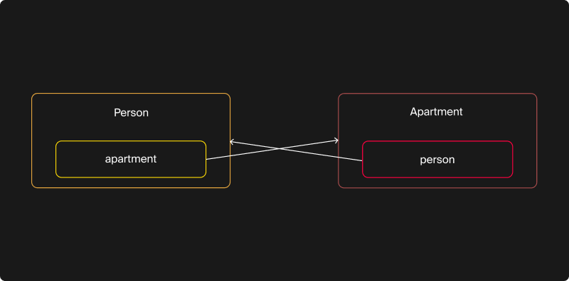
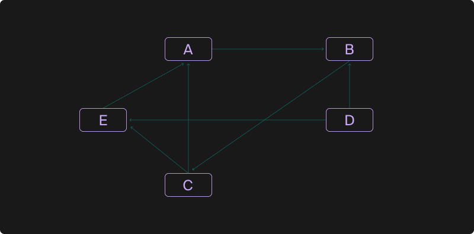

## Умный указатель weak_ptr

Вы познакомились с умным указателем `shared_ptr`. Благодаря ему несколько умных указателей могут владеть одним динамически выделенным ресурсом. Ресурс будет автоматически уничтожен, когда последний из ссылающихся на ресурс умных указателей разрушится или станет ссылаться на другой объект.

У вас могло сложиться впечатление о всесильности указателя `shared_ptr`. Настало время это развеять.

### Проблема циклических ссылок

Рассмотрим два класса: `Person` и `Apartment`. Человек живёт в квартире, поэтому содержит `shared_ptr`, ссылающийся на его квартиру. В квартире, в свою очередь, проживает человек, поэтому она содержит `shared_ptr`, ссылающийся на человека:
```cpp
struct Apartment;

struct Person {
    explicit Person(string name)
        : name(move(name))  //
    {
        cout << "Person "sv << this->name << " has been created"sv << endl;
    }
    ~Person() {
        cout << "Person "sv << name << " has died"sv << endl;
    }

    string name;
    shared_ptr<Apartment> apartment;
};

struct Apartment {
    Apartment() {
        cout << "The apartment has been created"sv << endl;
    }
    ~Apartment() {
        cout << "The apartment has been destroyed"sv << endl;
    }

    shared_ptr<Person> person;
}; 
```
Создадим человека и квартиру и свяжем их друг с другом:
```cpp
int main() {
    auto apartment = make_shared<Apartment>();
    auto person = make_shared<Person>("Ivan"s);
    person->apartment = apartment;
    apartment->person = person;
} 
```
Запустив программу, столкнёмся с утечкой памяти: ни у человека, ни у квартиры не был вызван деструктор.
```
The apartment has been created
Person Ivan has been created 
```
Суть проблемы в том, что между `person` и `apartment` возникла циклическая ссылка. Циклическая ссылка — ситуация, при которой в программе появляется циклическая последовательность владеющих ссылок. В данном случае:
- объект `person` владеет объектом `apartment`, не давая ему уничтожиться;
- объект `apartment` владеет объектом `person`, также не давая ему уничтожиться.


В итоге даже при отсутствии внешних ссылок на `person` и `apartment` эти объекты удерживают друг друга от разрушения, что и приводит к утечке памяти.

В нашем случае проблема возникла из-за неправильного предположения, что квартира владеет своими жильцами и одновременно человек владеет квартирой.

В реальных программах циклические ссылки могут принимать более сложные формы. На следующей диаграмме можно обнаружить два цикла: `A-B-C` и `A-B-C-E`.

Указатели `unique_ptr` и `shared_ptr` — владеющие. Объект, который ссылается на другой объект по `shared_ptr` или `unique_ptr`, отвечает за его удаление. Выбирайте `unique_ptr` и `shared_ptr` только тогда, когда нужно обозначить владение одного объекта другим. И в то же время, когда удаление владеющего объекта должно повлечь за собой удаление того, которым владеют. В остальных случаях используйте обычные ссылки или невладеющие указатели.

Циклическое владение практически всегда свидетельствует об ошибке. Решение: разорвать цикл владеющих ссылок, заменив некоторые связи между объектами на обычные указатели. Например, можно заменить связь от `Apartment` к `Person` на обычный указатель:
```cpp
struct Apartment {
    Apartment() {
        cout << "The apartment has been created"sv << endl;
    }
    ~Apartment() {
        cout << "The apartment has been destroyed"sv << endl;
    }

    Person* person = nullptr;
};

int main() {
    auto apartment = make_shared<Apartment>();
    auto person = make_shared<Person>("Ivan"s);
    person->apartment = apartment;
    // Теперь apartment ссылается на person по обычному указателю.
    apartment->person = person.get();
    cout << "----"sv << endl;
}
```
Запустим программу и увидим, что оба объекта своевременно разрушились:
```
The apartment has been created
Person Ivan has been created
----
Person Ivan has died
The apartment has been destroyed 
```
Немного усложним код. Изменения в коде выделены комментариями. Что выведет эта программа?
```
#include <iostream>
#include <memory>
#include <string_view>

using namespace std;

struct Apartment;

struct Person {
    explicit Person(string name)
        : name(move(name))  //
    {
        cout << "Person "sv << this->name << " has been created"sv << endl;
    }
    ~Person() {
        cout << "Person "sv << name << " has died"sv << endl;
    }

    string name;
    shared_ptr<Apartment> apartment;
};

struct Apartment {
    Apartment() {
        cout << "The apartment has been created"sv << endl;
    }
    ~Apartment() {
        cout << "The apartment has been destroyed"sv << endl;
    }

    Person* person = nullptr;
};

// ----- Начало изменений ----
void PrintApartmentInfo(const Apartment& apartment) {
    if (apartment.person) {
        cout << apartment.person->name << " is living in the apartment" << endl;
    } else {
        cout << "The apartment is empty"sv << endl;
    }
}

int main() {
    auto apartment = make_shared<Apartment>();
    {
        auto person = make_shared<Person>("Ivan"s);
        person->apartment = apartment;
        apartment->person = person.get();
        cout << "----"sv << endl;
    }
    PrintApartmentInfo(*apartment);
}
// ----- Конец изменений ---- 
```

— Программа содержит неопределённое поведение. Будет ошибка компиляции.


Эта проблема вызвана разыменованием «висячего» указателя. Её можно исправить, обнулив в деструкторе класса Person ссылку на него со стороны Apartment, однако есть способ лучше.

#### weak_ptr!

`std::weak_ptr` — умный указатель, хранящий невладеющую, или слабую, ссылку на объект, на который ссылается `shared_ptr`.
`weak_ptr` позволяет безопасно узнать, существует ли объект, на который он ссылается, и получить к нему временный доступ, если объект всё ещё жив. При этом наличие слабой ссылки не продлевает объекту жизнь. Объект будет удалён, как только на него перестанут ссылаться `shared_ptr`, — по этой причине их ещё называют сильными ссылками:
```cpp
#include <cassert>
#include <memory>

using namespace std;

struct Object {
    void DoSomething() {
    }
};

int main() {
    auto sp = make_shared<Object>();

    weak_ptr wp{sp};  // Аналог weak_ptr<Object> wp{sp}.

    // Пока объект жив, слабые ссылки не устаревают.
    assert(!wp.expired());
    // После обнуления shared_ptr объект удаляется.
    sp.reset();

    // С этого момента все слабые ссылки становятся устаревшими.
    assert(wp.expired());
} 
```
`weak_ptr` не имеет операторов `*` и `->`, ведь обращаться к объекту, который может быть в любой момент удалён, небезопасно.

Чтобы безопасно обратиться к объекту, на который ссылается `weak_ptr`, нужно получить временный объект `shared_ptr`, используя метод `lock`. Если объект был удалён, метод `lock` вернёт нулевой указатель:
```cpp
int main() {
    auto sp = make_shared<Object>();
    weak_ptr wp{sp};

    if (auto sp2 = wp.lock()) {
        // В этом блоке можно безопасно обращаться к объекту, используя сильную ссылку.
        sp2->DoSomething();
    } else {
        // Сюда мы не попадём, так как на объект всё ещё ссылается sp.
        assert(false);
    }

    sp.reset();
    // Объект уже разрушен, создать сильную ссылку не выйдет.
    assert(!wp.lock());
} 
```
Рассмотренная ранее проблема циклических ссылок может быть безопасно решена с использованием `weak_ptr`.  Для этого одну из ссылок, образующих цикл, нужно сделать слабой.

Объявив внутри `Apartment` слабую ссылку на `Person`, решим и проблему с утечкой памяти, и проблему висячих ссылок:

```cpp
struct Apartment {
    Apartment() {
        cout << "The apartment has been created"sv << endl;
    }
    ~Apartment() {
        cout << "The apartment has been destroyed"sv << endl;
    }

    // Ссылка на Person автоматически обнулится, когда Person будет удалён.
    weak_ptr<Person> person;
};

void PrintApartmentInfo(const Apartment& apartment) {
    if (const auto person = apartment.person.lock()) {
        cout << person->name << " is living in the apartment" << endl;
    } else {
        cout << "The apartment is empty"sv << endl;
    }
}

int main() {
    auto apartment = make_shared<Apartment>();
    {
        auto person = make_shared<Person>("Ivan"s);
        person->apartment = apartment;
        apartment->person = person;
        cout << "----"sv << endl;
    }
    PrintApartmentInfo(*apartment);
} 
```
Теперь программа отработает корректно без дополнительных усилий с нашей стороны:
```
The apartment has been created
Person Ivan has been created
----
Person Ivan has died
The apartment is empty
The apartment has been destroyed 
```
Решение проблемы висячих ссылок — не единственное применение указателя `weak_ptr`. Он умеет отслеживать, жив ли некоторый объект, а ещё может получать доступ к нему. Этим способностям можно найти много разных применений. В следующем задании вам предстоит разработать простой кэш объектов, который будет возвращать существующий объект из кэша или, при его отсутствии, создавать новый.