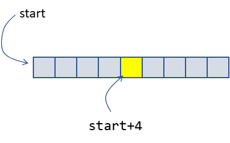
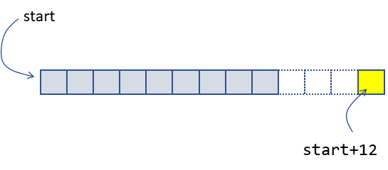

## Знакомство с неопределённым поведением
Из предыдущих уроков вы знаете, что некоторые операции в C++ приводят к неопределённому поведению, или undefined behavior. Причём это вызвано не ошибками компилятора или стандартной библиотеки. Такое поведение описано в стандарте языка. При этом с программой может происходить что угодно: от корректной работы до аварийного завершения или зависания.

Возникает вопрос, зачем в языке программирования такая странная конструкция, усложняющая жизнь разработчикам. Ответ прост: производительность. Неопределённое поведение позволяет улучшить производительность программы, причём двумя способами.

Во-первых, неопределённое поведение разрешает убирать из программы некоторые накладные расходы. Во-вторых, разрешает выполнять оптимизации кода, которые в противном случае были бы невозможны.

В этом уроке вы узнаете, как неопределённое поведение позволяет избегать накладных расходов.

В качестве примера рассмотрим два способа доступа к элементу контейнера std::vector по его индексу:

- оператор `[]`;
- метод `at`.

Метод `at` проверяет, не выходит ли индекс элемента за границы массива, и выбрасывает исключение `out_of_range` при попытке обратиться к несуществующему элементу:
```cpp
#include <iostream>
#include <string_view>
#include <vector>

using namespace std;

int main() {
    vector v{1, 2, 3, 4};
    try {
        cout << v.at(10) << endl;
    } catch (const exception& e) {
        cout << "Exception: "sv << e.what() << endl;
    }
} 
```
Запустим программу и увидим сообщение о пойманном исключении:
```
Exception: vector::_M_range_check: __n (which is 10) >= this->size() (which is 4) 
```
Текст сообщения может быть другим в вашей версии компилятора. Но при обращении за границы контейнера точно выбросится исключение.

Какое поведение допустимо при работе этой программы? Выберите несколько вариантов ответа.

```cpp
#include <iostream>
#include <string_view>
#include <vector>

using namespace std;

int main() {
    vector v{1, 2, 3, 4};
    cout << v[0] << endl;
    cout << v[10] << endl;
    cout << v[100] << endl;
    cout << v[1000] << endl;
    cout << v[10000] << endl;
    cout << v[100000] << endl;
} 
```

Программа выведет
```
1 
```
Верно, это возможный вариант развития событий.

Программа выведет
```
1
-93263863
0
0
0
0 
```
Такой вывод вполне ожидаем.

Программа упадёт
Да, такое может произойти.

Программа выведет
```
1
Hello, world! 
```
Маловероятно, но возможно.


В отличие от метода `at()`, оператор `[]` контейнера `vector` не проверяет выход индекса за границы массива, а напрямую обращается к ячейке памяти по адресу `start+index`, где `start` — адрес массива в динамической памяти, а `index` — индекс элемента.

Если индекс находится внутри массива, всё в порядке:



Но если индекс выходит за пределы массива, то в памяти по адресу `start+index` может быть всё что угодно. Например, по этому адресу может располагаться область памяти, недоступная нашей программе.


Когда выполняется не чтение, а запись за пределы массива, программа может испортить содержимое другого объекта, которому посчастливилось оказаться в той области памяти. Стандарт C++ в подобных случаях вводит понятие неопределённого поведения. Если программа нарушает правила языка, на её поведение не накладывается никаких ограничений.

В описании `vector::operator[]` говорится о неопределённом поведении при выходе индекса за пределы массива. Это позволило авторам стандартной библиотеки избавиться от накладных расходов на проверки и реализовать максимально быстрый доступ к элементу динамического массива.

Чтобы убедиться в этом, используйте онлайн-сервис Compiler Explorer. Там вы увидите, какой ассемблерный код сгенерируется из заданного кода на C++.

Рассмотрим две функции, которые принимают по ссылке `vector` и возвращают некоторый элемент этого массива. Только одна использует оператор `[]`, а другая — метод `at`:
```cpp
#include <vector>

int TestVectorIndexingOperator(std::vector<int>& v) {
    return v[3];
}

int TestVectorAt(std::vector<int>& v) {
    return v.at(3);
} 
```
Сгенерированный код для ассемблера x86-64 функции, которая использует оператор []:
```
TestVectorIndexingOperator(std::vector<int, std::allocator<int> >&):
        // В регистре %rdi — первый аргумент функции — адрес, по которому располагается vector<int>
        movq    (%rdi), %rax    // Загружаем в регистр rax адрес массива элементов контейнера vector
        movl    12(%rax), %eax  // Загружаем в регистр eax значение элемента с индексом 3 (12/sizeof(int))
        ret                     // Выходим из функции. В регистре eax значение элемента массива 
```
Код второй функции:
```
.LC0:
        .string "vector::_M_range_check: __n (which is %zu) >= this->size() (which is %zu)"
TestVectorAt(std::vector<int, std::allocator<int> >&):
        // В регистре rdi — первый аргумент функции — адрес, по которому располагается vector<int>
        // Загружаем в регистр rdx адрес первого элемента массива
        movq    (%rdi), %rdx
        // Загружаем в регистр rax адрес конца массива (указатель end)
        movq    8(%rdi), %rax
        // Проверяем, что массив содержит более трёх элементов
        subq    %rdx, %rax
        cmpq    $12, %rax
        jbe     .L8            // Если нет, переходим на метку .L8 
        movl    12(%rdx), %eax // Загружаем в регистр eax значение элемента с индексом 3
        ret                    // Выходим из функции. Результат возвращается в регистре eax
.L8:
        // Выбрасываем исключение out_of_range
        pushq   %rdx
        sarq    $2, %rax
        movl    $3, %esi
        movl    $.LC0, %edi
        movq    %rax, %rdx
        xorl    %eax, %eax
        call    std::__throw_out_of_range_fmt(char const*, ...) 
```
Даже если вы не знакомы с языком ассемблера, увидите, что второй вариант функции занимает значительно больше кода и, скорее всего, будет медленнее. 

Индекс массива вышел за границы контейнера, и случилось неопределённое поведение оператора `[]`. Это позволило избавиться от накладных расходов на проверку индекса и максимально быстро обращаться к элементам массива.
Вы можете поэкспериментировать с генерируемым кодом на сайте Compiler Explorer: https://godbolt.org/z/r541Kx.

За скорость доступа надо платить. Задача программиста — гарантировать, что при работе с оператором `[]` будут использованы только допустимые значения индексов.

Посмотрим на другие примеры, когда неопределённое поведение избавляет программу от накладных расходов.

- Повторный вызов оператора `delete` с одним и тем же значением указателя. Без неопределённого поведения понадобилось бы проверить валидность удаляемого указателя. А это дорого:
```cpp
int main() {
    int *p = new int(42);
    delete p;
    delete p; // Неопределённое поведение: повторное удаление ранее удалённого объекта
} 
```
- Вызов непарной версии оператора delete: удаление массива как одиночного объекта и наоборот. Неопределённое поведение позволяет уменьшить объём служебной информации, которая нужна для хранения объектов и массивов в куче:
```cpp
int main() {
    int *p = new int(42);
    delete[] p; // Неопределённое поведение: одиночный объект удаляется как массив
} 
```
- При работе программы в многопоточном режиме часто случаются ситуации неопределённого поведения. Один из примеров — состояние гонки. Так называется ситуация, когда два разных потока не синхронизовавшись должным образом выполняют действия с одной и той же ячейкой памяти: чтения или записи. Гонка возникает, когда хотя бы одно из этих действий — запись. Рассмотрим пример:
```cpp
#include <future>
#include <iostream>
#include <string_view>

using namespace std;

int main() {
    int i = 0;
    auto f = async([&i] {
        // Неопределённое поведение: чтение и запись переменной
        // производится в разных потоках без синхронизации
        ++i;
    });

    // Неопределённое поведение: чтение и запись переменной
    // производится в разных потоках без синхронизации
    ++i; 
    f.get();
    cout << "i: "sv << i << endl;
} 
```
Вместо этого программист сам должен синхронизировать доступ в нужных местах. Например, используя mutex:
```cpp
#include <future>
#include <iostream>
#include <mutex>
#include <string_view>

using namespace std;

int main() {
    int i = 0;
    mutex m;
    auto f = async([&i, &m] {
        lock_guard lk{m};
        ++i;
    });

    {
        lock_guard lk{m};
        ++i; 
    }
    f.get();
    cout << "i: "sv << i << endl;
} 
```