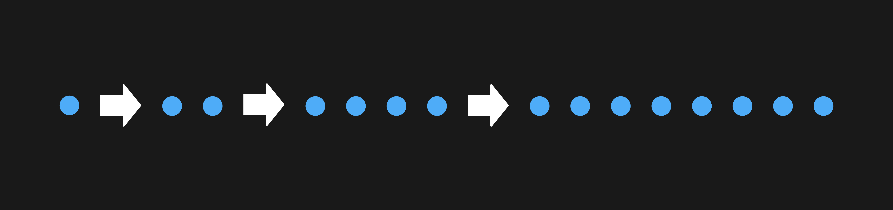
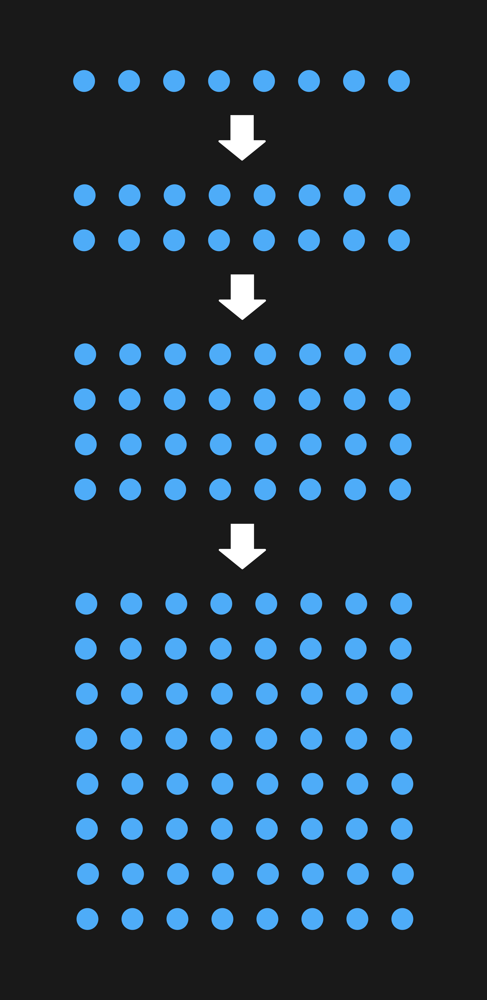

## Идиоматический C++ и неопределённое поведение

В прошлом уроке вы увидели, как неопределённое поведение в программе может привести к очень неожиданным результатам. Отчасти проблема была вызвана тем, что код определения планеты вряд ли можно считать хорошим примером современного C++.
```cpp
bool IsPlanet(string_view name) {
    for (int i = 0; i < NUM_PLANETS; ++i) {
        if (PLANETS[i] == name) {
            return true;
        }
    }
    return false;
} 
```
Здесь массив `PLANETS` и константа `NUM_PLANETS` — разные объекты. Такой стиль написания кода, скорее, характерен для C, а не C++. В C++ эту задачу можно решить проще.
Во-первых, вы можете использовать функцию `std::size` для определения размера массива и отказаться от константы `NUM_PLANETS`:
```cpp
bool IsPlanet(string_view name) {
    for (size_t i = 0; i < std::size(PLANETS); ++i) {
        if (PLANETS[i] == name) {
            return true;
        }
    }
    return false;
}
```
Во-вторых, для поиска планеты не важен индекс элемента в массиве, поэтому цикл получится упростить, используя range-based for:
```cpp
bool IsPlanet(string_view name) {
    for (auto planet_name : PLANETS) {
        if (planet_name == name) {
            return true;
        }
    }
    return false;
}
 ```
В этом цикле шанс ошибиться с индексами уже исключён. Можно пойти дальше и избавиться от написания цикла вручную, заменив его на подходящий здесь алгоритм `std::find`:
```cpp
#include <algorithm>
...
bool IsPlanet(string_view name) {
    return find(begin(PLANETS), end(PLANETS), name) != end(PLANETS);
} 
```
Если ваш компилятор поддерживает C++20, примените алгоритм `std::ranges::find` — это сделает код ещё компактнее:
```cpp
#include <algorithm>
...
using namespace std;
bool IsPlanet(string_view name) {
    return ranges::find(PLANETS, name) != end(PLANETS);
} 
```
Идиоматический код на C++ стал более лаконичным, легче читается и меньше подвержен случайным ошибкам, которые приводят к неопределённому поведению.

Рассмотрим ещё один пример, когда неопределённое поведение интересно себя проявляет: программа, управляющая домашней сигнализацией. Уровень реакции сигнализации на внешний раздражитель можно настраивать, используя указатель `alarm`. Он имеет тип `void (*)()`, что означает «указатель на функцию без параметров, возвращающую `void»`. Указатель `alarm` объявлен в безымянном пространстве имён, чтобы ограничить его область видимости текущим файлом:
```cpp
#include <iostream>

using namespace std;

// Указатель на функцию без параметров, которая возвращает void
using Alarm = void (*)();

namespace {
// Поведение сигнализации определяется значением указателя alarm
Alarm alarm = nullptr;
}  // namespace 
Для установки агрессивного уровня реагирования служит функция SetHostileAlarm. Она присваивает указателю alarm адрес функции, выпускающей велоцираптора:

// Выпустить велоцираптора
void HostileAlarm() {
    cout << "Attack with velociraptor"sv << endl;
}

// Настраиваем сигнализацию на выпуск велоцираптора
void SetHostileAlarm() {
    cout << "Hostile alarm set" << endl;
    alarm = HostileAlarm;
} 
Остаётся протестировать работу программы, вызвав функцию Test. Она, в свою очередь, вызовет функцию, на которую ссылается указатель alarm:

void Test() {
    // Вызываем функцию, на которую ссылается указатель alarm
    alarm();
    cout << "Test succeeded"sv << endl;
}

int main() {
    Test();
} 
```
Какое поведение допустимо при работе этой программы? Выберите один или несколько вариантов.

Тоже правильный ответ
Программа ничего не выведет.

Правильный ответ
Программа упадёт.

Тоже правильный ответ
Программа выведет сообщение "Test succeeded".

Тоже правильный ответ
На вас нападёт велоцираптор.
Как вам задача?

В программе неопределённое поведение, поэтому произойти может всё что угодно.

Указатель `alarm` при запуске программы инициализируется значением `nullptr`, но функция `SetHostileAlarm`, настраивающая этот указатель, в программе не вызывается. Поэтому вызов функции с использованием нулевого указателя alarm приводит к неопределённому поведению. И это в прямом смысле может привести к нападению велоцираптора в программе, собранной компилятором Clang 10.0 с флагом компиляции -O2, который включает оптимизации скорости выполнения:
```
Attack with velociraptor
Test succeeded 
```
Функция `HostileAlarm` была вызвана без предварительного вызова `SetHostileAlarm`, о чём свидетельствует отсутствие сообщения “Hostile alarm set”. Ссылка на онлайн-компилятор wandbox.org, где вы можете в этом убедиться: https://wandbox.org/permlink/xb70ZYQxyqtHbN5V.

Такое поведение кажется странным. Но попробуем найти ему рациональное объяснение. Функция `main` вызывает функцию `Test`, в которой по указателю `alarm` вызывается текущий обработчик сигнализации. Так как указатель не проверяется на `nullptr` перед вызовом, компилятор считает, что он ненулевой. Ведь иначе это привело бы к неопределённому поведению. А неопределённое поведение компилятор вправе исключить из рассмотрения.

Далее компилятор оптимизирует код, пытаясь заменить вызов обработчика по указателю на прямой вызов функции. Он видит, что единственное место в программе, где этому указателю присваивается ненулевое значение — функция `SetHostileAlarm`, и это значение — адрес функции `HostileAlarm`. Здесь компилятору помогает то, что указатель `alarm` объявлен в безымянном пространстве имён — присвоить ему значение может только код в текущей единице трансляции.

Так как указатель alarm может ссылаться только на функцию `HostileAlarm`, компилятор генерирует код, который вызывает данную функцию, не используя указатель `alarm`. При этом не имеет значения, что свои выводы компилятор сделал на основе функции `SetHostileAlarm`, которая не вызывается вообще. Неопределённое поведение это позволяет. В других компиляторах неопределённое поведение может проявлять себя иначе. Единственно правильное решение в этой ситуации — устранить его причины.

Во-первых, следует проверить значение указателя `alarm` на равенство `nullptr` перед вызовом функции:
```cpp
void Test() {
    if (alarm != nullptr) {
        alarm();
    }
    cout << "Test succeeded"sv << endl;
} 
```
Во-вторых, вы можете объявить тип `Alarm` с использованием `std::function`. `std::function` выбрасывает исключение `std::bad_function_call`, если функция не была инициализирована. Кроме того, `std::function` позволяет хранить любой объект, который можно вызвать, включая лямбда-функции и методы классов:
```cpp
#include <functional>
using namespace std;
using Alarm = function<void()>;
...
void Test() {
    alarm();
    cout << "Test succeeded"sv << endl;
}
```
Неопределённое поведение может поджидать и когда пишете исключительно идиоматичный код на C++. Рассмотрим программу, которая создаёт сетку из точек. Она начнёт с одной точки, затем создаст её дубликат со смещением по горизонтали. Продублирует эту пару точек, чтобы получить четыре, а потом проделает то же самое с четырьмя.



```cpp
#include <iostream>
#include <vector>

using namespace std;

struct Point {
    int x, y;
    Point(int x, int y)
        : x(x)
        , y(y) {
    }
};

void DuplicateAlongX(vector<Point>& v, int offset) {
    for (const auto& p : v) {
        v.emplace_back(p.x + offset, p.y);
    }
}

int main() {
    vector points = {Point(0, 0)};

    DuplicateAlongX(points, 1);
    DuplicateAlongX(points, 2);
    DuplicateAlongX(points, 4);

    for (const auto& p : points) {
        cout << '{' << p.x << ", "sv << p.y << "} "sv;
    }
} 
```
Запустим программу и увидим набор из восьми точек:

    {0, 0} {1, 0} {2, 0} {3, 0} {4, 0} {5, 0} {6, 0} {7, 0} 

Теперь проделаем то же самое с рядами точек, продублировав их со смещением по вертикали:



Добавим функцию `DuplicateAlongY`, дублирующую точки со смещением вдоль оси Y:
```cpp
void DuplicateAlongY(vector<Point>& v, int offset) {
    for (const auto& p : v) {
        v.emplace_back(p.x, p.y + offset);
    }
}

int main() {
    vector points = {Point(0, 0)};

    DuplicateAlongX(points, 1);
    DuplicateAlongX(points, 2);
    DuplicateAlongX(points, 4);

    // Дублируем точки по оси Y
    DuplicateAlongY(points, 1);
    DuplicateAlongY(points, 2);
    DuplicateAlongY(points, 4);

    int n = 0;
    for (const auto& p : points) {
        cout << '{' << p.x << ", "sv << p.y << "} "sv;
        ++n;
        if (n == 8) {
            cout << endl;
            n = 0;
        }
    }
} 
```
Запустим программу, ожидая увидеть стройную сетку 8*8, однако результат будет совсем не тот:
```
{0, 0} {1, 0} {2, 0} {3, 0} {4, 0} {5, 0} {6, 0} {7, 0} 
{0, 1} {1, 1} {2, 1} {3, 1} {4, 1} {5, 1} {6, 1} {7, 1} 
{0, 2} {1411111800, 32649} {2, 2} {3, 2} {4, 2} {5, 2} {6, 2} {7, 2} 
{0, 3} {1, 3} {2, 3} {3, 3} {4, 3} {5, 3} {6, 3} {7, 3} 
{0, 4} {1, 4} {2, 4} {3, 4} {4, 4} {5, 4} {6, 4} {7, 4} 
{0, 5} {1, 5} {2, 5} {3, 5} {4, 5} {5, 5} {6, 5} {7, 5} 
{0, 6} {1411111800, 32653} {2, 6} {3, 6} {4, 6} {5, 6} {6, 6} {7, 6} 
{0, 7} {1, 7} {2, 7} {3, 7} {4, 7} {5, 7} {6, 7} {7, 7} 
```
В чём может быть причина такого странного поведения программы?
```cpp
void DuplicateAlongX(vector<Point>& v, int offset) {
    for (const auto& p : v) {
        v.emplace_back(p.x + offset, p.y);
    }
}

void DuplicateAlongY(vector<Point>& v, int offset) {
    for (const auto& p : v) {
        v.emplace_back(p.x, p.y + offset);
    }
} 
```

— Проблема вызвана модификацией вектора в цикле range-based for.

Проблема функций `DuplicateAlongX` и `DuplicateAlongY` в том, что они изменяют вектор точек в процессе итерирования по нему. Чтобы лучше понять, что происходит, нужно рассмотреть, как цикл range-based for устроен внутри:
```cpp
for (const auto& p : v) {
    v.emplace_back(p.x, p.y + offset);
} 
```
Для этого обратимся к документации на cpp reference. Компилятор преобразует цикл в эквивалент следующего кода:
```cpp
{
    auto __begin = v.begin() ;
    auto __end = v.end() ;
    for ( ; __begin != __end; ++__begin) {
        const auto& p = *__begin;
        v.emplace_back(p.x, p.y + offset);
    }
} 
```
То есть это обычный цикл `for`, у которого компилятор сохраняет итераторы на начало и конец диапазона, вектора `v`. На каждой итерации цикла выполняется вставка точки в конец вектора. Для этого используется `emplace_back`. Затем итератор на начало увеличивается до тех пор, пока не сравняется с конечным итератором.

Вы уже знаете, что вектор при нехватке места в текущем массиве производит переаллокацию, то есть выделяет в памяти новый массив большего размера и переносит туда все элементы. Представим, что произойдёт, если переаллокация случится в процессе работы данного цикла. Итераторы `begin` и end продолжат бежать по той области памяти, которая уже возвращена обратно в кучу. Когда размер вектора равен его вместимости, вызов методов `push_back` и `emplace_back` делает недействительными все итераторы на элементы вектора. При их использовании происходит неопределённое поведение.

Возможно, вы захотите использовать метод `reserve`, чтобы избавиться от переаллокации и зарезервировать в векторе место, вдвое превышающее его текущий размер:
```cpp
void DuplicateAlongX(vector<Point>& v, int offset) {
    v.reserve(v.size() * 2);
    for (const auto& p : v) {
        v.emplace_back(p.x + offset, p.y);
    }
}

void DuplicateAlongY(vector<Point>& v, int offset) {
    v.reserve(v.size() * 2);
    for (const auto& p : v) {
        v.emplace_back(p.x, p.y + offset);
    }
} 
```
Запустите программу и увидите, что вывод ровно тот, что нужен:
```
{0, 0} {1, 0} {2, 0} {3, 0} {4, 0} {5, 0} {6, 0} {7, 0} 
{0, 1} {1, 1} {2, 1} {3, 1} {4, 1} {5, 1} {6, 1} {7, 1} 
{0, 2} {1, 2} {2, 2} {3, 2} {4, 2} {5, 2} {6, 2} {7, 2} 
{0, 3} {1, 3} {2, 3} {3, 3} {4, 3} {5, 3} {6, 3} {7, 3} 
{0, 4} {1, 4} {2, 4} {3, 4} {4, 4} {5, 4} {6, 4} {7, 4} 
{0, 5} {1, 5} {2, 5} {3, 5} {4, 5} {5, 5} {6, 5} {7, 5} 
{0, 6} {1, 6} {2, 6} {3, 6} {4, 6} {5, 6} {6, 6} {7, 6} 
{0, 7} {1, 7} {2, 7} {3, 7} {4, 7} {5, 7} {6, 7} {7, 7} 
```
Можно ли считать, что проблема с кодом исправлена? — Проблема осталась.


Чтобы разобраться, что не так, надо внимательнее прочитать описание метода `emplace_back`.

If the new `size()` is greater than `capacity()` then all iterators and references (including the past-the-end iterator) are invalidated. Otherwise only the past-the-end iterator is invalidated.

Если новый размер вектора больше, чем вместимость, все итераторы и ссылки, включая end-итератор, становятся недействительными. В противном случае недействительным становится только end-итератор.

Из этого замечания следует, что итератор, который возвращается из метода end, всегда инвалидируется при вызове `emplace_back`. А это именно тот итератор, который получен при инициализации range-based цикла `for`. Сравнение с таким итератором — неопределённое поведение.

В данном случае компилятор и стандартная библиотека не использовали неопределённое поведение, чтобы результат программы стал неожиданным. Но это может измениться в следующих версиях компилятора или при переходе на другой компилятор.

Здесь не получится написать реализацию функций `DuplicateAlong` с использованием цикла range-based for. Следует выбрать обычный цикл, использующий индексы:
```cpp
void DuplicateAlongX(vector<Point>& v, int offset) {
    // reserve по-прежнему нужен, чтобы избежать переаллокации
    v.reserve(v.size() * 2);
    const size_t old_size = v.size();
    for (size_t i = 0; i != old_size; ++i) {
        auto& p = v[i];
        v.emplace_back(p.x + offset, p.y);
    }
}

void DuplicateAlongY(vector<Point>& v, int offset) {
    v.reserve(v.size() * 2);
    const size_t old_size = v.size();
    for (size_t i = 0; i != old_size; ++i) {
        auto& p = v[i];
        v.emplace_back(p.x, p.y + offset);
    }
} 
```
Идиоматический C++ помогает избежать многих проблем с неопределённым поведением. Но иногда этого недостаточно. И даже если программа работает правильно во всех ваших компиляторах, нельзя делать вывод, что в ней нет неопределённого поведения.
Чтобы его обнаружить, используются специальные инструменты. О них — в следующем уроке.