## Отношения между классами

На протяжении всех предыдущих спринтов вы создавали и использовали классы и функции. Подобно тому, как функции и методы состоят из определённого набора инструкций, решающих нужную задачу, классы программы создаются и взаимодействуют по определённым правилам.

Понимание этих правил позволяет создавать программы не методом проб и ошибок, а проектировать и анализировать архитектуру программы ещё до того, как вы напишете первую строчку кода. В результате вы будете иметь представление о том, из каких классов должна состоять ваша программа и о связях между ними. Также вы можете обсудить структуру программы с коллегами и распределить работу над ней.

На этапе проектирования ошибку легко исправить — ведь вам не нужно переписывать ненаписанный код. Аналогия из реального мира: пока дом существует лишь на бумаге, вносить в него изменения легче, чем когда дом уже построен.

В этом уроке вы научитесь визуализировать архитектуру программы и узнаете о свойствах связей между классами. Благодаря этому вы сможете обозревать структуру программы «с высоты птичьего полёта» и принимать стратегические решения, касающиеся её архитектуры.

### Визуализация класса

Один из способов визуализации структуры программы — диаграмма классов. Диаграмма визуализирует классы и интерфейсы, из которых состоит программа или её часть, свойства и методы классов, а также связи между компонентами программы. Используемые в этой теме обозначения основываются на упрощённой нотации универсального языка моделирования UML.

Класс обозначается прямоугольником, содержащим имя класса, его методы и поля. Перед именем публичного метода и поля класса может ставиться символ `+`, а приватного — символ `-`. Тип полей, аргументов и возвращаемых значений указывается после двоеточия. Указатели, ссылки, а также тип `void` для краткости записи можно опустить.

Приватная часть класса, часть публичных методов или все публичные методы, несущественные на данной схеме, могут быть пропущены:

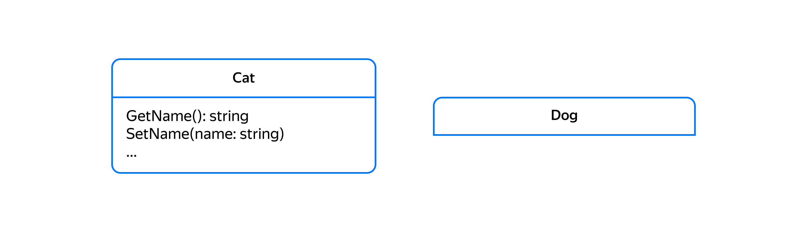

Стандартные классы вроде `string`, `vector`, а также несущественные для диаграммы классы обычно на ней не отображаются.

Перечислимые типы отображаются похожим на класс образом, с той лишь разницей, что перед именем класса записывают слово enumeration.

### Композиция (Composition)

Композиция — один из самых простых способов создать новый тип данных, используя функционал уже имеющихся. При композиции мы получаем новый, более сложный тип, состоящий из одного или нескольких более простых объектов.

Особенности:

- Один объект является частью другого, составного объекта.

- Часть в один момент времени может принадлежать только одному составному объекту.

-Составной объект управляет своими частями. В частности, когда объект удаляется, его части должны быть также удалены.

- Часть не знает о существовании объекта, который ею владеет.

В C++ мы обычно используем композицию, когда объявляем структуру или класс.

Примеры композиции:

- Точка на плоскости состоит из двух чисел, хранящих её координаты.

- Окружность состоит из точки, задающей координаты центра, и числа, задающего радиус.

- Осьминог состоит из головы и нескольких щупалец.

- Класс рациональных чисел состоит из двух целых чисел — числителя и знаменателя.

```cpp
// Книга - пример композиции экземпляров string и int.
class Book {
    ...
private:
    string title_;
    string author_;
    string isbn_; // ISBN - уникальный номер книжного издания
    int publication_year_; // Год публикации
};

// Человек - ещё один пример композиции экземпляров string и int
class Person {
private:
    string name_;
    string address_;
    int birth_year_;
}; 
```
Композиция позволяет с лёгкостью создавать сложные объекты из более простых. Однажды разработав и протестировав класс, мы можем многократно использовать его как надёжный «кирпичик» в составе более крупных компонентов нашей программы. Классы стандартной библиотеки C++ являются хорошим примером таких «кирпичиков». 

На диаграмме классов композиция обозначается соединительной линией с закрашенным ромбом, исходящим от составного объекта. Со стороны включаемого объекта наконечника может и не быть.

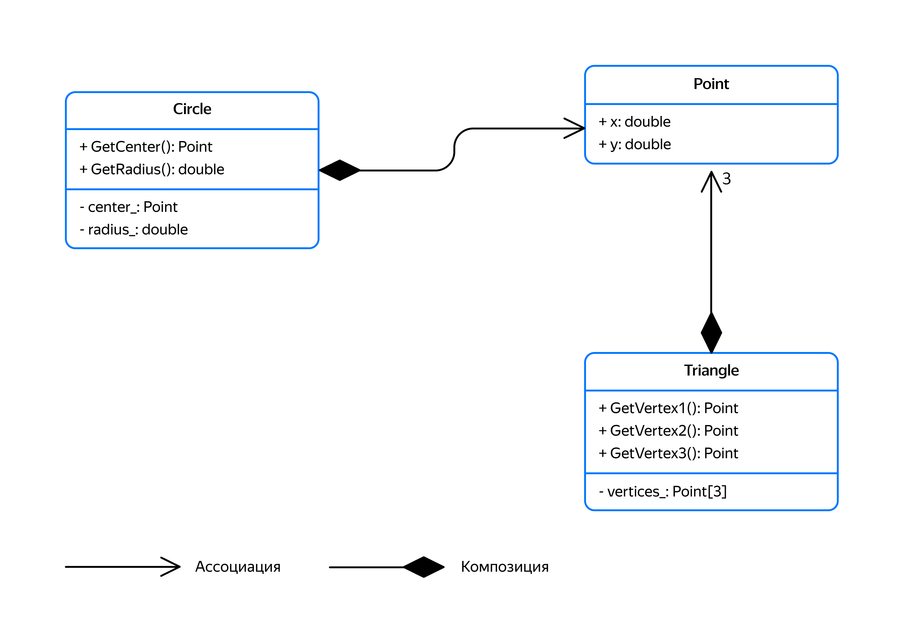

Ограничений на количество включений простого объекта в состав более сложного нет. В приведённом примере Circle содержит один экземпляр Point, а Triangle — три. Чтобы подчеркнуть множественный характер связи, на конце стрелочки может указываться количество экземпляров.

Составной класс, как правило, прячет свои члены-данные от доступа извне и управляет ими. Это позволяет сохранить состояние объекта согласованным. На следующей диаграмме представлен класс AlarmClock, который состоит из часов (Clock), звукового устройства (Beeper) и времени включения звукового сигнала. Пользователи Будильника не имеют доступа к содержащимся в нём полям `clock_` и `beeper_`. Благодаря этому сигнал пробуждения прозвучит в тот момент, когда текущее время, предоставляемое часами, станет равно значению поля `alarm_time_`.

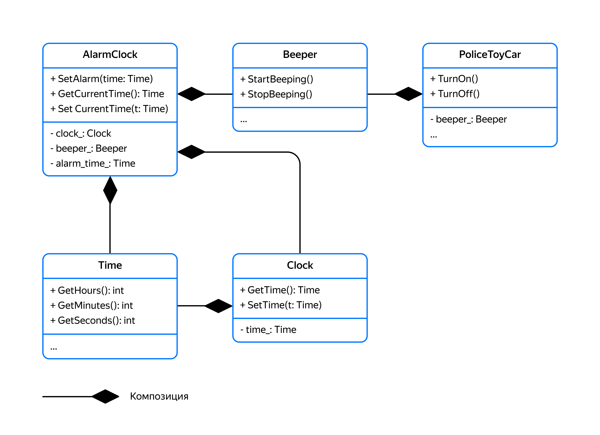

То, что класс Beeper не знает об объектах, в которых он содержится, даёт возможность использовать Beeper не только в будильнике, но и, например, в игрушечной полицейской машине. Только в этом случае звуковой сигнал будет включён не по достижении определённого времени, а сразу при включении игрушки.

При разрушении составного объекта удаляются и входящие в его состав объекты. Например, при удалении папки должны быть удалены все содержащиеся в ней файлы.

### Агрегация (Aggregation)

Агрегация — тоже пример отношений часть-целое, и реализуется она, подобно композиции, с использованием структур или классов. Различия между композицией и агрегацией в основном семантические.

Особенности агрегации:

- Часть является частью Целого.
- Часть в один и тот же момент времени может принадлежать более чем одному Целому.
- Целое не управляет своими частями. При удалении Целого Часть продолжает существовать.
- Часть не знает о существовании Целого.
- Транзитивность — связи между агрегируемыми объектами не имеют циклов, то есть ни один из объектов не является прямой или косвенной частью самого себя.

При композиции мы добавляем части к целому, используя обычные переменные-члены. А когда класс использует динамическое выделение памяти, применяем указатели. При этом часть не может существовать без целого. В качестве примера композиции классов, использующих динамическое выделение памяти, можно привести классы Осьминог и Односвязный список. При разрушении Осьминога происходит удаление его Щупалец, а при разрушении односвязного списка удаляются его узлы.

При агрегации мы также используем переменные-члены класса, только в этом случае они будут ссылками или указателями на объекты, созданные и существующие за пределами класса. Адреса объектов передаются классу-агрегату снаружи через параметры конструктора либо через параметры методов. При этом Часть может существовать отдельно от Целого.

Примером агрегации можно назвать отношение итератора и узла односвязного списка. Итератор хранит указатель на узел односвязного списка, которым владеет другой объект, а именно односвязный список. Разрушение итератора не влияет на узел. Узел ничего не знает о существовании итератора. Агрегацией в односвязном списке также будет связь текущего узла списка со следующим за ним:
```cpp
template <typename T>
class SingleLinkedList {
    struct Node {
        ...
        T value{};
        Node* node_ = nullptr;
    };
public:
    class Iterator {
        ...
    private:
        // Итератор хранит адрес узла списка, но не владеет им
        Node* node_;
    };
}; 
```
Объект-агрегат обычно скрывает свои части от доступа извне. Например, итератор не имеет публичных методов для доступа к узлам списка, хотя в своём операторе разыменования возвращает ссылку на значение узла списка. Так внешний код не может получить доступ к служебным полям узла списка в обход итератора. 

Так как Агрегат не единственный владелец своих частей, он должен быть готов к тому, что к его частям могут иметь доступ и другие объекты.

На схемах агрегация обозначается как композиция с той лишь разницей, что ромбик, расположенный на стороне объекта-агрегата, не закрашивается:

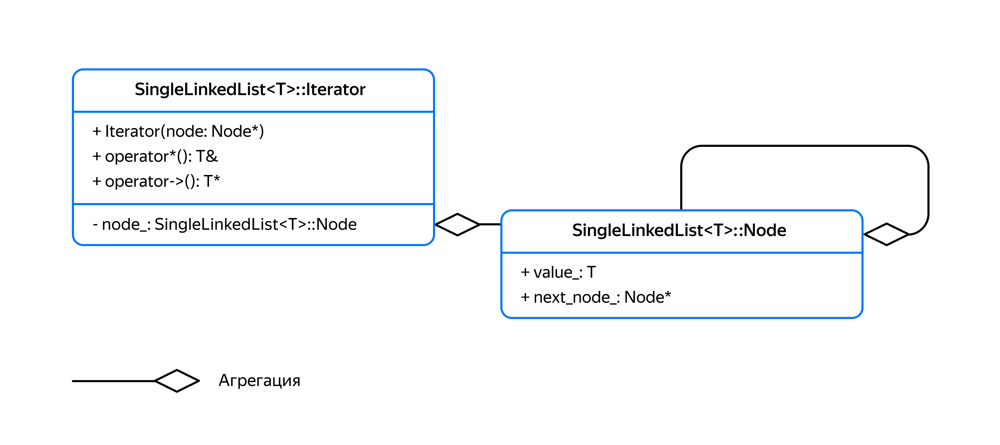

Ещё один пример агрегации — отношение между Автобусом и Человеком. Автобус перевозит людей, но они не его составная часть. После разрушения автобуса с человеком ничего не происходит.

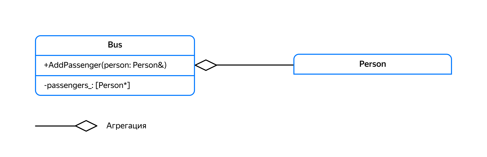

Агрегация позволяет одному объекту делегировать часть работы другому, переданному извне, объекту. Например, чтобы добавить в вашу поисковую систему логирование поисковых запросов, не нужно в ней реализовывать код логирования, ведь основная задача поисковой системы — поиск. Вместо этого логирование лучше поручить отдельному классу `Logger`. Ссылку на `Logger` нужно передать в конструктор класса `SearchServer`, чтобы он сохранил её в одном из своих полей.

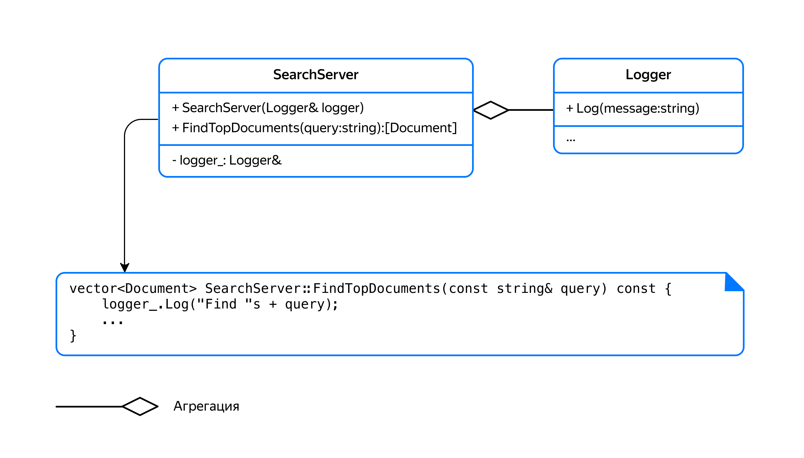

Теперь при поиске документов поисковая система может использовать Logger для ведения логов поисковых запросов. Товарищ майор одобряет.

### Зависимость (Dependency)

При композиции и агрегации Целое оказывается связанным с Частью в течение длительного времени — поля Целого хранят Часть по значению, ссылке или указателю.

В жизни потребность в каком-либо объекте нам часто нужна лишь для выполнения некоторой задачи: мы вызываем такси, чтобы доехать до нужного места, берём нож, чтобы сделать бутерброд, прибегаем к услугам парикмахера, чтобы подстричься. После выполнения задачи потребность в объекте исчезает до следующего раза. И правда, незачем держать при себе парикмахера до конца своей жизни.

Такого рода отношение называется зависимостью, или отношением «Клиент-Поставщик». У Клиента возникает зависимость от Поставщика при решении некоторой задачи. Зависимость возникает в любом из следующих случаев:

- Поставщик создаётся внутри метода Клиента.

- Поставщик передаётся в метод Клиента по значению, ссылке или указателю.

- Метод клиента возвращает Поставщика.

Во всех упомянутых ситуациях зависимость от Поставщика существует лишь на протяжении вызова метода Клиента — в локальных переменных, параметрах функций и временных объектах.

Также Поставщик ничего не знает про Клиента:
```cpp
// Поставщик. Предоставляет функционал, нужный Клиенту
class Supplier { 
public:
    void DoSomething();
    ...
};

// Клиент. Использует функционал, предоставляемый ему Поставщиком
class Client {
public:
    // Зависимость передаётся через параметр метода
    void DependentMethod1(Supplier& supplier) {
        supplier.DoSomething();
    }

    // Клиент создаёт экземпляр Поставщика и использует его
    void DependentMethod2() {
        Supplier supplier;
        supplier.DoSomething();
    }

    // Клиент возвращает Поставщика
    Supplier DependentMethod3() {
        return Supplier{};
    }

    // Этот метод не зависит от Поставщика
    void IndependentMethod() {
        cout << "Hello"s << endl;
    }
}; 
```
Примером зависимости может служить отношение односвязного списка и его итератора — односвязный список не хранит внутри себя итератор, однако возвращает его и принимает в качестве параметра методов, таких как `Insert` или `Erase`.

Ещё один пример — загрузка и сохранение объектов в потоки ввода и вывода: 
```cpp
class Document {
public:
    // output используется только для записи документа
    void SaveToStream(ostream& output) const {
        output << title_ << endl;
        output << text_ << endl;
    }
    // input используется только для чтения документа
    void LoadFromStream(istream& input) {
        getline(input, title_);
        text_.clear();
        string line;
        while (getline(input, line)) {
            if (!text_.empty()) {
                text_ += '\n'; // Добавляем символ перевода строки перед каждой строкой, кроме первой
            }
            text_ += line;
        }
    }
private:
    string title_;
    string text_;
}; 
```
Класс `Document` зависит от классов `ostream` и `istream` только во время вызова методов `SaveToStream` и `LoadFromStream`. Это значит, что на протяжении жизни Документа его можно сохранять в разные потоки вывода или загружать из разных потоков ввода. Точь-в-точь как для печати одного и того же документа вы используете разные листы бумаги. Обратной зависимости `ostream` и `istream` от документа нет.

На схемах зависимость изображается пунктирной стрелкой, идущей от Клиента к Поставщику. Чтобы конкретизировать, какой вид зависимости используется, на стрелке дополнительно может указываться одно из следующих слов:

`create`. Метод Клиента создаёт экземпляр Поставщика и использует его, не передавая наружу.

`return`. Клиент возвращает экземпляр Поставщика. При этом клиент может создавать Поставщика самостоятельно или делегировать создание другому объекту.

`use`. Клиент использует зависимость, переданную ему через параметр метода. Для этого он вызывает методы переданных ему параметров или передаёт их дальше в качестве параметров.

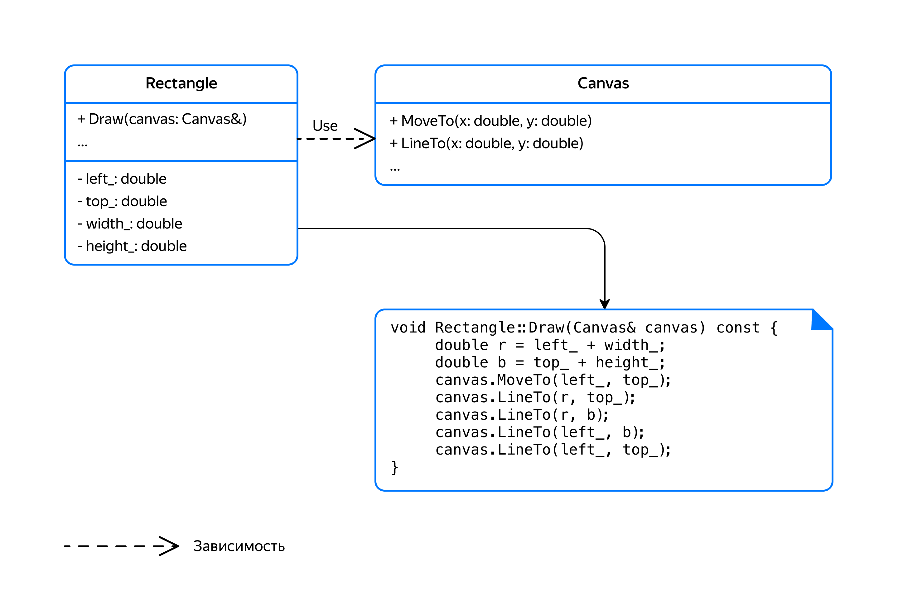

Класс Прямоугольник использует переданный ему Холст (Canvas), чтобы нарисовать на нём своё изображение, вызывая методы MoveTo и LineTo. Так можно многократно с разными параметрами вызывать метод Draw у одного и того же прямоугольника, получая изображение прямоугольника на разных холстах.

Поисковая система возвращает экземпляры Document. Такой тип зависимости обозначается словом “return”:

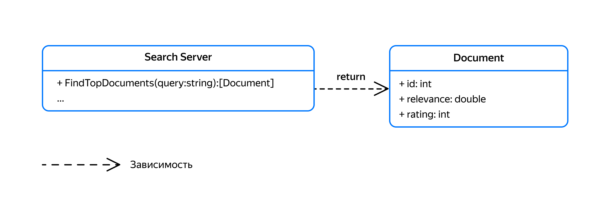

Зависимость — наиболее слабая связь между классами среди рассмотренных отношений. Эта слабость даёт наибольшую гибкость — каждый вызов метода Клиента может иметь дело с новым Поставщиком. За эту гибкость приходится платить — зависимость транзитивна. Она распространяется на всех пользователей Клиента — они должны уметь создать Поставщика перед тем как передать его Клиенту в качестве параметра и знать, что делать с Поставщиком, которого им вернул Клиент. При композиции и агрегации зависимость не распространяется, так как Целое скрывает свои Части в приватной области.

На схеме показан класс Приложение, включающий в себя Поисковую Систему. Приложение неявно зависит от класса Document, так как используемый Приложением метод `SearchServer::FindTopDocuments` возвращает вектор документов.

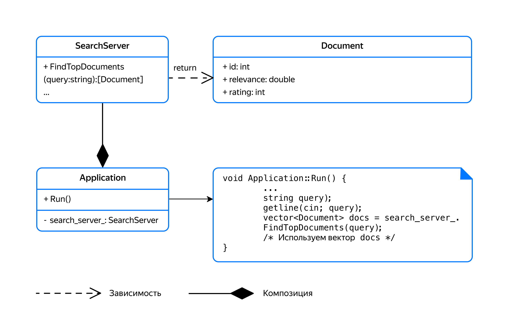

Для приложения эта транзитивная зависимость от документа означает следующее:

- Приложение должно уметь работать с документами, которые оно получает от поисковой системы.

- Изменения в классе Document окажут влияние не только на SearchServer, но и на Application. Зависимые классы может потребоваться доработать и заново протестировать.

### Подводим итоги

При композиции Целое единолично владеет содержащейся в нём Частью. Композиция обозначается стрелкой с закрашенным ромбиком.

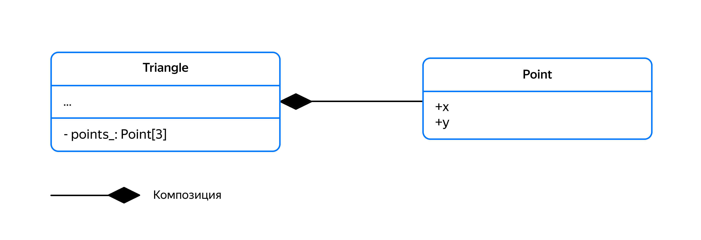

Треугольник содержит точки и единолично ими владеет

При агрегации Целое пользуется Частью, но не владеет ею. Агрегация обозначается стрелкой с незакрашенным ромбиком.

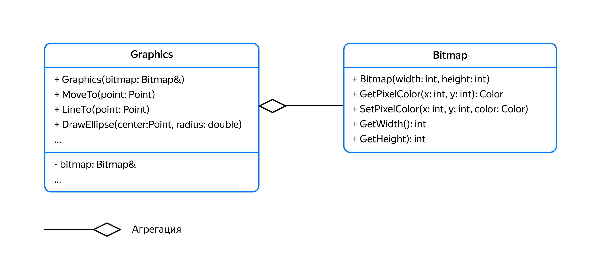

Graphics хранит ссылку на растровое изображение, на котором рисует графические примитивы

Зависимость задаёт отношение вида «Клиент-Поставщик». Клиент использует переданного ему Поставщика, не сохраняя ссылку на него в своих полях. Зависимость обозначается пунктирной стрелкой.

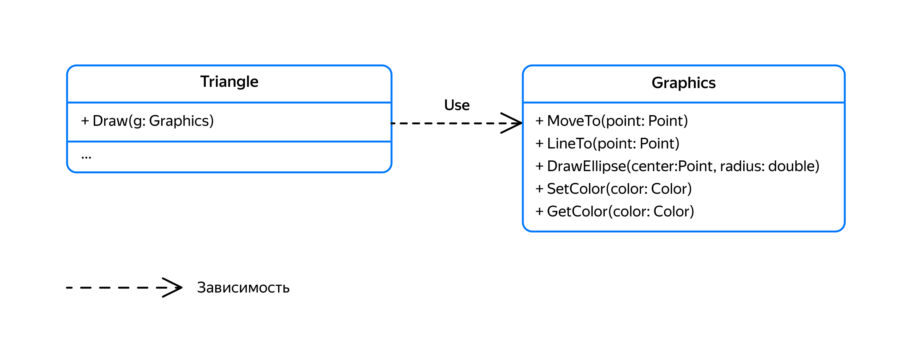

Треугольник использует `Graphics` в методе `Draw`, чтобы нарисовать на нём своё изображение
Для примера выражающего отношения между классами `House` (дом), `Wall` (стена), `Base` (фундамент), `Roof` (крыша) и `Window` (окно), представленна диаграмма:

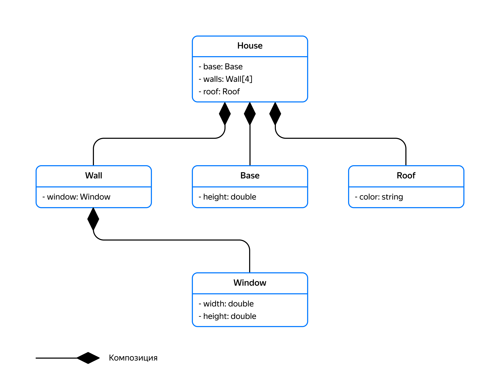

Между домом и его частями используется отношение композиции. В представленной диаграмме показано отношение агрегации. Вдобавок перепутаны направления стрелок.