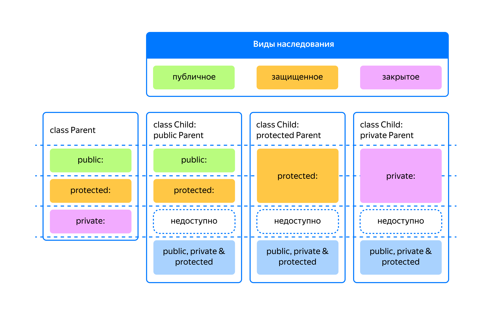

## Другие виды наследования

Публичное наследование — основной вид наследования в C++. Оно выражает отношение «является» между классами. Его ещё называют наследованием интерфейса, так как публичные методы и данные родителя остаются публичными в классе-наследнике:

```cpp
class Parent {...};
// Класс Child публично унаследован от класса Parent
class Child : public Parent {...};

// Структуры по умолчанию используют публичное наследование
struct ChildStruct : Parent {...}; 
```
Однако C++ поддерживает и другие, реже используемые виды наследования.

### Приватное наследование

Приватное наследование — второй по распространённости вид наследования в C++. При приватном наследовании публичные и защищённые методы и данные родителя становятся приватными в классе-наследнике. Они доступны только классу-наследнику, но не коду вне его.

Поэтому приватное наследование называется наследованием реализации — класс-наследник унаследовал детали реализации своего родителя, но не его интерфейс. Наследник предоставляет свой набор публичных методов, с которым должны работать клиенты.

Чтобы обозначить приватное наследование в объявлении класса, перед именем родительского класса пишут ключевое слово `private`. По умолчанию классы в C++ наследуются приватно, а структуры — публично:
```cpp
class Parent {
public:
    void ParentMethod();
    ...
};
// Класс Child приватно унаследован от Parent
class Child : private Parent {
public:
    void ChildMethod() {
        ParentMethod(); // Классу Child доступны публичные и защищённые методы родителя
    }
};
// Тоже приватное наследование: классы по умолчанию наследуются приватно
class Child1 : Parent {...};

int main() {
    Child child;
    
    // Не скомпилируется: в классе Child метод ParentMethod стал приватным
    // child.ParentMethod();

    // Класс Child предоставляет свой набор публичных методов
    child.ChildMethod();
} 
```
Приватное наследование выражает другой тип отношений между классами — «реализован посредством». Класс-наследник реализован посредством родительского класса.

С точки зрения кода вне класса приватное наследование неотличимо от композиции. По сравнению с композицией наследование создаёт более тесную связь между классами. В результате будет больше причин для изменений производного класса при изменении класса-родителя. Поэтому используйте композицию везде, где возможно, а приватное наследование — там, где это необходимо.

Вот несколько ситуаций, когда приватное наследование имеет преимущества перед композицией:

- При приватном наследовании класс-наследник может переопределить виртуальные методы своего родителя. При композиции для этого нужно создать вспомогательный класс, переопределяющий виртуальные методы, и использовать его как часть производного класса:

```cpp
class Base {
public:
    // Реализует паттерн «Шаблонный метод»
    void Algorithm() {
        Step1();
        Step2();
    }
private:
    virtual void Step1(); // Этот шаг может быть переопределён подклассами
    void Step2();
};
// --- Приватное наследование ---
class Child : Base {
public:
    void DoSomething() {
        Algorithm();
    }
private:
    void Step1() override {...} // Переопределяем шаг алгоритма
};
// --- Композиция ---
class Composite {
public:
    void DoSomething() {
        child_.Algorithm();
    }

private:
    class Child : public Base {
    private:
        void Step1() override {...}
    };

    Child child_; // Используем Child посредством композиции
}; 
```
- В приватном наследовании классу-наследнику доступны не только публичные методы родителя, но и защищённые. При композиции защищённые методы используемого класса недоступны.

При наследовании, включая приватное, класс-наследник может «вынести» публичные или защищённые данные и методы класса в свою публичную область видимости. Так, приватное наследование от `std::variant` позволяет упростить реализацию класса `json::Node`.

Решение, использующее композицию:
```cpp
namespace json {
...
class Node final {
public:
    using Value = std::variant<std::nullptr_t, Array, Dict, bool, int, double, std::string>;
    Node() = default;
    Node(std::nullptr_t);
    Node(int val);
    Node(double val);
    Node(std::string val);
    Node(Array val);
    Node(Dict val);
    Node(bool val);

    bool IsInt() const {
        return std::holds_alternative<int>(value_);
    }
    int AsInt() const {
        using namespace std::literals;
        if (!IsInt()) {
            throw std::logic_error("Not an int"s);
        }
        return std::get<int>(value_);
    }
    ...
private:
    Value value_;
};
...
} // namespace json 
```
Унаследовав `json::Node` приватно от `std::variant`, мы сделаем недоступным неявное преобразование типа Node к типу `variant`. А с использованием `using` сделаем доступными конструкторы класса `variant`, включая универсальный конструктор из содержащихся в JSON значений:
```cpp
namespace json {
...
class Node final
    : private std::variant<std::nullptr_t, Array, Dict, bool, int, double, std::string> 
{
public:
    // Делаем доступными все конструкторы родительского класса variant
    using variant::variant;

    bool IsInt() const {
        return std::holds_alternative<int>(*this);
    }
    int AsInt() const {
        using namespace std::literals;
        if (!IsInt()) {
            throw std::logic_error("Not an int"s);
        }
        return std::get<int>(*this);
    }
    ...
};
...
} // namespace json 
```
При приватном наследовании становится недоступным преобразование класса-наследника к классу-родителю. Неявное или явное преобразование вызовет ошибку компиляции. Приватное наследование — это не наследование интерфейса!
```cpp
class Parent {...};
class Child : Parent {...};

void PlayWithParent(Parent& parent);

int main() {
    Child c;
    PlayWithParent(c); // Ошибка компиляции
    Parent* p = dynamic_cast<Parent*>(&c); // Ошибка компиляции
} 
```
Это ограничение касается кода за пределами класса-наследника. Так как классу-наследнику доступен интерфейс родителя, внутри методов класса разрешено преобразование типа вверх по иерархии классов.

Для иллюстрации такой полезной возможности рассмотрим класс `Timer`, который о каждом тике уведомляет своего наблюдателя, реализующего интерфейс `TimerObserver`:
```cpp
class TimerObserver {
public:
    // Вызывается при очередном тике таймера
    virtual void OnTick(int counter) = 0;

protected:
    // Timer не владеет своими наблюдателями,
    // поэтому TimerObserver не предназначен для полиморфного удаления
    ~TimerObserver() = default;
};

class Timer {
public:
    Timer() = default;

    // Запрещаем копирование и присваивание Timer, чтобы не думать о том, 
    // должна ли копия таймера уведомлять наблюдателей таймера-оригинала
    Timer& operator=(const Timer&) = delete;
    Timer(const Timer&) = delete;

    void SetObserver(TimerObserver* observer) {
        observer_ = observer;
    }

    void Tick() {
        ++tick_counter_;
        if (observer_) {
            observer_->OnTick(tick_counter_);
        }
    }

private:
    TimerObserver* observer_ = nullptr;
    int tick_counter_ = 0;
};
```
Класс `TimerDisplay` приватно реализует интерфейс `TimerObserver`. В своём конструкторе `TimerDisplay` регистрирует себя в роли наблюдателя переданного ему таймера, а в деструкторе отписывается от получения уведомлений. Если бы использовалось публичное наследование, внешний код мог бы вызвать метод `OnTick` напрямую у `TimerDisplay` или подписать его на получение событий у другого таймера:
```cpp
// Благодаря приватному наследованию от TimerDisplay, преобразование TimerDisplay к TimerObserver
// будет недоступно вне класса TimerDisplay.
class TimerDisplay : TimerObserver {
public:
    TimerDisplay(Timer& timer, string name)
        : timer_(timer)
        , name_(move(name))  //
    {
        // Внутри методов класса доступно преобразование к TimerObserver,
        // поэтому TimerDisplay* будет преобразована к типу TimerObserver*
        timer_.SetObserver(this);
    }

    // Запрещаем копирование и присваивание, чтобы не задумываться о том,
    // должна ли копия TimerDisplay в своём деструкторе сбрасывать наблюдателя у timer_
    TimerDisplay(const TimerDisplay&) = delete;
    TimerDisplay& operator=(const TimerDisplay&) = delete;

    ~TimerDisplay() {
        // Надо отписаться от своего таймера, чтобы после уничтожения этого объекта таймер не пытался его уведомить
        timer_.SetObserver(nullptr);
    }

private:
    void OnTick(int counter) override {
        cout << name_ << " tick #"sv << counter << endl;
    }
    Timer& timer_;
    string name_;
}; 
```
Создадим пару таймеров. Дисплей, подключённый к таймеру, будет отображать текущее количество тиков при каждом вызове метода `Tick`.
```cpp
int main() {
    Timer timer1;
    Timer timer2;

    TimerDisplay display1{timer1, "Timer 1"s};
    timer1.Tick();
    timer2.Tick();
    {
        cout << "---"sv << endl;
        TimerDisplay display2{timer2, "Timer 2"s};
        timer1.Tick();
        timer2.Tick();
        cout << "---"sv << endl;
        // При выходе из блока объект display2 отпишется от получения уведомлений от timer2
    }

    timer1.Tick();
    timer2.Tick();
}
```
Счётчик тиков второго таймера будет отображаться только внутри вложенного блока функции `main`:
```
Timer 1 tick #1
---
Timer 1 tick #2
Timer 2 tick #2
---
Timer 1 tick #3 
```

### Защищённое наследование

При защищённом наследовании публичные и защищённые данные и методы родителя становятся защищёнными в классе-наследнике. Поэтому наследники производного класса также смогут ими пользоваться:

```cpp
class Parent {
public:
    void ParentMethod();
    virtual void ParentMethod2();
};

class Child : protected Parent {
public:
    void ChildMethod() {
        ParentMethod();
    }
};

// Внук
class GrandChild : public Child {
public:
    void GrandChildMethod() {
        ParentMethod(); // Внукам также доступны методы Parent
    }
};
```
Необходимость в этом экзотическом виде наследования на практике встречается крайне редко.

### Итоги

На иллюстрации показано сравнение областей видимости при использовании различных вариантов наследования:



Используйте публичное наследование, чтобы выразить между классами отношение «является».

Используйте приватное наследование, чтобы выразить отношение «реализован с помощью» и использовать в одном классе функциональность родительского класса, не раскрывая внешнему коду его интерфейс. По возможности отдавайте предпочтение композиции и используйте приватное наследование, когда композиция не позволяет эффективно реализовать задуманное.

Защищённое наследование — экзотическая форма наследования и применяется крайне редко.

Какой тип наследования следует использовать, чтобы реализовать класс `Apple` на основе класса `Fruit`? — Публичное

Какой тип наследования следует использовать, чтобы реализовать класс `Stack` (стек) на основе класса `Vector`? — Приватное наследование или композицию