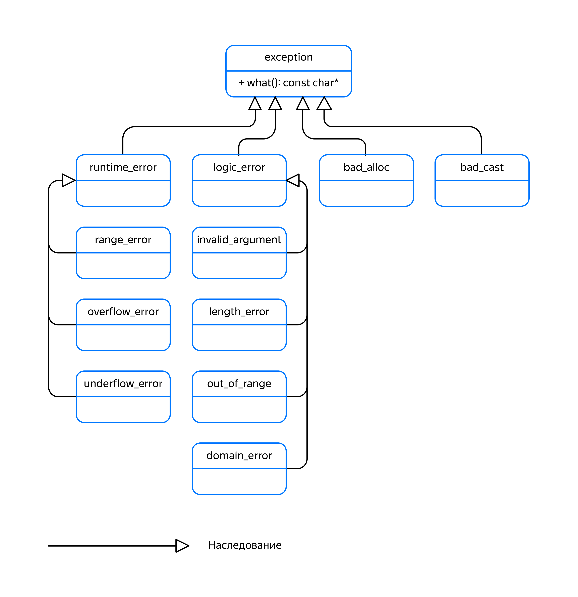

### Наследование и исключения

В C++ можно использовать классы и структуры в качестве объектов исключений. У этого есть ряд преимуществ.

Во-первых, классы исключений могут нести дополнительную информацию о возникшей проблеме. Например:

- имя файла, при чтении которого возникла проблема;

- введённые пользователем данные, не прошедшие проверку;

- имя файла и номер строки исходного кода, в котором произошло выбрасывание исключения.

Во-вторых, обработчик `catch`, отлавливающий исключения родительского класса, может поймать исключения любых его публичных наследников. То есть приведение типа вверх по иерархии классов работает и при поиске подходящего обработчика исключений.

На диаграмме показана иерархия классов стандартных исключений C++. Некоторые стандартные классы исключений на ней для экономии места не показаны.



Все стандартные классы исключений прямо или косвенно наследуются от класса `std::exception`. Когда нужно однотипно обрабатывать все стандартные исключения, можно написать единственный обработчик `catch`, отлавливающий `std::exception`:

```cpp
#include <iostream>
#include <stdexcept>

using namespace std;

int main() {
    try {
        throw std::invalid_argument("Invalid argument"s);
    } catch (const std::exception& e) {
        std::cout << e.what() << std::endl;
    }
}
```

Когда требуется особая реакция на определённый тип исключений, следует разместить его обработчик `catch` до обработчика более общего типа.

Это иллюстрирует программа, которая определяет, чётное ли очередное введённое пользователем число. Ввод заканчивается, когда пользователь введёт `exit` или нажмёт комбинацию клавиш Ctrl+Z (на Windows) либо Ctrl+D (на Linux или MacOS) для ввода символа конца файла:
```cpp
#include <iostream>
#include <stdexcept>
#include <string>
#include <string_view>

using namespace std;

int main() {
    while (true) {
        cout << "Enter a number, or type 'exit' to quit"sv << endl;
        string str;
        if (!getline(cin, str) || (str == "exit"sv)) {
            break;
        }

        try {
            size_t idx;
            // stoi может выбросить out_of_range либо invalid_argument
            int number = std::stoi(str, &idx);
            if (idx != str.length()) {
                throw invalid_argument("invalid argument"s);
            }

            cout << number;
            if (number % 2 == 0) {
                cout << " is even"sv << endl;
            } else {
                cout << " is odd"sv << endl;
            }
        } catch (const out_of_range&) {
            cout << "An overflow occurred when converting '"sv << str << "' to number"sv << endl;
        } catch (const invalid_argument&) {
            cout << '\'' << str << "' is not a valid number"sv << endl;
        } catch (const exception& e) {
            // Сюда можем попасть, например, при нехватке памяти
            cout << "Unexpected exception: "sv << e.what() << endl;
        } catch (...) {
            // В этот обработчик попасть не должны никогда, так как в программе
            // не выбрасываются исключения, не унаследованные от std::exception.
            // Тем не менее это на практике возможно, особенно когда используется
            // код сторонних библиотек.
            cout << "Unknown error"sv << endl;
        }
    }
} 
```
Функция `stoi` преобразует строки в числа. Она может выбросить исключения двух типов:
- `out_of_range`, если в строке записано число, не помещающееся в диапазон `int`;
- `invalid_argument`, если в начале строки не записано число.

Чтобы программа сообщала об этих ошибках по-разному, их обработчики должны быть размещены до обработчика исключений exception, способного поймать любые стандартные исключения:
```
Enter a number, or type 'exit' to quit
10
10 is even
Enter a number, or type 'exit' to quit
13
13 is odd
Enter a number, or type 'exit' to quit
1235s
'1235s' is not a valid number
Enter a number, or type 'exit' to quit
hello
'hello' is not a valid number
Enter a number, or type 'exit' to quit
99999999999999999999999999999
An overflow occurred when converting '99999999999999999999999999999' to number
Enter a number, or type 'exit' to quit
exit 
```
При создании собственных классов исключений рекомендуется наследоваться от `std::exception` или одного из его подклассов. Это позволит перехватывать пользовательские типы исключений вместе со стандартными.
Пример:

```cpp
class UserValidationError : public invalid_argument {
public:
    UserValidationError(bool invalid_login, bool invalid_password)
        : invalid_argument(MakeErrorMessage(invalid_login, invalid_password))
        , invalid_login_(invalid_login)
        , invalid_password_(invalid_password) {
    }

    bool IsUserNameValid() const {
        return !invalid_login_;
    }

    bool IsPasswordValid() const {
        return !invalid_password_;
    }

private:
    static std::string MakeErrorMessage(bool invalid_login, bool invalid_password) {
        if (invalid_login && invalid_password) {
            return "Invalid login and password"s;
        } else if (invalid_login) {
            return "Invalid login"s;
        } else if (invalid_password) {
            return "Invalid password"s;
        } else {
            return "Unknown user registration error"s;
        }
    }

    bool invalid_login_ = false;
    bool invalid_password_ = false;
};

struct User {
    string login;
    string password;
};

void ValidateUser(const User& user) {
    const bool login_is_valid = !user.login.empty();
    const bool password_is_valid = user.password.length() > 10;
    if (!login_is_valid || !password_is_valid) {
        throw UserValidationError(!login_is_valid, !password_is_valid);
    }
}

int main() {
    try {
        ValidateUser({"CoolHacker"s, "qwerty"s});
    } catch (const std::exception& e) {
        cout << e.what() << endl;
    } catch (...) {
        cout << "Unknown exception"sv << endl;
    }
} 
```

```
Invalid password 
```

При наследовании классов исключений важно использовать публичное наследование. Другие типы наследования сделают невозможным перехват исключений дочернего класса в обработчике базового.

Так, если забыть указать публичное наследование при объявлении `UserValidationError`, преобразование от `UserValidationError` к `std::exception` станет недоступным:

```
class `UserValidationError` : invalid_argument { ... };
```

Тогда обработчик `catch (const std::exception& e)` не будет считаться подходящим обработчиком для исключения `UserValidationError`. Это исключение будет поймано в обработчике `catch (...)`, который выведет менее информативное сообщение:

```
Unknown exception 
```

Классы исключений следует ловить по ссылке — возможно, константной, — а не по значению. Это позволит избежать срезки, когда исключение дочернего класса попадает в обработчик исключения родительского класса. Обработчик, принимающий исключение родительского класса по значению, будет иметь дело не с оригинальным объектом исключения, а с копией части объекта, который относится к родительскому классу.

Рассмотрим срезку на иерархии животных:
```cpp
class Animal {
public:
    virtual ~Animal() = default;
    virtual string GetType() const {
        return "unknown"s;
    }
};

class Mouse : public Animal {
public:
    string GetType() const override {
        return "mouse"s;
    }
};

class Frog : public Animal {
public:
    string GetType() const override {
        return "frog"s;
    }
};

int main() {
    try {
        throw Mouse();
    } catch (Animal animal) {
        cout << "Caught an animal of type: "sv << animal.GetType() << endl;
    }
}
```
Обработчик catch ловит исключения типа `Animal` по значению. Перед передачей мыши в обработчик исключения она будет частично скопирована в новый объект, имеющий тип `Animal`. В результате обработчик исключения поймает не мышонка, не лягушку, а неведому зверушку:
```
Caught an animal of type: unknown 
```
Компилятор может предупредить о том, что полиморфный класс `Animal` отлавливается по значению:
```
prog.cc: In function 'int main()':
prog.cc:25:21: warning: catching polymorphic type 'class Animal' by value [-Wcatch-value=]
   25 |     } catch (Animal animal) {
      |                     ^~~~~~  
```
После исправления обработчика исключения на ловлю по ссылке, проблема будет решена:
```cpp
int main() {
    try {
        throw Mouse();
    } catch (const Animal& animal) {
        cout << "Caught an animal of type: "sv << animal.GetType() << endl;
    }
}
```
Будет пойман мышонок:
```
Caught an animal of type: mouse 
```
Подведём итоги.

Используйте наследование, чтобы построить иерархии классов исключений. Это позволит одинаково обрабатывать исключения одной и той же категории.

Делайте собственные классы исключений прямыми или косвенными наследниками std::exception. Это позволит обрабатывать пользовательские типы ошибок наравне со стандартными.

Сначала размещайте обработчики конкретных типов исключений, а потом — более общих. Так вы сможете обработать нужные типы ошибок особо. С остальными ошибками справится универсальный обработчик.

Всегда используйте публичное наследование при объявлении классов исключений. Ловите исключения по ссылке, а не по значению, чтобы избежать срезки.

Что выведет эта программа?
```cpp
#include <iostream>
#include <stdexcept>
#include <string>
#include <string_view>

using namespace std;

int main() {
    try {
        cout << stoi("hello"s) << "!" << endl;
    } catch (const exception&) {
        cout << "exception"sv << endl;
    } catch (const out_of_range&) {
        cout << "out_of_range"sv << endl;
    } catch (const invalid_argument&) {
        cout << "invalid_argument"sv << endl;
    } catch (...) {
        cout << "unknown"sv << endl;
    }
} 
```

— `exception`. Функция `stoi` выбросит исключение `invalid_argument`. Обработчик `exception`, который способен поймать исключение данного типа, находится раньше обработчика `invalid_argument`, поэтому обработает ошибку обработчик `exception`. Следовало бы разместить его после обработчиков исключений дочерних классов.
