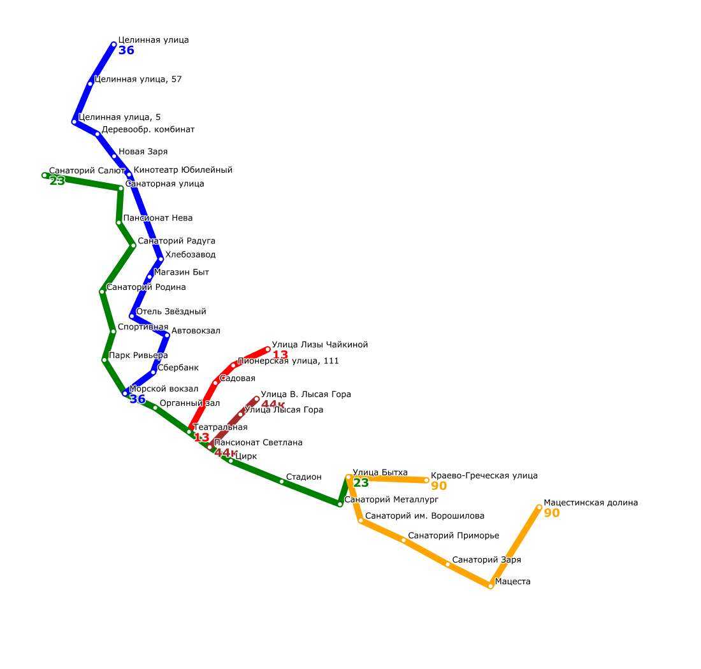
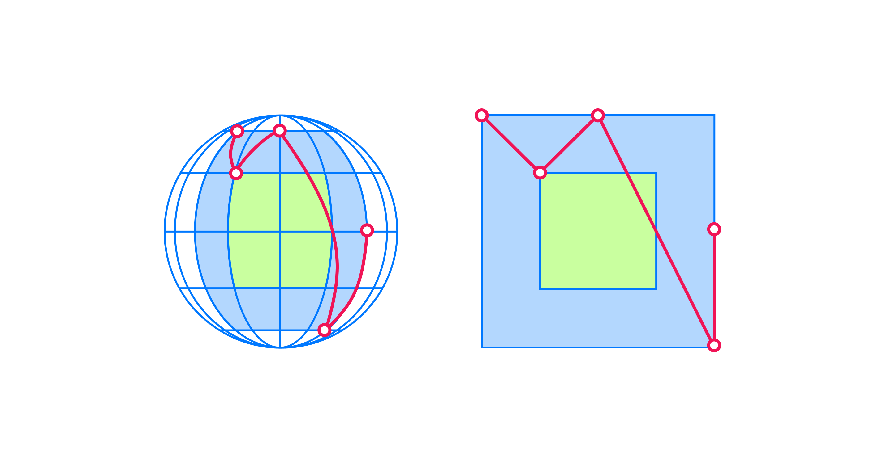
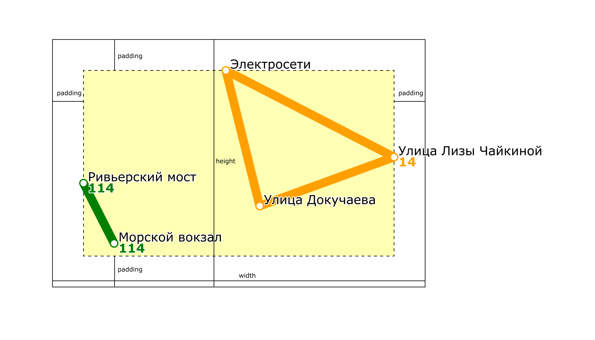
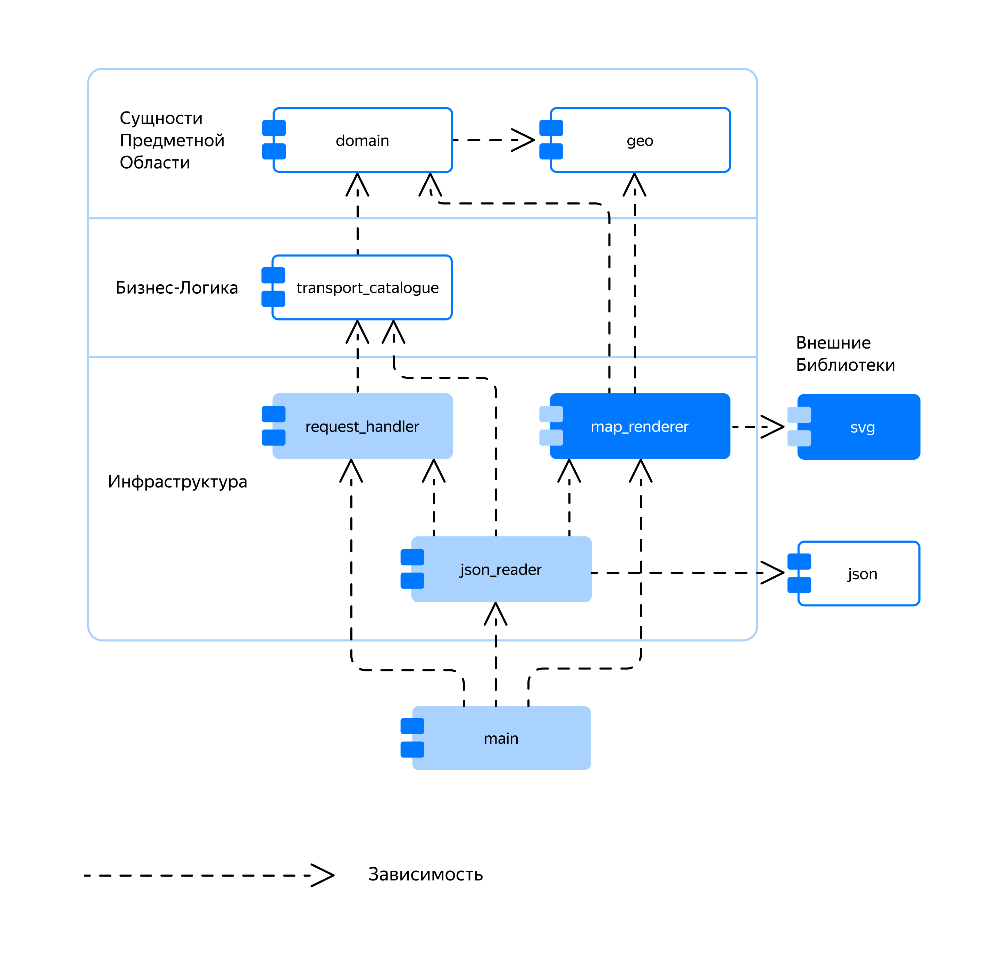

### Транспортный справочник — визуализация карты маршрутов
Вы проделали важную работу — реализовали обмен данными с транспортным справочником в виде JSON-объектов. Пора сделать нечто красивое. Примените свою SVG-библиотеку и научите программу рисовать карту автобусных маршрутов.

Результатом работы программы будет SVG-изображение карты, подобное этому:



Пример карты, которую сможет построить ваша программа

### Построение проекции маршрутов на карте

Планета Земля имеет форму геоида, но чтобы упростить вычисления, в программе она считается идеальной сферой радиусом 6371 километр. Эти допущения отражены в функции `geo::ComputeDistance`. Она вычисляет географическое расстояние между двумя точками земной поверхности:

```cpp
namespace geo {

double ComputeDistance(Coordinates from, Coordinates to) {
    using namespace std;
    if (from == to) {
        return 0;
    }
    static const double dr = M_PI / 180.;
    return acos(sin(from.lat * dr) * sin(to.lat * dr)
                + cos(from.lat * dr) * cos(to.lat * dr) * cos(abs(from.lng - to.lng) * dr))
        * 6371000;
}

}  // namespace geo 
```

Координаты на земной поверхности задаются широтой и долготой и измеряются в градусах. Экран монитора, на котором нужно нарисовать карту — плоский. Координаты на нём задаются в пикселях. Поэтому прежде чем нарисовать карту, надо преобразовать координаты остановок — ключевых точек карты — из градусов в пиксели. Такое преобразование координат называется «проецирование сферы на плоскость».

Чтобы спроецировать координаты остановок на карту, сначала нужно определить, в каком диапазоне географических координат располагаются остановки. Затем преобразовать географические координаты в плоские. При преобразовании сферических координат в плоские будут искажаться форма и размеры объектов.

Чем больше проецируемая область и чем ближе объект находится к полюсу, тем заметнее искажения. Например, Гренландия на карте мира кажется больше Индии, хотя имеет в полтора раза меньшую площадь. На карте города эти искажения будут незначительны, так как размеры городов во много раз меньше размеров Земли, да и вблизи северного и южного полюсов населённых пунктов нет.



Искажение формы и размера объектов при проецировании участка поверхности сферы на плоскую карту

На рисунке зелёным цветом выделен участок, внутри которого находятся ключевые точки маршрута. Оранжевая область расположена близко к экватору и искажена меньше зелёной.

Представленный ниже алгоритм проецирования использует долготу и широту остановок в качестве координат `x` и `y`. Он масштабирует их так, чтобы вписать в прямоугольник шириной $width−2∗padding$ и высотой $height−2∗padding$. 

- `width` и `height` задают ширину и высоту карты в пикселях;

- `padding` задаёт отступ краёв карты от границ SVG документа и также измеряется в пикселях.


Влияние параметров `width`, `height` и `padding` на внешний вид карты маршрутов

1. Сначала вычислите минимальные и максимальные широты и долготы: `min_lat`, `min_lon`, `max_lat` и `max_lon`. Остановка с минимальной долготой будет иметь минимальную координату `x`, равную `padding`. Самая северная остановка с максимальной широтой будет иметь минимальную координату y, тоже равную `padding`.
2. Затем вычислите максимально допустимый коэффициент масштабирования долгот в иксы. Он равен `width_zoom_coef = (width - 2 * padding) / (max_lon - min_lon)`. Максимально допустимый коэффициент масштабирования широт в игреки: `height_zoom_coef = (height - 2 * padding) / (max_lat - min_lat)`.
3. Единый для обеих осей итоговый коэффициент масштабирования `zoom_coef` выберите как минимальное значение `width_zoom_coef` и `height_zoom_coef`. Если все остановки имеют одинаковую широту или долготу, может возникнуть деление на 0. В этом случае в качестве `zoom_coef` выберите другой из двух коэффициентов. Если у всех остановок одинаковые координаты, считайте, что `zoom_coef` равен 0.

4. Формулы вычисления `x` и `y` по долготе `lon` и широте `lat`:
```
x = (lon - min_lon) * zoom_coef + padding;
y = (max_lat - lat) * zoom_coef + padding; 
```
В вычислении `y` противоположный знак множителя, потому что широта на карте увеличивается «снизу вверх», а ось `Y` в SVG-документе направлена сверху вниз.

При вычислении коэффициентов масштабирования должны учитываться только те остановки, которые входят в какой-либо маршрут.

Класс `SphereProjector` проецирует точки по описанному алгоритму:
```cpp
#include "geo.h"
#include "svg.h"

#include <algorithm>
#include <cstdlib>
#include <iostream>
#include <optional>
#include <vector>

inline const double EPSILON = 1e-6;
bool IsZero(double value) {
    return std::abs(value) < EPSILON;
}

class SphereProjector {
public:
    // points_begin и points_end задают начало и конец интервала элементов geo::Coordinates
    template <typename PointInputIt>
    SphereProjector(PointInputIt points_begin, PointInputIt points_end,
                    double max_width, double max_height, double padding)
        : padding_(padding) //
    {
        // Если точки поверхности сферы не заданы, вычислять нечего
        if (points_begin == points_end) {
            return;
        }

        // Находим точки с минимальной и максимальной долготой
        const auto [left_it, right_it] = std::minmax_element(
            points_begin, points_end,
            [](auto lhs, auto rhs) { return lhs.lng < rhs.lng; });
        min_lon_ = left_it->lng;
        const double max_lon = right_it->lng;

        // Находим точки с минимальной и максимальной широтой
        const auto [bottom_it, top_it] = std::minmax_element(
            points_begin, points_end,
            [](auto lhs, auto rhs) { return lhs.lat < rhs.lat; });
        const double min_lat = bottom_it->lat;
        max_lat_ = top_it->lat;

        // Вычисляем коэффициент масштабирования вдоль координаты x
        std::optional<double> width_zoom;
        if (!IsZero(max_lon - min_lon_)) {
            width_zoom = (max_width - 2 * padding) / (max_lon - min_lon_);
        }

        // Вычисляем коэффициент масштабирования вдоль координаты y
        std::optional<double> height_zoom;
        if (!IsZero(max_lat_ - min_lat)) {
            height_zoom = (max_height - 2 * padding) / (max_lat_ - min_lat);
        }

        if (width_zoom && height_zoom) {
            // Коэффициенты масштабирования по ширине и высоте ненулевые,
            // берём минимальный из них
            zoom_coeff_ = std::min(*width_zoom, *height_zoom);
        } else if (width_zoom) {
            // Коэффициент масштабирования по ширине ненулевой, используем его
            zoom_coeff_ = *width_zoom;
        } else if (height_zoom) {
            // Коэффициент масштабирования по высоте ненулевой, используем его
            zoom_coeff_ = *height_zoom;
        }
    }

    // Проецирует широту и долготу в координаты внутри SVG-изображения
    svg::Point operator()(geo::Coordinates coords) const {
        return {
            (coords.lng - min_lon_) * zoom_coeff_ + padding_,
            (max_lat_ - coords.lat) * zoom_coeff_ + padding_
        };
    }

private:
    double padding_;
    double min_lon_ = 0;
    double max_lat_ = 0;
    double zoom_coeff_ = 0;
};

int main() {
    using namespace std;

    const double WIDTH = 600.0;
    const double HEIGHT = 400.0;
    const double PADDING = 50.0;
    
    // Точки, подлежащие проецированию
    vector<geo::Coordinates> geo_coords = {
        {43.587795, 39.716901}, {43.581969, 39.719848}, {43.598701, 39.730623},
        {43.585586, 39.733879}, {43.590317, 39.746833}
    };

    // Создаём проектор сферических координат на карту
    const SphereProjector proj{
        geo_coords.begin(), geo_coords.end(), WIDTH, HEIGHT, PADDING
    };

    // Проецируем и выводим координаты
    for (const auto &geo_coord: geo_coords) {
        const svg::Point screen_coord = proj(geo_coord);
        cout << '(' << geo_coord.lat << ", "sv << geo_coord.lng << ") -> "sv;
        cout << '(' << screen_coord.x << ", "sv << screen_coord.y << ')' << endl;
    }
} 
```
После запуска программа выведет исходные и спроецированные координаты:
```
(43.5878, 39.7169) -> (50, 232.18)
(43.582, 39.7198) -> (99.2283, 329.5)
(43.5987, 39.7306) -> (279.22, 50)
(43.5856, 39.7339) -> (333.61, 269.08)
(43.5903, 39.7468) -> (550, 190.051)
```
Можно увидеть, что при размерах карты 600*400 пикселей географические координаты остановок, которые различались на доли градуса, после проецирования будут различаться на десятки или сотни пикселей.

### Обзор архитектуры

В вашей программе появятся два новых модуля: 

- `svg` — поместите в него вашу SVG-библиотеку,
- `map_renderer` — отвечает за визуализацию карты.

На схеме новые модули выделены голубым цветом.



Модуль `map_renderer` зависит от библиотечного модуля `svg`. Модули `json` и svg не имеют зависимостей от модулей приложения. Поэтому эти библиотеки легко использовать в разных приложениях.

Модули `json_reader` и `main` зависят от `map_renderer`.

- `json_reader` должен считать из словаря `render_settings` настройки визуализации, нужные модулю `map_renderer`. Настройки визуализации нужны только `map_renderer`. Поэтому структуру, которая их хранит, следует разместить в `map_renderer`. Тогда его не придётся изменять, если решите сменить формат хранения настроек с JSON на XML. Нет зависимости — нет причин для изменений.

- `main` зависит от `map_renderer`, так как создаёт визуализатор карты и с его помощью рисует карту.

`request_handler` получает данные о маршрутах у транспортного справочника и передаёт их модулю `map_renderer`. Это позволяет устранить зависимость `map_renderer` от transport_catalogue. Изменения в `transport_catalogue` не будут влиять на `map_renderer`, ведь он зависит только от модулей `domain` и `geo`.

Остальные модули приложения не имеют зависимостей ни от `svg`, ни от `map_renderer`. В них не надо будет вносить изменения, когда поменяется библиотека SVG или алгоритм визуализации карты.

Между модулями нет циклических зависимостей. Из-за циклов при изменении любого модуля часто приходится вносить трудоёмкие изменения во все зависимые модули.