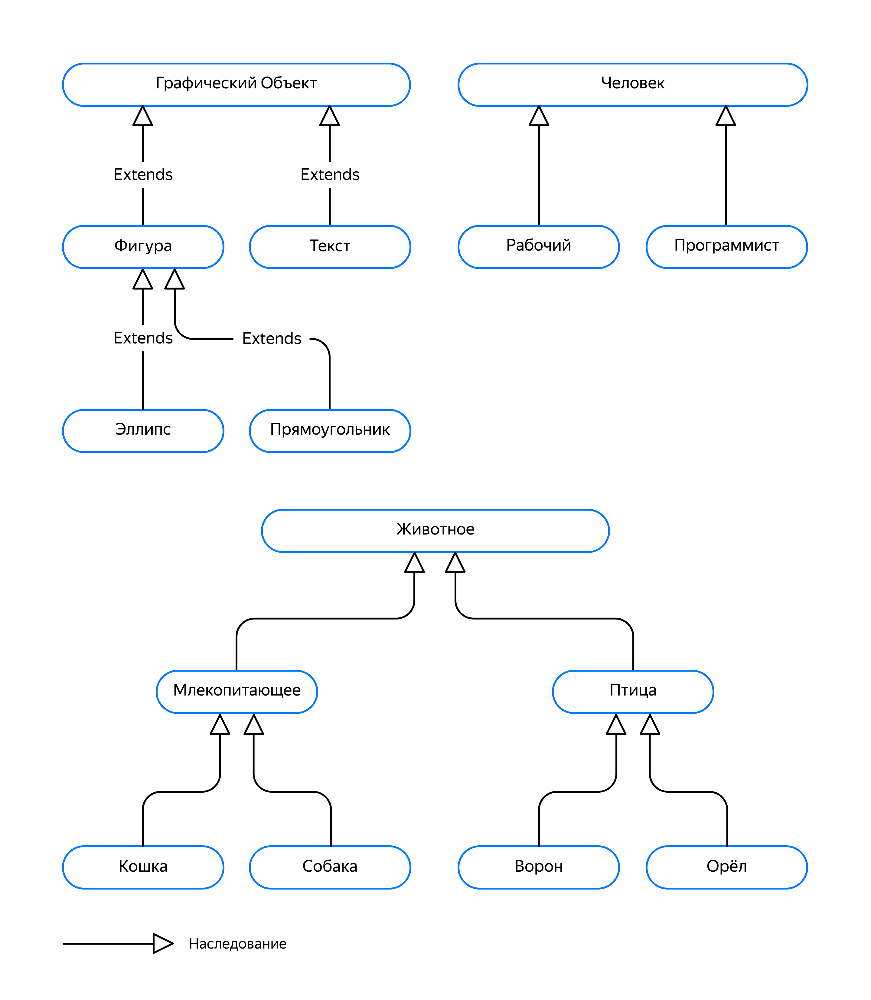

## Введение в наследование
В прошлом уроке вы познакомились с различными видами отношений между классами: композицией, агрегацией и зависимостью. Многие из них вы уже использовали в своих программах, просто не знали, как это называется. В этом уроке вы узнаете об одной из основных концепций объектно-ориентированного программирования — наследовании.

### Введение в наследование

Рассмотрим программу, которая имеет дело с сущностями `Программист` и `Рабочий`, представленными классами `Programmer` и `Worker` соответственно. Программисты владеют языками программирования, а рабочие — специальностями. И те и другие обладают именем, возрастом и полом:

```cpp
#pragma once
#include <unordered_set>
#include <string>

enum class ProgrammingLanguage { CPP, JAVA, PYTHON, PHP };

enum class Gender { MALE, FEMALE };

// Программист. Знает несколько языков программирования
class Programmer {
public:
    Programmer(const std::string& name, int age, Gender gender);

    const std::string& GetName() const;
    int GetAge() const;
    Gender GetGender() const;

    void AddProgrammingLanguage(ProgrammingLanguage language);
    bool CanProgram(ProgrammingLanguage language) const;

private:
    std::string name_;
    int age_;
    Gender gender_;
    std::unordered_set<ProgrammingLanguage> programming_languages_;
};

enum class WorkerSpeciality { BLACKSMITH, CARPENTER, WOOD_CHOPPER, ENGINEER, PLUMBER };

// Рабочий. Владеет несколькими специальностями
class Worker {
public:
    Worker(const std::string& name, int age, Gender gender);

    const std::string& GetName() const;
    int GetAge() const;
    Gender GetGender() const;

    void AddSpeciality(WorkerSpeciality speciality);
    bool HasSpeciality(WorkerSpeciality speciality) const;

private:
    std::string name_;
    int age_;
    Gender gender_;
    std::unordered_set<WorkerSpeciality> specialities_;
};
```
В этом примере `Programmer` и `Worker` имеют одинаковый набор данных и методов, которые есть у людей вне зависимости от их рода деятельности: имя, возраст, пол. В то же время представленные классы имеют специфичные для конкретных профессий данные и методы: программист владеет языками программирования, а рабочий — одной или несколькими специализациями.

При попытке установить, как друг с другом связаны Программист и Рабочий, выяснится, что знакомые вам виды отношений им не подходят. Эти классы друг с другом никак не связаны. Кроме того, есть потребность добавить ещё одну сущность, обобщающую Программистов и Рабочих. И такая сущность — класс `Person`.

Здесь мы сталкиваемся с новым видом отношений между классами — «является». И рабочий, и программист «являются» людьми. Всё, что верно для людей, верно и для рабочих, и для программистов. У людей есть имя, пол и возраст. Рабочий и программист сохраняют эти свойства, добавляя к ним свои данные и методы.

В C++ и многих других языках программирования для выражения отношения «является» используется наследование. Механизм наследования создаёт новый класс не с нуля, а на основе уже существующего класса. Новый класс сохраняет данные и поведение родительского класса. За счёт этого обеспечивается повторное использование кода. Наследование вводит следующие концепции:

- Класс-родитель (класс-предок, родительский класс, предок, суперкласс, родитель) — класс, от которого наследуются другие классы.

- Класс-потомок (класс-наследник, дочерний класс, потомок, подкласс) — класс, определённый через наследование.

- Базовый класс — класс, находящийся на вершине иерархии наследования, то есть не определённый через наследование. Любой небазовый класс является классом-потомком.

- Иерархия наследования (иерархия классов) — структура, отражающая связи родителей и потомков. В простейшем случае представляет из себя дерево, узлами которого будут классы.

Чтобы объявить класс-наследник в C++, нужно через двоеточие указать имя базового класса:
```cpp
struct Point {
    double x = 0;
    double y = 0;
};

enum class Color { BLACK, RED, GREEN, BLUE };

class Shape {
public:
    Color GetColor() const;
    void SetColor(Color color);

private:
    Color color_ = Color::BLACK;
};

class Circle : public Shape {
public:
    Point GetCenter() const;
    void SetCenter(Point center);
    double GetRadius() const;
    void SetRadius(double radius);

private:
    Point center_;
    double radius_ = 1.0;
}; 
```
В примере выше объявляется класс `Circle`, который наследуется от класса `Shape` (фигура). Ключевое слово public перед именем родительского класса означает публичное наследование. При публичном наследовании публичные методы родительского класса остаются публичными методами наследника. Такой тип наследования выражает отношение «Является» между классами `Circle` и `Shape`. Окружность является фигурой.
```cpp
int main() {
    Circle c;
    c.SetColor(Color::RED);
    c.SetRadius(2);
}
```
Публичное наследование ещё называется «наследованием интерфейса». Окружность унаследовала от Фигуры методы `GetColor` и `SetColor`, составляющие интерфейс фигуры. При этом родительский класс моделирует более общее, абстрактное понятие, а класс-наследник — более конкретное.

При создании экземпляра класса-наследника в программе создаётся один объект, содержащий данные и методы, специфичные как для этого класса, так и для его родителей.

### Графическое представление иерархий наследования

Графически наследование обозначается в виде стрелки с треугольным наконечником, направленной от наследника к базовому классу. Иногда встречается форма записи, при которой соединительная линия содержит надпись "Extends". На следующем рисунке показаны различные иерархии наследования.



В визуальном представлении иерархии наследования значение имеет направление стрелок, а не расположение классов относительно друг друга. На следующем рисунке изображены два разных представления одной и той же иерархии наследования. Верхняя иерархия воспринимается легче, так как в ней элементы упорядочены по глубине наследования.

### Передача параметров конструктору родительского класса

Жизненный цикл объекта начинается с вызова его конструктора, который выполняет необходимую инициализацию объекта. Конструирование дочернего класса происходит чуть сложнее: сначала выполняется конструктор класса-родителя, чтобы проинициализировать часть, относящуюся к родительскому классу. Если у родительского класса есть предок, перед вызовом конструктора родительского класса выполняется конструктор предка. Например, при инициализации Кошки сначала выполнится конструктор Животного, затем Млекопитающего, а следом за ним — Кошки.

Для этого компилятор перед вызовом конструктора наследника сам вызывает конструктор по умолчанию класса-родителя. Если в родительском классе есть параметризованный конструктор, наследник может вызвать его в списке инициализации своего конструктора. Более того, это единственный способ создать класс-наследник класса, не имеющего конструктор по умолчанию.

Ниже приведён класс `Shape`, имеющий параметризованный конструктор. Из-за этого в классе отсутствует конструктор по умолчанию:
```cpp
struct Point {
    double x = 0;
    double y = 0;
};

enum class Color { BLACK, RED, GREEN, BLUE };

class Shape {
public:
    explicit Shape(Color color)
        : color_(color) {
    }

    Color GetColor() const {
        return color_;
    }

private:
    Color color_;
};
```

Унаследованный от `Shape` класс `Circle` должен явно вызвать параметризованный конструктор родителя, передав ему нужное значение цвета:
```cpp
class Circle : public Shape {
public:
    Circle(Color color, Point center, double radius)
        : Shape(color)  // Передаём цвет конструктору родительского класса
        , center_(center)
        , radius_(radius) {
    }

    Point GetCenter() const {
        return center_;
    }
    void SetCenter(Point center) {
        center_ = center;
    }

    double GetRadius() const {
        return radius_;
    }
    void SetRadius(double radius) {
        radius_ = radius;
    }

private:
    Point center_;
    double radius_;
};

int main() {
    // Красная окружность с центром в точке {1, 2} радиусом 5
    Circle c{Color::RED, {1, 2}, 5};
}
```

Вы познакомились с наследованием — способом создать новый класс на основе уже существующего. Порождаемый класс сохраняет свойства и поведение родительского класса, а также добавляет свои собственные.

А теперь настало время взяться за клавиатуру, чтобы навести порядок в классах `Worker` и `Programmer`.