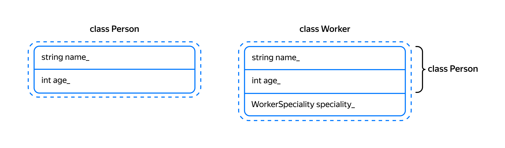

## Полиморфизм

В прошлом уроке вы узнали о наследовании — механизме, который позволяет производному классу сохранять данные и поведение родительского класса. Наиболее распространённая форма наследования — это публичное наследование, его ещё называют наследованием интерфейса.

В жизни мы часто используем устройства, использующие стандартные интерфейсы:  электрические розетки, разъёмы USB и HDMI. При этом один и тот же интерфейс позволяет подключать совершенно непохожие друг на друга устройства. Например, USB позволяет подключить к компьютеру как флэш-накопитель, так и мышь и веб-камеру.

В этом уроке вы научитесь использовать полиморфизм — один из важнейших механизмов объектно-ориентированного программирования, который позволяет работать через один интерфейс со множеством реализаций.

### Приведение типа вверх по иерархии класса

При публичном наследовании между классом-наследником и классом-родителем возникает отношение «является». При этом ссылки и указатели на дочерний класс могут неявно преобразовываться к ссылкам и указателям на родительский класс. Это позволяет наследнику сохранять интерфейс родителя — везде, где ожидается ссылка или указатель на родительский класс, можно использовать класс-наследник. 

Рассмотрим эту возможность на примере иерархии классов `Person` и `Worker`:
```cpp
class Person {
public:
    Person(const string& name, int age)
        : name_(name)
        , age_(age) {
    }

    int GetAge() const { return age_; }
    const string& GetName() const { return name_; }
    void Dance() const {
        cout << name_ << " is dancing"s << endl;
    }

private:
    string name_;
    int age_;
};

enum class WorkerSpeciality { BLACKSMITH, CARPENTER, WOOD_CHOPPER, ENGINEER, PLUMBER };

class Worker : public Person {
public:
    Worker(const string& name, int age, WorkerSpeciality speciality)
        : Person(name, age)
        , speciality_(speciality) {
    }
    void Work() {
        cout << GetName() << " is working"s << endl;
    }

private:
    WorkerSpeciality speciality_;
}; 
```

Совершеннолетний человек может прийти в ночной клуб, чтобы потанцевать:
```cpp
void VisitNightClub(const Person& person) {
    if (person.GetAge() >= 18) {
        person.Dance();
    } else {
        cout << person.GetName() << " is too young to visit night clubs"s << endl;
    }
} 
```

Функция `VisitNightClub` зависит от общего типа `Person` и может принимать не только экземпляры класса `Person`, но и других классов, публично унаследованных от него. Таким образом, наследование способствует повторному использованию кода:
```cpp
int main() {
    Person boy("Harry Potter"s, 11);
    VisitNightClub(boy);

    Worker worker("Mario"s, 40, WorkerSpeciality::PLUMBER);
    VisitNightClub(worker);
} 
```
```
Harry Potter is too young to visit night clubs
Mario is dancing 
```
Публичное наследование позволяет приводить тип ссылок и указателей, ссылающихся на экземпляры классов-наследников, вверх по иерархии классов и тем самым одинаково работать с наследниками через указатели и ссылки на родительский класс.

Благодаря этому можно в одном контейнере хранить указатели типа `Person*`, которые в действительности могут ссылаться на любой из его наследников:
```cpp
int main() {
    Person boy("Harry Potter"s, 11);
    Worker worker("Mario"s, 40, WorkerSpeciality::PLUMBER);
    vector<const Person*> people{&boy, &worker};

    for (const Person* person : people) {
        VisitNightClub(*person);
    }
} 
```
В этом примере вектор указателей `people` можно сравнить с очередью посетителей в ночной клуб. В ней могут стоять разные люди вне зависимости от их профессиональной деятельности. Единственный критерий допуска для них — совершеннолетие.

Рассмотрим, за счёт чего происходит преобразование типа ссылок и указателей вверх по иерархии классов. Внутри блока данных класса-наследника содержится порция данных класса-родителя. Например, в начале блока данных класса `Worker` может находиться блок данных его родителя, класса `Person`.



Благодаря одинаковому расположению полей name_ и age_ в самом классе `Person` и в его наследниках, функция `VisitNigthClub` может работать с `Person` и его наследниками через ссылку на базовый класс.

### Виртуальные методы. Полиморфизм

Наследование позволяет наследникам не только использовать методы класса родителя, но и заменять их поведение на собственное.

Рассмотрим эту возможность на следующем примере: сделаем, чтобы Рабочий во время танца от восторга выкрикивал «Оп-па!». При этом обычные экземпляры `Person` должны танцевать по-старому.

Метод класса-родителя, который может быть переопределён в классах-наследниках, в C++ должен быть объявлен виртуальным. Для этого используют ключевое слово `virtual`:

```cpp
class Person {
public:
    ...    
    // Реализация виртуального метода может быть переопределена в классах-наследниках
    virtual void Dance() const { 
        cout << name_ << " is dancing"s << endl;
    }

private:
    string name_;
    int age_;
}; 
```
В классе-наследнике переопределяемый виртуальный метод объявляется со спецификатором `override`. При необходимости внутри метода класса-наследника можно вызвать реализацию метода родительского класса, написав перед именем вызываемого метода `ИмяКлассаРодителя::`. В нашем случае прежде чем выкрикнуть «Оп-па!», рабочий вызывает реализацию метода `Dance` класса `Person`, чтобы рабочий станцевал как обычный человек:
```cpp
class Worker : public Person {
public:
    ...
    // Метод Dance переопределяет (override) реализацию базового класса
    void Dance() const override {
        // Сначала вызываем метод Dance родительского класса
        Person::Dance();
        // Добавляем дополнительное поведение
        cout << "Oppa!"s << endl;
    }

private:
    WorkerSpeciality speciality_;
}; 
```
Благодаря тому, что метод `Dance` виртуальный, при его вызове даже с использованием ссылки на базовый класс будет вызвана реализация класса наследника:
```cpp
int main() {
    Person person("Ivan Ivanov"s, 30);
    VisitNightClub(person);

    Worker worker("Mario"s, 40, WorkerSpeciality::PLUMBER);
    VisitNightClub(worker);
} 
```
Теперь в ночном клубе Person и Worker будут танцевать по-разному:
```
Ivan Ivanov is dancing
Mario is dancing
Oppa! 
```
Возможность работы с разными реализациями через один и тот же интерфейс называется полиморфизм. В данном случае речь идёт о полиморфизме времени выполнения: реализация вызываемого метода выбирается во время работы программы. С другим вариантом полиморфизма — полиморфизмом времени компиляции — вы познакомились раньше, когда проходили шаблоны и перегрузку функций и операторов.

Чтобы полиморфизм времени выполнения корректно работал, метод родительского класса, который можно переопределить в наследниках, должен быть объявлен виртуальным. Только в этом случае компилятор будет знать, что у этого метода возможны несколько реализаций в классах наследниках. Тогда компилятор поместит в объект дополнительную информацию, которая позволит во время выполнения вызвать верную реализацию метода.

Не менее важно в методе наследника указывать спецификатор `override` у переопределяемого метода. Во-первых, при чтении кода будет видно, что данный метод переопределяет метод класса-родителя. Во-вторых, `override` требует, чтобы в одном из родительских классов был виртуальный метод с идентичной сигнатурой. Это позволяет обнаружить ошибку, описанную далее.
Если метод `Person::Dance` не объявить виртуальным, метод `Dance` класса `Worker` лишь скроет одноимённый метод родителя:
```cpp
class Person {
public:
    ...    
    // Метод Dance умышленно объявлен невиртуальным
    void Dance() const { 
        cout << name_ << " is dancing"s << endl;
    }
};

class Worker : public Person {
public:
    ...
    // Метод Dance класса Worker замещает собой невиртуальный метод Dance родительского класса
    void Dance() const {
        Person::Dance();
        cout << "Oppa!"s << endl;
    }
}; 
```
Результат вызова невиртуального метода `Dance` у одного и того же объекта будет зависеть от типа ссылки или указателя на объект, которые используются для вызова метода.
```cpp
void VisitNightClub(const Person& person) {
    if (person.GetAge() >= 18) {
        // Компилятор вызовет метод Person::Dance, так как он не виртуальный
        person.Dance();
    } else {
        cout << person.GetName() << " is too young to visit night club"s << endl;
    }
}

int main() {
    Worker worker("Mario"s, 40, WorkerSpeciality::PLUMBER);
    // Здесь будет вызван метод Worker::Dance, так он вызывается у переменной типа Worker
    worker.Dance();

    VisitNightClub(worker);
} 
```
Внутри функции `VisitNightClub` переменная person будет ссылкой на Person, поэтому будет вызван метод `Person::Dance`. Внутри функции `main` компилятор знает реальный тип переменной worker, поэтому будет вызван метод `Worker::Dance`:

```
Mario is dancing
Oppa!
Mario is dancing 
```

Эту ошибку можно обнаружить во время компиляции, указав спецификатор `override` у метода `Worker::Dance`. В этом случае компилятор выдал бы ошибку при попытке переопределить невиртуальный метод.

По умолчанию в C++ методы класса невиртуальные, так как их вызов проще и быстрее вызова виртуальных методов. Кроме того, объект без виртуальных методов занимает меньше места в памяти. Это соответствует философии C++: «Вы не платите за те функции языка, которые не используете».

Подведём итоги.

- Объявляйте метод родительского класса виртуальным, если нужно дать подклассам переопределять реализацию этого метода. В дочерних классах используйте спецификатор `override`, когда метод переопределяет реализацию родителя.

- Если возможность переопределения метода в подклассах не требуется, не объявляйте метод виртуальным, а в классах-наследниках не объявляйте методов с таким же именем.

- Метод класса, который объявлен виртуальным в родительском классе, остаётся виртуальным и во всех его наследниках.