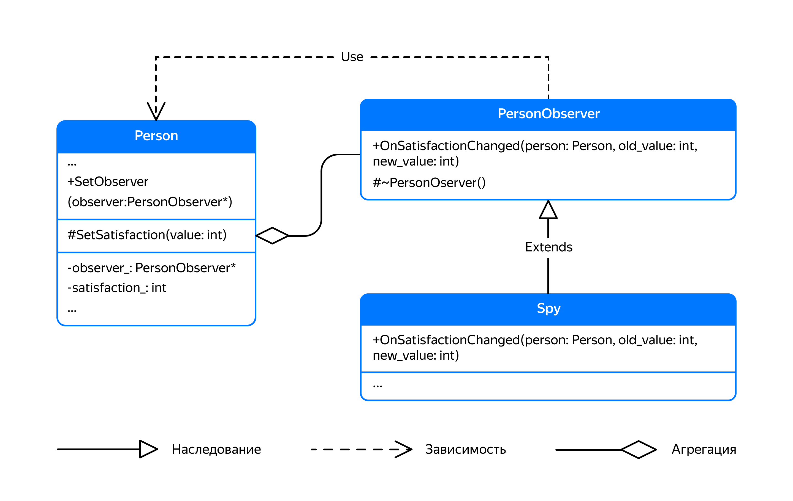

## Наследование — детали

Публичные данные и методы класса формируют его интерфейс и доступны как самому классу, так и коду за его пределами. Приватные данные и методы формируют реализацию класса и доступны внутри самого класса. При этом члены-данные класса часто объявляются приватными, что позволяет поддерживать состояние класса в согласованном виде — никто, кроме самого класса, не может изменить его состояние и нарушить согласованность данных.

Так приватная область класса оказывается скрытой от всего внешнего мира, включая наследников. В ряде случаев это может оказаться неудобным.

Вы уже умеете обращаться со спецификаторами доступа public и private, которые разграничивают права доступа к данным и методам класса. В этом уроке вы познакомитесь со спецификатором доступа protected. Благодаря ему дочерние классы смогут обращаться к данным и методам своего родителя.

Также вы узнаете об особенностях работы деструкторов в иерархии классов и научитесь правильно выполнять полиморфное удаление объектов.

### Защищённые члены класса

Рассмотрим уже знакомую иерархию классов `Person` и `Worker`. Добавим в класс `Person` приватное поле `satisfaction_`, хранящее уровень удовлетворённости. Во время танца уровень удовлетворённости будет увеличиваться:

```cpp
class Person {
public:
    ...
    int GetAge() const { return age_; }
    int GetSatisfaction() const { return satisfaction_; }
    // Танец поднимает настроение
    virtual void Dance() {
        ++satisfaction_;
    }
private:
    int satisfaction_; // Уровень удовлетворения
    int age_;
};
```

От заказчика поступили следующие требования:
- Рабочие в возрасте от 30 до 40 лет должны во время танца восклицать «Оп-па!», а их уровень удовлетворения должен увеличиваться на два пункта вместо одного.

- Работа уменьшает уровень удовлетворения рабочего на один пункт.

- Пользователи класса Person имеют доступ к значению удовлетворённости только на чтение.

Чтобы реализовать требования заказчика, классу `Worker` нужен доступ к полю `satisfaction_` своего родителя. Можно было бы объявить класс `Worker` другом класса `Person`, но это даст Рабочему доступ ко всем приватным полям Человека, а не только к `satisfaction_`. Кроме того, придётся каждый раз вносить изменения в класс `Person`, если другие его наследники тоже захотят изменять уровень удовлетворённости.

В C++ есть ещё один спецификатор доступа, `protected` , который обретает смысл при использовании наследования. Данные и методы, объявленные с этим спецификатором, становятся доступны не только самому классу, но и его наследникам. Остальной код к ним доступа не имеет.

Если поле `Person::satisfaction_` объявить защищённым, оно станет доступно дочернему классу `Worker`:
```cpp
class Person {
    ...
protected:
    int satisfaction_; // Уровень удовлетворения теперь доступен наследникам класса Person
private:
    int age_;
};

class Worker : public Person {
public:
    void Dance() override {
        // Рабочий сперва просто танцует, как обычный человек
        Person::Dance();

        // Рабочий в возрасте от 30 до 40 во время танца получает 
        // дополнительную порцию удовлетворения
        if (const int age = GetAge(); age > 30 && age < 40) {
            cout << "Oppa!" << endl;
            ++satisfaction_;
        }
    }

    void Work() {
        // Работа понижает уровень удовлетворённости
        --satisfaction_;
    }
};
 ```
Сделав поле `satisfaction_` защищённым, мы слегка нарушили инкапсуляцию класса `Person` — к состоянию Человека кроме него самого теперь имеют доступ его наследники. Если в будущем вы захотите от этого поля избавиться или изменить его тип, потребуется внести изменения во все подклассы, которые с этим полем напрямую взаимодействуют.

На диаграмме классов защищённые данные и методы помечаются символом `#`:

Если вы не единственный пользователь класса `Person`, лучше сделать члены-данные базового класса приватными и для доступа к состоянию использовать защищённые set-методы. Так будет легче защитить код дочерних классов от возможных изменений базового класса:

```cpp
class Person {
public:
    ...
    int GetSatisfaction() const { return satisfaction_; }
protected:
    void SetSatisfaction(int value) { satisfaction_ = value; }
private:
    int satisfaction_;
    int age_;
};

class Worker : public Person {
public:
    void Dance() override {
        Person::Dance();
        if (const int age = GetAge(); age > 30 && age < 40) {
            cout << "Oppa!" << endl;
            SetSatisfaction(GetSatisfaction() + 1);
        }
    }
    void Work() {
        SetSatisfaction(GetSatisfaction() - 1);
    }
};
```

### Защищённый конструктор

Особое применение в C++ имеет защищённый конструктор. Он будет доступен лишь классам-наследникам, поэтому, используя его, создать экземпляр класса не получится. Если объявить конструкторы родительского класса защищёнными, можно запретить создание экземпляров данного класса и вместо этого создавать экземпляры его классов-наследников.

Например, нет особого смысла создавать в программе экземпляры класса `Shape`, ведь этот класс — слишком абстрактная сущность. Объявив конструктор `Shape` защищённым, сможете создавать в программе только экземпляры конкретных фигур, таких как окружности и прямоугольники:
```cpp
class Shape {
public:
    ...
protected:
    // Этот конструктор доступен только классам-наследникам
    explicit Shape(Color color)
        : color_(color) {
    }
private:
    Color color_;
    ...
};

class Circle : public Shape {
public:
    Circle(double radius, Color color)
        : Shape(color)
        , radius_(radius) {
    }
    ...
private:
    double radius_;
    ...
};

int main() {
    Shape shape(Color::RED); // Ошибка компиляции - конструктор Shape недоступен
    Circle circle(10.0, Color::RED); // OK - экземпляр Circle имеет публичный конструктор
} 
```

### Деструкторы и наследование

В C++ для удаления объектов, которые созданы в динамической памяти с использованием оператора `new`, служит оператор `delete`. Помимо освобождения памяти, занимаемой объектом, он предварительно выполняет вызов деструктора удаляемого объекта:

```cpp
Circle* circle = new Circle(Color::RED);
delete circle;
```

При публичном наследовании указатели и ссылки на дочерние классы могут приводиться к указателям и ссылкам на класс-родитель. Это даёт возможность единообразно взаимодействовать с подклассами, используя ссылку или указатель на их общего родителя:
```cpp
// Функция DoSomething может обработать вектор указателей на любые фигуры
void DoSomething(const vector<Shape*>& shapes);

int main() {
    Circle* circle = new Circle(10, Color::RED);
    Rectangle* rectangle = new Rectangle(10, 20, Color::BLUE);
    vector<Shape*> shapes = {circle, rectangle};

    DoSomething(shapes);

    delete circle;
    delete rectangle;
}
```

Когда оператор `delete` удаляет экземпляр класса-наследника через указатель на родительский класс, деструктор родителя должен быть виртуальным. Иначе оператор `delete` вызовет неопределённое поведение:

```cpp
class Shape {
public:
    ...
    // Помечаем деструктор виртуальным. Компилятор сам сгенерирует тело деструктора
    virtual ~Shape() = default;
    /*
    virtual ~Shape() {
        // Также можно написать тело деструктора вручную
    }
    */
    ...
};

class Circle : public Shape { ... };

int main() {
    Shape* shape = new Circle(10, Color::RED);
    delete shape; // OK, так как деструктор Shape виртуальный
}
```

По умолчанию деструкторы, как и методы класса, невиртуальные. Это нужно, чтобы минимизировать накладные расходы при разрушении объекта или свести их к нулю, когда полями объекта будут типы с тривиальным деструктором. Тривиальный деструктор — деструктор, который не выполняет никаких действий.

Практически всегда сто́ит объявлять деструктор базового класса публичным и виртуальным. Так вы избежите проблем при удалении его наследников через указатель на базовый класс. Например когда в контейнере хранятся умные указатели на базовый класс иерархии:
```cpp
class Shape {
public:
    virtual ~Shape() = default;
    ...
};

class Circle : public Shape { ... };
class Rectangle : public Shape { ... };

int main() {
    vector<unique_ptr<Shape>> shapes;
    shapes.emplace_back(make_unique<Circle>(10.0, Color::RED));
    shapes.emplace_back(make_unique<Rectangle>(10.0, 20.0, Color::BLUE));
    // Деструкторы unique_ptr корректно удалят фигуры через указатель на класс Shape
}
```
Если родительский класс не предназначен для полиморфного удаления и его экземпляры не будут создаваться напрямую, можно избежать накладных расходов, объявив деструктор родительского класса защищённым и невиртуальным. Так наследники этого класса будут защищены от полиморфного удаления через указатель на базовый класс.

Например, можно ввести класс `PersonObserver` , который человек использует для уведомления об изменении своего состояния. Класс Person не владеет своим наблюдателем, поэтому деструктор `PersonObserver` можно сделать защищённым невиртуальным:
```cpp
class Person;

// Наблюдатель за состоянием человека
class PersonObserver {
public:
    // Этот метод вызывается, когда меняется состояние удовлетворённости человека
    virtual void OnSatisfactionChanged(Person& /*person*/, int /*old_value*/, int /*new_value*/) {
        // Реализация метода базового класса ничего не делает
    }

protected:
    // Класс PersonObserver не предназначен для удаления напрямую
    ~PersonObserver() = default;
};

class Person {
public:
    Person(const string& name, int age)
        : name_(name)
        , age_(age) {
    }

    int GetSatisfaction() const {
        return satisfaction_;
    }

    string GetName() const {
        return name_;
    }

    void SetObserver(PersonObserver* observer) {
        observer_ = observer;
    }

    virtual void Dance() {
        SetSatisfaction(satisfaction_ + 1);
    }

protected:
    void SetSatisfaction(int value) {
        if (satisfaction_ != value) {
            int old_satisfaction = satisfaction_;
            satisfaction_ = value;
            // Если у человека есть наблюдатель, сообщаем ему об изменении удовлетворённости
            if (observer_) {
                observer_->OnSatisfactionChanged(*this, old_satisfaction, satisfaction_);
            }
        }
    }

private:
    string name_;
    PersonObserver* observer_ = nullptr;
    int satisfaction_ = 100;
    int age_;
};
```

Сам `PersonObserver` не выполняет никаких действий при изменении удовлетворённости человека. Это просто основа для создания подклассов. Они и будут выполнять конкретные действия.



Так, например, класс `Spy` может выводить в `cout` сообщения об изменении удовлетворённости человека:
```cpp
// Шпион
class Spy : public PersonObserver {
public:
    void OnSatisfactionChanged(Person& person, int old_value, int new_value) override {
        cout << person.GetName() << "'s satisfaction has changed from "s << old_value << " to "s << new_value << endl;
    }
};
```

Назначив шпиона наблюдателем, будем в курсе состояния человека:
```cpp
int main() {
    Person person{"Ivan"s, 10};

    Spy spy;
    person.SetObserver(&spy);

    person.Dance();
} 
```
```
Ivan's satisfaction has changed from 100 to 101 
```
Если потребуется выполнить иные действия при изменении удовлетворённости человека, не нужно будет вносить изменения в класс Person. Достаточно создать новый класс-наследник `PersonObserver` и назначить его наблюдателем:
```cpp
// Надсмотрщик за удовлетворённостью
class SatisfactionSupervisor : public PersonObserver {
public:
    void OnSatisfactionChanged(Person& person, int old_value, int new_value) override {
        // Если уровень удовлетворённости упал слишком низко,
        // можно поднять его, вызвав person.Dance()
    }
}; 
```
Если класс не предназначен для наследования, можно объявить его финальным, используя ключевое слово final:
```cpp
// Класс рациональных чисел самодостаточен и не предназначен для наследования
class Rational final {
    /* Деструктор можно не объявлять, так как Rational не выделяет динамическую память */
    ...
};

// Шаблонный класс SimpleVector также является самодостаточным классом и объявлен финальным
template <typename T>
class SimpleVector final {
public:
    // Объявляем деструктор публичным невиртуальным
    ~SimpleVector() {
        ...
    }
    ...
};

// Этот код не скомпилируется, так как класс Rational финальный
// class MyRational : public Rational { ... }; 
```

Подведём итоги.

Деструктор базового класса надо объявлять либо публичным виртуальным, либо защищённым невиртуальным. Это зависит от того, требуется ли полиморфное удаление классов-наследников через указатель на базовый класс.

Если класс не предназначен для наследования, не объявляйте в нём деструктор вообще, либо объявите публичным невиртуальным. Сам класс желательно объявить финальным.