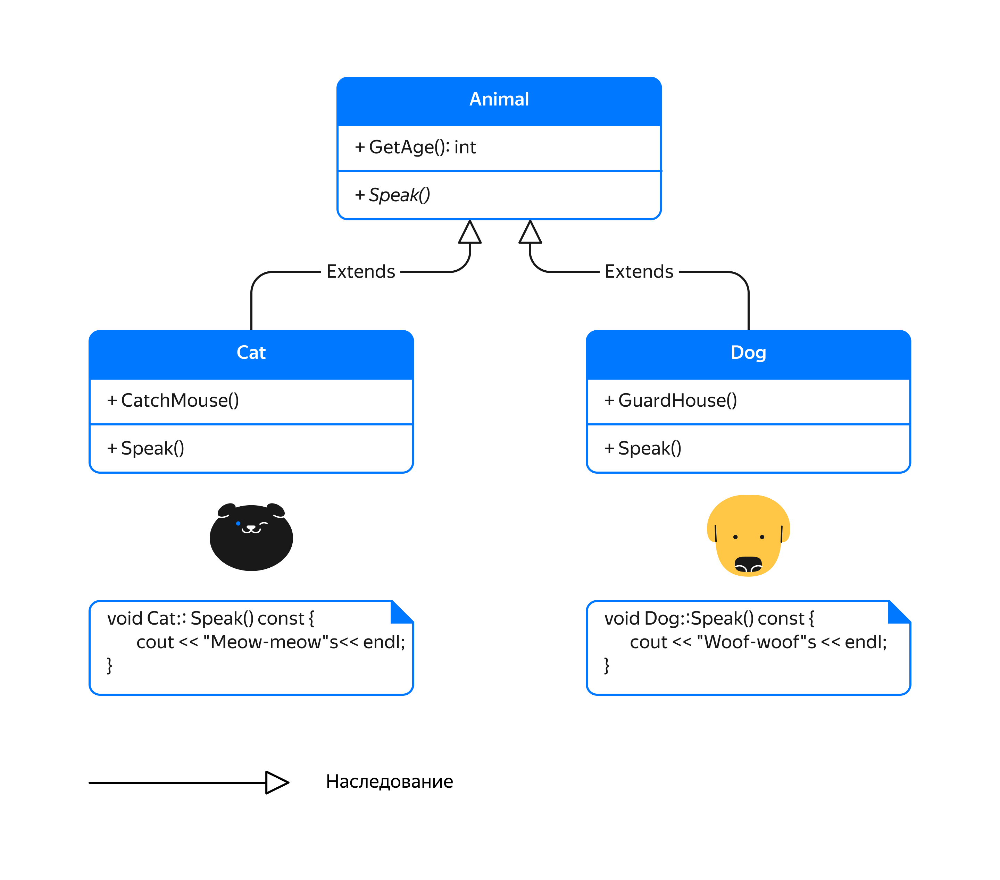

## Абстрактные классы. Разработка SVG-библиотеки

Класс Shape, который вы разработали раньше, в действительности представляет собой абстрактную сущность:

- нет однозначного способа вычислить площадь Фигуры;
- нет однозначного способа нарисовать Фигуру;
- нет смысла создавать в программе экземпляры класса Фигура. 

Практическую пользу несут лишь конкретные фигуры вроде Окружностей и Прямоугольников.

Вы обошли эти трудности, возвращая 0 в качестве площади фигуры и строку “Shape” в качестве типа фигуры. Однако при этом есть риск забыть переопределить в подклассе виртуальный метод базового класса:

```cpp
struct Point {
    double x, y;
};

class Shape {
public:
    virtual const string& GetType() const { return type_; }
    virtual double GetArea() const { return 0; }
private:
    static const string type_;
};
const string Shape::type_ = "Shape"s;

class Triangle : public Shape {
public:
    Triangle(Point p1, Point p2, Point p3);
    const string& GetType() const override { return type_; }
private:
    Point p1_, p2_, p3_;
    static const string type_;
};
const string Triangle::type_ = "Triangle"s; 
```
В примере выше в классе `Triangle` не переопределён метод `GetArea`, поэтому метод вычисления площади будет возвращать 0, используя реализацию класса `Shape`:
```cpp
int main() {
    Triangle t{{0, 0}, {10, 0}, {0, 10}};
    cout << t.GetArea() << endl; // Будет выведено 0.0
} 
```
Виртуальные функции, для которых в данном классе нельзя дать осмысленное определение и которые должны быть переопределены в подклассах, можно объявить чисто виртуальными. Для этого напишите `= 0` в объявлении функции:
```cpp
class Shape {
public:
    virtual double GetArea() const = 0;
    virtual const string& GetType() const = 0;
    // Остальные методы Shape
}; 
```
Теперь при попытке создать экземпляр `Triangle`, не переопределив в нём метод `GetArea`, появится сообщение об ошибке:
```
prog.cc: In function 'int main()':
prog.cc:31:14: error: cannot declare variable 't' to be of abstract type 'Triangle'
   31 |     Triangle t{{0, 0}, {10, 0}, {0, 10}};
      |              ^
prog.cc:20:7: note:   because the following virtual functions are pure within 'Triangle':
   20 | class Triangle : public Shape {
      |       ^~~~~~~~
prog.cc:13:20: note:     'virtual double Shape::GetArea() const'
   13 |     virtual double GetArea() const = 0;
      |                    ^~~~~~~
 ```
Эта проблема обнаружится ещё на стадии компиляции. Чтобы её устранить, надо реализовать недостающие чисто виртуальные методы.

В C++ класс, где объявлен хотя бы один чисто виртуальный метод, называется абстрактным. Абстрактным будет и класс, который не реализует хотя бы один чисто виртуальный метод своего родителя. 

Абстрактные классы не предполагают создание своих экземпляров и предназначены для использования в качестве родительских или базовых классов.

Класс, не содержащий чисто виртуальных методов, называется конкретным. В программе можно создавать лишь экземпляры конкретных классов.

На диаграммах чисто виртуальные методы и абстрактные классы могут дополнительно выделяться курсивным шрифтом:



Абстрактные классы часто применяются при реализации паттерна проектирования «Шаблонный метод». В этом случае базовый абстрактный класс содержит метод, который задаёт каркас или шаблон алгоритма, состоящего из нескольких шагов. Конкретные подклассы должны переопределить чисто виртуальные методы, соответствующие определённым шагам этого алгоритма. Так базовый класс задаёт количество шагов и их порядок, а подклассы определяют детали реализации этих шагов.
Для примера рассмотрим класс `CaffeineBeverage`, который задаёт алгоритм приготовления кофеинового напитка:
```cpp
// Базовый класс, описывающий каркас приготовления абстрактного напитка с кофеином
class CaffeineBeverage {
public:
    // Шаблонный метод приготовления напитка
    void Prepare() {
        BoilWater();
        Brew();
        PourInCup();
        AddCondiments();
    }

    // Деструктор базового класса объявляем публичным виртуальным
    virtual ~CaffeineBeverage() = default;

private:
    void BoilWater() {
        cout << "Boiling water"sv << endl;  // Кипятим воду
    }
    void PourInCup() {
        cout << "Pouring into a cup"sv << endl;  // Наливаем в чашку
    }

    virtual void Brew() = 0;  // Завариваем

    virtual void AddCondiments() {  // Добавляем дополнения к напитку
        // Подклассы могут переопределить этот метод
    }
}; 
```
Метод `Prepare` задаёт шаблон алгоритма (отсюда паттерн и получил своё название) приготовления напитка:

1. Вскипятить воду.
2. Заварить напиток.
3. Перелить в чашку.
4. Добавить дополнения к напитку.

Первый и третий шаги класс `CaffeineBeverage` реализует самостоятельно и даёт своим подклассам возможность переопределить второй и четвёртый шаг. При этом метод `Brew` объявлен чисто виртуальным, то есть обязательным для реализации в подклассах, а метод `AddCondiments` может быть переопределён по мере необходимости.

Так как эти методы приватные, они недоступны для вызова подклассами напрямую. Но остаётся возможность их переопределить. Итак, только класс `CaffeineBeverage` может вызвать методы `Brew` и `AddCondiments`, при этом оставив своим подклассам возможность их переопределения.
Дочерние классы `Coffee`, `Tea` и `Chifir` реализуют шаги приготовления кофе, чая и чифиря соответственно:

```cpp
// Описывает шаги, специфичные для приготовления кофе
class Coffee : public CaffeineBeverage {
    void Brew() override {
        cout << "Dripping coffee through filter"sv << endl;  // Процеживаем кофе сквозь фильтр
    }
    void AddCondiments() override {
        cout << "Adding sugar and milk"sv << endl;  // Добавляем сахар и молоко
    }
};

// Описывает шаги, специфичные для приготовления чая
class Tea : public CaffeineBeverage {
    void Brew() override {
        cout << "Steeping the tea bag"sv << endl;  // Погружаем чайный пакетик
    }

    void AddCondiments() override {
        cout << "Adding lemon"sv << endl;  // Добавляем лимон
    }
};

// Реализует шаги, специфичные для приготовления чифиря
class Chifir : public CaffeineBeverage {
    void Brew() override {
        cout << "Put 5 to 8 tea bags"sv << endl;
    }
    // Метод AddCondiments не переопределяем - не положено
}; 
```
Теперь, когда дочерние классы реализуют чисто виртуальные методы своего родителя, различные типы напитков можно готовить единообразно:

```cpp
// Функция может готовить любые напитки, по рецепту, задаваемому классом CaffeineBeverage
void PrepareBeverages(const vector<unique_ptr<CaffeineBeverage>>& beverages) {
    for (const auto& beverage : beverages) {
        beverage->Prepare();
        cout << "-----"sv << endl;
    }
}

int main() {
    // Составляем набор напитков
    vector<unique_ptr<CaffeineBeverage>> beverages;
    beverages.emplace_back(make_unique<Tea>());
    beverages.emplace_back(make_unique<Coffee>());
    beverages.emplace_back(make_unique<Chifir>());

    // И готовим их
    PrepareBeverages(beverages);
} 
```
```
Boiling water
Steeping the tea bag
Pouring into a cup
Adding lemon
-----
Boiling water
Dripping coffee through filter
Pouring into a cup
Adding sugar and milk
-----
Boiling water
Put 5 to 8 tea bags
Pouring into a cup
----- 
```
Закрепите новые знания на практике и разработайте первую часть библиотеки для вывода SVG изображений.