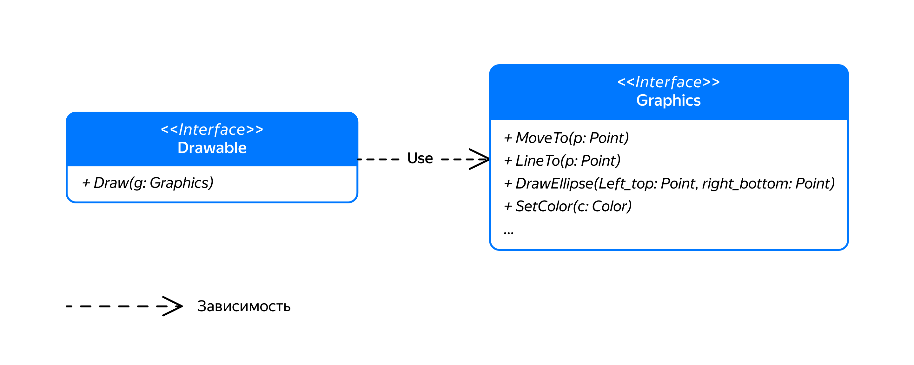

## Интерфейсы

Предельный случай абстрактного класса в C++ — это интерфейс, класс без членов-данных. Все его методы — чисто виртуальные.

Интерфейс не имеет ни состояния, ни поведения, поэтому на первый взгляд он может показаться бесполезным. На деле же это совсем не так. Интерфейс задаёт набор методов, которые должны быть у объекта, чтобы с ним взаимодействовать. Фактически интерфейс описывает протокол для работы с объектом, не конкретизируя, какой это должен быть объект.

В качестве аналогии интерфейса из реального мира можно привести интерфейс USB для подключения различных периферийных устройств к вычислительной технике. Требования к разъёмам и протоколам передачи данных стандартизованы, что позволяет соединять друг с другом устройства разных производителей. В отсутствие стандартизации мы оказались бы в ситуации, когда устройства разных производителей несовместимы.

Рассмотрим для примера два интерфейса: `Graphics` и `Drawable`. Интерфейс `Graphics` объявляет набор методов для рисования графических примитивов, таких как отрезки прямых, кривые и эллипсы. Интерфейс `Drawable` объявляет метод Draw для рисования объекта на графическом устройстве, реализующем интерфейс `Graphics`:
```cpp
// Интерфейс Graphics предоставляет методы для рисования графических примитивов
class Graphics {
public:
    virtual void MoveTo(Point p) = 0;
    virtual void LineTo(Point p) = 0;
    virtual void DrawEllipse(Point left_top, Point right_bottom) = 0;
    virtual void SetColor(Color color) = 0;
    // Прочие методы рисования графических примитивов
    // ...
};

// Интерфейс Drawable задаёт объекты, которые можно нарисовать с помощью Graphics
class Drawable {
public:
    virtual void Draw(Graphics& g) const = 0;
}; 
```
Интерфейсы `Drawable` и `Graphics` можно сравнить с «материнским» и «отцовским» разъёмами стандарта USB. В любое устройство с «материнским» разъёмом можно вставить устройство с «отцовским» разъёмом. Точно так же любой объект, реализующий интерфейс `Drawable`, сможет рисовать своё изображение на любом объекте, реализующем интерфейс `Graphics`.
На диаграмме классов интерфейсы отображаются подобно классам, с уточняющей пометкой `<<Interface>>`.



Про класс X, унаследованный от интерфейса Y, говорят: класс X реализует интерфейс Y. 

Класс, наследующийся от `Drawable`, должен реализовать метод `Draw`, чтобы, используя переданный интерфейс `Graphics`, нарисовать своё изображение. Если этого не сделать, класс-наследник будет абстрактным. Иногда это то, что нужно. Например, объявив Фигуру объектом, который можно нарисовать, и не реализовав в ней метод `Draw`, потребуем от всех конкретных классов-наследников Фигуры реализовать этот метод:

```cpp
// Класс Shape наследуется от Drawable, но не реализует метод Draw.
// Это должны будут сделать подклассы Shape
class Shape : public Drawable {
public:
    ...
    Color GetColor() const { return color_; }
    void SetColor(Color color) { color_ = color; }
private:
    Color color_;
}; 
```

На диаграмме классов отношение между интерфейсом и реализующим его классом обозначается пунктирной линией с треугольным наконечником, направленным к интерфейсу. Почти как при наследовании, только линия пунктирная:


Как видно из диаграммы, реализовывать интерфейс `Drawable` могут не только фигуры, но и любые другие классы. Например, котики:
```cpp
class Rectangle : public Shape {
public:
    ...
    void Draw(Graphics& g) const override {
        g.SetColor(GetColor());
        g.MoveTo(left_top_);
        g.LineTo({left_top_.x + width_, left_top.y});
        g.LineTo({left_top_.x + width_, left_top.y + height_});
        g.LineTo({left_top_.x, left_top.y + height_});
        g.LineTo(left_top_);
    }
private:
    Point left_top_;
    double width_;
    double height_;
};

class Circle : public Shape {
public:
    ...
    void Draw(Graphics& g) const override {
        g.SetColor(GetColor());
        g.DrawEllipse(
            {center_.x - radius_, center_.y - radius_}, 
            {center_.x + radius_, center_.y + radius_});
    }
private:
    Point center_;
    double radius_;
};

// Котики тоже могут реализовывать интерфейс Drawable
class Cat : public Drawable {
public:
    void Draw(Graphics& g) const override {
        // Рисуем кота при помощи методов, доступных в интерфейсе Graphics
    }
};
```
Теперь, когда объекты умеют рисовать себя, используя интерфейс `Graphics`, можно создать функцию для рисования картины (picture) на графическом устройстве. Картину можно задать в виде вектора указателей на объекты, реализующие интерфейс `Drawable`:
```cpp
void DrawPicture(const vector<const Drawable*>& picture, Graphics& g) {
    for (const Drawable* drawable : picture) {
        drawable->Draw(g);
    }
};
```
Интерфейс `Graphics` может иметь несколько реализаций, например:
- `BitmapGraphics` — класс, позволяющий рисовать на растровом изображении в памяти компьютера. Полученное растровое изображение впоследствии можно сохранить в файл на диске.
- `Printer` — класс для вывода изображения на принтер. Сначала изображение строится в памяти компьютера, а затем выводится на печать вызовом отдельного метода Print.

```cpp
// Растровое изображение в памяти компьютера
class Bitmap {
public:
    Bitmap(int width, int height);
    ... 
};

// Класс для рисования на растровом изображении в памяти компьютера
class BitmapGraphics : public Graphics {
public:
    explicit BitmapGraphics(Bitmap& bitmap)
        : bitmap_(bitmap) {
    }

    /* Реализация методов Graphics */

private:
    Bitmap& bitmap_;
    /* прочие данные */
};

// Сохраняем растровое изображение в файл
void SaveToFile(const Bitmap& bmp, const string& file_name) { ... }

// Позволяет выводить изображение на принтер
class Printer : public Graphics {
public:
    ...
    // Реализация методов Graphics. Выполняет построение изображения в памяти компьютера
    void MoveTo(Point p) override { ... }
    void LineTo(Point p) override { ... }
    void DrawEllipse(Point left_top, Point right_bottom) { ... }
    void SetColor(Color color) { ... }

    // Выводит изображение, построенное в памяти, на печать
    void Print() { ... }
private:
    /* Данные, необходимые для хранения изображения в памяти и вывода его на печать */  
}; 
```
Далее остаётся сформировать картину из имеющихся фигур, напечатать на принтере и сохранить в файл:
```cpp
int main() {
    // Создаём "картину" из Drawable объектов
    Circle circle{...};
    Rectangle rectangle{...};
    Cat cat{...};
    vector<const Drawable*> picture = {&circle, &rectangle, &cat};
    
    // Печатаем "картину" на принтере
    Printer printer;
    DrawPicture(picture, printer);
    printer.Print();

    // Рисуем "картину" на растровом изображении и сохраняем в файл
    Bitmap bmp(1024, 768);
    BitmapGraphics bitmapGraphics(bmp);
    DrawPicture(picture, bitmapGraphics);
    SaveToFile(bmp, "picture.png"s);
} 
```
Проанализируем получившееся решение.

Введённый интерфейс `Graphics` позволил абстрагироваться от различий между рисованием на растровом изображении и выводом изображения на принтер. Код, который использует интерфейс `Graphics`, может рисовать, используя любые объекты, которые реализуют этот интерфейс. Создав классы, реализующие методы интерфейса `Graphics` с применением распространённых графических библиотек, таких как OpenGL, Direct3D, Vulkan или Metal, код сможет использовать функциональность этих библиотек, но не привязываться ни к одной из них.

Интерфейс `Drawable` позволил унифицировать рисование объектов. Любой объект, который поддерживает этот интерфейс, можно нарисовать на любом графическом устройстве, реализующем интерфейc `Graphics`.

Интерфейсы помогают наладить взаимодействие между объектами, у которых минимум информации друг о друге. Это позволяет создавать гибкие архитектуры. Работая с ними, можно заменять одни части программы без модификации других.

Помогают интерфейсы и при написании модульных тестов. Класс, который зависит от передаваемого извне интерфейса или абстрактного класса, легче протестировать, чем класс, зависящий от конкретных классов:

```cpp
// Интерфейс, от которого зависит тестируемый класс
class Service {
public:
    virtual int DoSomething(int param) = 0;
protected:
    ~Service() = default;
};

// Класс, который требуется протестировать
class MyClass {
public:
    MyClass(Service& service)
        : service_(service) {
    }
    // Метод Run использует service_
    void Run() {
        ...
        int value = service_.DoSomething(42);
        ...
    }
private:
    Service& service_;
};

// Реализация сервиса. Может зависеть от других объектов
class RealService : public Service { ... }; 
```

Здесь класс `MyClass` зависит от некоторого объекта, реализующего интерфейс `Service`. `RealService` — класс, реализующий интерфейс `Service`, который может быть сложным сам по себе, требовать каких-то внешних зависимостей или предварительной настройки. Поэтому тестирование класса `MyClass` совместно с `RealService` может быть затруднено. Решение: создать Mock-объект (англ. mock — пародировать) — легковесный класс, который «прикидывается» `Service`-ом, реализуя интерфейс `Service` упрощённым способом, и в тестах использовать его вместо `RealService`:
```cpp
// Тестовый дублёр, имитирует работу RealService, 
// возвращая заготовленные значения и запоминая параметры, с которыми вызываются его методы
struct MockService : public Service {
    int DoSomething(int param) override {
        // Запоминаем параметр метода
        this->param = param;
        // Возвращаем заранее заготовленный результат
        return return_value;
    }
    optional<int> param;
    int return_value = 0;
};

void TestMyClass() {
    // Создаём и настраиваем mock-объект
    MockService service;
    service.return_value = 10; // Имитируем возврат значения 10 из метода DoSomething

    // Создаём тестируемый объект
    MyClass my_obj(service);

    // Вызываем тестируемый метод
    my_obj.Run();
    // Проверяем, как my_obj использует service
    assert(service.param == 42);
    // ... прочие проверки
} 
```

Таким образом, зависимость от интерфейса позволила протестировать класс `MyClass` изолированно от других классов.

Найдётся применение интерфейсам и в SVG-библиотеке. Пора браться за клавиатуру.