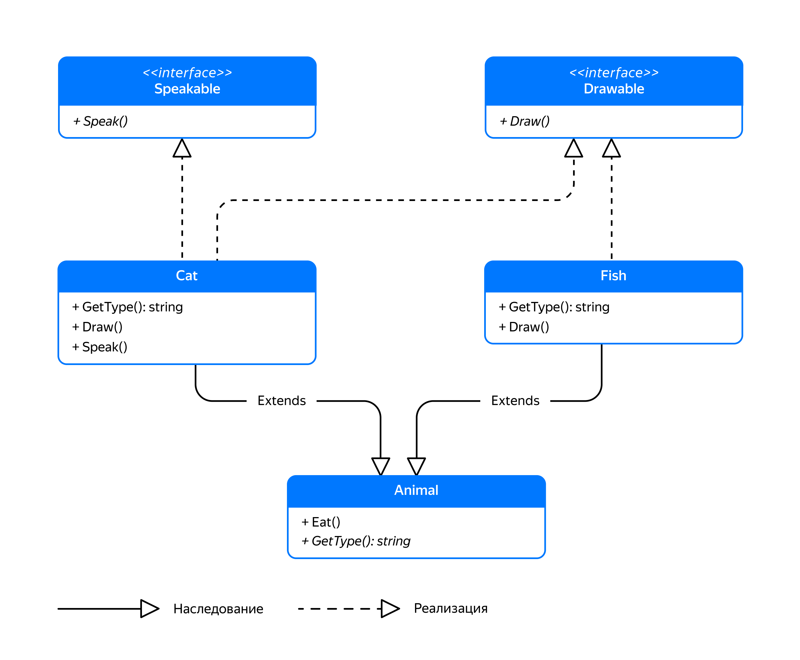
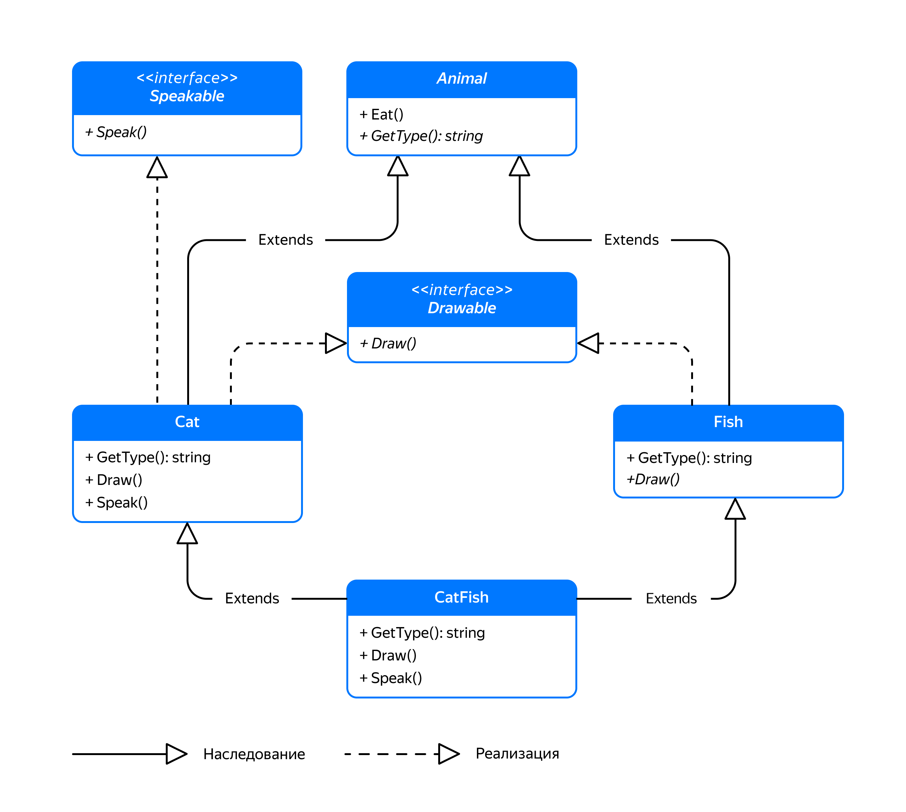
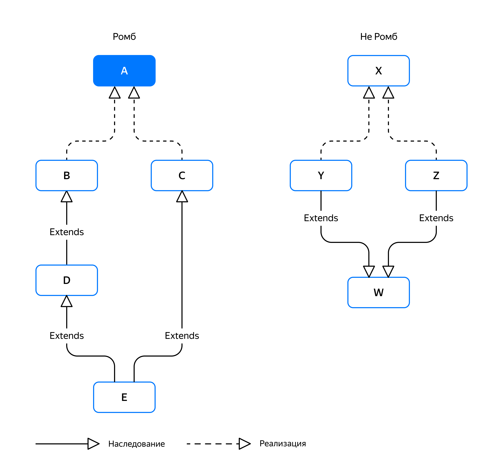
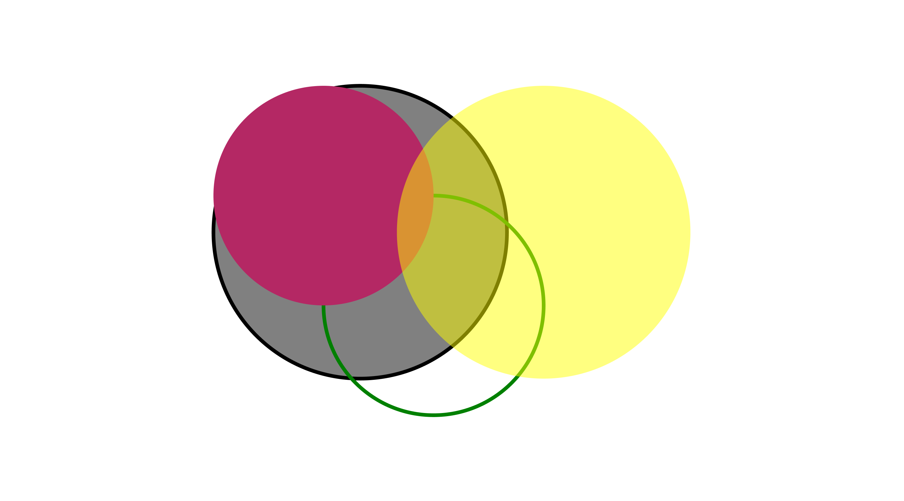
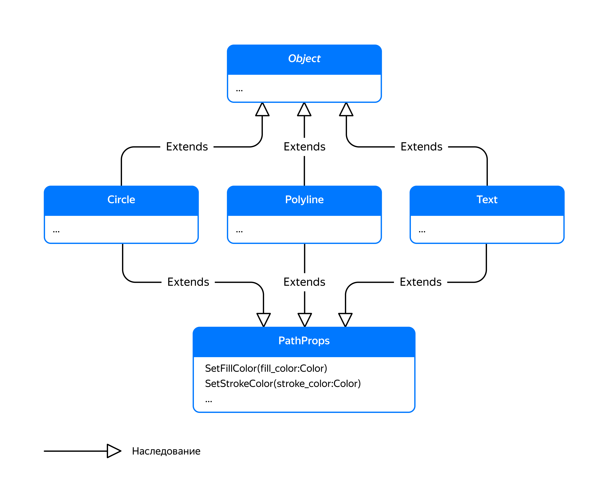

## Множественное наследование

C++ поддерживает множественное наследование — наследование от более чем одного базового класса. Оно позволяет классу реализовывать несколько интерфейсов или использовать функциональность сразу нескольких родительских классов.

Рассмотрим на примере классов `Cat` и `Fish`. `Рыбы` и коты — животные `Animal`, поэтому их можно покормить. Кроме того, коты — существа, которые, в отличие от рыб, обладают методом Speak. Назовём интерфейс таких объектов `Speakable`.



Когда класс наследуется от нескольких классов, все его базовые классы перечисляются через запятую:
```cpp
class Speakable {
public:
    virtual ~Speakable() = default;
    virtual void Speak() const = 0;
};

class Drawable {
public:
    virtual ~Drawable() = default;
    virtual void Draw() const = 0;
};

class Animal {
public:
    virtual ~Animal() = default;
    void Eat(string_view food) {
        cout << GetType() << " is eating "sv << food << endl;
        ++energy_;
    }
    virtual string GetType() const = 0;

private:
    int energy_ = 100;
};

// Рыба — и животное, и объект, который можно нарисовать
class Fish : public Animal, public Drawable {
public:
    string GetType() const override {
        return "fish"s;
    }
    void Draw() const override {
        cout << "><(((*>"sv << endl;
    }
};

// Кот — животное, он может говорить, и его можно нарисовать
class Cat : public Animal, public Speakable, public Drawable {
public:
    void Speak() const override {
        cout << "Meow-meow"sv << endl;
    }
    void Draw() const override {
        cout << "(^w^)"sv << endl;
    }
    string GetType() const override {
        return "cat"s;
    }
}; 
```
Благодаря публичному наследованию от класса `Animal` кошек и рыб можно покормить:
```cpp
void Feed(Animal& animal) {
    animal.Eat("meat"sv);
}

int main() {
    Cat cat;
    Fish fish;

    // И кошка, и рыба — животные, поэтому их можно покормить
    Feed(cat);
    Feed(fish);
} 
```
```
cat is eating meat
fish is eating meat 
```
С кошкой можно поговорить:
```cpp
void Talk(Speakable& speakable) {
    speakable.Speak();
}

int main() {
    Cat cat;
    Talk(cat);
} 
```
Вывод:
```
Meow Meow
```
Что произойдёт, если попробовать поговорить с рыбой?

```cpp
void Talk(Speakable& speakable) {
    speakable.Speak();
}

int main() {
    Fish fish;
    Talk(fish);
} 
```

— Программа не скомпилируется.

Функция `Talk` принимает ссылку на `Speakable`. Класс `Fish` не унаследован от `Speakable` и не имеет оператора приведения к `Speakable`. Поэтому программа даже не скомпилируется.

И кошку, и рыбу можно нарисовать:
```cpp
template <typename DrawableIterator>
void DrawPicture(DrawableIterator begin, DrawableIterator end) {
    for (; begin != end; ++begin) {
        const Drawable* drawable = *begin;
        drawable->Draw();
    }
}

int main() {
    Cat cat;
    Fish fish;

    // Рисование поддерживают и коты, и рыбы
    std::array<const Drawable*, 2> picture{&cat, &fish};
    DrawPicture(picture.begin(), picture.end());
} 
```
Вывод программы:
```
(^w^)
><(((*> 
```

Множественное наследование следует использовать аккуратно. В том числе чтобы не столкнуться с проблемой так называемого ромбовидного наследования. Оно возникает, когда родители производного класса имеют общего предка. Эта ситуация так называется, потому что иерархия классов похожа на ромб.

Для иллюстрации создадим класс `CatFish`, унаследованный от `Cat` и `Fish`. С архитектурной точки зрения так наследоваться неправильно: сом — это рыба, и к котам, кроме английского названия, никакого отношения не имеет. Но пример очень показательный.



На диаграмме получилось два «ромба», идущие по стрелкам наследования от `CatFish` к базовым классам `Drawable` и `Animal`.

Объявив класс `CatFish`, попробуем покормить получившуюся химеру:
```cpp
class CatFish : public Cat, public Fish {
};

int main() {
    CatFish cat_fish;
    Feed(cat_fish);
} 
```
Сразу столкнёмся с ошибкой компиляции:
```
prog.cc: In function 'int main()':
prog.cc:77:18: error: 'Animal' is an ambiguous base of 'CatFish'
   77 |     Feed(cat_fish);
      |                  ^ 
```
Проблема в том, что класс `CatFish` унаследовал функциональность `Animal` дважды — от кота и от рыбы. При вызове `Feed` возникает неоднозначность в том, как мы хотим покормить сома — как рыбу или как кота. Будто у него две пищеварительные системы. Если нас устраивает наличие у сома двух ртов, явно укажем, по какой ветке наследования хотим выполнить приведение типа:
```cpp
int main() {
    CatFish cat_fish;
    
    // Кормим сома сначала как кота
    Feed(static_cast<Cat&>(cat_fish));
    
    // Затем кормим сома как рыбу
    Feed(static_cast<Fish&>(cat_fish));

    // Также можно явно указать, какой из методов Eat() нужно вызвать
    cat_fish.Cat::Eat("milk");
} 
```
```
cat is eating meat
fish is eating meat
cat is eating milk 
```
Если с наличием у сома двух ртов ещё как-нибудь можно смириться, то рисование сома то как рыбы, то как кота, выглядит совсем уж дико. В C++ для решения этой проблемы можно использовать виртуальное наследование. Классы-родители, имеющие общего предка, должны наследоваться от этого предка виртуально. В данном случае `Cat` и `Fish` должны виртуально наследоваться от `Animal` и `Drawable`:
```
class Fish : public virtual Animal, public virtual Drawable { ... };

class Cat : public virtual Animal, public Speakable, public virtual Drawable { ... }; 
```
Теперь при наследовании от `Cat` и `Fish` класс `CatFish` будет иметь одну копию данных и методов их общих предков Animal и Drawable. Потребуется также явно переопределить методы Draw и GetType, ведь родительские классы `Cat` и `Fish` реализовали их по-разному, и нужно устранить эту неоднозначность:
```cpp
class CatFish : public Cat, public Fish {
public:
    string GetType() const override {
        return "catfish"s;
    }
    void Draw() const override {
        // Рисуем сома несколько иначе, чем рыбу
        cout << "><(((*){"sv << endl;
    }
};
```
Теперь `CatFish` получился вполне жизнеспособным. Его можно покормить и нарисовать. При этом он может ещё и поддержать беседу, жалобно мяукая:
```cpp
int main() {
    CatFish cat_fish;

    Feed(cat_fish);
    Talk(cat_fish);
    cat_fish.Draw();
} 
```
```
catfish is eating meat
Meow-meow
><(((*){ 
```
Вот такой получился странный сом — дитя порочного союза родителей, имеющих общего предка. Инцест до добра не доводит.

Пример с классом `CatFish` — искусственный. Обычно при множественном наследовании избегают ромбовидных иерархий классов. Виртуальное наследование применяется в тех редких случаях, когда нужно устранить описанные проблемы ромбовидной иерархии. 

Встречаются примеры и в стандартной библиотеке. В частности, класс std::basic_iostream, который является родителем для std::basic_stringstream и std::basic_fstream, виртуально наследуется от классов std::basic_istream и std::basic_ostream, имеющих общего предка.

Когда анализируете иерархии классов на предмет ромбовидного наследования, руководствуйтесь не геометрической формой иерархии, а наличием нескольких путей от класса-наследника до любого из его родителей. 

На рисунке показаны две похожие внешне диаграммы классов. На диаграмме слева существуют два пути от класса `E` до родительского класса `A`. На диаграмме справа классы `Y` и `Z` имеют только по одному пути до любого из своих родителей.



Итак, поддержка множественного наследования — полезная возможность C++, позволяющая реализовывать несколько интерфейсов и наделять классы функциональностью сразу нескольких классов. Главное — старайтесь избегать ромбовидного наследования.

Настало время применить множественное наследование на практике и заодно добавить долгожданную поддержку цвета в SVG-библиотеку.

### Да будет цвет!

В SVG-файле объекты, такие как круги, ломаные и тексты, поддерживают два типа цвета:

- Цвет заливки внутренностей. Задаётся атрибутом `fill`. По умолчанию для цвета заливки используется значение `black`. Вот почему выводимые библиотекой изображения были чёрными.

- Цвет контура фигур. Задаётся атрибутом `stroke`. По умолчанию используется значение `none`, означающее отсутствие контура.

Формат SVG поддерживает различные способы задания цвета. Вот некоторые из них:

- Именованное значение цвета, например: `red`, `green`, `blue`.

- Формат `rgb`, задающий значения интенсивностей красного, зелёного и синего компонента цвета в диапазоне от 0 до 255. Например: `rgb(255,0,0)`.

- Формат `rgba`, дополнительно задающий значение альфа-канала в диапазоне от 0.0 (абсолютно прозрачно) до 1.0 (абсолютно непрозрачно). Например: `rgba(255,100,10,0.5)`.
Этот SVG-файл рисует несколько цветных кругов:
```xml
<?xml version="1.0" encoding="UTF-8" ?>
<svg xmlns="http://www.w3.org/2000/svg" version="1.1">
  <circle cx="50" cy="50" r="40" fill="grey" stroke="black"/>
  <circle cx="70" cy="70" r="30" fill="none" stroke="green"/>
  <circle cx="40" cy="40" r="30" fill="rgb(180,40,100)"/>
  <circle cx="100" cy="50" r="40" fill="rgba(255,255,0,0.5)"/>
</svg> 
```



Сначала объявим тип `Color` в библиотеке svg как аналог типа `string`. Это поможет расширить способы задать цвет в будущих версиях библиотеки. Сразу же объявим константу `NoneColor` для упрощения задания цвета none:
```cpp
namespace svg {
...
using Color = std::string;

// Объявив в заголовочном файле константу со спецификатором inline,
// мы сделаем так, что она будет одной на все единицы трансляции,
// которые подключают этот заголовок.
// В противном случае каждая единица трансляции будет использовать свою копию этой константы
inline const Color NoneColor{"none"};
...
} 
```
Следующий вопрос, который нужно решить: как задать цвет заливки и обводки фигур. Заливкой и контуром обладают многие элементы SVG-файла, но не все. Например, элемент `<image>` не имеет заливки и обводки. Поэтому добавлять эти свойства в класс `svg::Object` не стоит.

Хорошее решение должно позволять выборочно добавлять свойства заливки и контура, а также ряд других свойств и при этом избегать дублирования кода.



Введём вспомогательный базовый класс `svg::PathProps`. Путь — представленный в виде последовательности различных контуров векторный объект, который будет содержать свойства, управляющие параметрами заливки и контура. Унаследовав от него классы `Circle`, `Polyline` и `Text`, мы сделаем их обладателями этих свойств.

```cpp
namespace svg {
...
class PathProps {
public:
    void SetFillColor(Color fill_color);
    void SetStrokeColor(Color stroke_color);
    ...
};

class Circle : public Object, public PathProps { ... };
...
} // namespace svg

int main() {
    svg::Circle circle;
    circle.SetFillColor("red"s);
} 
```

У такого способа есть один недостаток — отсутствует поддержка method chaining. Для устранения недостатка требуется возвращать из методов `PathProps::Set*` ссылку на текущий экземпляр правильного типа. Например, при вызове `SetFillColor` у класса `Circle` должна возвращаться ссылка `Circle&`. На помощь приходят шаблоны: класс `PathProps` должен принимать шаблонный параметр Owner, который задаёт тип класса, владеющего этими свойствами.

```cpp
namespace svg {
...
template <typename Owner>
class PathProps {
public:
    Owner& SetFillColor(Color color) {
        fill_color_ = std::move(color);
        return AsOwner();
    }
    Owner& SetStrokeColor(Color color) {
        stroke_color_ = std::move(color);
        return AsOwner();
    }

protected:
    ~PathProps() = default;

    // Метод RenderAttrs выводит в поток общие для всех путей атрибуты fill и stroke
    void RenderAttrs(std::ostream& out) const {
        using namespace std::literals;

        if (fill_color_) {
            out << " fill=\""sv << *fill_color_ << "\""sv;
        }
        if (stroke_color_) {
            out << " stroke=\""sv << *stroke_color_ << "\""sv;
        }
    }

private:
    Owner& AsOwner() {
        // static_cast безопасно преобразует *this к Owner&,
        // если класс Owner — наследник PathProps
        return static_cast<Owner&>(*this);
    }

    std::optional<Color> fill_color_;
    std::optional<Color> stroke_color_;
};

// Наследованием от PathProps<Circle> мы «сообщаем» родителю,
// что владельцем свойств является класс Circle
class Circle : public Object, public PathProps<Circle> {
    ...
    void RenderObject(const RenderContext& context) const {
        auto& out = context.out;
        out << "<circle cx=\""sv << center_.x << "\" cy=\""sv << center_.y << "\" "sv;
        out << "r=\""sv << radius_ << "\" "sv;
        // Выводим атрибуты, унаследованные от PathProps
        RenderAttrs(context.out);
        out << "/>"sv;
    }
    ...
};
...
} // namespace svg

int main() {
    svg::Circle c;
    // Теперь method chaining работает
    c.SetFillColor("red"s).SetStrokeColor("black").SetCenter({10, 10});
}
```

Защищённый метод `PathProps::RenderAttrs` используется в дочерних классах для вывода атрибутов, общих для всех наследников `PathProps`. В нашем случае это атрибуты `fill` и `stroke`.

Интересный приём, когда дочерний класс наследуется от шаблона и передаёт свой тип в качестве шаблонного параметра, имеет название Curiously Recurring Template Pattern (CRTP). Это один из инструментов обеспечения статического полиморфизма. В нашем случае он позволил элегантно реализовать method chaining без дублирования кода.