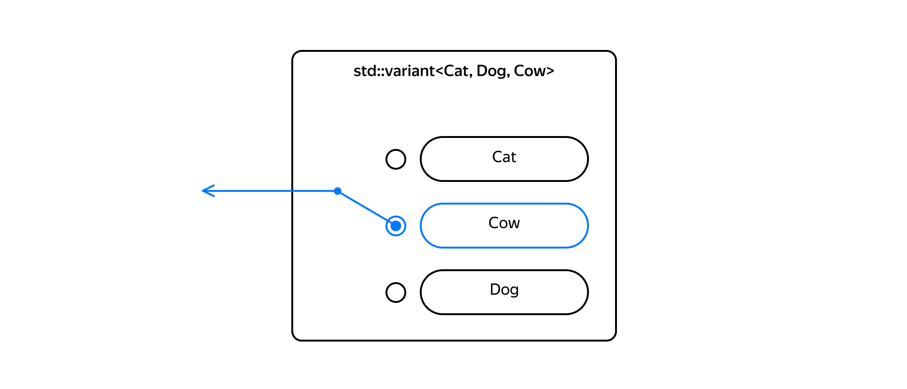

## Runtime-полиморфизм с std::variant

`std::variant` — стандартный шаблонный класс, который в один момент времени хранит значение одного из заданных типов либо, в случае ошибки, не содержит значения. Список типов, которые может хранить `variant`, задаётся в его шаблонных параметрах.



Перечень возможных типов решений квадратного уравнения известен заранее.
 Поэтому можно объявить тип `Solution`, который использует `variant` для объединения типов:
- `std::monostate` — означает, что действительных корней нет.
- `double` — хранит один действительный корень.
- `std::pair<double, double>` — хранит два действительных корня.

```cpp
#include <cmath>
#include <variant>

using namespace std;
using Solution = variant<monostate, double, pair<double, double>>; 
Тогда функцию SolveQuadraticEquation можно переписать так:

// Возвращает корни квадратного уравнения вида ax^2+bx+c=0
Solution SolveQuadraticEquation(double a, double b, double c) {
    if (a == 0) {
        throw invalid_argument("Not a quadratic equation"s);
    }

    const double d = b * b - 4 * a * c;
    if (d > 0) {
        const double sqrt_d = sqrt(d);
        const double dbl_a = 2.0 * a;
        return pair{(-b - sqrt_d) / dbl_a, (-b + sqrt_d) / dbl_a};
    } else if (d == 0) {
        return -b / (2 * a);
    } else {
        return monostate{};
        // либо return {}, так как monostate - самый первый элемент списка типов Solution
    }
} 
```
Эта версия функции не использует динамическое выделение памяти ни явно, ни косвенно: функция возвращает результат по значению, а объекты `variant` не выделяют память в куче. `variant` занимает объём памяти, достаточный, чтобы вместить любой из своих шаблонных параметров плюс служебные данные о том, какой из типов в данный момент хранится.

```cpp
int main() {
    cout << "sizeof(Solution)"sv << sizeof(Solution) << endl;
} 
```
Размер типа `Solution` составляет 24 байта: 16 байт достаточно для хранения типа `pair<double,double>`, имеющего наибольший размер, плюс 8 байт на служебные данные и обеспечение нужного выравнивания.

Когда программа решит квадратное уравнение, она должна вывести в `stdout` результат, зависящий от типа значения, которое в данный момент хранится в `variant`. Если классическое решение использовало для этих целей виртуальные методы, то `variant` предлагает другой способ поддержки полиморфизма времени выполнения:

- Создайте Посетитель — класс или структуру с перегруженными операциями () для каждого типа, которые могут содержаться в `variant`. Название «Посетитель» связано с паттерном проектирования «Посетитель». Этот паттерн работает по схожему принципу.

- Вызовите функцию `std::visit`, передав в неё Посетителя и переменную типа `variant`. Эта функция вызовет операцию `()` Посетителя, принимающую тот тип, который в данный момент хранится внутри `variant`.

Сравните, насколько компактнее можно реализовать вывод корней квадратного уравнения по сравнению с версией, использовавшей наследование:

```cpp
struct SolutionPrinter {
    void operator()(monostate) const {
        cout << "No roots"sv << endl;
    }
    void operator()(double root) const {
        cout << "One root: "sv << root << endl;
    }
    void operator()(pair<double, double> roots) const {
        cout << "Two roots: "sv << roots.first << " and "sv << roots.second << endl;
    }
};

int main() {
    const auto solution = SolveQuadraticEquation(1, 0, -4);
    // Функция visit вызовет оператор (), принимающий тот тип,
    // который хранится в variant
    visit(SolutionPrinter{}, solution);
}
```
Здесь код, который обрабатывает хранящееся внутри `variant` значение, выполняется Посетителем. В классическом решении класс `Solution` содержал метод `Print`, неотделимый от типа `Solution`.
Функция `visit` ещё во время компиляции требует, чтобы Посетитель содержал операции (), способные принять все хранящиеся в `variant` типы. Если это не так, программа не скомпилируется:

```cpp
struct IncompleteSolutionPrinter {
    /* Забыли перегрузить оператор () для monostate */
    void operator()(double root) const {
        cout << "One root: "sv << root << endl;
    }
    void operator()(pair<double, double> roots) const {
        cout << "Two roots: "sv << roots.first << " and "sv << roots.second << endl;
    }
};

int main() {
    const auto solution = SolveQuadraticEquation(1, 0, -4);

    // Эта строчка не скомпилируется (хотя сообщение об ошибке будет весьма мудрёным)
    visit(IncompleteSolutionPrinter{}, solution);
} 
```
Чтобы добавить новое действие над корнями, в классическом решении требовалось добавить новый виртуальный метод в базовый класс, а здесь нужно создать нового Посетителя. Так действия  изолируются друг от друга.
Это иллюстрирует структура `GreatestRootGetter`, которая находит значение наибольшего из корней квадратного уравнения:

```cpp
struct GreatestRootGetter {
    optional<double> operator()(monostate) const { return nullopt; }
    optional<double> operator()(double root) const { return root; }
    optional<double> operator()(pair<double, double> roots) const {
        return std::max(roots.first, roots.second);
    }
};

int main() {
    const auto solution = SolveQuadraticEquation(1, 0, -4);

    if (const auto greatest_root = visit(GreatestRootGetter{}, solution)) {
        cout << "Greatest root: "sv << *greatest_root << endl;
    } else {
        cout << "No roots"sv << endl;
    }
}
```
Класс-посетитель может обладать состоянием и использовать его в своей работе. Например, вместо вывода корней в `cout` Посетитель может выводить их в поток вывода, на который ссылается одно из его полей:
```cpp
struct OstreamSolutionPrinter {
    ostream& out;

    void operator()(monostate) const {
        out << "No roots"sv << endl;
    }
    void operator()(double root) const {
        out << "One root: "sv << root << endl;
    }
    void operator()(pair<double, double> roots) const {
        out << "Two roots: "sv << roots.first << " and "sv << roots.second << endl;
    }
};

int main() {
    const auto solution = SolveQuadraticEquation(1, 0, -4);

    ostringstream strm;
    // Выводим в поток strm
    visit(OstreamSolutionPrinter{strm}, solution);
    cout << strm.str();
} 
```

Обработать значение внутри `variant` можно, не создавая класс-посетитель. Для этого вместо Посетителя передайте универсальную — или обобщённую — лямбда-функцию. Она принимает параметр типа `auto`. В следующем примере печать корней уравнения выполняется функциями `PrintRoots`, вызываемыми из такой лямбда-функции:

```cpp
void PrintRoots(ostream& out, monostate) {
    out << "No roots"sv << endl;
}
void PrintRoots(ostream& out, double root) {
    out << "One root: "sv << root << endl;
}
void PrintRoots(ostream& out, pair<double, double> roots) {
    out << "Two roots: "sv << roots.first << " and "sv << roots.second << endl;
}

int main() {
    const auto solution = SolveQuadraticEquation(1, 0, -4);

    ostringstream strm;
    visit(
        [&strm](auto value) {
            // Это универсальная лямбда-функция (generic lambda).
            // Внутри неё нужная функция PrintRoots будет выбрана за счёт перегрузки функций.
            PrintRoots(strm, value);
        }, solution);

    cout << strm.str();
} 
```
Можно обойтись вообще без посетителей и функции `visit`, когда достаточно обработать некоторые частные случаи:
```cpp
int main() {
    const auto solution = SolveQuadraticEquation(1, 0, -4);

    // Проверка типа при помощи std::holds_alternative().
    if (holds_alternative<double>(solution)) {
        // Когда мы убедились, что variant сейчас хранит double,
        // можно смело брать это значение при помощи std::get.
        cout << "One root: "sv << get<double>(solution) << endl;
    }

    // ---------------

    // std::get_if вернёт указатель на значение нужного типа 
    // либо nullptr, если variant содержит значение другого типа.
    if (const auto* roots = get_if<pair<double, double>>(&solution)) {
        assert(roots != nullptr);
        cout << "Two roots: "sv << roots->first << " and "sv << roots->second << endl;
    } else {
        assert(roots == nullptr);
    }

    // ---------------

    try {
        // Если solution хранит значение типа double, получим ссылку на него.
        const double& root = get<double>(solution);
        cout << "One root: "sv << root << endl;
    } catch (const bad_variant_access& e) {
        // Либо словим std::bad_variant_access в случае ошибки.
        cout << e.what() << endl;
    }
} 
```
Достоинства `variant`:

- Позволяет передавать объекты по значению без динамического выделения памяти;
- Облегчает добавление новых «методов» — вы просто создаёте структуру или класс с перегруженными операциями `()`;
- Нет необходимости вводить базовый класс. `variant` позволяет объединять не связанные друг с другом классы и примитивные типы данных;
- При небольшом количестве типов внутри `variant` затраты на вызов нужной операции Посетителя функцией `visit` могут быть ниже, чем при использовании виртуальных функций.

Недостатки `variant`:

- Типы, объединяемые в `variant`, должны быть известны на этапе компиляции. Поэтому с ним не получится создать систему подключаемых модулей, которые ещё называются плагинами. С использованием наследования система, поддерживающая расширение, просто объявляет интерфейсы, а классы плагинов эти интерфейсы реализуют.
- Затрудняется добавление новых типов, так как это означает изменение сигнатуры типа, основанного на `variant`, и требует модификации всех посетителей.
- Неэффективное использование памяти, когда размеры типов сильно различаются. Если один из типов внутри `variant` занимает четыре байта, а другой — 100, итоговый тип будет иметь размер не менее 100 байт.
- Для каждой операции требуется создать отдельного Посетителя. Без должного контроля эти посетители будут разбросаны по различным файлам программы.
- Передача параметров Посетителю требует бо́льших усилий по сравнению с обычными методами, так как функция `std::visit` не предоставляет для этого никаких средств.
- При большом количестве типов внутри `variant` затраты на вызов нужной операции Посетителя могут быть выше, чем затраты на вызов виртуального метода.

Попробуем `variant` в действии. И начнём с улучшения SVG-библиотеки.