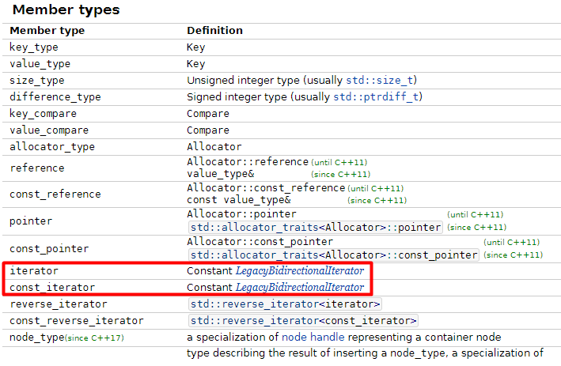
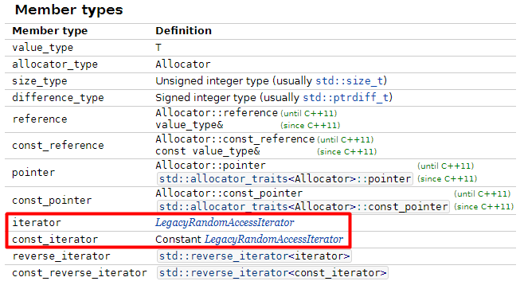

## Поддержка инвариантов в классах и объектах

В прошлом уроке вы рассмотрели два примера ошибок, которые компилятор не мог бы найти без указания константности. Правильное проектирование API, в частности сигнатуры функции, уберегает программу от ошибок во время работы.

В этом уроке вы увидите, как константность позволяет сохранить важные свойства объектов.

### Пример из стандартной библиотеки
```cpp
int main() {
    vector<int> v = {1, 10, 3, 6, 2, 9};
    auto it = find(v.begin(), v.end(), 3);
    *it = 15;
}
```

В этом примере алгоритм `find` находит в векторе число 3 и меняет его через итератор на число 15. Абсолютно никаких проблем. Но вдруг программист понял, что контейнер `vector` ему не подходит, и поменял его на `set`:
```cpp
int main() {
    set<int> v = {1, 10, 3, 6, 2, 9};
    auto it = find(v.begin(), v.end(), 3);
    *it = 15;
}
```
Что случится с этим кодом при компиляции и запуске? — Код не скомпилируется.
```
example.cpp:12:11: error: assignment of read-only location 'it.std::_Rb_tree_const_iterator<int>::operator*()'
     *it = 15;
```
Чтобы понять, почему так произошло, нужно вспомнить, как организован контейнер set. Обычно он представляет собой двоичное дерево поиска, где узлы в левом поддереве меньше текущего узла, а узлы правого поддерева — больше. Если разрешить пользователю доступ к изменению элементов через итераторы, контейнер потеряет контроль над этой структурой. Замена числа 3 на 15 приведёт к тому, что множество потеряет свой инвариант. Поэтому в стандартных библиотеках для поддержания инвариантов объектов используется константность, запрещающая изменения объекта. Посмотрите, как это выглядит в документации. Описание итератора множества:



Описание вектора:



В одном случае константность есть, а в другом — нет. Так благодаря константности на уровне проектирования библиотеки заложено сохранение инварианта объекта множества.

### Пример из жизни

Рассмотрим его:
```cpp
vector<int> Sorted(vector<int> nums) {
    sort(nums.begin(), nums.end());
    return nums;
}

int main() {
    // создадим отсортированный вектор
    vector<int> sorted_v = Sorted({1, 5, 9, 7, 15, 6});
    // допустим, тут очень много разного кода
    DoSomethingWithVector1(sorted_v);
    DoSomethingElseWithVector(sorted_v);
    DoOneMoreActionWithVector(sorted_v);
    // и еще много подобного кода

    int n;
    // прочитаем n чисел из потока ввода и найдём их в sorted_v
    cin >> n;
    for (int i = 0; i < n; i++) {
        int x;
        cin >> x;
        cout << x << ' ';
        cout << std::binary_search(sorted_v.begin(), sorted_v.end(), x) << endl;
    }
}
```
После создания `sorted_v` этот объект передаётся в различные функции и обрабатывается. Дойдя до момента поиска в векторе, программист хочет быть уверен, что вектор остался отсортированным, и никто не нарушил его инвариант. После путешествия по всем функциям вектор должен дойти до бинарного поиска в изначальном виде. Имеющийся код уверенности в этом не даёт. У программиста есть несколько путей.

Как программисту достичь желаемого результата?

— Пусть пройдётся по всем функциям DoSomethingWithVector и проверит, что происходит с вектором. Если окажется, что упорядоченность элементов меняется, пусть перепишет реализацию.

— Можно использовать контейнер set и не мучиться.

— Можно добавить ассерты после каждого вызова функции DoSomethingWithVector.
—  Хороший вариант. Выглядеть, правда, будет не очень красиво. А если внутри этих функций есть код, который всё-таки может изменить сортировку вектора, и это не произошло в отладочной сборке, остаётся риск, что в финальной сборке что-нибудь пойдёт не так, а программист об этом уже не узнает.

— А почему бы не сделать отдельный класс SortedVector, который предоставит только определённые методы, не изменяющие инвариант?


А можно просто объявить свой вектор константным.
```cpp
const vector<int> sorted_v = Sorted({1, 5, 9, 7, 15, 6});
```
Теперь важное свойство вектора — его отсортированность — надёжно защищено от изменений. В идеале все функции `DoSomethingWithVector`, принимающие вектор по ссылке, должны делать это через константную ссылку. Но в целом программист добился того, чего хотел.

Таким образом, константность в проектировании кода защищает инварианты объектов.