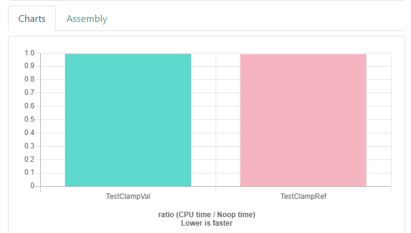
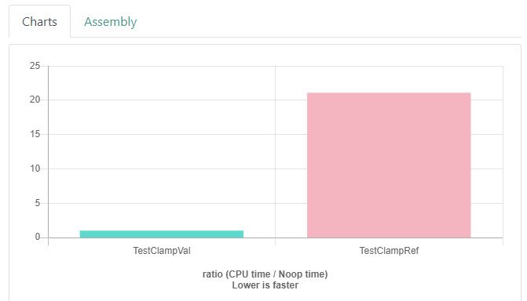
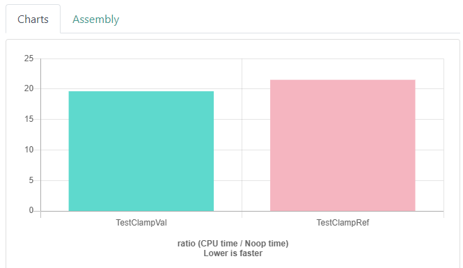

## Запускаем бенчмарки
Убедиться в том, что один способ передачи аргументов действительно эффективнее другого, поможет только реальное измерение производительности. Обычно мы делали это макросом `LOG_DURATION`, но в этом уроке поступим по-другому — обратимся к сервису Quick C++ Benchmarks, где запускать бенчмарки приятно и удобно. Он использует библиотеку Google Benchmark. Её можно скачать и делать тесты на своём компьютере.

Будем проверять, насколько отличается эффективность передачи аргумента типа `float` по ссылке от передачи по значению. Для примера выберем простую функцию округления `float` и приведения его к нужному диапазону:
```cpp
// Функция приводит число с плавающей точкой к диапазону от 0 до 255,
// округляя до ближайшего целого.
// Прибавление .5f нужно для правильного округления.
uint8_t ClampFloatVal(float v) {
    return static_cast<uint8_t>(std::max(0.f, std::min(255.f, v + .5f)));
} 
```
Будем сравнивать её с аналогичной функцией, принимающей аргумент по константной ссылке:
```cpp
uint8_t ClampFloatRef(const float& v) {
    return static_cast<uint8_t>(std::max(0.f, std::min(255.f, v + .5f)));
}
```
На сервисе Quick C++ Benchmarks каждая задача — это функция, принимающая аргумент `state` типа `benchmark::State&`. Внутри этой функции можно сделать предварительные приготовления и в цикле по `state` написать код, эффективность которого будет измеряться. Цикл нужен для того, чтобы библиотека Google Benchmark сама определила необходимое количество запусков для измерения времени:
```cpp
#include <cstdint>
#include <random>

uint8_t ClampFloatVal(float v) {
    return static_cast<uint8_t>(std::max(0.f, std::min(255.f, v + .5f)));
}

uint8_t ClampFloatRef(const float& v) {
    return static_cast<uint8_t>(std::max(0.f, std::min(255.f, v + .5f)));
}

float GetRandomFloat() {
    static std::random_device rd;
    static std::mt19937 gen(rd());

    std::uniform_real_distribution<float> dist(-1000, 1000);
    return dist(gen);
}

static void TestClampVal(benchmark::State& state) {
    float v0 = GetRandomFloat(), v1 = GetRandomFloat(), v2 = GetRandomFloat(), v3 = GetRandomFloat();

    // код внутри этого цикла будет измеряться
    for (auto _ : state) {
        benchmark::DoNotOptimize(ClampFloatVal(v0) + ClampFloatVal(v1) + ClampFloatVal(v2) + ClampFloatVal(v3));
    }
}
// регистрируем функцию как задачу
BENCHMARK(TestClampVal);

static void TestClampRef(benchmark::State& state) {
    float v0 = GetRandomFloat(), v1 = GetRandomFloat(), v2 = GetRandomFloat(), v3 = GetRandomFloat();

    // код внутри этого цикла будет измеряться
    for (auto _ : state) {
        benchmark::DoNotOptimize(ClampFloatRef(v0) + ClampFloatRef(v1) + ClampFloatRef(v2) + ClampFloatRef(v3));
    }
}
// регистрируем функцию как задачу
BENCHMARK(TestClampRef);
```
Мы добавили две задачи, которые по четыре раза вызывают измеряемую функцию. Числа сгенерировали предварительно. Также понадобилось обернуть результат в функцию `benchmark::DoNotOptimize`, чтобы оптимизатор вовсе не исключил этот код, видя, что его результат никак не используется.

Запустив бенчмарк, обнаружим, что разницы между двумя функциями нет:



Почему так происходит? — Вероятно, вмешался оптимизатор.

Для чистоты эксперимента добавим функциям атрибут, написав перед определением текст `__attribute__((noinline))`. Это запретит оптимизатору встраивать функции в место вызова:

```cpp
__attribute__((noinline)) uint8_t ClampFloatVal(float v) {
    return static_cast<uint8_t>(std::max(0.f, std::min(255.f, v + .5f)));
}

__attribute__((noinline)) uint8_t ClampFloatRef(const float& v) {
    return static_cast<uint8_t>(std::max(0.f, std::min(255.f, v + .5f)));
}
```

Запустим бенчмарк заново и увидим такую картину:



Поразительно, небольшое изменение заставило функцию с передачей по ссылке работать в 21 раз медленнее. Это уже больше согласуется со сказанным ранее.
Почему так происходит? — Встраивания больше не происходит, и оптимизатор не вмешивается.

Из приведённых бенчмарков можно сделать вывод: оптимизатор действительно встроил функции в первом примере, несмотря на то, что мы не запросили встраивание явно словом `inline`. В современных компиляторах это ключевое слово нужно больше для компоновщика, чем для оптимизатора: последний чаще всего сам решает, нужно ли встраивать функцию. После встраивания оптимизатору стало всё равно, как мы передавали аргумент, и он выбрал лучший способ — по значению.

Немного поменяем функции измерения. Вместо отдельных переменных создадим вектор. Как говорилось ранее, доступ к элементу вектора имеет нулевой оверхед, а значит, производительность вряд ли изменится:
```cpp
static void TestClampVal(benchmark::State& state) {
    float v0 = GetRandomFloat(), v1 = GetRandomFloat(), v2 = GetRandomFloat(), v3 = GetRandomFloat();

    std::vector<float> v = {v0, v1, v2, v3};

    for (auto _ : state) {
        benchmark::DoNotOptimize(ClampFloatVal(v[0]) + ClampFloatVal(v[1]) + ClampFloatVal(v[2]) + ClampFloatVal(v[3]));
    }
}
BENCHMARK(TestClampVal);

static void TestClampRef(benchmark::State& state) {
    float v0 = GetRandomFloat(), v1 = GetRandomFloat(), v2 = GetRandomFloat(), v3 = GetRandomFloat();

    std::vector<float> v = {v0, v1, v2, v3};

    for (auto _ : state) {
        benchmark::DoNotOptimize(ClampFloatRef(v[0]) + ClampFloatRef(v[1]) + ClampFloatRef(v[2]) + ClampFloatRef(v[3]));
    }
}
BENCHMARK(TestClampRef); 
```
Запускаем бенчмарк. Результат:



Время работы `ClampFloatRef` не изменилось — оверхед вектора действительно нулевой. Зато `ClampFloatVal` замедлилась в разы и практически сравнялась с функцией `ClampFloatRef`. При этом код функций мы не меняли, менялся только способ вызова.

Почему так происходит? — Теперь в обоих случаях происходит чтение памяти для доступа к элементу.

Чтобы объяснить этот эффект, нужно вспомнить, что передача аргумента по ссылке фактически эквивалентна передаче по указателю. Это значит, что для обращения к данным, переданным по ссылке, происходит чтение памяти по указателю. При использовании вектора чтение памяти всё равно происходит, поскольку в основе вектора лежит указатель. Выигрыша от передачи по значению тут практически не возникает. Только если обратиться напрямую к переменным, этих расходов можно избежать благодаря работе оптимизатора.

Когда передаётся тяжелый объект, например, строка или вектор, то другие операции чтения, несомненно перекроют затраты на один переход по указателю. Но если функция простая, как в примере этого урока, лишних операций лучше избегать.

Версия с передачей по значению никогда не была медленней. Это подтверждает золотое правило передачи аргумента: при прочих равных выбирайте передачу по значению. Однако выигрыш производительности можно не заметить — он зависит от многих факторов. Несмотря на то, что производительность может оказаться одинаковой, сигнатура функции с передачей аргумента по значению выглядит лучше и понятнее. А это иногда даже более важный фактор, чем производительность.