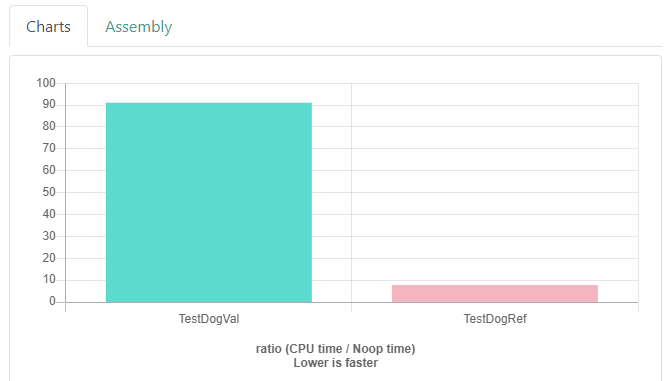

## Передаём умный указатель
Рассматривать частные случаи можно до бесконечности. Но у некоторых распространённых случаев есть нетривиальные нюансы. Таким случаям посвящены следующие два урока.

На этом этапе курса вы уже умеете самостоятельно догадываться, как правильно передавать объект.

Умные указатели `unique_ptr` и `shared_ptr` — перемещаемые объекты. Если функция сохраняет объект, то правильный способ передачи — по значению.

Рассмотрим случай, когда умный указатель нужен функции только на время её работы, а при завершении она не будет его сохранять и забудет. Как вы знаете, в этом случае передача по значению не обязательна.

Выбирая между передачей по ссылке и передачей по значению, какой способ вы бы предпочли для shared_ptr? — По константной ссылке — копирование содержит побочный эффект.

Указатель `shared_ptr` содержит счётчик ссылок. Это достаточно лёгкий объект, но его увеличение, уменьшение и проверка — лишние операции, которые не происходят при передаче по ссылке. Даже если в вашем случае этими издержками получится пренебречь, копирования `shared_ptr` всё равно могут быть нежелательны. Они непотокобезопасны, и их нельзя производить вне критической секции многопоточного приложения.

Выбирая между передачей по ссылке и передачей по значению, какой способ вы бы предпочли для unique_ptr? — По константной ссылке — постоянный unique_ptr вообще не получится передать по значению.

Класс `unique_ptr` вовсе запрещает копирование. Этот объект в большинстве случаев нельзя передавать по значению — только если функция намеревается его сохранить.

Чтобы подтвердить эти результаты, запустим бенчмарк на сайте quick-bench.com. Возьмём за основу программу о собаках и хозяевах из урока «Умный указатель `shared_ptr»`. В класс человека добавим метод для проверки принадлежности собаки. Реализуем его в двух видах — для приёма умного указателя по ссылке и по значению:

```cpp
#include <memory>
#include <string>
#include <string_view>
#include <iostream>

using namespace std;

class Dog {
public:
    explicit Dog(string name)
        : name_(move(name))  //
    {
        cout << name_ << " dog has been created"sv << endl;
    }

    ~Dog() {
        // Все псы попадают в рай
        cout << name_ << " dog has gone to heaven"sv << endl;
    }

private:
    string name_;
};

class Person {
public:
    explicit Person(string name)
        : name_(move(name)) {
    }

    ~Person() {
        cout << name_ << " has died"sv << endl;
    }

    // Стать владельцем собаки
    void OwnDog(shared_ptr<Dog> dog) {
        dog_ = move(dog);
    }

    const shared_ptr<Dog>& GetDog() const {
        return dog_;
    }

    __attribute__((noinline)) bool TestDogVal(shared_ptr<Dog> dog) const {
        return dog_ == dog;
    }

    __attribute__((noinline)) bool TestDogRef(const shared_ptr<Dog>& dog) const {
        return dog_ == dog;
    }

    // Перестаём владеть собакой
    void ReleaseDog() {
        dog_.reset();
        assert(!dog_);  // Указатель обнуляется после вызова reset
    }

private:
    string name_;
    shared_ptr<Dog> dog_;
};

static void TestDogVal(benchmark::State& state) {
  Person ivan("Иван"s);
  auto sharik = make_shared<Dog>("Шарик"s);
  auto barbos = make_shared<Dog>("Барбос"s);

  ivan.OwnDog(sharik);

  // Code inside this loop is measured repeatedly
  for (auto _ : state) {
    bool own_sharik = ivan.TestDogVal(sharik);
    bool own_barbos = ivan.TestDogVal(barbos);
    benchmark::DoNotOptimize(own_sharik | own_barbos);
  }
}
// Register the function as a benchmark
BENCHMARK(TestDogVal);

static void TestDogRef(benchmark::State& state) {
  Person ivan("Иван"s);
  auto sharik = make_shared<Dog>("Шарик"s);
  auto barbos = make_shared<Dog>("Барбос"s);

  ivan.OwnDog(sharik);

  // Code inside this loop is measured repeatedly
  for (auto _ : state) {
    bool own_sharik = ivan.TestDogRef(sharik);
    bool own_barbos = ivan.TestDogRef(barbos);
    benchmark::DoNotOptimize(own_sharik | own_barbos);
  }
}
// Register the function as a benchmark
BENCHMARK(TestDogRef); 
```

Результаты предсказуемы: передача умного указателя shared_ptr по значению оказалась значительно медленнее.



Хотя `TestDogRef` работает существенно быстрее, такой способ передачи умного указателя — неверный. Как вы помните, передача по ссылке эквивалентна передаче по указателю. Таким образом, передавая умный указатель по ссылке, вы передаёте указатель по указателю, или двойной указатель. В большинстве случаев это избыточно, ведь функция может принимать обычный указатель на сам объект или даже ссылку. Если функция не принимает владение умным указателем, передавать его и не следует — это усложняет сигнатуру и делает функцию менее универсальной.

Правильный вид метода `TestDog` таков:
```cpp
bool TestDog(const Dog* dog) const {
    return dog_.get() == dog;
}
```
По производительности он ничем не отличается от `TestDogRef`, но его сигнатура лучше.

Такая передача недопустима, если умный указатель ptr может быть пустым:
```cpp
void Process(const Elephant&);

...

shared_ptr<Elephant> ptr;

...

Process(*ptr); 
```
Ссылка не может ссылаться на несуществующий объект.

Если функция принимает объект через умный указатель, в неё не получится передать объект, хранящийся в локальной переменной или контейнере.

Приём через умный указатель — гораздо менее универсальный способ. Он запрещает функции принимать объекты, не хранящиеся в умном указателе.