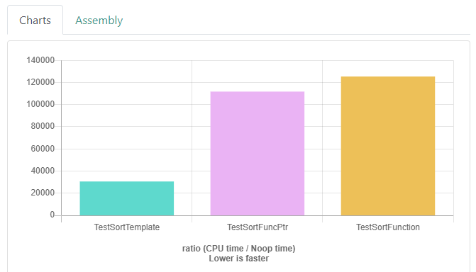

## Три способа передачи функций

Функциональное программирование — отдельный мир со своими законами. На нашей императивной планете, где находится C++, функция — это одно, а объект — другое. Но порой требуется совместить два понятия и посмотреть на функцию не как на кусочек кода в исходном файле, а как на нечто существующее во время выполнения программы. Нечто, что можно записать в переменную, передать параметром и в любой момент вызвать, заранее не зная, что именно запустится.

#### Первый способ — шаблонный параметр

Иногда параметром одного действия бывает другое действие. В программировании это выражается функциональным параметром. Вы видели подобные параметры в алгоритмах. Например, алгоритм sort допускает компаратор:

```cpp
template <typename RandomIt, typename Compare>
void sort(RandomIt first, RandomIt last, Compare comp);
```

Компаратор может быть любым объектом, допускающим вызов с двумя аргументами нужного типа. Например, стандартным компаратором `less`, лямбда-функцией или объектом класса с переопределённой операцией `operator()`.

Почему компаратор принимается по значению, а не по ссылке? — Часто компаратор вообще ничего не весит, передавать даже одну ссылку избыточно.

Многие компараторы — например, `std::less` — не имеют полей. Хотя по стандарту `sizeof` объекта не может быть ноль, он всё равно меньше размера ссылки. Если требуется передать компаратор по ссылке, это можно сделать, обернув его функцией `std::ref`.

В следующей программе один и тот же компаратор записан шестью разными способами:
```cpp
#include <algorithm>
#include <cassert>
#include <functional>
#include <iostream>
#include <string_view>

using namespace std;

template <typename T>
void TestComparator(T comp, std::string_view name) {
    vector v1{3, 1, 4, 555, 3, 4, 6, 3, 345, 53, 5, 345, 3};
    vector v2 = v1;
    
    sort(v1.begin(), v1.end());
    sort(v2.begin(), v2.end(), comp);
    
    cout << "Компаратор "sv << name << ": "sv << (v1 == v2 ? "OK"sv : "Fail"sv) << endl;
}

bool CmpFunction(int x, int y) {
    return x < y;
}

struct CmpObject {
    bool operator()(int x, int y) const {
        return x < y;   
    }
};

int main() {
    auto cmp_lambda = [](int x, int y) {
        return x < y;  
    };
    
    TestComparator(CmpFunction, "функция"sv);
    TestComparator(CmpObject(), "объект"sv);
    TestComparator(std::less<>(), "std::less"sv);
    Test```Comparator(cmp_lambda, "лямбда-функция"sv);
    TestComparator(std::ref(cmp_lambda), "лямбда-функция по ссылке"sv);
    TestComparator(std::function(CmpFunction), "std::function"sv);
}
```
Проверяем результат:
```
Компаратор функция: OK
Компаратор объект: OK
Компаратор std::less: OK
Компаратор лямбда-функция: OK
Компаратор лямбда-функция по ссылке: OK
Компаратор std::function: OK
```
Как видно, этот способ универсален — можно передать функцию сравнения в любом виде. Но в чём основной минус такой сигнатуры?
```cpp
template <typename RandomIt, typename Compare>
void sort(RandomIt first, RandomIt last, Compare comp); 
```

— Из типа параметра comp не ясно, какие параметры каких типов должен принимать компаратор. Из сигнатуры вообще ничего не ясно о компараторе.

#### Второй способ — указатель на функцию

Невнятная сигнатура — большой минус кода, хотя для стандартной библиотеки это не так страшно — понимание сигнатур её функций входит в умение программировать на C++. Можно сделать сигнатуру более внятной и прибегнуть к способу, который использовали задолго до появления шаблонов, в языке C, — указатели на функции. Например, функция, сортирующая `int`, будет выглядеть так:
```cpp
template <typename RandomIt>
void SortInt(RandomIt begin, RandomIt end, bool (*comp)(int x, int y));
```
Название параметра `comp`, вопреки обыкновению, записывается не после типа, а внутри. У этого параметра будет тип указателя на функцию, возвращающую `bool` и принимающую два параметра `int`. Запись получится более естественной, если создать для типа этого компаратора псевдоним: `bool (*)(int x, int y)`:
```cpp
using IntComparator = bool (*)(int x, int y);

template <typename RandomIt>
void SortInt(RandomIt begin, RandomIt end, IntComparator comp);
```

Сейчас сортировка ограничена значениями типа `int`. Можно сделать псевдоним для функции сравнения произвольных типов, убрав это ограничение:

```cpp
// псевдоним для типа элемента по итератору.
// iterator_traits — структура, дающая доступ к информации об итераторе.
// iterator_traits::value_type — тип, на который указывает итератор.
// typename — ключевое слово, указывающее, что зависимое от шаблонного параметра имя
// является типом.
template <typename Iterator>
using IterValType = typename iterator_traits<Iterator>::value_type;

// псевдоним для компаратора по типу
template <typename T>
using ComparatorByType = bool (const T& x, const T& y);

// псевдоним для компаратора по итератору
template <typename Iterator>
using ComparatorByIterator = ComparatorByType<IterValType<Iterator>>;

template <typename RandomIt>
void SortFuncPtr(RandomIt first, RandomIt last, ComparatorByIterator<RandomIt>* comp) {
    sort(first, last, comp);
}
```

Однако, улучшив сигнатуру, мы пожертвовали универсальностью — из шести компараторов, которые можно использовать при шаблонной передаче, остался только один — `CmpFunction`:
```cpp
#include <algorithm>
#include <cassert>
#include <functional>
#include <iostream>
#include <string_view>

using namespace std;

// псевдоним для типа по итератору
template <typename Iterator>
using IterValType = decay_t<decltype(*declval<Iterator>())>;

// псевдоним для компаратора по типу
template <typename T>
using ComparatorByType = bool (const T& x, const T& y);

// псевдоним для компаратора по итератору
template <typename Iterator>
using ComparatorByIterator = ComparatorByType<IterValType<Iterator>>;

template <typename RandomIt>
void SortFuncPtr(RandomIt first, RandomIt last, ComparatorByIterator<RandomIt>* comp) {
    sort(first, last, comp);
}

template <typename T>
void TestComparatorFuncPtr(T comp, std::string_view name) {
    vector v1{3, 1, 4, 555, 3, 4, 6, 3, 345, 53, 5, 345, 3};
    vector v2 = v1;
    
    sort(v1.begin(), v1.end());
    SortFuncPtr(v2.begin(), v2.end(), comp);
    
    cout << "Компаратор "sv << name << ": "sv << (v1 == v2 ? "OK"sv : "Fail"sv) << endl;
}

bool CmpFunctionRef(const int& x, const int& y) {
    return x < y;
}

int main() {
    // осталась только одна возможность
    TestComparatorFuncPtr(CmpFunctionRef, "функция"sv);
}
```
Причём аргументы функции пришлось сделать константными ссылками: обычные int уже не сгодятся, так как функция должна строго соответствовать типу, в который её собираются передать.

Применение указателя на функцию имеет существенный недостаток — функция не может использовать никаких внешних данных — только свои аргументы. Представьте, что хотите снять жильё поближе к месту работы. У вас есть список координат свободных квартир в виде `vector<pair<float, float>>`. Его нужно отсортировать по удалённости от офиса, координаты которого тоже известны. Отсортировав по удалённости, можно будет начать рассматривать квартиры с самой близкой.

Для сортировки по удалённости напишем функцию `SortByDistance`:
```cpp
#include <algorithm>
#include <cmath>
#include <vector>

using namespace std;

using Coordinates = pair<float,float>;

float Distance(Coordinates c1, Coordinates c2) {
    return hypot(c1.first - c2.first, c1.second - c2.second);
}

void SortByDistance(vector<Coordinates>& places, Coordinates origin) {
    sort(places.begin(), places.end(), [origin](Coordinates p1, Coordinates p2){
        return Distance(p1, origin) < Distance(p2, origin);
    });
}
```
Использовать для этой же цели `SortFuncPtr` не получится — она никак не сможет получить доступ к значению `origin`.

В таких случаях в языке С поступали просто и некрасиво. Добавляли в функцию лишний параметр типа `void*`, в который можно было передать по желанию любой указатель. Внутри функции этот указатель мог конвертироваться в указатель на структуру, содержащую все нужные данные. Вам, вероятно, придётся столкнуться с таким подходом, если будете использовать библиотеки, написанные на чистом C.

#### Третий способ — std::function

Выше разобраны два способа передачи функции в функцию:

- через шаблонный параметр, обладающий поразительной универсальностью, но невнятной сигнатурой;
  
- через указатель на функцию, обладающий хорошей выразительностью, но совершенно не универсальный.

Есть третий способ — такой же универсальный, как шаблонный параметр, и такой же выразительный, как указатель на функцию. Может быть, даже более выразительный. Он заключается в использовании шаблонного класса `std::function` из файла `<functional>.` Этот класс позволяет сделать указатель на функцию универсальным, способным принять любые компараторы и функциональные объекты. Единственный шаблонный параметр класса `std::function` — тип указателя на функцию.

С `std::function` сигнатура универсальной функции, сортирующей диапазон чисел, выглядит так:
```cpp
template <typename RandomIt>
void SortInt(RandomIt begin, RandomIt end, const function<bool(int, int)>& comp); 
```
Из неё сразу видно, что третий параметр должен быть функциональным объектом, принимающим два значения `int` и возвращающим `bool`. Такая сигнатура очень выразительна.

Можно сделать определённую выше функцию `SortFuncPtr` универсальной, добавив в неё `function`:
```cpp
template <typename RandomIt>
void SortFunction(RandomIt first, RandomIt last, const function<ComparatorByIterator<RandomIt>>& comp) {
    sort(first, last, ref(comp));
}
```
Проверим, что ни один компаратор не пострадал:
```cpp
#include <algorithm>
#include <cassert>
#include <functional>
#include <iostream>
#include <iterator>
#include <string_view>

using namespace std;

// value_type из iterator_traits позволяет получить
// тип элемента по итератору
template <typename Iterator>
using IterValType = typename iterator_traits<Iterator>::value_type;

template <typename T>
using ComparatorByType = bool (const T& x, const T& y);

template <typename Iterator>
using ComparatorByIterator = ComparatorByType<IterValType<Iterator>>;

template <typename RandomIt>
void SortFunction(RandomIt first, RandomIt last, const function<ComparatorByIterator<RandomIt>>& comp) {
    sort(first, last, ref(comp));
}

template <typename T>
void TestComparatorFunction(T comp, std::string_view name) {
    vector v1{3, 1, 4, 555, 3, 4, 6, 3, 345, 53, 5, 345, 3};
    vector v2 = v1;
    
    sort(v1.begin(), v1.end());
    SortFunction(v2.begin(), v2.end(), comp);
    
    cout << "Компаратор "sv << name << ": "sv << (v1 == v2 ? "OK"sv : "Fail"sv) << endl;
}

bool CmpFunction(int x, int y) {
    return x < y;
}

struct CmpObject {
    bool operator()(int x, int y) const {
        return x < y;   
    }
};

int main() {
    auto cmp_lambda = [](int x, int y) {
        return x < y;  
    };
    
    TestComparatorFunction(CmpFunction, "функция"sv);
    TestComparatorFunction(CmpObject(), "объект"sv);
    TestComparatorFunction(std::less<>(), "std::less"sv);
    TestComparatorFunction(cmp_lambda, "лямбда-функция"sv);
    TestComparatorFunction(std::ref(cmp_lambda), "лямбда-функция по ссылке"sv);
    TestComparatorFunction(std::function(CmpFunction), "std::function"sv);
}
```
Проверяем результат:
```cpp
Компаратор функция: OK
Компаратор объект: OK
Компаратор std::less: OK
Компаратор лямбда-функция: OK
Компаратор лямбда-функция по ссылке: OK
Компаратор std::function: OK
```
Почему мы передавали функцию по ссылке в `SortFunction`, а в `SortFuncPtr` — по значению? — `function` — тяжёлый объект, а указатель на функцию — лёгкий.

Значение `function` может содержать, например, связанные значения лямбды и поэтому быть тяжёлым объектом. Лучше не копировать `function` лишний раз. Кроме того, желательно принимать его по константной ссылке. Чтобы и `sort` принимал его по ссылке, используйте функцию `std::ref`. Это увеличивает эффективность `function`.

Выходит, `function` хорош всем. Но в стандартной библиотеке почему-то предпочли невнятную сигнатуру шаблонного типа. Разберёмся почему. Запустим бенчмарк, в котором сравним все три способа по производительности.
Его результаты наглядно объясняют выбор стандартной библиотеки:



Вариант с шаблонным параметром примерно в четыре раза обходит версию с `function`.

Почему так происходит? — С шаблоном лучше работает оптимизатор.

Только шаблонный вариант позволяет встроить функцию-компаратор в код сортировки.  Полученный после оптимизации алгоритм эквивалентен сортировке, где явно указан способ сравнения — без вызова функции сравнения каждой пары чисел. Полученная реализация очень быстрая.

В стандартной библиотеке на первом месте стоят производительность и универсальность и только потом внятность сигнатуры. Но стандарт C++20 может исправить ситуацию, введя концепты, которые улучшат понятность сигнатур шаблонных функций.