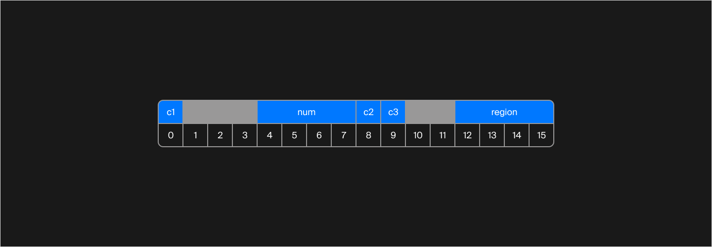
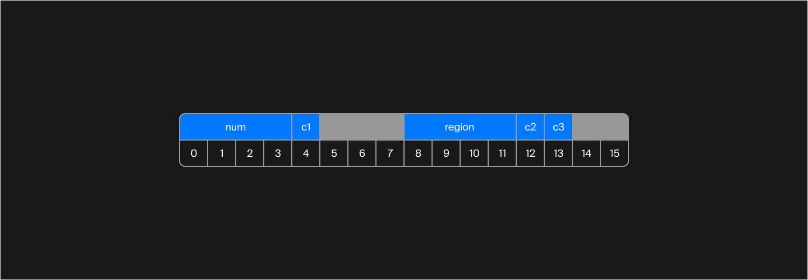
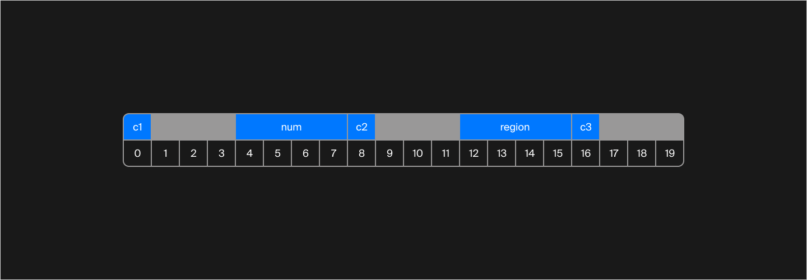
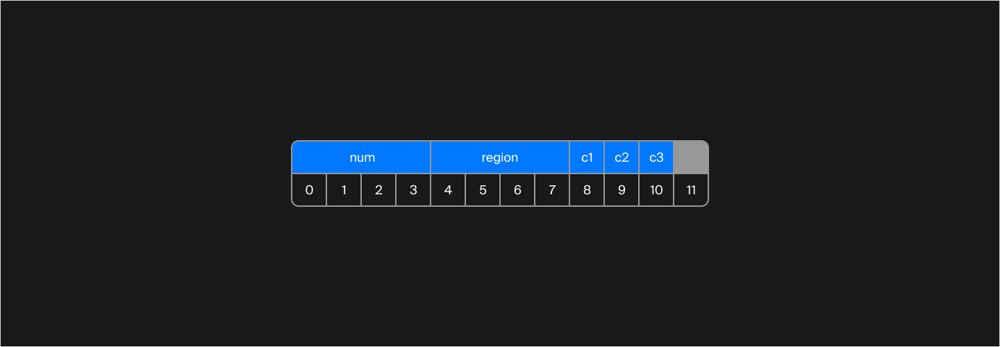

## От перемены мест слагаемых сумма...

Пора узнать, как созданные в программе объекты представлены в памяти. Можно сказать, что тема хранения объектов в памяти — для настоящих мастеров. Далеко не все программисты, пишущие код на С++, имеют об этом представление. Но хорошие программисты — точно имеют.

Понимание того, как объекты выглядят «изнутри», даёт разработчику больше инструментов для создания высокоэффективных программ, где размер объекта важен вплоть до битов. Быстрая передача данных через коммуникационные интерфейсы, создание приложений в условиях ограниченной памяти — всё это доступно только тем, кто знает, что прячется между полей структур.

Начнём с понятия о выравнивании. Вспомните структуру автомобильного номера. Вы уже работали с ней в уроке о хеш-функциях, и тогда символы были представлены в виде массива. Для наших целей пусть теперь это будут отдельные поля типа `char`:
```cpp
struct Plate {
    char c1;
    int num;
    char c2;
    char c3;
    int region;
};
```
Посчитаем, какого размера эта структура:

`char c1` — 1 байт;

`int num` — 4 байта;

`char c2` — 1 байт;

`char c3` — 1 байт;

`int region` — 4 байта.

Итого: 11 байт.

Используем программные средства, чтобы проверить себя:
```cpp
int main() {
    cout << sizeof(Plate) << endl;
}
```
Оператор [sizeof](https://en.cppreference.com/w/cpp/language/sizeof.html) возвращает размер объекта или типа данных, переданного в качестве параметра. Запустим программу и узнаем ответ. Каков же он?

> 16 байт. Все поля в этой структуре должны лежать по «коробочкам» из 4 байт. Таким образом, c1 займёт не 1 байт, а 4. c2 и c3 поместятся в одну «коробочку», но и там возникнут пустые 2 байта. Итого 11 байт для данных + 5 байт пустых.


Используем оператор `offsetof`. Он позволяет узнать, какое смещение в байтах имеет поле относительно начала объекта:
```cpp
int main() {
    cout << "Sizeof = "s << sizeof(Plate) << endl;
    cout << offsetof(Plate, c1) << endl;
    cout << offsetof(Plate, num) << endl;
    cout << offsetof(Plate, c2) << endl;
    cout << offsetof(Plate, c3) << endl;
    cout << offsetof(Plate, region) << endl;
}
```
Программа напечатает:
```cpp
Sizeof = 16

0
4
8
9
12 
```
Рисунок более наглядно иллюстрирует результат работы программы:


<div class="caption">
Синим цветом обозначены байты, занимаемые данными, а серым — байты, которые не содержат полезной для пользователя информации.
</div>

На данном этапе принцип расположения пока не очень понятен. Проведём несколько экспериментов. Будем менять порядок полей в структуре и рисовать схемы расположения полей. Вот какие схемы получатся:



<div class="caption">Размер структуры — 16 байт.</div>




<div class="caption">Размер структуры — 20 байт.</div>



<div class="caption">Размер структуры — 12 байт.</div>

Глядя на эти схемы, можно утверждать, что:

> От перемены мест полей в структуре общий размер структуры меняется.

> Поля типа `int` выравниваются по байту, кратному 4. 

Дальше подробно разберём правила выравнивания. Но сначала ответим на вопрос, зачем выравнивание нужно. Процессор — главный пользователь структур данных в коде. При каждом обращении к полю структуры для чтения или записи процессор должен найти данные в памяти. Выравнивание существует, чтобы облегчить процессору поиск. Процессор не читает из памяти побайтно. Обычно он делает это «словами» по 4 байта.

Если половина числа лежит в первых 4 байтах, а вторая половина — во вторых, процессору нужно будет прочитать из памяти дважды, а потом ещё и склеить число из двух половинок. Чтобы облегчить работу процессору, данные выравниваются.