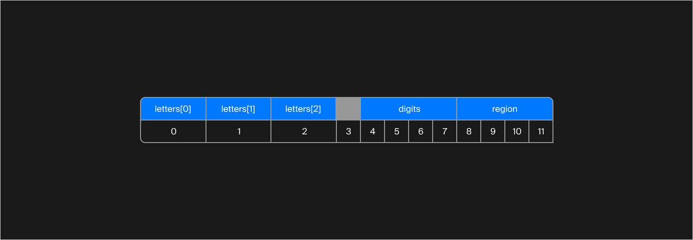
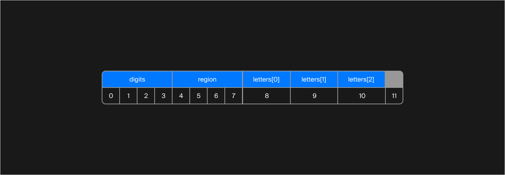
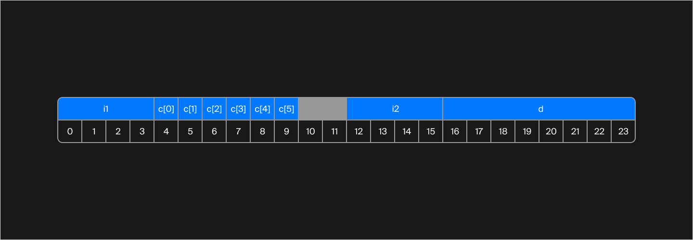
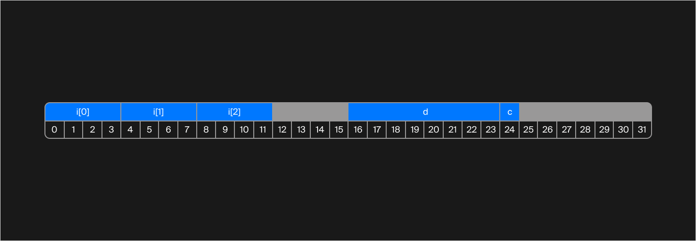

## Правила выравнивания

В прошлом уроке стало понятно, что поля структур в памяти расположены не абы как. И это неслучайно. Есть несколько правил выравнивания, которые спасают процессор от лишней работы.

### Правило 1: выравнивание типа по его размеру

Процессору удобно выравнивать типы данных по размеру. То есть тип `int` выравнивается по байтам, кратным 4. Тип `double` — по байтам, кратным 8. Тип `char` занимает всего 1 байт, поэтому не выравнивается никаким специальным образом.

Байты, оставшиеся неиспользованными, но нужные процессору для выравнивания, называются padding.

Вернёмся к идее коробочек. В структуре `Plate` максимальный размер поля равен 4. И если посмотреть внимательно, выравнивание всех полей происходит так, будто данные раскладываются в коробочки размера 4.

Разберёмся на примере:
```cpp
struct Plate {
    char c1;
    int num;
    char c2;
    char c3;
    int region;
};
```

Максимальный размер поля, как уже было сказано, равен 4. Возьмём первую коробочку размера 4 и начнём заполнять её. Положим первое поле `c1` размера 1:


Теперь нужно разместить следующее поле `num`. Его размер 4 байта, и оно не помещается в первую коробочку. Байты 1, 2 и 3 в первой коробочке используются как padding. Возьмём вторую коробочку и положим туда поле `num`:


Вторая коробочка заполнена, берём третью. Положим туда поле `c2`:


Следующее поле `c3` имеет тип `char`, значит, его не нужно выравнивать специальным образом. `c3` отлично вместится в третью коробочку рядом с `c2`:


Последнее поле `region` в третью коробочку уже не поместится. Берём последнюю четвёртую коробочку и кладём `region` туда. Байты 10 и 11 использованы для padding:


Общий размер структуры равен 16 байтам, из них 5 байтов — padding.

#### Правило 2: массивы

Когда структура содержит массив данных, каждый элемент массива представляет собой отдельный элемент. При этом, как вы уже знаете, данные массива располагаются в массиве последовательно. Возьмём структуру автомобильного номера в том виде, в каком она была в уроках о хеш-функциях:
```cpp
struct Plate {
    array<char, 3> letters;
    int digits;
    int region;
};
```
Схема полей этой структуры:




Общий размер структуры равен 12 байтам, из них 1 байт — padding.

### Правило 3: padding в конце структуры

Если последняя коробочка заполнена не до конца, незаполненные байты остаются частью структуры и учитываются в общем размере. Очевидным это правило становится, когда структуры помещаются в массив. Изменим порядок полей, чтобы в конце оставались неиспользованные байты:
```cpp
struct Plate {
    int digits;
    int region;
    array<char, 3> letters;
};
```
Схема расположения полей этой структуры:



Создадим массив таких структур:
```cpp
array<Plate, 2> Plates;
```
После первой структуры в памяти должна разместиться вторая, и отступы от начала структуры у полей должны быть точно такими же, как у первой структуры. Иначе процессору каждый раз придётся искать поля относительно начала массива, а не относительно начала конкретной структуры, что заметно усложнит процессору работу.

Даже если в последней коробочке достаточно места, чтобы начать размещать в ней поля следующей структуры, процессор не станет этого делать и возьмёт новую коробочку. Так отступы полей относительно начала структуры будут одинаковыми для всех элементов массива.

Посчитайте размер структуры и количество байтов для padding. Напишите ответ в формате `<размер_структуры><пробел><padding>`:
```cpp
struct X {
      int i1;
    array<char, 6> c;
    int i2;
    double d;
};
```

> 24 2

Так эта структура выглядит в памяти:



Посчитайте размер структуры и количество байтов для padding. Ответ в формате `<размер_структуры><пробел><padding>`:

```cpp
struct X {
    array<int, 3> i;
    double d;
    char c;
}; 
```
> 32 11

Так эта структура выглядит в памяти:

