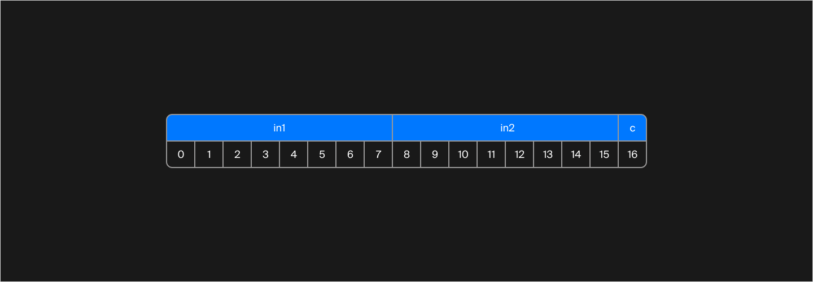
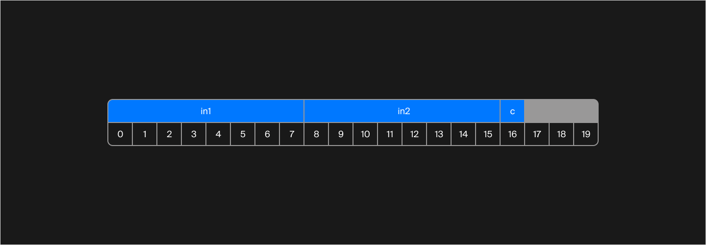

## Выравнивание сложных объектов
В первом правиле о выравнивании говорилось, что процессор выравнивает типы данных по размеру. Во всех примерах, которые вы рассмотрели ранее, данные были стандартных типов. В этом уроке вы узнаете, как выравниваются объекты, содержащие в себе другие объекты, и как выравниваются объекты при наследовании.

Рассмотрим две структуры:

```cpp
struct Inner {
    int i;
    char c;
};

struct Outer {
    Inner in1;
    Inner in2;
    char c;
};
```
Размер структуры `Inner` вы уже можете предположить, пользуясь знаниями о выравнивании стандартных типов. Чему равен sizeof(Inner)?

> Размер равен 8, так как тип `int` занимает 4 байта, тип `char` 1 байт и ещё 3 байта остаются во второй коробочке для padding.

Теперь используем макросы `offsetof` и проверим, как расположены поля внутри структуры: Outer
```cpp
cout << offsetof(Outer, in1) << endl;
cout << offsetof(Outer, in2) << endl;
cout << offsetof(Outer, c) << endl; 
```
Результат работы программы:
```cpp
0
8
16 
```
Визуализируем в виде схемы:


Всё здорово, но не хватает байтов для выравнивания в конце!


Первое поле структуры Inner имеет тип int, то есть должно быть выровнено по байту, кратному 4. Значит, в конце точно должны быть байты для выравнивания.
Предположите, чему в итоге равен размер структуры `Outer`.

> 20 байт

Вот финальная схема расположения полей в структуре `Outer`:



Порядок следования полей в структуре `Outer` изменён. Напишите в точности то, что выведет на экран программа:
```cpp
struct Inner {
    int i;
    char c;
};

struct Outer {
    Inner in1;
    char c;
    Inner in2;
};

int main() {
    cout << offsetof(Outer, in1) << " "s 
         << offsetof(Outer, c) << " "s 
         << offsetof(Outer, in2) << " "s 
         << sizeof(Outer) << endl;
}
```
> 0 8 12 20

Размер структуры остался неизменным, а поля типа `Inner` выровнены по 4 байтам, так как это максимальный размер типа внутри структуры `Inner`.