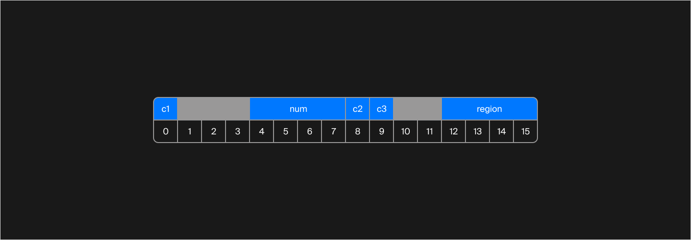
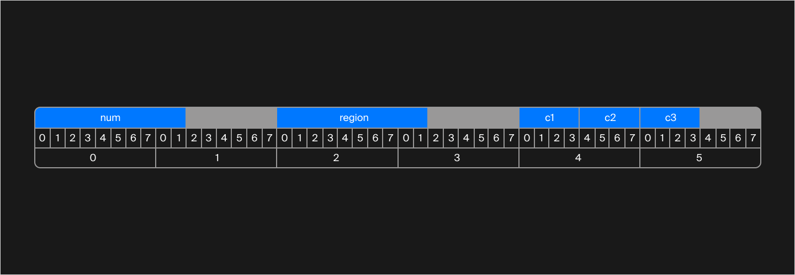

## Плотная упаковка
В этом уроке вы узнаете, как применять техники плотной упаковки. Она позволяет минимизировать количество байтов, нужных для хранения информации.

Плотная упаковка важна, когда память сильно ограничена, или когда, например, данные передаются большим потоком через каналы коммуникации.

Упакуем как следует уже известную вам структуру `Plate`:
```cpp
struct Plate {
    char c1;
    int num;
    char c2;
    char c3;
    int region;
};
```
Предположите, какой размер будет иметь максимально упакованная структура в конце этого урока.

> 4 байта и ни битом больше.

А теперь следите за руками. Магия начинается. Напоминаем, что схема размещения полей в памяти выглядит так:



Из 16 байт 5 ушло на padding.

Самое простое, что можно сделать, — переупорядочить поля. Пусть поля num и region идут в начале структуры, а однобайтовые `c1`, `c2` и `c3` — в конце:

```cpp
struct Plate {
    int num;
    int region;
    char c1;
    char c2;
    char c3;
};
```

Схема структуры теперь выглядит так:


Размер стал равен 12 байтам. Простой перегруппировкой получилось сократить размер структуры на 4 байта. 

Но можно лучше. 

Вспомните смысл поля `region` и `num`. Это код региона и номер. То есть каждое из этих полей точно не будет превосходить 1000. В таком случае 4 байта — это слишком много. Для представления чисел от 0 до 1000 достаточно 2 байт. Используем тип `uint16_t`, сэкономив при этом суммарно 4 байта:
```cpp
struct Plate {
    uint16_t num;
    uint16_t region;
    char c1;
    char c2;
    char c3;
}
```
Схема:


8 байт — отличный результат. Но можно лучше.
У программиста есть инструмент сэкономить биты выравнивания, усложнив при этом жизнь процессору. Это специальная директива `pragma pack`. Она сообщает процессору, что никакого выравнивания у структуры быть не должно. Все поля будут расположены одно за другим без учёта каких бы то ни было удобных коробочек.

Использование директивы `pragma pack` выглядит так:
```cpp
#pragma pack(push, 1)
struct Plate {
    uint16_t num;
    uint16_t region;
    char c1;
    char c2;
    char c3;
};
#pragma pack(pop)
```
Теперь размер структуры стал равен 7 байтам.
Но можно лучше.
Сколько нужно бит, чтобы хранить число в диапазоне от 0 до 1000?

> 10 бит.


Максимальное число, представимое в виде n бит вычисляется как $2^n-1$. То есть 2 бита могут максимум представить число $2^2-1=3$ (в двоичном формате 3 = 11), 4 бита - $-2^4-1=15$. В нашем случае 8 бит недостаточно — максимум составит 255. А 10 бит как раз хватит.

Определим поля `num` и `region` как битовые:
```cpp
#pragma pack(push, 1)
struct Plate {
    uint16_t num:10;
    uint16_t region:10;
    char c1;
    char c2;
    char c3;
};
#pragma pack(pop)
```
Пока мы ничего не выиграли. Но вспомните, что поля `c1` , `c2` и `c3` — это не просто символы, а буквы на автомобильном номере. В автомобильных номерах используются не все символы, а только 12 из них. Создадим массив таких символов, и вместо самих символов в структуре будем хранить индексы в этом массиве. Для хранения чисел от 0 до 12 будет достаточно 4 бит:

```cpp
const static int N = 12;
const std::array<char, N> Letters = {
    'A', 'B', 'E', 'K', 'M', 'H', 'O', 'P', 'C', 'T', 'Y', 'X'};

#pragma pack(push, 1)
struct Plate {
    uint16_t num:10;
    uint16_t region:10;
    uint8_t c1:4;
    uint8_t c2:4;
    uint8_t c3:4;
};
#pragma pack(pop) 
```
Вызвав макрос `sizeof`, программист узнает, что размер этой структуры — 6 байт.


<div class="caption">
Схема структуры изображена с детализацией до битов, чтобы яснее показать её устройство
</div>
 
Несмотря на то что поля `c1` и `c2` заявлены как тип `uint8_t`, компилятор видит, что пользователю нужно только 4 бита на каждое из них, и решает положить их в один байт, экономя место.

6 байт — уже достаточно круто. Но мы всё еще можем лучше.

Посчитаем, сколько битов занимает в памяти сами данные, без битов и байтов выравнивания. 10 бит для `num` + 10 бит для `region` + 4 бита на каждое из трёх полей с индексами символов. Итого 32 бита. Но 32 бита — это ровно 4 байта. Вся структура может уместиться в одну переменную типа `uint32_t`. Чтобы явно сказать это компилятору, определим структуру так:
```cpp
const static int N = 12;
const std::array<char, N> Letters = {
    'A', 'B', 'E', 'K', 'M', 'H', 'O', 'P', 'C', 'T', 'Y', 'X'};

#pragma pack(push, 1)
struct Plate {
    uint32_t num:10;
    uint32_t region:10;
    uint32_t c1:4;
    uint32_t c2:4;
    uint32_t c3:4;
};
#pragma pack(pop)
```
Размер структуры сократился с 16 байт до 4, как и было обещано в начале урока.

Последний трюк с переходом к `uin32_t` даёт выигрыш в данном конкретном случае, но не всегда он обязателен для плотной упаковки. Посмотрите на пример:

```cpp
#pragma pack(push, 1)
struct MonitoringData {
    uint32_t time;
    uint16_t patient_id:10;
    uint8_t age:7;
    uint8_t maximum_rate;
    uint8_t minimum_rate;
}
#pragma pack(pop)
```
Это структура, содержащая данные о мониторинге пульса пациента. Поле `time` — это время мониторинга в минутах. `patient_id` — некий внутренний id пациента, не превышающий тысячи. Возраст в поле `age` предполагается не превосходящим 120. Максимальный и минимальный пульс находятся в диапазоне от 0 до 255. Размер структуры 9 байт, а схема распределения полей в памяти такая:
```
*** Dumping AST Record Layout
         0 | struct MonitoringData
         0 |   uint32_t time
     4:0-9 |   uint16_t patient_id
     6:0-6 |   uint8_t age
         7 |   uint8_t maximum_rate
         8 |   uint8_t minimum_rate
           | [sizeof=9, align=1,
           |  nvsize=9, nvalign=1]
```
Поля выравниваются по границе их типов данных. 

Если заменить все поля на `uint32_t`, никакого выигрыша не получится. Мы даже наоборот проиграем:
```cpp
#pragma pack(push, 1)
struct MonitoringData {
    uint32_t time;
    uint32_t patient_id:10;
    uint32_t age:7;
    uint32_t maximum_rate:8;
    uint32_t minimum_rate:8;
}
#pragma pack(pop)
```
Размер такой структуры 12 байт. Вот как компилятор разложил поля в памяти:
```
*** Dumping AST Record Layout
         0 | struct MonitoringData
         0 |   uint32_t time
     4:0-9 |   uint32_t patient_id
     5:2-8 |   uint32_t age
     6:1-8 |   uint32_t maximum_rate
     8:0-7 |   uint32_t minimum_rate
           | [sizeof=12, align=1,
           |  nvsize=12, nvalign=1]
```
Каждый раз лучше перепроверять результат упаковки, чтобы выбрать оптимальный способ.

Вы можете спросить, почему бы всегда не упаковывать структуры так компактно. Память не резиновая, можно и поберечь её. Ответ в том, что бесплатного сыра в программировании практически никогда не бывает.

Проведём тест, который наглядно продемонстрирует, насколько процессору сложнее работать с плотно упакованными структурами:
```cpp
template <typename Plate>
void Test() {
    const size_t N = 500000;
    vector<Plate> plates(N);
    for (auto& plate : plates) {
        plate.c1 = rand() % 10;
        plate.num = rand() % 1000;
        plate.c2 = rand() % 10;
        plate.c3 = rand() % 10;
        plate.region = rand() % 1000;
    }

    LOG_DURATION(typeid(Plate).name());

    for (volatile Plate& plate : plates) {
        plate.c1 = (plate.c1 * 2) % 10;
        plate.region /= 5;
        plate.num = (plate.num + plate.region) % 1000;
        plate.region = (plate.region * 3) % 1000;
        plate.c2 -= plate.c3;
        plate.region = plate.c2;
        plate.c3 = (plate.c3 + 42) % 10;
        plate.region -= plate.c1;
        plate.c1 = (plate.c1 * 2) % 10;
        plate.region /= 5;
        plate.num = (plate.num + plate.region) % 1000;
        plate.region = (plate.region * 3) % 1000;
        plate.c2 -= plate.c3;
        plate.region = plate.c2;
        plate.c3 = (plate.c3 + 42) % 10;
        plate.region -= plate.c1;
        plate.c1 = (plate.c1 * 2) % 10;
        plate.region /= 5;
        plate.num = (plate.num + plate.region) % 1000;
        plate.region = (plate.region * 3) % 1000;
        plate.c2 -= plate.c3;
        plate.region = plate.c2;
        plate.c3 = (plate.c3 + 42) % 10;
        plate.region -= plate.c1;
    }
}
```
Вызовем этот тест для двух типов структур:
```cpp
const static int N = 12;
const std::array<char, N> Letters = {'A', 'B', 'E', 'K', 'M', 'H', 'O', 'P', 'C', 'T', 'Y', 'X'};

#pragma pack(push, 1)
struct PackedPlate {
    uint32_t num:10;
    uint32_t region:10;
    uint32_t c1:4;
    uint32_t c2:4;
    uint32_t c3:4;
};
#pragma pack(pop)

struct Plate {
    char c1;
    int num;
    char c2;
    char c3;
    int region;
};

...

void main() {
    Test<Plate>();
    Test<PackedPlate>();
}
```
Результаты работы программы:
```
5Plate: 18 ms
11PackedPlate: 51 ms
```
Разница очевидна. Процессору неудобно работать с плотно упакованными структурами, поэтому код значительно замедляется.