## Реализация методов Insert, Emplace и Erase

Ваши методы `PushBack`, `EmplaceBack` и `PopBack` добавляют и удаляют элемент в конце вектора. В этом уроке вы реализуете операции вставки и удаления элемента в произвольной позиции.

Чтобы задать позицию элемента, класс `std::vector` использует итераторы. Поступим аналогично. Проще всего объявить итераторы указателями на элементы контейнера:

```cpp
template <typename T>
class Vector {
public:
    using iterator = T*;
    using const_iterator = const T*;
    
    iterator begin() noexcept;
    iterator end() noexcept;
    const_iterator begin() const noexcept;
    const_iterator end() const noexcept;
    const_iterator cbegin() const noexcept;
    const_iterator cend() const noexcept;
    ...
}; 
```

### Реализация методов Insert и Emplace

Метод `Insert` вставляет элемент в заданную позицию вектора. Подобно `EmplaceBack` и `PushBack`, метод `Insert` допускает вставку элемента вектора внутрь того же самого вектора:

```cpp
template <typename T>
class Vector {
public:
    ...
    iterator Insert(const_iterator pos, const T& value);
    iterator Insert(const_iterator pos, T&& value);
};
```

При этом в работе метода возможны две основные ситуации:

1. Вектор имеет достаточную вместимость для вставки ещё одного элемента.

2. Вектор полностью заполнен. В результате вставка элемента приведёт к реаллокации памяти.

Рассмотрим наиболее общий случай вставки элемента вектора в этот же вектор, когда вместимость достаточна для ещё одного элемента.

Сначала скопируйте или переместите значение во временный объект в зависимости от версии метода `Insert`. Так вы убережёте значение от перезаписывания, когда вставляется элемент из этого же вектора.

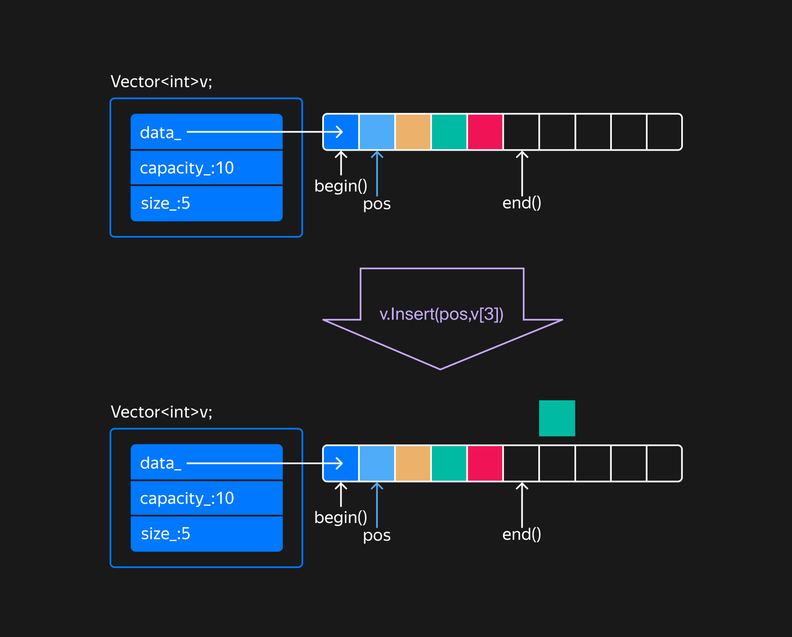

Прежде чем вставить элемент в середину вектора, освободите для него место. Сначала в неинициализированной области, следующей за последним элементом, создайте копию или переместите значение последнего элемента вектора:

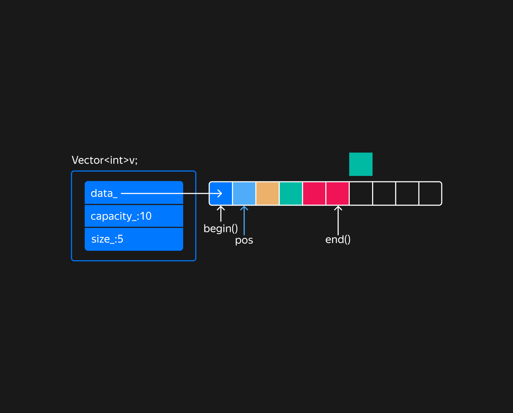

Затем переместите элементы диапазона `[pos, end()-1)` вправо на один элемент.
В какой последовательности нужно перемещать элементы вектора, чтобы освободить место для вставляемого элемента?

> От последнего до первого элемента диапазона. Так как элементы сдвигаются вправо, начать надо с последнего элемента и двигаться к первому.

Для сдвига элементов вправо используйте функцию [move_backward](https://en.cppreference.com/w/cpp/algorithm/move_backward.html). Она перемещает объекты, начиная с последнего. Так элементы не затрут друг друга. После перемещения элементов нужно переместить временное значение во вставляемую позицию.

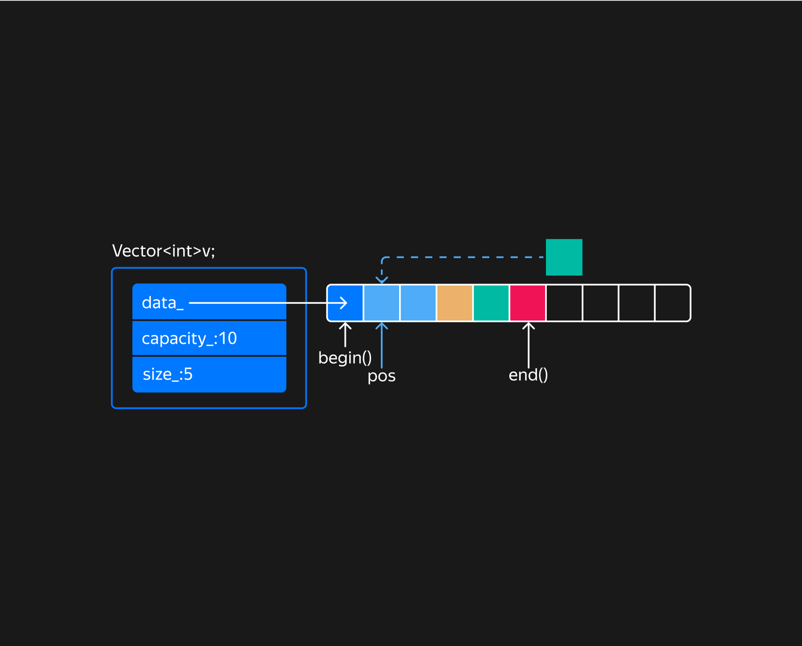

В конце остаётся обновить размер вектора и вернуть итератор, указывающий на вставленный элемент.

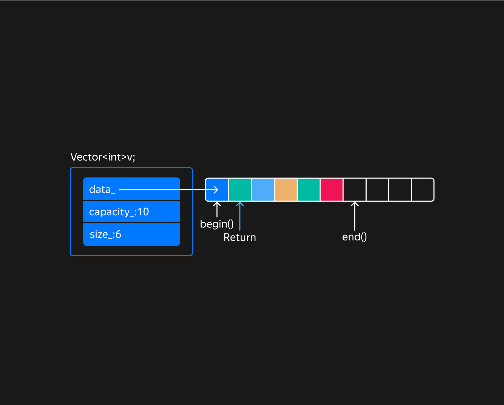

Теперь рассмотрим вставку элемента в полностью заполненный вектор:

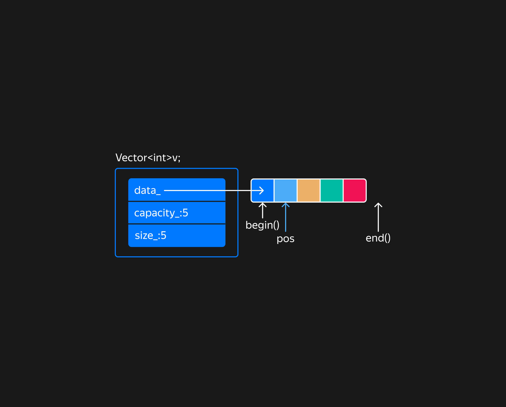

Итератор `pos` указывает на позицию вставки элемента. Рассмотрим случай, когда в вектор вставляется элемент этого же вектора:
```cpp
Vector<int> v(5);
auto pos = v.begin() + 1;
v.Insert(pos, v[3]);
```
На первом шаге нужно выделить новый блок сырой памяти с удвоенной вместимостью. Затем сконструировать в ней вставляемый элемент, используя конструктор копирования или перемещения. Это зависит от версии метода `Insert`.

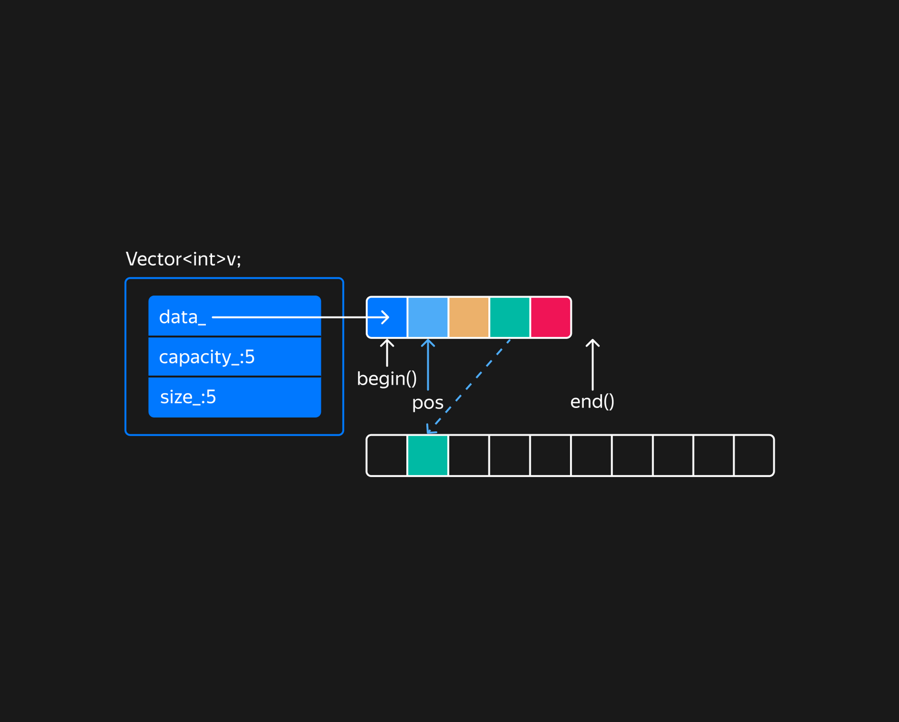

Вставляемый элемент сконструируйте в новом блоке памяти до конструирования остальных элементов, чтобы корректно обработать вставку элемента из этого же вектора.

Если будет выброшено исключение, на этом этапе нужно просто удалить выделенную сырую память. Деструктор `RawMemory` сделает это автоматически.

Затем копируются либо перемещаются элементы, которые предшествуют вставленному элементу:

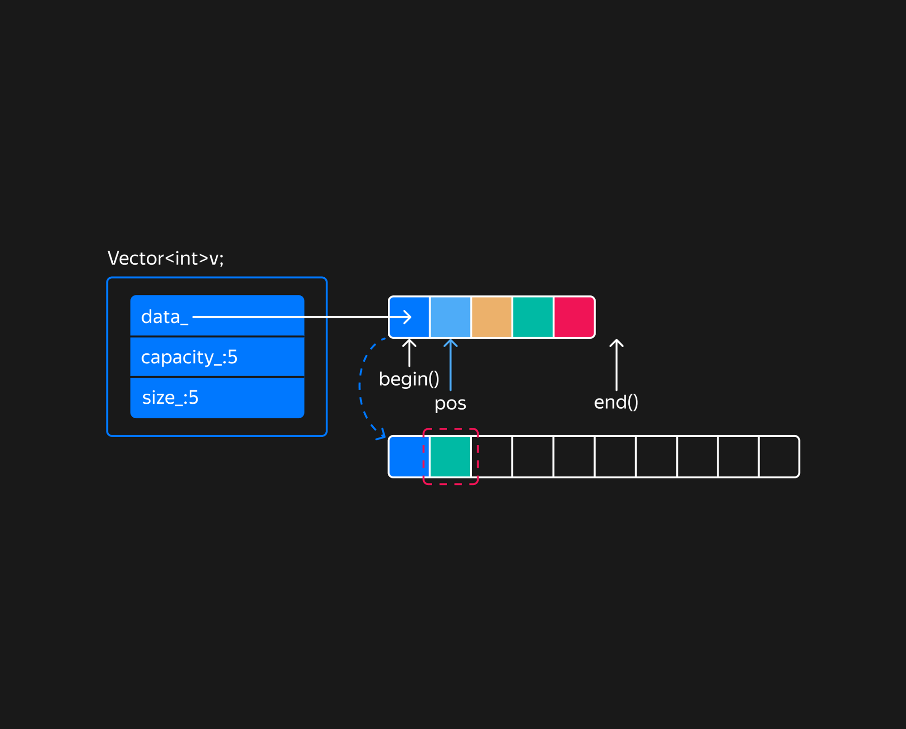

Если исключение выбросится при их копировании, нужно разрушить ранее вставленный элемент в обработчике. На рисунке элемент выделен красной пунктирной рамкой.

Затем копируются либо перемещаются элементы, которые следуют за вставляемым:

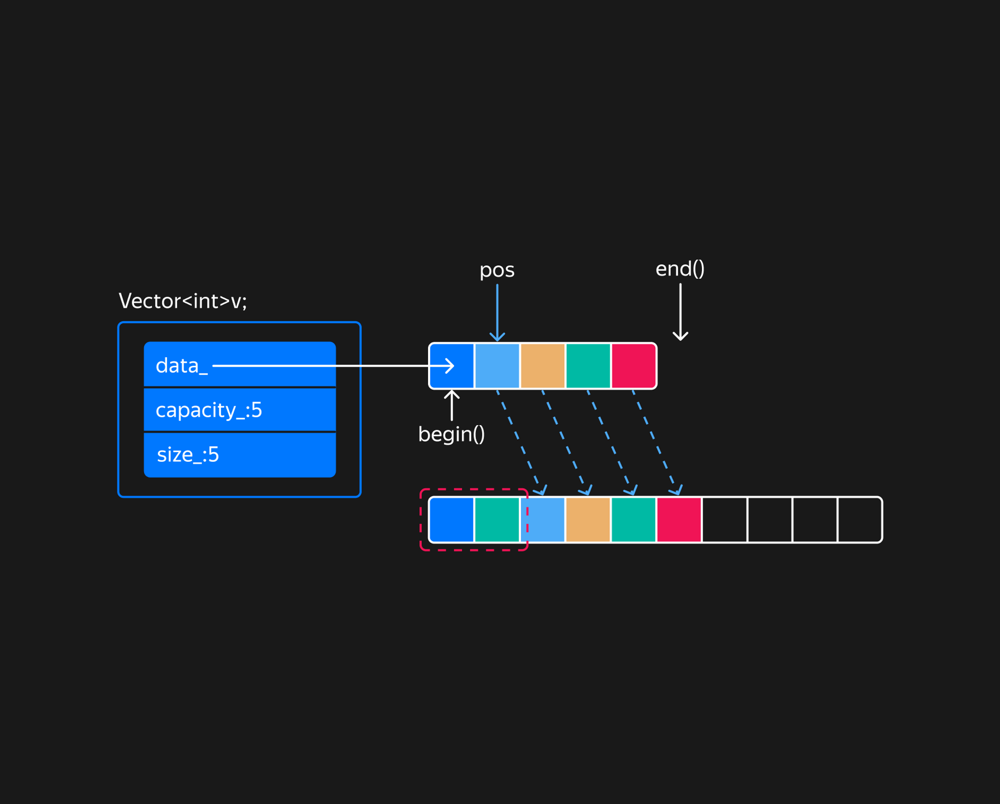

Если выбросится исключение при конструировании элементов, следующих за `pos`, выделенные рамкой элементы нужно разрушить.

На последнем шаге разрушаются исходные элементы, а занимаемая память возвращается обратно в кучу. Вектор обновляет свой размер и вместимость и ссылается на новый блок памяти. На этом этапе исключения не выбрасываются.

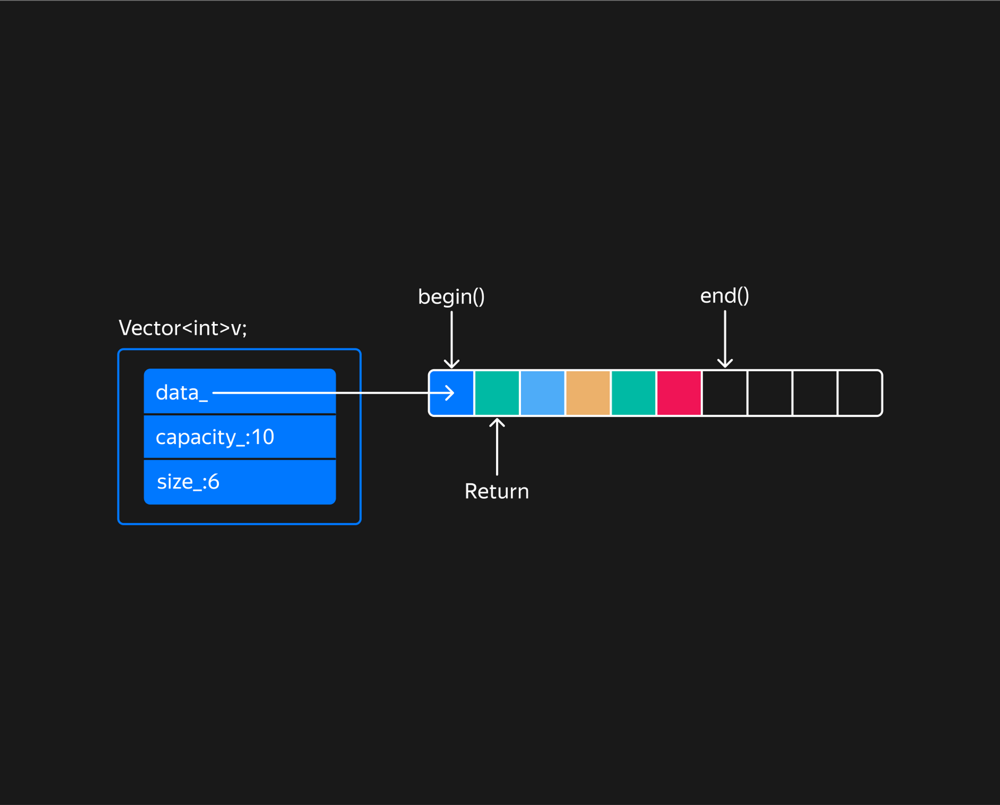

Метод `Insert` возвращает итератор, указывающий на вставленный элемент в новом блоке памяти.

Метод Emplace действует по такому же алгоритму. Основное отличие от Insert в том, что Emplace для передачи своих параметров конструктору элемента использует perfect forwarding:
```cpp
template <typename T>
class Vector {
public:
    ...
    template <typename... Args>
    iterator Emplace(const_iterator pos, Args&&... args);
};
```
Так как `Emplace` способен передать свои аргументы любому конструктору `T`, включая конструкторы копирования и перемещения, оба метода `Insert` можно реализовать на основе `Emplace`.

### Реализация метода `Erase`

Метод `Erase` удаляет элемент, на который указывает переданный итератор:

```cpp
template <typename T>
class Vector {
public:
    ...
    iterator Erase(const_iterator pos);
};
```

Разберём алгоритм работы метода `Erase` на примере удаления элемента из середины вектора:

```cpp
Vector<int> v{5};
...
v.Erase(v.cbegin() + 1);
```

Сначала на место удаляемого элемента нужно переместить следующие за ним элементы. Для этого применим алгоритм `std::move`, который последовательно перемещает диапазон элементов. Алгоритм использует перемещающий оператор присваивания, а при его отсутствии — копирующий.

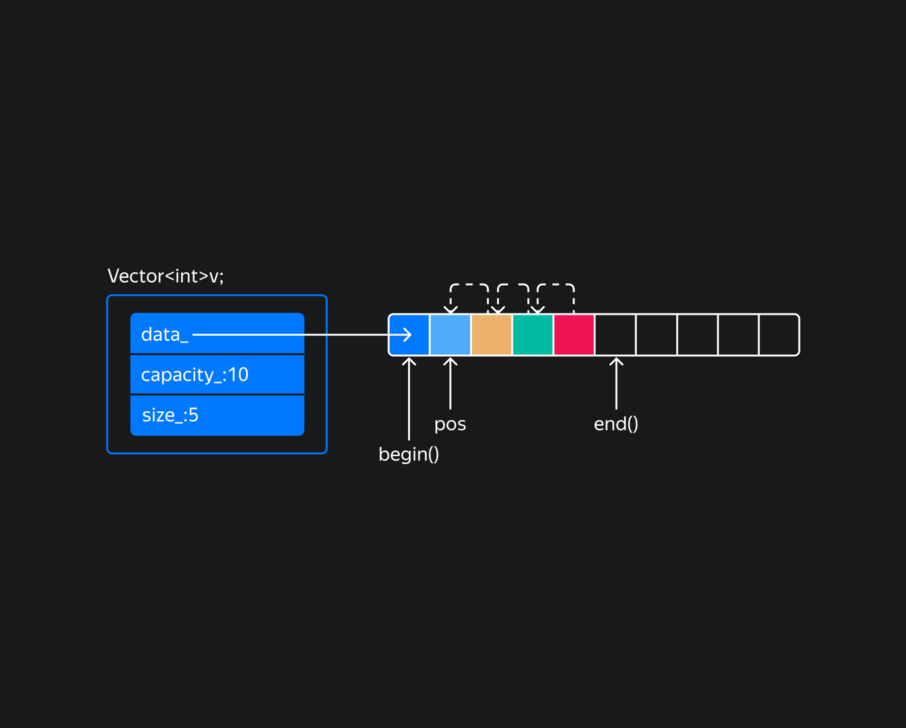

После перемещения элементов в конце вектора останется «пустой» элемент, значение которого содержится в предыдущем элементе:

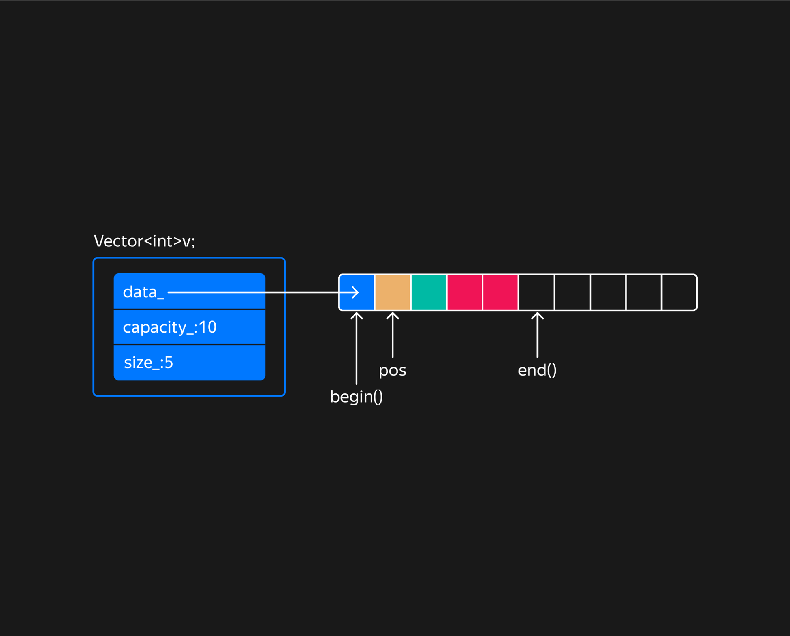

После разрушения объекта в конце вектора и обновления поля `size_` удаление элемента можно считать завершённым. Метод `Erase` возвращает итератор, который ссылается на элемент, следующий за удалённым. А если удалялся последний элемент вектора, возвращает end-итератор.

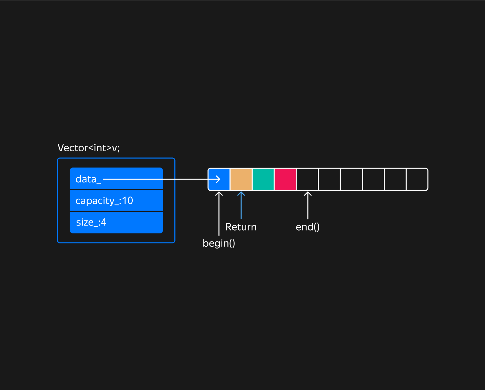