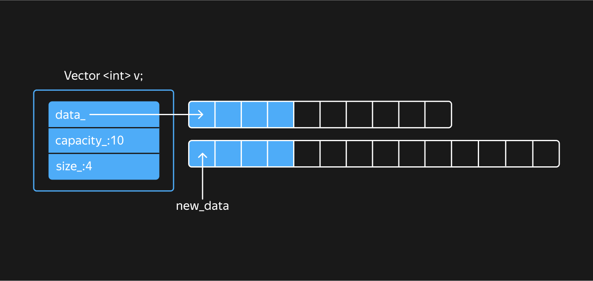
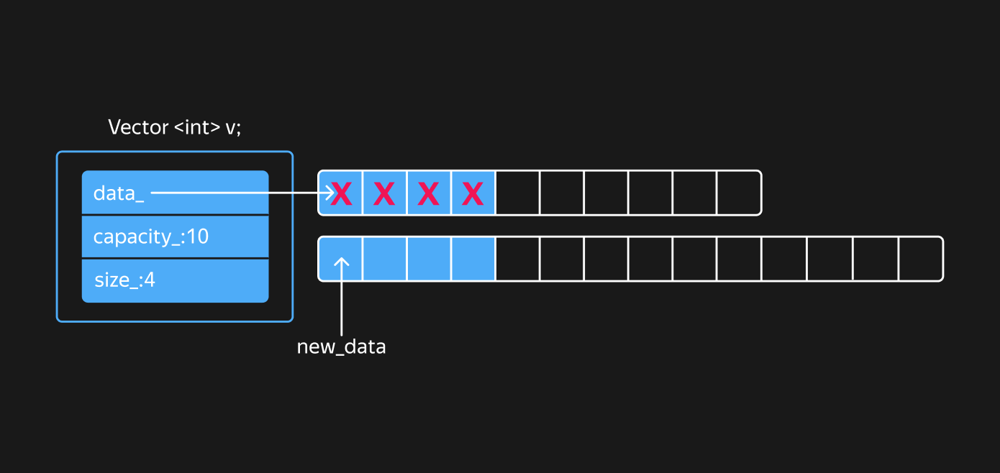
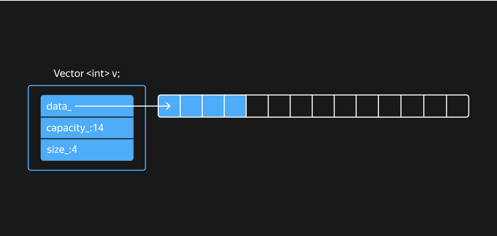

## Наивная реализация базового функционала класса Vector

В этом уроке вы начнёте писать с нуля класс `Vector`. Вам предстоит реализовать его конструкторы, деструкторы и метод `Reserve`. Для простоты изложения вопрос безопасности `Vector` к возникновению исключений рассматривать не будем.

Во внутреннем представлении класс `std::vector` хранит указатель на область памяти, в которой непрерывным блоком размещаются элементы динамического массива, вместимость вектора и его размер.

Выберем аналогичный подход в своей реализации класса `Vector`. На рисунке показан вектор вместимостью 10, содержащий 4 элемента.

Начнём с заготовки шаблонного класса `Vector` с полями `data_`, `capacity_` и `size_`. Класс будет иметь вспомогательные методы `Size` и `Capacity`, а также две версии оператора `[]` для доступа к элементам вектора:
```cpp
template <typename T>
class Vector {
public:
    size_t Size() const noexcept {
        return size_;
    }

    size_t Capacity() const noexcept {
        return capacity_;
    }

    const T& operator[](size_t index) const noexcept {
        return const_cast<Vector&>(*this)[index];
    }

    T& operator[](size_t index) noexcept {
        assert(index < size_);
        return data_[index];
    }
private:
    T* data_ = nullptr;
    size_t capacity_ = 0;
    size_t size_ = 0;
};
```
В константном операторе `[]` используется оператор  [const_cast](https://en.cppreference.com/w/cpp/language/const_cast.html), чтобы снять константность с ссылки на текущий объект и вызвать неконстантную версию оператора `[]`. Так получится избавиться от дублирования проверки `assert(index < size)`. Оператор `const_cast` позволяет сделать то, что нельзя, но, если очень хочется, можно. В данном случае нельзя вызвать неконстантный метод из константного. Но неконстантный оператор `[]` тут не модифицирует состояние объекта, поэтому его можно вызвать, предварительно сняв константность с объекта.

Конструктор по умолчанию у вектора будет инициализировать вектор нулевого размера и вместимости, данные которого указывают на `nullptr`. Если не обращаться к его элементам, он уже вполне работоспособен:
```cpp
int main() {
    Vector<int> v;
    assert(v.Size() == 0);
    assert(v.Capacity() == 0);
}
```
Создадим вспомогательные статические методы `Allocate` и `Deallocate`, чтобы выделить и освободить сырую память. Для этого используем функции `operator new` и `operator delete`, изученные в прошлом уроке:
```cpp
template <typename T>
class Vector {
public:
    ...
private:
    // Выделяет сырую память под n элементов и возвращает указатель на неё
    static T* Allocate(size_t n) {
        return n != 0 ? static_cast<T*>(operator new(n * sizeof(T))) : nullptr;
    }

    // Освобождает сырую память, выделенную ранее по адресу buf при помощи Allocate
    static void Deallocate(T* buf) noexcept {
        operator delete(buf);
    }
    ...
};
```
Если размер выделяемого массива нулевой, функция `Allocate` не выделяет память, а просто возвращает `nullptr`. Такая оптимизация направлена на экономию памяти — нет смысла выделять динамическую память под хранение пустого массива и зря расходовать память под служебные данные.

Следующие вспомогательные методы предназначены для конструирования и разрушения массивов объектов в сырой памяти:
```cpp
template <typename T>
class Vector {
public:
    ...
private:
    // Вызывает деструкторы n объектов массива по адресу buf
    static void DestroyN(T* buf, size_t n) noexcept {
        for (size_t i = 0; i != n; ++i) {
            Destroy(buf + i);
        }
    }

    // Создаёт копию объекта elem в сырой памяти по адресу buf
    static void CopyConstruct(T* buf, const T& elem) {
        new (buf) T(elem);
    }

    // Вызывает деструктор объекта по адресу buf
    static void Destroy(T* buf) noexcept {
        buf->~T();
    }
    ...
};
```
Функция `operator delete` не выбрасывает исключений. Это же требование можно предъявить и к шаблонному параметру `T`, поэтому смело объявляйте функции `Destroy` и `Deallocate` как `noexcept`.

Теперь используем эти вспомогательные функции, чтобы написать конструктор, создающий вектор заданного размера. Все элементы такого вектора будут проинициализированы значением по умолчанию для типа `T`:
```cpp
template <typename T>
class Vector {
public:
    Vector() = default;

    explicit Vector(size_t size)
        : data_(Allocate(size))
        , capacity_(size)
        , size_(size)  //
    {
        for (size_t i = 0; i != size; ++i) {
            new (data_ + i) T();
        }
    }
    ...
};
```
Этот конструктор сначала выделяет в сырой памяти буфер, достаточный для хранения  элементов в количестве, равном `size`. Затем конструирует в сырой памяти элементы массива. Для этого он вызывает их конструктор по умолчанию, используя размещающий оператор `new`.

Корректная реализация деструктора для контейнера `Vector`.
```cpp
template <typename T>
class Vector {
public:
    ...
    ~Vector() {
        DestroyN(data_, size_);
        Deallocate(data_);
    }
    ...
};  
```
Сначала необходимо вызвать деструкторы у `size_` элементов массива, используя функцию `DestroyN`. Затем нужно освободить выделенную динамическую память, используя функцию `Deallocate`.


Для корректного разрушения контейнера `Vector` нужно сначала вызвать `DestroyN`, передав ей указатель data_ и количество элементов `size_`, а затем `Deallocate`, чтобы вернуть память обратно в кучу:
```cpp
template <typename T>
class Vector {
public:
    ...
    ~Vector() {
        DestroyN(data_, size_);
        Deallocate(data_);
    }
    ...
};
```
Чтобы создать копию контейнера `Vector`, выделим память под нужное количество элементов, а затем сконструируем в ней копию элементов оригинального контейнера, используя функцию `CopyConstruct`:
```cpp
template <typename T>
class Vector {
public:
    Vector(const Vector& other)
        : data_(Allocate(other.size_))
        , capacity_(other.size_)
        , size_(other.size_)  //
    {
        for (size_t i = 0; i != other.size_; ++i) {
            CopyConstruct(data_ + i, other.data_[i]);
        }
    }
    ...
};
```

Здесь вместимость копии равна размеру оригинального вектора. Это экономит память: независимо от вместимости оригинального вектора копия будет занимать столько памяти, сколько нужно для хранения его элементов. Кроме того, если оригинальный вектор был пустым, функция `Allocate` не станет выделять память в куче вообще.

Метод `Reserve` предназначен для заблаговременного резервирования памяти под элементы вектора, когда известно их примерное количество.
```cpp
template <typename T>
class Vector {
public:
    ...
    void Reserve(size_t new_capacity) {
        if (new_capacity <= capacity_) {
            return;
        }
        T* new_data = Allocate(new_capacity);
        for (size_t i = 0; i != size_; ++i) {
            CopyConstruct(new_data + i, data_[i]);
        }
        DestroyN(data_, size_);
        Deallocate(data_);

        data_ = new_data;
        capacity_ = new_capacity;
    }
    ...
};
```
Если требуемая вместимость больше текущей, `Reserve` выделяет нужный объём сырой памяти.

На следующем шаге из массива `data_` копируются значения в только что выделенную область памяти.



После копирования элементы в прежнем массиве разрушаются.



В конце прежняя область памяти освобождается, и вектор начинает указывать на новую область памяти. Также обновляется значение поля `capacity_`.



Так реализуются конструкторы, деструкторы и метод `Reserve` у класса `Vector`. Теперь вам предстоит собрать класс `Vector` из имеющихся фрагментов.