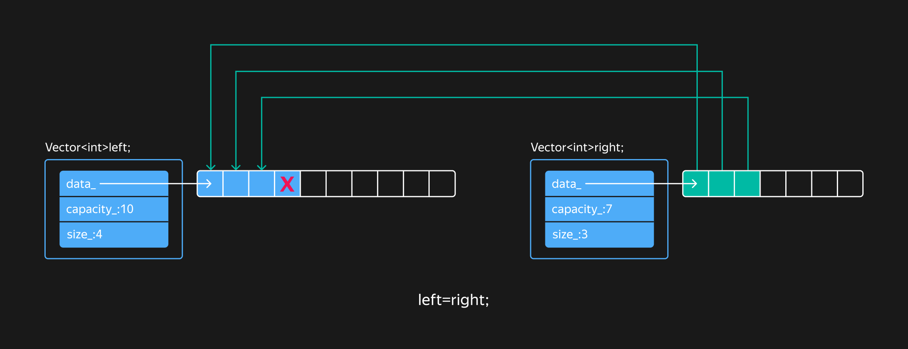

## Оператор присваивания и move-конструктор

В этом уроке вы реализуете перемещающий конструктор и операторы присваивания для класса `Vector`. Но сначала нужно навести порядок с конструкторами и операторами присваивания для класса `RawMemory`.

Класс `RawMemory` нарушает «правило трёх» и «правило пяти». В них говорится, что если класс имеет одну из следующих специальных функций-членов, то в нём, скорее всего, должны быть объявлены и остальные:

- конструктор копирования;
- копирующий оператор присваивания;
- деструктор;
- конструктор перемещения;
- перемещающий оператор присваивания.

Действительно, в `RawMemory` объявлен лишь деструктор, освобождающий сырую память. Сгенерированные компилятором остальные функции-члены скопируют указатель `buffer_` и поле `capacity_`. Из-за этого несколько объектов `RawMemory` станут конкурировать за владение одной и той же областью памяти, что приведёт к неопределённому поведению при их разрушении.

Операция копирования не имеет смысла для класса `RawMemory`, так как у него нет информации о количестве находящихся в сырой памяти элементов. Копирование элементов определено для класса `Vector`, который использует сырую память для размещения элементов и знает об их количестве.

Поэтому конструктор копирования и копирующий оператор присваивания в классе `RawMemory` должны быть запрещены. Это исключит возможность их случайного вызова. Зато перемещающие конструктор и оператор присваивания классу `RawMemory` нужны:
```cpp
template <typename T>
class RawMemory {
public:
    RawMemory(const RawMemory&) = delete;
    RawMemory& operator=(const RawMemory& rhs) = delete;
    RawMemory(RawMemory&& other) noexcept { ... }
    RawMemory& operator=(RawMemory&& rhs) noexcept { ... }
    ...
};
```
Перемещающие конструктор и оператор присваивания не выбрасывают исключений и выполняются за $O(1)$.

Теперь обновлённый класс `RawMemory` можно применить, чтобы реализовать операции перемещения и присваивания класса `Vector`.

Move-конструктор класса `Vector` легко написать, если использовать соответствующий конструктор `RawMemory`. После перемещения новый вектор станет владеть данными исходного вектора. Исходный вектор будет иметь нулевой размер и вместимость и ссылаться на `nullptr`.

Взгляните на код оператора присваивания, основанный на идиоме copy-and-swap:
```cpp
template <typename T>
class Vector {
public:
    Vector& operator=(const Vector& rhs) {
        if (this != &rhs) {
            Vector rhs_copy(rhs);
            Swap(rhs_copy);
        }
        return *this;
    }
    void Swap(Vector& other) noexcept;
    ...
};
```
Какие недостатки у этой реализации оператора присваивания? 

Операция присваивания недостаточно эффективна.
Идиома copy-and-swap каждый раз выделяет динамическую память и создаёт элементы вектора с нуля. Если вместимость вектора-приёмника достаточна, можно реализовать присваивание более эффективно.

При простом применении copy-and-swap вектор-приёмник будет каждый раз выделять новый кусок динамической памяти, даже если он уже достаточно вместителен.
Более оптимальная стратегия — применять copy-and-swap только когда вместимости вектора-приёмника не хватает, чтобы вместить все элементы вектора-источника:
```cpp
template <typename T>
class Vector {
public:
    Vector& operator=(const Vector& rhs) {
        if (this != &rhs) {
            if (rhs.size_ > data_.Capacity()) {
                /* Применить copy-and-swap */
            } else {
                /* Скопировать элементы из rhs, создав при необходимости новые
                   или удалив существующие */
            }
        }
        return *this;
    }
    void Swap(Vector& other) noexcept;
    ...
};
```
Когда вектор-приёмник может вместить все элементы вектора-источника, нужно обработать две ситуации.

1. Размер вектора-источника меньше размера вектора-приёмника. Тогда нужно скопировать имеющиеся элементы из источника в приёмник, а избыточные элементы вектора-приёмника разрушить:



2. Размер вектора-источника больше или равен размеру вектора-приёмника. Тогда нужно присвоить существующим элементам приёмника значения соответствующих элементов источника, а оставшиеся скопировать в свободную область, используя функцию `uninitialized_copy` или `uninitialized_copy_n`.


Проанализируем решение на предмет безопасности исключений. Вспомним, какие гарантии безопасности исключений бывают:

- Базовая гарантия. Если возникает исключение, состояние программы остаётся согласованным, нет утечки памяти и других ресурсов.

- Строгая гарантия. Исключение не влияет на состояние приложения. То есть помимо базовых гарантий обеспечивается транзакционное выполнение операции.

- Гарантия отсутствия исключений. Операция ни при каких условиях не будет генерировать исключений.

Какую гарантию безопасности исключений обеспечивает операция присваивания, которая реализует описанный выше алгоритм?

> Базовая гарантия безопасности исключений. Если операция присваивания одного из элементов вектора выбросит исключение, вектор останется в согласованном состоянии. Но восстановить состояние, которое было до операции присваивания, не получится.

Из-за частичного отказа от идиомы copy-and-swap операция присваивания обеспечивает лишь базовую гарантию безопасности исключений. Такие же гарантии даёт оператор присваивания в классе `std::vector`. Тем не менее у программиста остаётся возможность применить эту идиому явно, если задача требует строгой гарантии безопасности исключений.