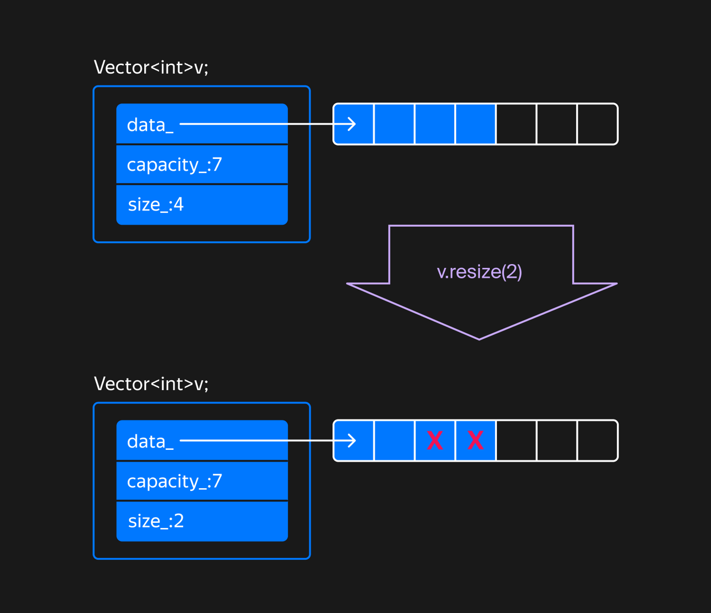
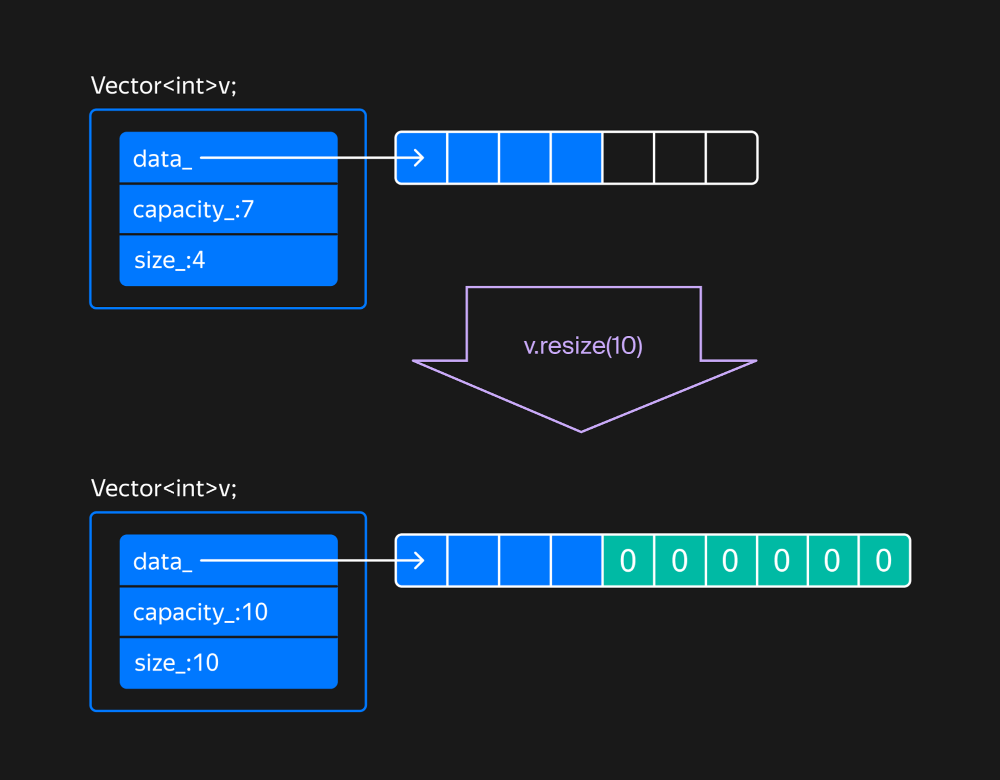
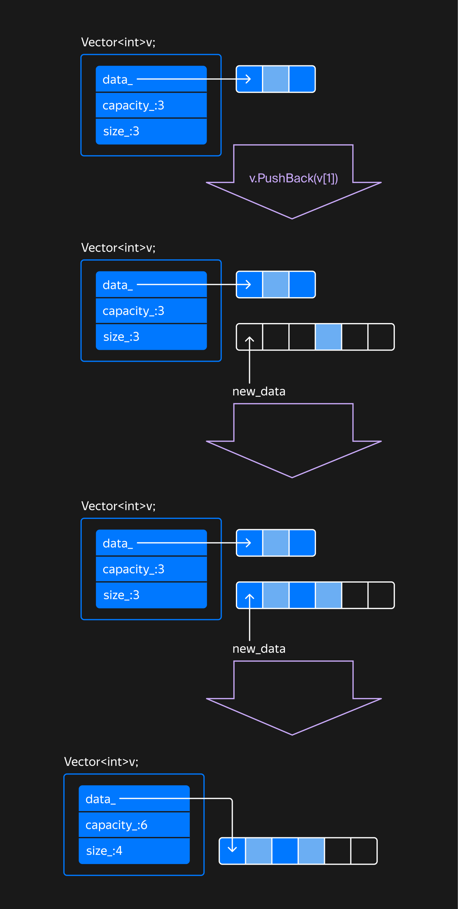

## Реализация методов Resize, PushBack и PopBack

Вы реализовали операции присваивания и перемещения для класса Vector. В этом уроке вам предстоит создать методы PushBack, PopBack и Resize.

Метод Resize

Метод Resize изменяет количество элементов в векторе, а Reserve изменяет только объём зарезервированной памяти.

В методе Resize возможны два сценария:

- уменьшение размера вектора;
- увеличение размера вектора.

При уменьшении размера вектора нужно удалить лишние элементы вектора, вызвав их деструкторы, а затем изменить размер вектора:



Когда метод `Resize` должен увеличить размер вектора, сначала нужно убедиться, что вектору достаточно памяти для новых элементов. Самый простой способ так сделать — вызвать метод `Reserve`. Затем новые элементы нужно проинициализировать, используя функцию `uninitialized_value_construct_n`. В конце, когда элементы сконструированы, нужно изменить размер вектора.



### Метод PushBack

Метод `PushBack` добавляет новое значение в конец вектора. При нехватке памяти стандартный `vector` увеличивает вместимость в кратное число раз.

Наивная реализация метода `PushBack` могла бы выглядеть так:
```cpp
template <typename T>
class Vector {
public:
    void PushBack(const T& value) {
        if (size_ == Capacity()) {
            Reserve(size_ == 0 ? 1 : size_ * 2);
        }
        new (data_ + size_) T(value);
        ++size_;
    }
    ...
};
```
Какие недостатки есть у этой реализации? 


> Вызов может привести к неопределённому поведению. Неопределённое поведение возможно, если value — ссылка на элемент этого же вектора. Вызов Reserve вызовет реаллокацию памяти и перенос объектов в другое место. Ссылки на элементы вектора станут невалидными, в том числе и value. Попытка создать копию несуществующего объекта приведёт к неопределённому поведению


> Метод может работать недостаточно эффективно, когда в вектор добавляется временный объект. Метод PushBack всегда копирует вставляемый объект в конец вектора, даже если в качестве аргумента передан временный объект. Дополнительная версия PushBack, которая поддерживает rvalue-ссылки, сможет работать эффективнее с типами, которые поддерживают move-семантику.

Надёжная реализация метода `PushBack` корректно вставляет в вектор объекты, находящиеся вне вектора и внутри него. Если вставка в вектор сопровождается реаллокацией его элементов, нужно сначала завершить вставку элемента в новую область памяти. Только после этого можно удалять объекты в старой области.

В каком порядке должны выполняться действия в методе `PushBack`, если происходит реаллокация памяти? Выберите один вариант.

Сначала создать копию вставляемого элемента в позиции `size_` в новой области памяти, затем переместить или скопировать туда существующие элементы.

Допустим, вы сначала переместили существующие элементы вектора в новую область памяти. Если `value` ссылался на существующий элемент, в конец вектора будет вставлена копия объекта, значение из которого перемещено. Поэтому сначала надо создать копию объекта в позиции `size_`, а потом переместить существующие элементы. Стандартный `vector` использует подобную стратегию вставки элемента.



<div class="caption">Процесс вставки элемента из вектора в конец этого же вектора
</div>

Чтобы эффективно вставлять в конец вектора временные объекты, потребуется добавить версию метода `PushBack`, которая принимает параметр по rvalue-ссылке. В этом случае вместо копирования элемента можно выполнить его перемещение:
```cpp
template <typename T>
class Vector {
public:
    void PushBack(T&& value) {
        ...
    }
};
```
### Метод PopBack

Метод `PopBack` разрушает последний элемент вектора и уменьшает размер вектора на единицу. Как и в случае стандартного вектора, вызов `PopBack` на пустом векторе приводит к неопределённому поведению.