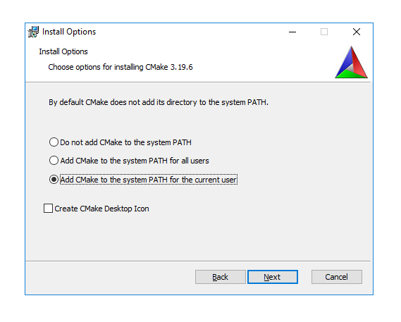

## Установка CMake

Как обычно, установка программы для разработки не представляет трудности на системах Linux и macOS — нужно установить соответствующий пакет CMake. В этом уроке разберём установку под Windows. Вы можете сразу переходить к заданию, если у вас другая операционная система. Но нужно убедиться, что команда `cmake --version` выполняется успешно, и версия `cmake` — не ниже 3.11.

Перейдите на ст[раницу скачивания CMake](https://cmake.org/download/) и выберите инсталлятор под вашу архитектуру в разделе Latest Release:

Запустите инсталлятор и следуйте его инструкциям. На шаге “Install options” выберите “Add CMake to the system PATH for all users” либо “Add CMake to the system PATH for the current user”.

По завершению работы инсталлятора перезагрузите систему или запустите новую командную строку, нажав клавиши Win+R и введя команду `cmd`. Запущенная таким образом командная строка будет иметь обновлённые переменные окружения. В окне консоли проверьте, что команда `cmake --version` выполняется успешно.