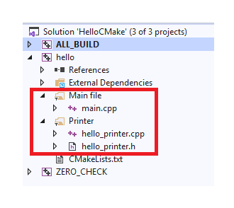

## Основы синтаксиса CMake

Создать простую программу с CMake — это цветочки. Ну а ягодки в том, что CMake — мощная система, поддерживающая переменные, функции, макросы. Подробно разбирать синтаксис в курсе не будем, но важные и хитрые основы затронем.

### Переменные CMake

CMake позволяет создавать переменные. Некоторые из них имеют специальный смысл, но можно создавать переменные и для своих целей. Вы знакомы уже с двумя:

- `CMAKE_CXX_STANDARD` — определяет стандарт C++, влияет на параметры компиляции;

- `CMAKE_BUILD_TYPE` — определяет конфигурацию сборки.

Эти переменные заданы разными способами: одна через команду `set`, вторая через параметры командной строки. При задании через `set` переменную нужно указать первым параметром, а всё остальное содержимое скобок станет её значением:

```cmake
# создаём переменную HELLO_WORLD. Её значением 
# будет список из слов “Hello” и “world”
set(HELLO_WORLD Hello world) 
```
По стайлгайду курса будем называть переменные CMake заглавными буквами — использовать SCREAMING_SNAKE_CASE.

Создавать переменные увлекательно, но в этом не было бы смысла, если бы их нельзя было использовать. В C++, чтобы прочитать значение переменной, мы пишем её название. В CMake этого недостаточно, потому что название переменной — всего лишь строковый литерал. Для чтения значения применяется операция `${}`. Командой `message` можно вывести значение в консоль:

```cmake
set(HELLO_WORLD Hello world)

# Первый параметр команды message задаёт тип сообщения.
# STATUS указывает, что это простое информационное сообщение.
message(STATUS "Value of HELLO_WORLD: " ${HELLO_WORLD}) 
```
Важно понимать, что команды, записанные в файле CMakeLists.txt, выполняются на этапе генерации. То есть на первом этапе работы CMake. На этапе сборки они меняться не могут.

Первым параметром в `message` указан тип сообщения — `STATUS`. Он запрашивает вывод информации в штатном режиме. Помимо `STATUS` есть и другие типы, например, для предупреждений или ошибок. Все типы сообщений ищите в [документации по CMake](https://cmake.org/cmake/help/latest/command/message.html). Добавим этот код в наш файл CMakeLists.txt и выполним в папке hello_cmake_build команду:

```cmake
cmake . 
```
В качестве параметра мы указали `.`, то есть путь к текущей папке, где уже есть сгенерированные файлы CMake. Это позволяет просто перезапустить генерацию, заново читая файл CMakeLists.txt.

В выводе CMake будет такая строчка:
```
Value of HELLO_WORLD: Helloworld 
```
Куда делся пробел между словами “Hello” и “world”?

> Эти слова — разные аргументы команды `set`.

Команда `message` выводит свои аргументы без пробелов. У CMake есть особенность: если в команду подставляется список, его элементы становятся отдельными аргументами. Так два элемента списка `HELLO_WORLD` стали двумя аргументами команды `set`.

Сделаем значение переменной одним аргументом, заключив его в кавычки. В CMake это самый верный способ разделять аргументы:
```cmake
set(HELLO_WORLD Hello world)
message(STATUS "Value of HELLO_WORLD: " "${HELLO_WORLD}") 
```
Перезапустим генерацию командой `cmake .` и увидим такой вывод:
```
Value of HELLO_WORLD: Hello;world
```
Это не то, что мы хотели, но так поступает CMake при конвертации списка в строку. Можно даже встроить значение переменной в литерал и ещё уменьшить количество аргументов `message`:
```cmake
message(STATUS "Value of HELLO_WORLD: ${HELLO_WORLD}") 
```
Результат будет аналогичный. В `message` всегда можно обойтись двумя аргументами, заключая всё в кавычки.

Как нужно поменять команду `set`, чтобы `HELLO_WORLD` стало строкой, а не списком, и команда  `message` выводила `Hello world` с пробелом?

> `set(HELLO_WORLD "Hello world")`

CMake поддерживает функции. Одна проблема — функции не могут возвращать значение. Поэтому в CMake применяется хак — функция принимает название переменной и записывает в неё значение. Для работы со списками в CMake есть встроенная функция `list`, о которой можно прочитать в документации. Она позволяет, в частности, объединять элементы списка, используя разделитель. Делается это так: `list(JOIN HELLO_WORLD " " HELLO_WORLD_JOINED)`. В качестве параметров указали команду `JOIN`, переменную списка, разделитель и переменную результата. Ещё одна полезная функция — [string](https://cmake.org/cmake/help/latest/command/string.html). Она поддерживает разнообразные операции со строками, поиск, замену, регулярные выражения и даже JSON.

В конструкции `${}` указывается любая строка, которая может даже содержать значения других переменных. Если переменной не существует, она раскрывается в пустую строку. Какой будет результат у следующего фрагмента?
```cmake
set(VAR1 15)
set(VAR2 3)
set(VAR15 "Pussy")
message(STATUS "${VAR${VAR1}} ${VAR${VAR2}}cat") 
```
> `Pussy cat`


Вначале CMake вычисляет содержимое скобок — `VAR${VAR1}`, что становится `VAR15`, а затем подставляет значение переменной с таким именем. Вторая часть содержит выражение `${VAR${VAR2}}`, которое превратится в `${VAR3}` и затем в пустоту, поскольку переменной `VAR3` не существует. Таким образом, название переменной может меняться динамически. Жаль, что в C++ так нельзя!

### Переменные на практике

Вряд ли единственным назначением переменных будет вывод текста на экран. Их можно с тем же успехом использовать и в других командах, например в `add_executable`:
```
set(SOURCE_DIR src)
add_executable(hello "${SOURCE_DIR}/main.cpp" "${SOURCE_DIR}/hello_printer.h" 
               "${SOURCE_DIR}/hello_printer.cpp")
```

Обязательны ли тут кавычки? Эта команда должна работать корректно, даже если в будущем кто-то изменит значение `SOURCE_DIR`. Если вы не уверены в ответе, протестируйте самостоятельно.

Да, так как без кавычек ${SOURCE_DIR} может создать лишние аргументы.

Может быть непривычно, что значение одной переменной задаёт сразу несколько аргументов команды, но этим можно пользоваться. Например, создавать списки файлов:
```cmake
set(SOURCE_DIR src)
set(FILES_PRINTER "${SOURCE_DIR}/hello_printer.h" "${SOURCE_DIR}/hello_printer.cpp")
set(FILES_MAIN "${SOURCE_DIR}/main.cpp")
add_executable(hello ${FILES_PRINTER} ${FILES_MAIN}) 
```

Списки файлов делают конфигурацию более прозрачной. Кроме того, они помогут задавать группировку файлов в IDE. Добавим в CMakeLists.txt такие команды:
```
source_group("Printer" FILES ${FILES_PRINTER})
source_group("Main file" FILES ${FILES_MAIN})
```
Если после этого попросить CMake сгенерировать проект для Visual Studio, дерево файлов получившегося проекта будет таким:



CMake помог распределить файлы исходного кода по группам. Для проекта из трёх файлов это, конечно, избыточно. Но может упростить разработку больших программ.

### Кэш CMake

Выше говорилось, что помимо `set` есть ещё один способ задания переменных — через аргумент командной строки CMake. При задании через командную строку к имени переменной нужно приписать `-D`. Так, аргументом `-DCMAKE_BUILD_TYPE=Debug` мы определили переменную `CMAKE_BUILD_TYPE` со значением `Debug`. Такая переменная попадает в кэш CMake — это значит, что её значение сохранится, и она будет существовать при следующем запуске CMake, даже если не была задана повторно.

Переменные кэша — это своего рода опции сборки вашей программы, которые должны быть заданы при генерации. Их поддерживают графические утилиты для работы с CMake, например cmake-gui. Не следует слишком увлекаться переменными кэша, иначе первый запуск CMake будет довольно затруднительным.

Задать переменную кэша можно и через `set`. Для этого добавьте в `set` дополнительные аргументы:

```cmake
# Присвоить переменной кэша SOURCE_PATH значение src.
# Переменная имеет тип STRING и описание "Path of source files".
set(SOURCE_PATH "src" CACHE STRING "Path of source files") 
```

Тип переменной `STRING` влияет на то, как оно будет отображаться в графических утилитах. Полный список типов смотрите в [документации](https://cmake.org/cmake/help/v3.0/command/set.html). Описание для переменных кэша задавать обязательно. Оно будет отображаться в программе cmake-gui и подскажет, как правильно задавать значения переменных кэша при первом запуске. 

Значения переменных кэша можно получить тем же способом — операцией `${}`. Протестируем её:
```
set(SOURCE_DIR "src" CACHE STRING "Path of source files")
message(STATUS "SOURCE_DIR value: ${SOURCE_DIR}")

set(SOURCE_DIR "src2" CACHE STRING "Path of source files")
message(STATUS "SOURCE_DIR value after another set: ${SOURCE_DIR}")
```

Перегенерируем сборочные файлы командой `cmake .`. В процессе её работы увидим такой текст:

```
-- SOURCE_DIR value: src
-- SOURCE_DIR value after another set: src 
```

Почему-то второй `set` не изменил значение `SOURCE_DIR`. Изменим команду генерации и установим эту переменную через командную строку: `cmake . -DSOURCE_DIR=src3`. Вывод стал другим:

```
-- SOURCE_DIR value: src3
-- SOURCE_DIR value after another set: src3 
```

Теперь уже не сработали оба вызова set. Изменим код на такой:

```cmake
set(SOURCE_DIR "another_src" CACHE STRING "Path of source files")
message(STATUS "SOURCE_DIR value: ${SOURCE_DIR}")

set(SOURCE_DIR "another_src2" CACHE STRING "Path of source files")
message(STATUS "SOURCE_DIR value after another set: ${SOURCE_DIR}") 
```

И выполним `cmake .` без явного задания значения `SOURCE_DIR`. Удивительно, но вывод не поменялся:

```
-- SOURCE_DIR value: src3
-- SOURCE_DIR value after another set: src3 
```

Всем этим странностям есть объяснение: в случае переменных кэша `set` игнорируется, если переменной уже присвоено значение. Благодаря этому задание через аргумент командной строки имеет приоритет. Кроме того, значение переменной кэша сохраняется на последующие запуски. Последний раз мы задали `SOURCE_DIR` в аргументе команды `cmake . -DSOURCE_DIR=src3`. И это значение сохранилось, несмотря на то, что в последующий раз оно нигде не было указано.

Но на этом странности не заканчиваются. Дополним наш скрипт ещё одним присваиванием:
```cmake
set(SOURCE_DIR "another_src" CACHE STRING "Path of source files")
message(STATUS "SOURCE_DIR value: ${SOURCE_DIR}")

set(SOURCE_DIR "another_src2" CACHE STRING "Path of source files")
message(STATUS "SOURCE_DIR value after another set: ${SOURCE_DIR}")

# Дополним командой set без опции CACHE
set(SOURCE_DIR "no_cache")
message(STATUS "SOURCE_DIR value after another set: ${SOURCE_DIR}") 
```
Запускаем `cmake .` и видим текст
```
-- SOURCE_DIR value: src3
-- SOURCE_DIR value after another set: src3
-- SOURCE_DIR value after another set: no_cache 
```
Выглядит, будто последний `set` смог то, что не смогли предыдущие, — переписать переменную кэша. Но на самом деле это не так: он лишь создал новую временную переменную, которая имеет приоритет над переменной кэша. Чтобы убедиться в этом, изменим команды `set`:

```cmake
message(STATUS "SOURCE_DIR value before first set: ${SOURCE_DIR}")

set(SOURCE_DIR "no_cache")
message(STATUS "SOURCE_DIR value after first set: ${SOURCE_DIR}")

# И снова попытаемся установить переменную кэша
set(SOURCE_DIR "another_src" CACHE STRING "Path of source files")
message(STATUS "SOURCE_DIR value after cache set: ${SOURCE_DIR}")
```

Вывод, который вы получите, запустив cmake ., вряд ли можно понять без объяснения:

```
-- SOURCE_DIR value before first set: src3
-- SOURCE_DIR value after first set: no_cache
-- SOURCE_DIR value after cache set: src3 
```
Вторая команда `set` изменила значение переменной, но не на то, которое ей присваивалось, а на то, которое было в ней до этого. Дело в том, что установка переменной кэша удаляет временную переменную, если та существует.

Кэш CMake содержит много вспомогательных и полезных переменных. Их можно посмотреть в файле CMakeCache.txt. Он находится в папке, в которой запускалась команда генерации CMake.

Как видно из этого урока, переменные в CMake имеют много нюансов. О них не обязательно знать при разработке простых проектов, но в более сложных случаях эти особенности могут быть полезны.

### Конструкция if

В предыдущем уроке был совет вставить команду `target_link_libraries(negate -lstdc++)` при компиляции в MinGW. Но тогда нужны разные файлы CMakeList.txt под разные платформы, что противоречит идеологии CMake. Попробуем решить эту задачу универсальным способом. 

Тут не обойтись без `if`. В CMake он напоминает `if` из C++. Отличие — в отсутствии фигурных скобок после `if` и `else` и наличии круглых скобок после else. Конец определяется командой `endif`, после которой также нужно написать пустые круглые скобки.

Самый простой вариант условия — проверить существование переменной:
```
if(MY_BEAUTIFUL_VARIABLE)
    message(STATUS "MY_BEAUTIFUL_VARIABLE exists and equals ${MY_BEAUTIFUL_VARIABLE}")
else()
    message(STATUS "MY_BEAUTIFUL_VARIABLE does not exist or equals OFF. Miss it.")
endif() 
```
Однако это условие будет не выполнено, если переменная с таким именем существует, но равна `OFF` — аналогу `false` из C++.

Для нашей цели нужно определить, что сборка производится на MinGW. Для этого возьмём встроенную переменную CMAKE_SYSTEM_NAME. Используем регулярное выражение, чтобы проверить, что её значение начинается со слов MINGW:
```
if(CMAKE_SYSTEM_NAME MATCHES "^MINGW")
    set(SYSTEM_LIBS -lstdc++)
else()
    set(SYSTEM_LIBS)
endif() 
```
Слово `MATCHES` в условии указывает, что нужно проверить значение переменной на соответствие регулярному выражению.

Затем используем установленную переменную в команде `target_link_libraries`:

```cmake
target_link_libraries(negate ${SYSTEM_LIBS}) 
```

Подробнее о синтаксисе команды `if` читайте в [документации](https://cmake.org/cmake/help/latest/command/if.html). В CMake также есть циклы [foreach](https://cmake.org/cmake/help/latest/command/foreach.html) и [while](https://cmake.org/cmake/help/latest/command/while.html), которые выходят за рамки нашего курса.